# CCA-06 Z2.5

## Table Of Contents
* [Full Maps](#full-maps)
* [Zoomed Maps](#zoomed-maps)
  * [Zoom 1](#zoom-1)
  * [Zoom 2](#zoom-2)
* [Scatter Comparisons](#scatter-comparisons)
  * [CCA UCVM-Py, Scott vs CCA UCVMC, First Or Second Crossing](#cca-ucvm-py-scott-vs-cca-ucvmc-first-or-second-crossing)
  * [CCA UCVM-Py, Scott vs CCA UCVMC, Last Crossing](#cca-ucvm-py-scott-vs-cca-ucvmc-last-crossing)
  * [CCA UCVM-Py, Scott vs CCA UCVMC, First Crossing](#cca-ucvm-py-scott-vs-cca-ucvmc-first-crossing)
  * [CCA UCVMC, First Or Second Crossing vs CCA UCVMC, Last Crossing](#cca-ucvmc-first-or-second-crossing-vs-cca-ucvmc-last-crossing)
  * [CCA UCVMC, First Or Second Crossing vs CCA UCVMC, First Crossing](#cca-ucvmc-first-or-second-crossing-vs-cca-ucvmc-first-crossing)
  * [CCA UCVMC, Last Crossing vs CCA UCVMC, First Crossing](#cca-ucvmc-last-crossing-vs-cca-ucvmc-first-crossing)
## Full Maps
*[(top)](#table-of-contents)*

| **CCA UCVM-Py, Scott** |  |
|-----|-----|
| **CCA UCVMC, First Or Second Crossing** |  |
| **CCA UCVMC, Last Crossing** |  |
| **CCA UCVMC, First Crossing** | 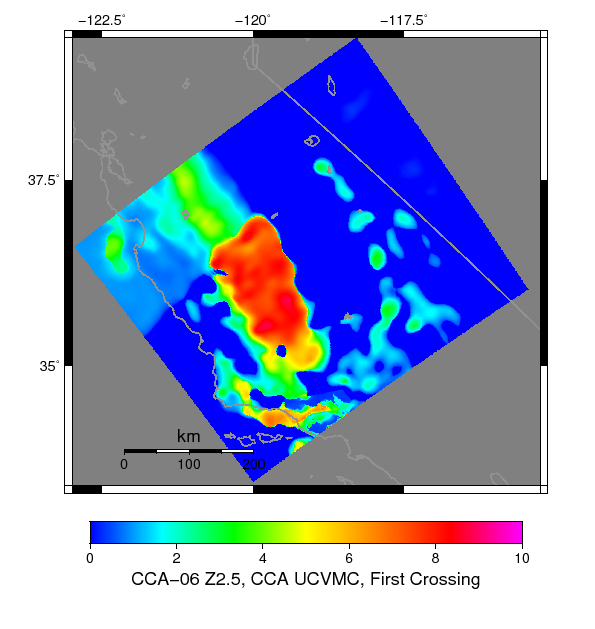 |
## Zoomed Maps
*[(top)](#table-of-contents)*

### Zoom 1
*[(top)](#table-of-contents)*

| **CCA UCVM-Py, Scott** |  |
|-----|-----|
| **CCA UCVMC, First Or Second Crossing** |  |
| **CCA UCVMC, Last Crossing** | 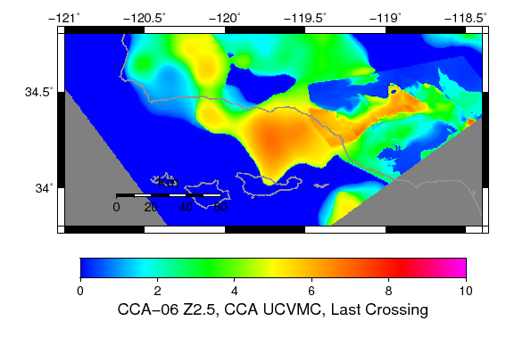 |
| **CCA UCVMC, First Crossing** | 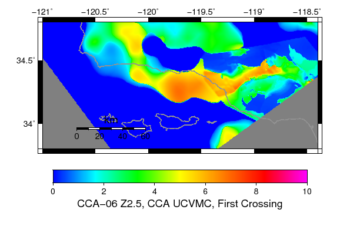 |
### Zoom 2
*[(top)](#table-of-contents)*

| **CCA UCVM-Py, Scott** |  |
|-----|-----|
| **CCA UCVMC, First Or Second Crossing** | 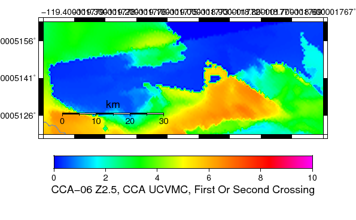 |
| **CCA UCVMC, Last Crossing** | 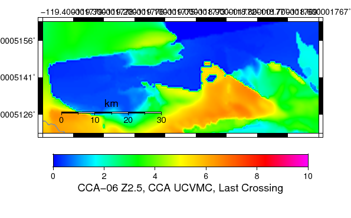 |
| **CCA UCVMC, First Crossing** | 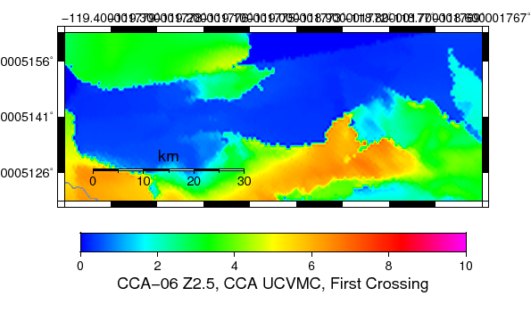 |
## Scatter Comparisons
*[(top)](#table-of-contents)*

### CCA UCVM-Py, Scott vs CCA UCVMC, First Or Second Crossing
*[(top)](#table-of-contents)*

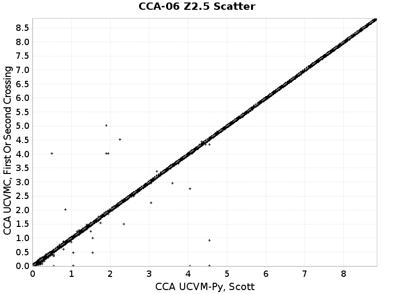
### CCA UCVM-Py, Scott vs CCA UCVMC, Last Crossing
*[(top)](#table-of-contents)*

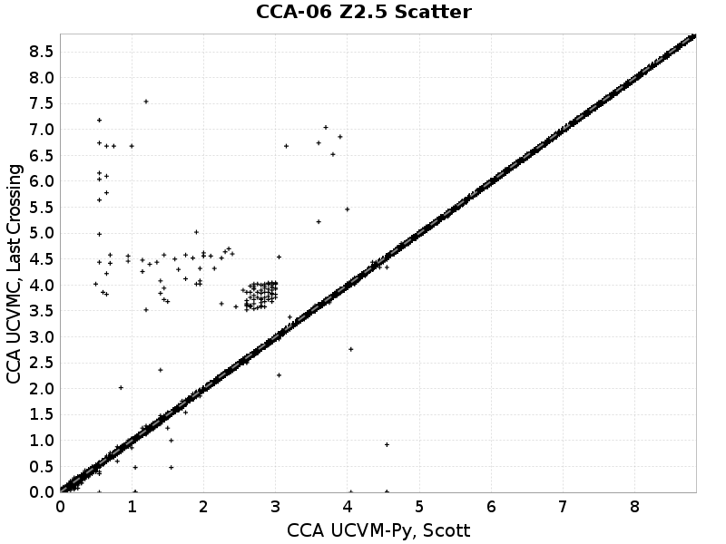
### CCA UCVM-Py, Scott vs CCA UCVMC, First Crossing
*[(top)](#table-of-contents)*

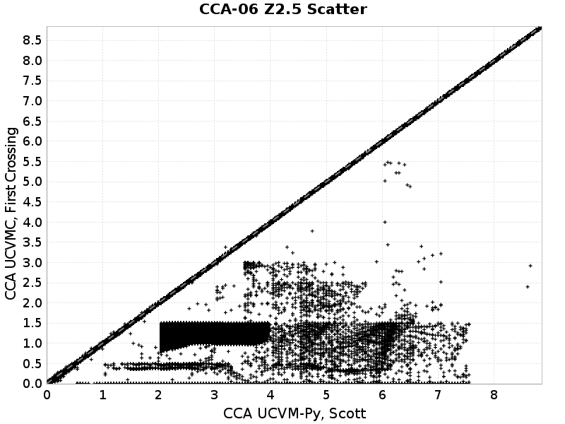
### CCA UCVMC, First Or Second Crossing vs CCA UCVMC, Last Crossing
*[(top)](#table-of-contents)*

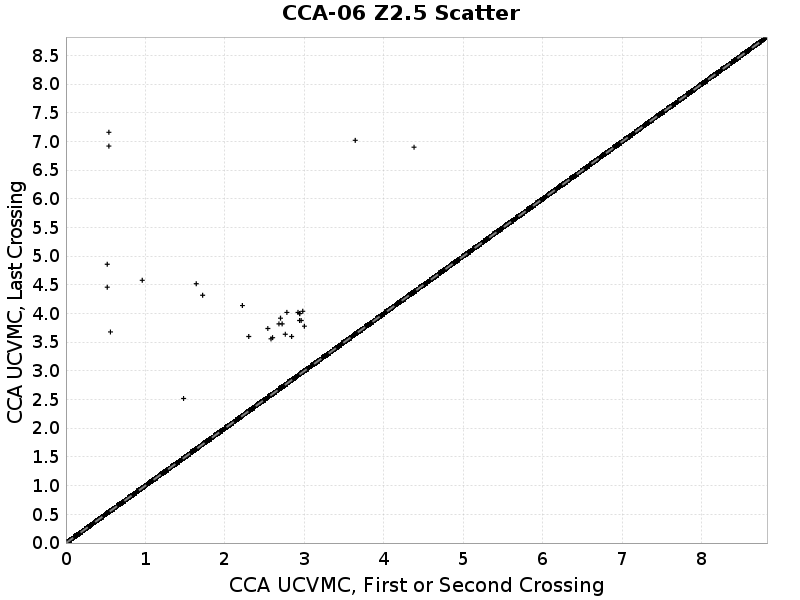
### CCA UCVMC, First Or Second Crossing vs CCA UCVMC, First Crossing
*[(top)](#table-of-contents)*

### CCA UCVMC, Last Crossing vs CCA UCVMC, First Crossing
*[(top)](#table-of-contents)*

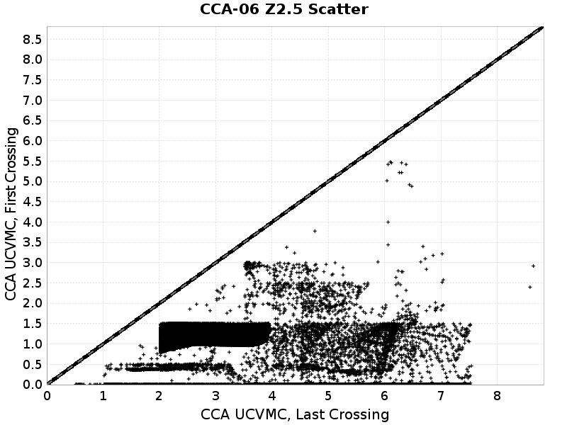
