# Coulomb Cartoons

## Table Of Contents
* [Right-Lateral Strike-Slip](#right-lateral-strike-slip)
  * [Right-Lateral Strike-Slip -> Right-Lateral Strike-Slip](#right-lateral-strike-slip---right-lateral-strike-slip)
  * [Right-Lateral Strike-Slip -> Left-Lateral Strike-Slip](#right-lateral-strike-slip---left-lateral-strike-slip)
  * [Right-Lateral Strike-Slip -> Reverse](#right-lateral-strike-slip---reverse)
  * [Right-Lateral Strike-Slip -> Normal](#right-lateral-strike-slip---normal)
* [Left-Lateral Strike-Slip](#left-lateral-strike-slip)
  * [Left-Lateral Strike-Slip -> Right-Lateral Strike-Slip](#left-lateral-strike-slip---right-lateral-strike-slip)
  * [Left-Lateral Strike-Slip -> Left-Lateral Strike-Slip](#left-lateral-strike-slip---left-lateral-strike-slip)
  * [Left-Lateral Strike-Slip -> Reverse](#left-lateral-strike-slip---reverse)
  * [Left-Lateral Strike-Slip -> Normal](#left-lateral-strike-slip---normal)
* [Reverse](#reverse)
  * [Reverse -> Right-Lateral Strike-Slip](#reverse---right-lateral-strike-slip)
  * [Reverse -> Left-Lateral Strike-Slip](#reverse---left-lateral-strike-slip)
  * [Reverse -> Reverse](#reverse---reverse)
  * [Reverse -> Normal](#reverse---normal)
* [Normal](#normal)
  * [Normal -> Right-Lateral Strike-Slip](#normal---right-lateral-strike-slip)
  * [Normal -> Left-Lateral Strike-Slip](#normal---left-lateral-strike-slip)
  * [Normal -> Reverse](#normal---reverse)
  * [Normal -> Normal](#normal---normal)
## Right-Lateral Strike-Slip
*[(top)](#table-of-contents)*

### Right-Lateral Strike-Slip -> Right-Lateral Strike-Slip
*[(top)](#table-of-contents)*

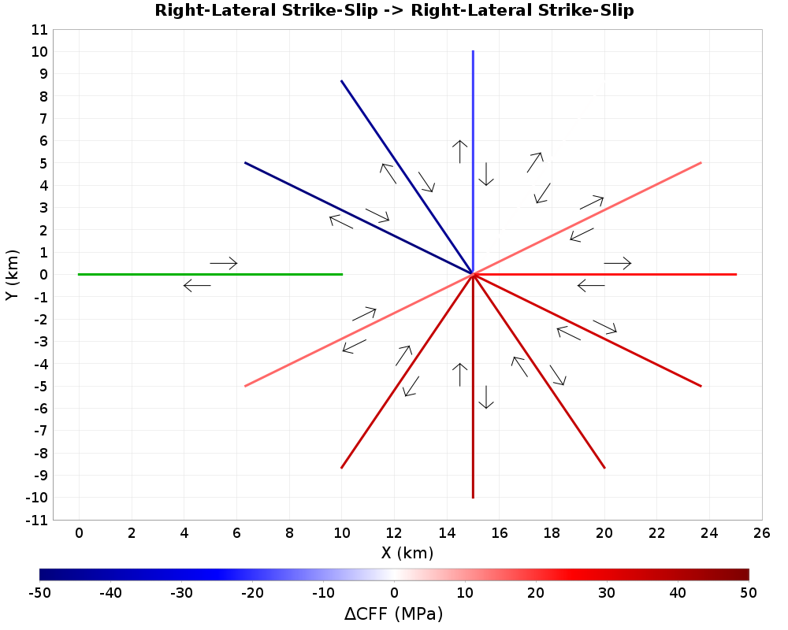

| &Delta;Tau | &Delta;Sigma |
|-----|-----|
| 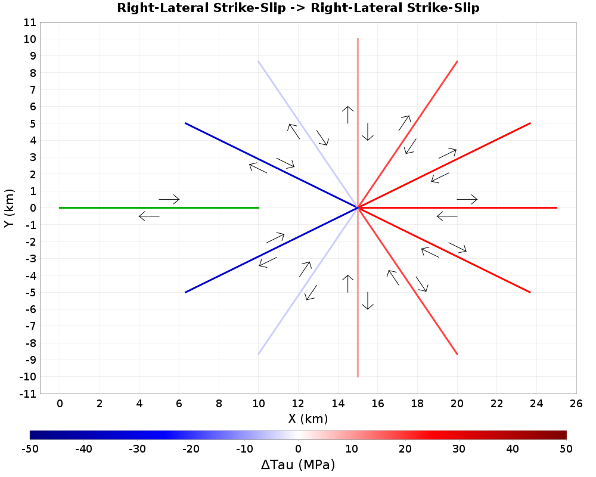 | 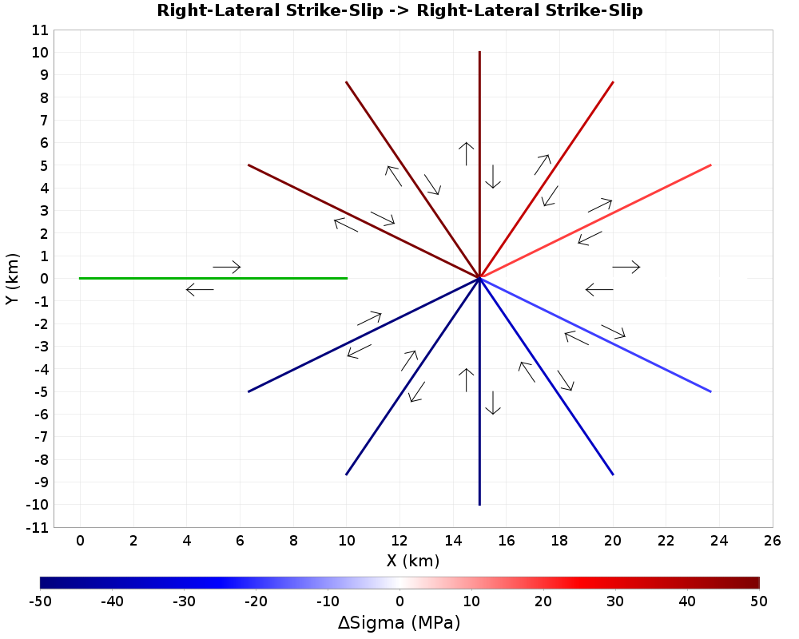 |

| Azimuth Change | &Delta;CFF | &Delta;CFF/Max | &Delta;Tau | &Delta;Tau/Max | &Delta;Sigma | &Delta;Sigma/Max |
|-----|-----|-----|-----|-----|-----|-----|
| -150 | -305.7959 | -1.3795857 | -221.0194 | -1.5601209 | 169.55302 | -1.3910389 |
| -120 | -181.67831 | -0.8196343 | -71.76194 | -0.92689323 | 219.83275 | -0.82643884 |
| -90 | -55.979847 | -0.25255078 | 47.420578 | -0.28560007 | 206.80086 | -0.25464743 |
| -60 | 55.074665 | 0.24846709 | 132.44809 | 0.280982 | 154.74686 | 0.25052986 |
| -30 | 139.94524 | 0.63135725 | 180.80151 | 0.7139779 | 81.71254 | 0.6365987 |
| 0 | 196.00781 | 0.8842812 | 196.00781 | 1.0 | 2.4504767E-14 | 0.8916225 |
| 30 | 221.65778 | 1.0 | 180.80151 | 1.1308619 | -81.71254 | 1.0083019 |
| 60 | 209.82152 | 0.9466012 | 132.44809 | 1.0704753 | -154.74686 | 0.95445985 |
| 90 | 150.821 | 0.6804228 | 47.420578 | 0.76946425 | -206.80086 | 0.6860716 |
| 120 | 38.15443 | 0.17213216 | -71.76194 | 0.19465771 | -219.83275 | 0.17356119 |
| 150 | -136.24289 | -0.6146542 | -221.0194 | -0.69508904 | -169.55302 | -0.619757 |

### Right-Lateral Strike-Slip -> Left-Lateral Strike-Slip
*[(top)](#table-of-contents)*

| &Delta;Tau | &Delta;Sigma |
|-----|-----|
|  |  |

| Azimuth Change | &Delta;CFF | &Delta;CFF/Max | &Delta;Tau | &Delta;Tau/Max | &Delta;Sigma | &Delta;Sigma/Max |
|-----|-----|-----|-----|-----|-----|-----|
| -150 | 136.24289 | 0.44553536 | 221.0194 | 0.61642957 | 169.55302 | 0.619757 |
| -120 | -38.15443 | -0.1247709 | 71.76194 | -0.17262934 | 219.83275 | -0.17356119 |
| -90 | -150.821 | -0.49320805 | -47.420578 | -0.68238807 | 206.80086 | -0.6860716 |
| -60 | -209.82152 | -0.6861489 | -132.44809 | -0.94933534 | 154.74686 | -0.95445985 |
| -30 | -221.65778 | -0.7248553 | -180.80151 | -1.0028883 | 81.71254 | -1.0083019 |
| 0 | -196.00781 | -0.64097595 | -196.00781 | -0.88683534 | 2.4504767E-14 | -0.8916225 |
| 30 | -139.94524 | -0.4576426 | -180.80151 | -0.6331808 | -81.71254 | -0.6365987 |
| 60 | -55.074665 | -0.18010269 | -132.44809 | -0.24918476 | -154.74686 | -0.25052986 |
| 90 | 55.979847 | 0.18306278 | -47.420578 | 0.25328025 | -206.80086 | 0.25464743 |
| 120 | 181.67831 | 0.5941163 | 71.76194 | 0.8220017 | -219.83275 | 0.82643884 |
| 150 | 305.7959 | 1.0 | 221.0194 | 1.3835704 | -169.55302 | 1.3910389 |

### Right-Lateral Strike-Slip -> Reverse
*[(top)](#table-of-contents)*

| &Delta;Tau | &Delta;Sigma |
|-----|-----|
|  |  |

| Azimuth Change | &Delta;CFF | &Delta;CFF/Max | &Delta;Tau | &Delta;Tau/Max | &Delta;Sigma | &Delta;Sigma/Max |
|-----|-----|-----|-----|-----|-----|-----|
| -150 | 22.22841 | 0.7758908 | 41.293438 | 0.40625617 | 38.130054 | 0.42638108 |
| -120 | 28.64889 | 1.0 | 54.715256 | 0.5235997 | 52.132732 | 0.5495375 |
| -90 | 23.923248 | 0.8350498 | 48.13761 | 0.43723178 | 48.428722 | 0.45889115 |
| -60 | 13.254499 | 0.4626532 | 29.850706 | 0.24224505 | 33.192413 | 0.25424525 |
| -30 | 1.7620552 | 0.061505184 | 8.215562 | 0.03220409 | 12.907013 | 0.033799402 |
| 0 | -6.5521293 | -0.22870448 | -9.972398 | -0.11974959 | -6.8405366 | -0.12568168 |
| 30 | -9.418532 | -0.32875735 | -20.499477 | -0.17213723 | -22.161888 | -0.18066448 |
| 60 | -6.956251 | -0.2428105 | -22.50705 | -0.1271355 | -31.101597 | -0.13343346 |
| 90 | -6.681712 | -0.23322761 | -25.80634 | -0.1221179 | -38.249252 | -0.12816732 |
| 120 | -15.482885 | -0.5404358 | -50.065468 | -0.282972 | -50.71562 | -0.2969897 |
| 150 | -30.926355 | -1.0794958 | -65.17086 | -0.56522363 | -68.48901 | -0.5932234 |

### Right-Lateral Strike-Slip -> Normal
*[(top)](#table-of-contents)*

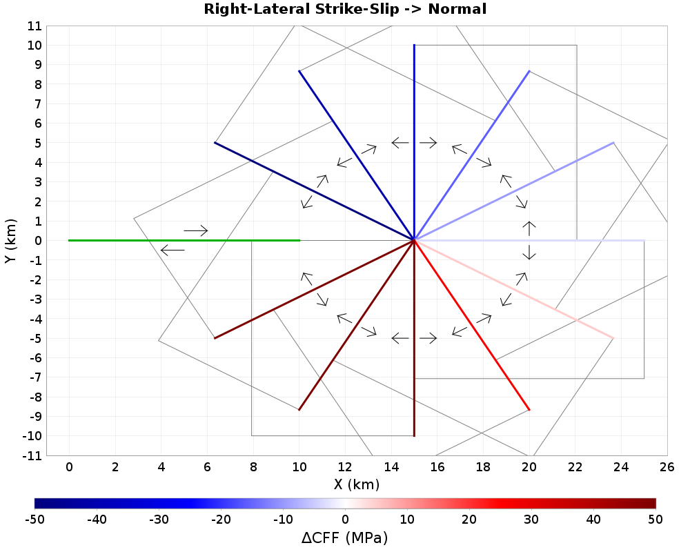

| &Delta;Tau | &Delta;Sigma |
|-----|-----|
|  |  |

| Azimuth Change | &Delta;CFF | &Delta;CFF/Max | &Delta;Tau | &Delta;Tau/Max | &Delta;Sigma | &Delta;Sigma/Max |
|-----|-----|-----|-----|-----|-----|-----|
| -150 | -60.358467 | -0.60713416 | -41.293438 | -0.92615724 | 38.130054 | -1.1577845 |
| -120 | -80.781624 | -0.81256676 | -54.715256 | -1.2395359 | 52.132732 | -1.5495374 |
| -90 | -72.351974 | -0.72777456 | -48.13761 | -1.110189 | 48.428722 | -1.3878416 |
| -60 | -46.446915 | -0.46720055 | -29.850706 | -0.7126945 | 33.192413 | -0.8909357 |
| -30 | -14.669068 | -0.14755332 | -8.215562 | -0.2250863 | 12.907013 | -0.28137922 |
| 0 | 13.392666 | 0.13471425 | 9.972398 | 0.20550083 | -6.8405366 | 0.25689554 |
| 30 | 31.580421 | 0.31766135 | 20.499477 | 0.48457885 | -22.161888 | 0.6057695 |
| 60 | 38.057846 | 0.38281652 | 22.50705 | 0.5839703 | -31.101597 | 0.73001826 |
| 90 | 44.930965 | 0.4519519 | 25.80634 | 0.68943334 | -38.249252 | 0.8618571 |
| 120 | 85.3696 | 0.8587163 | 50.065468 | 1.3099351 | -50.71562 | 1.6375431 |
| 150 | 99.41537 | 1.0 | 65.17086 | 1.5254574 | -68.48901 | 1.9069664 |

## Left-Lateral Strike-Slip
*[(top)](#table-of-contents)*

### Left-Lateral Strike-Slip -> Right-Lateral Strike-Slip
*[(top)](#table-of-contents)*

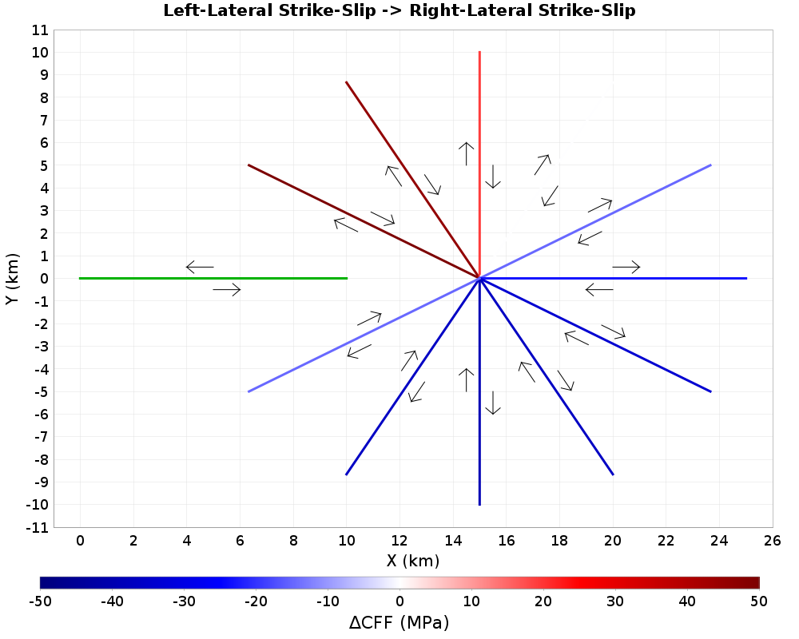

| &Delta;Tau | &Delta;Sigma |
|-----|-----|
| 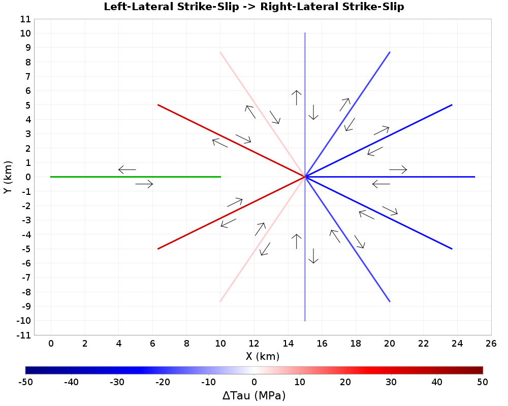 |  |

| Azimuth Change | &Delta;CFF | &Delta;CFF/Max | &Delta;Tau | &Delta;Tau/Max | &Delta;Sigma | &Delta;Sigma/Max |
|-----|-----|-----|-----|-----|-----|-----|
| -150 | 305.7959 | 1.0 | 221.0194 | 1.3835704 | -169.55302 | 1.3910389 |
| -120 | 181.67831 | 0.5941163 | 71.76194 | 0.8220017 | -219.83275 | 0.82643884 |
| -90 | 55.979847 | 0.18306278 | -47.420578 | 0.25328025 | -206.80086 | 0.25464743 |
| -60 | -55.074665 | -0.18010269 | -132.44809 | -0.24918476 | -154.74686 | -0.25052986 |
| -30 | -139.94524 | -0.4576426 | -180.80151 | -0.6331808 | -81.71254 | -0.6365987 |
| 0 | -196.00781 | -0.64097595 | -196.00781 | -0.88683534 | -2.4504767E-14 | -0.8916225 |
| 30 | -221.65778 | -0.7248553 | -180.80151 | -1.0028883 | 81.71254 | -1.0083019 |
| 60 | -209.82152 | -0.6861489 | -132.44809 | -0.94933534 | 154.74686 | -0.95445985 |
| 90 | -150.821 | -0.49320805 | -47.420578 | -0.68238807 | 206.80086 | -0.6860716 |
| 120 | -38.15443 | -0.1247709 | 71.76194 | -0.17262934 | 219.83275 | -0.17356119 |
| 150 | 136.24289 | 0.44553536 | 221.0194 | 0.61642957 | 169.55302 | 0.619757 |

### Left-Lateral Strike-Slip -> Left-Lateral Strike-Slip
*[(top)](#table-of-contents)*

| &Delta;Tau | &Delta;Sigma |
|-----|-----|
|  |  |

| Azimuth Change | &Delta;CFF | &Delta;CFF/Max | &Delta;Tau | &Delta;Tau/Max | &Delta;Sigma | &Delta;Sigma/Max |
|-----|-----|-----|-----|-----|-----|-----|
| -150 | -136.24289 | -0.6146542 | -221.0194 | -0.69508904 | -169.55302 | -0.619757 |
| -120 | 38.15443 | 0.17213216 | -71.76194 | 0.19465771 | -219.83275 | 0.17356119 |
| -90 | 150.821 | 0.6804228 | 47.420578 | 0.76946425 | -206.80086 | 0.6860716 |
| -60 | 209.82152 | 0.9466012 | 132.44809 | 1.0704753 | -154.74686 | 0.95445985 |
| -30 | 221.65778 | 1.0 | 180.80151 | 1.1308619 | -81.71254 | 1.0083019 |
| 0 | 196.00781 | 0.8842812 | 196.00781 | 1.0 | -2.4504767E-14 | 0.8916225 |
| 30 | 139.94524 | 0.63135725 | 180.80151 | 0.7139779 | 81.71254 | 0.6365987 |
| 60 | 55.074665 | 0.24846709 | 132.44809 | 0.280982 | 154.74686 | 0.25052986 |
| 90 | -55.979847 | -0.25255078 | 47.420578 | -0.28560007 | 206.80086 | -0.25464743 |
| 120 | -181.67831 | -0.8196343 | -71.76194 | -0.92689323 | 219.83275 | -0.82643884 |
| 150 | -305.7959 | -1.3795857 | -221.0194 | -1.5601209 | 169.55302 | -1.3910389 |

### Left-Lateral Strike-Slip -> Reverse
*[(top)](#table-of-contents)*

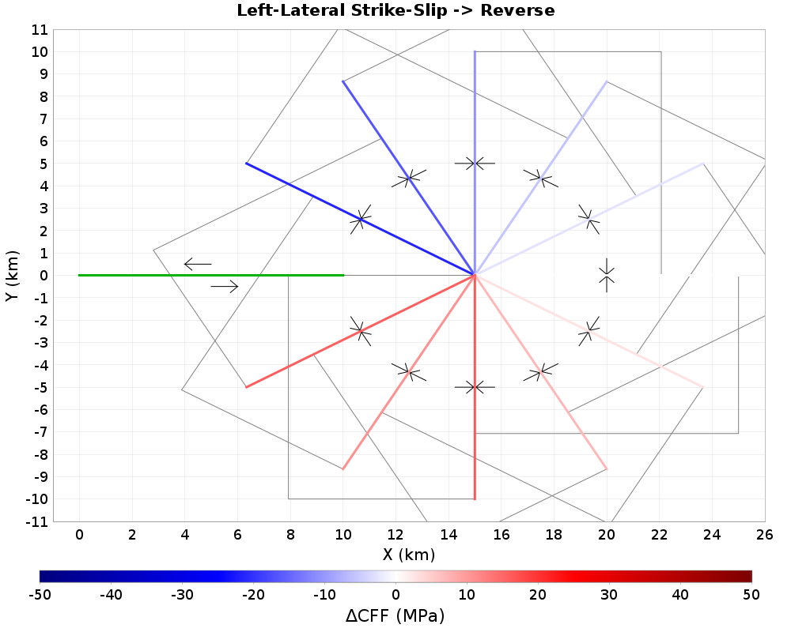

| &Delta;Tau | &Delta;Sigma |
|-----|-----|
| 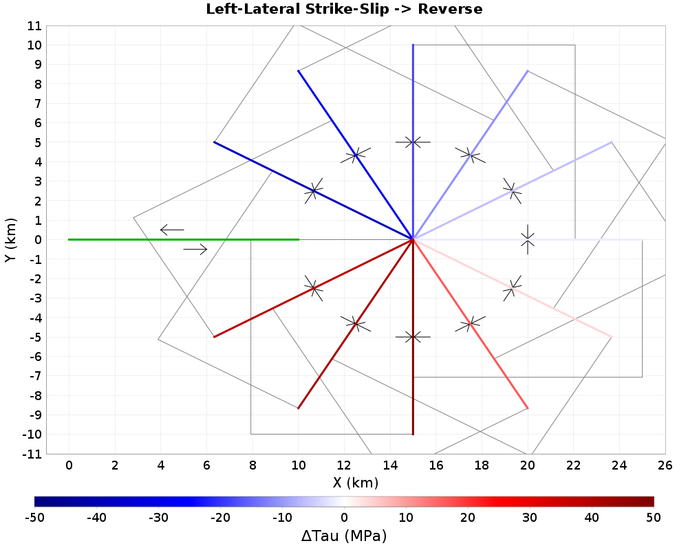 |  |

| Azimuth Change | &Delta;CFF | &Delta;CFF/Max | &Delta;Tau | &Delta;Tau/Max | &Delta;Sigma | &Delta;Sigma/Max |
|-----|-----|-----|-----|-----|-----|-----|
| -150 | -22.22841 | -0.71875304 | -41.293438 | -0.34107897 | -38.130054 | -0.3245544 |
| -120 | -28.64889 | -0.9263584 | -54.715256 | -0.4395966 | -52.132732 | -0.41829905 |
| -90 | -23.923248 | -0.7735554 | -48.13761 | -0.36708504 | -48.428722 | -0.34930053 |
| -60 | -13.254499 | -0.42858267 | -29.850706 | -0.20338076 | -33.192413 | -0.19352739 |
| -30 | -1.7620552 | -0.056975845 | -8.215562 | -0.02703747 | -12.907013 | -0.025727559 |
| 0 | 6.5521293 | 0.21186233 | 9.972398 | 0.10053771 | 6.8405366 | 0.09566686 |
| 30 | 9.418532 | 0.30454713 | 20.499477 | 0.14452061 | 22.161888 | 0.13751888 |
| 60 | 6.956251 | 0.22492956 | 22.50705 | 0.10673867 | 31.101597 | 0.1015674 |
| 90 | 6.681712 | 0.21605237 | 25.80634 | 0.10252607 | 38.249252 | 0.097558886 |
| 120 | 15.482885 | 0.50063723 | 50.065468 | 0.23757374 | 50.71562 | 0.22606379 |
| 150 | 30.926355 | 1.0 | 65.17086 | 0.47454268 | 68.48901 | 0.45155206 |

### Left-Lateral Strike-Slip -> Normal
*[(top)](#table-of-contents)*

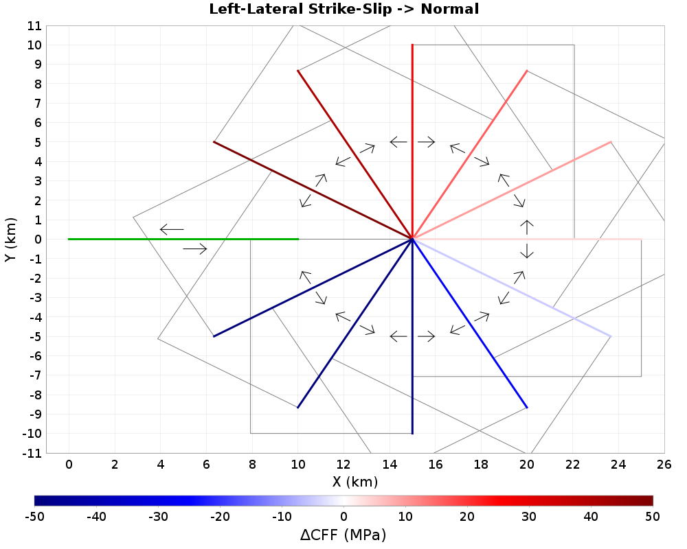

| &Delta;Tau | &Delta;Sigma |
|-----|-----|
| 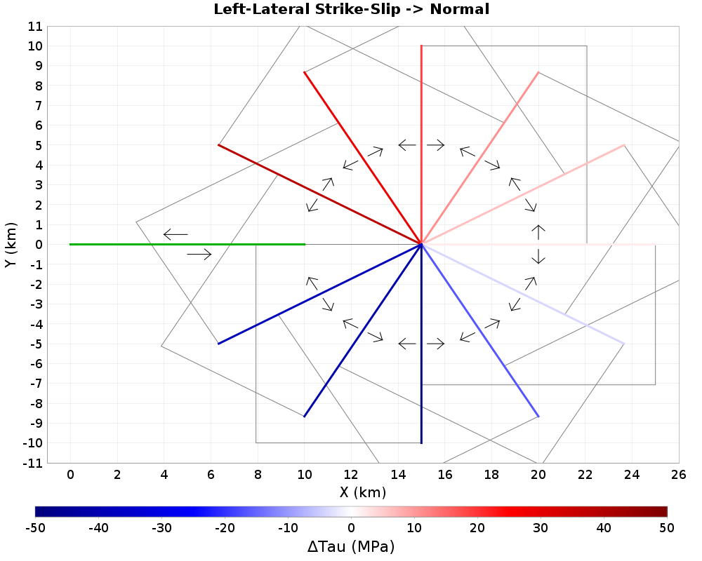 |  |

| Azimuth Change | &Delta;CFF | &Delta;CFF/Max | &Delta;Tau | &Delta;Tau/Max | &Delta;Sigma | &Delta;Sigma/Max |
|-----|-----|-----|-----|-----|-----|-----|
| -150 | 60.358467 | 0.7471807 | 41.293438 | 1.1031379 | -38.130054 | 0.88128686 |
| -120 | 80.781624 | 1.0 | 54.715256 | 1.4764004 | -52.132732 | 1.1794829 |
| -90 | 72.351974 | 0.89564896 | 48.13761 | 1.3223364 | -48.428722 | 1.0564026 |
| -60 | 46.446915 | 0.5749688 | 29.850706 | 0.84888417 | -33.192413 | 0.6781659 |
| -30 | 14.669068 | 0.18158917 | 8.215562 | 0.26809832 | -12.907013 | 0.21418133 |
| 0 | -13.392666 | -0.16578853 | -9.972398 | -0.24477024 | 6.8405366 | -0.19554473 |
| 30 | -31.580421 | -0.39093572 | -20.499477 | -0.57717764 | 22.161888 | -0.461102 |
| 60 | -38.057846 | -0.47112012 | -22.50705 | -0.6955619 | 31.101597 | -0.5556781 |
| 90 | -44.930965 | -0.5562028 | -25.80634 | -0.821178 | 38.249252 | -0.6560317 |
| 120 | -85.3696 | -1.0567948 | -50.065468 | -1.5602522 | 50.71562 | -1.2464714 |
| 150 | -99.41537 | -1.2306682 | -65.17086 | -1.8169589 | 68.48901 | -1.451552 |

## Reverse
*[(top)](#table-of-contents)*

### Reverse -> Right-Lateral Strike-Slip
*[(top)](#table-of-contents)*

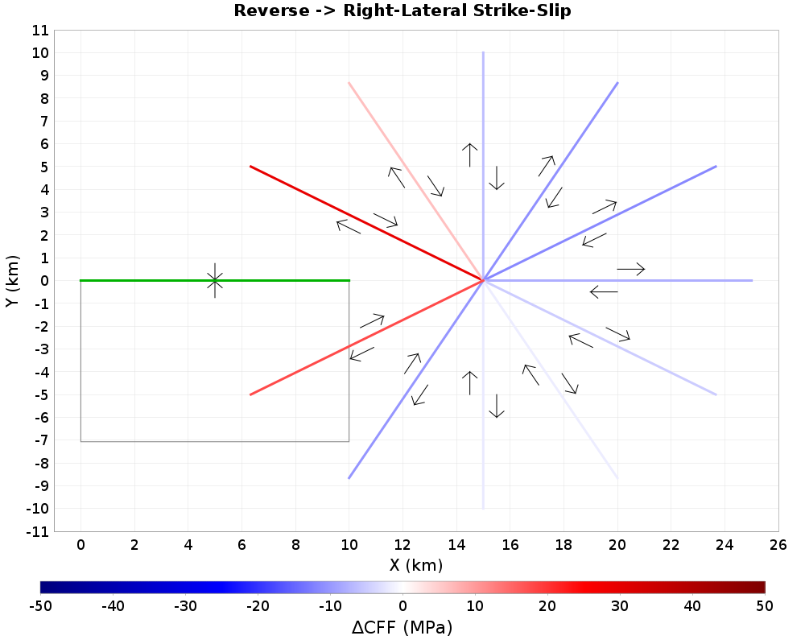

| &Delta;Tau | &Delta;Sigma |
|-----|-----|
| 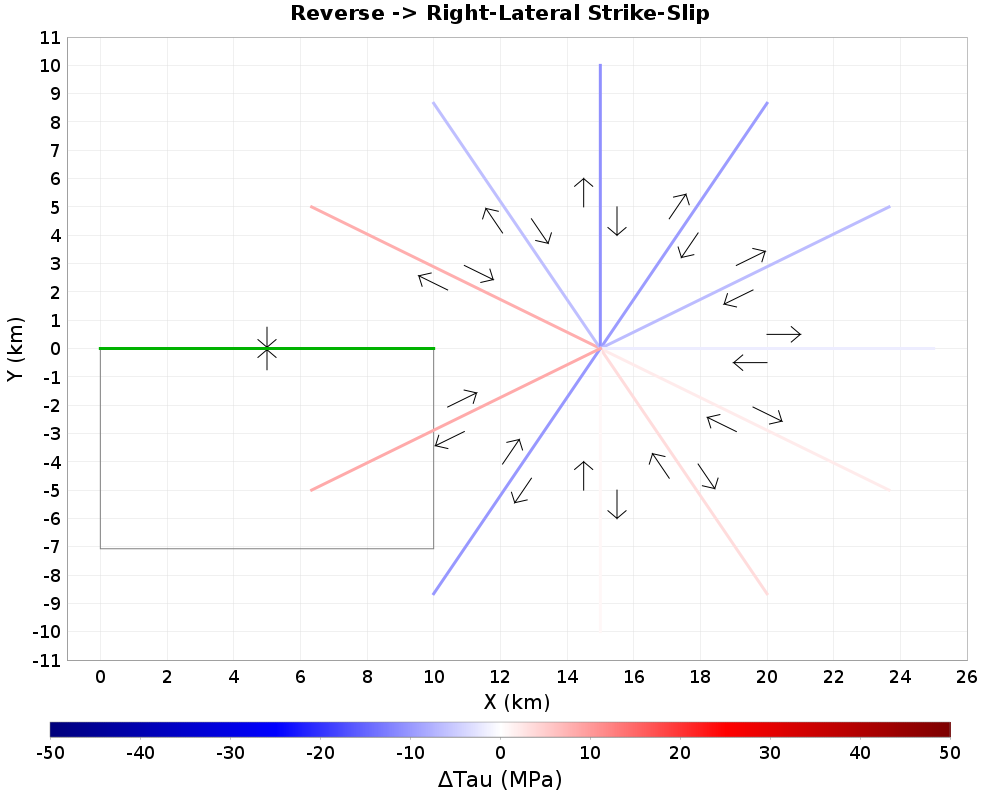 |  |

| Azimuth Change | &Delta;CFF | &Delta;CFF/Max | &Delta;Tau | &Delta;Tau/Max | &Delta;Sigma | &Delta;Sigma/Max |
|-----|-----|-----|-----|-----|-----|-----|
| -150 | 3.7804825 | 0.034557715 | -42.20473 | 0.06390732 | -91.97043 | 0.11219657 |
| -120 | -31.270477 | -0.28584614 | -53.902233 | -0.52861303 | -45.263508 | -0.9280404 |
| -90 | -43.055237 | -0.39357165 | -46.037212 | -0.727829 | -5.963951 | -1.2777867 |
| -60 | -37.770306 | -0.34526163 | -27.489265 | -0.63848966 | 20.562082 | -1.1209413 |
| -30 | -22.870602 | -0.20906214 | -6.265241 | -0.38661698 | 33.21072 | -0.67875016 |
| 0 | -5.1419706 | -0.0470032 | 11.705614 | -0.086922646 | 33.695168 | -0.15260261 |
| 30 | 10.360226 | 0.09470372 | 22.784029 | 0.17513484 | 24.847607 | 0.30746916 |
| 60 | 21.241728 | 0.19417247 | 26.192266 | 0.35908163 | 9.901079 | 0.6304087 |
| 90 | 9.517719 | 0.08700229 | -566.72894 | 0.16089267 | -11.42846 | 0.2824654 |
| 120 | 71.99824 | 0.6581421 | 52.793804 | 1.217097 | -47.5112 | 2.1367526 |
| 150 | 109.39619 | 1.0 | 59.15571 | 1.8492922 | -112.62998 | 3.246643 |

### Reverse -> Left-Lateral Strike-Slip
*[(top)](#table-of-contents)*

| &Delta;Tau | &Delta;Sigma |
|-----|-----|
|  |  |

| Azimuth Change | &Delta;CFF | &Delta;CFF/Max | &Delta;Tau | &Delta;Tau/Max | &Delta;Sigma | &Delta;Sigma/Max |
|-----|-----|-----|-----|-----|-----|-----|
| -150 | 88.18995 | 1.0 | 42.20473 | 0.1556122 | -91.97043 | 2.6172876 |
| -120 | 76.53399 | 0.86783123 | 53.902233 | 0.13504513 | -45.263508 | 2.2713637 |
| -90 | 49.01919 | 0.5558365 | 46.037212 | 0.086494945 | -5.963951 | 1.4547839 |
| -60 | 17.208223 | 0.19512683 | 27.489265 | 0.030364115 | 20.562082 | 0.510703 |
| -30 | -10.340118 | -0.11724827 | 6.265241 | -0.018245261 | 33.21072 | -0.30687243 |
| 0 | -28.553198 | -0.3237693 | -11.705614 | -0.050382458 | 33.695168 | -0.8473974 |
| 30 | -35.207832 | -0.39922726 | -22.784029 | -0.062124636 | 24.847607 | -1.0448925 |
| 60 | -31.142807 | -0.3531333 | -26.192266 | -0.054951854 | 9.901079 | -0.9242514 |
| 90 | 1.3067591 | 0.014817552 | 566.72894 | 0.002305792 | -11.42846 | 0.038781792 |
| 120 | -29.038206 | -0.3292689 | -52.793804 | -0.05123826 | -47.5112 | -0.8617914 |
| 150 | -2.8407152 | -0.032211326 | -59.15571 | -0.0050124754 | -112.62998 | -0.08430631 |

### Reverse -> Reverse
*[(top)](#table-of-contents)*

| &Delta;Tau | &Delta;Sigma |
|-----|-----|
| 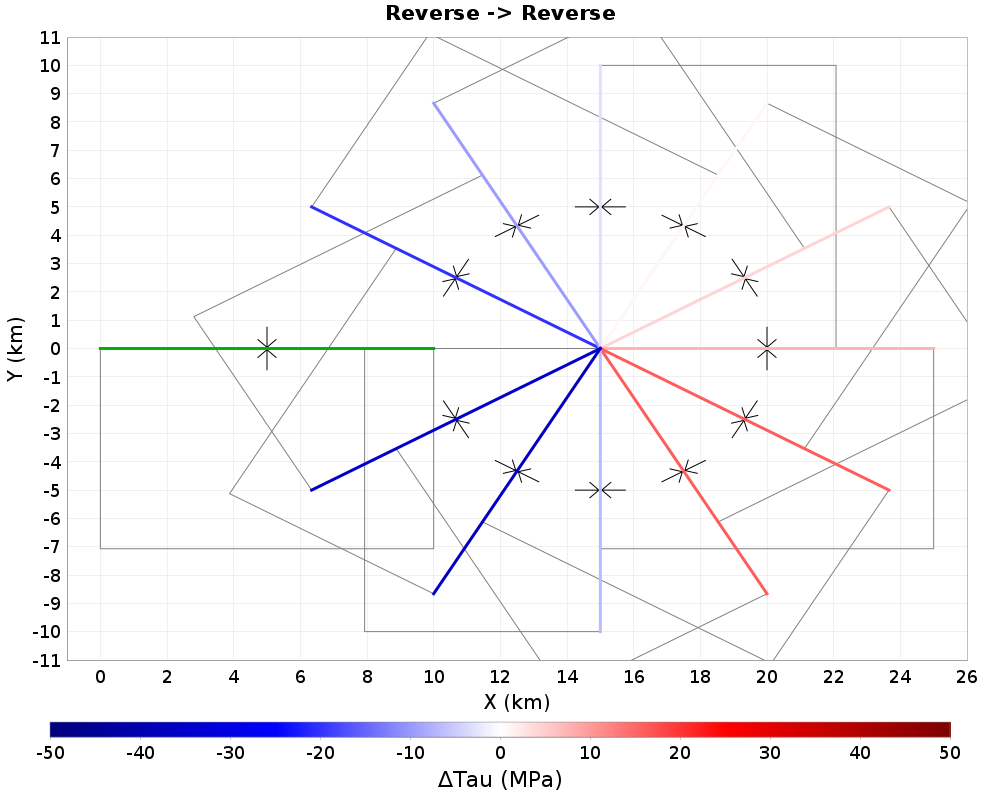 | 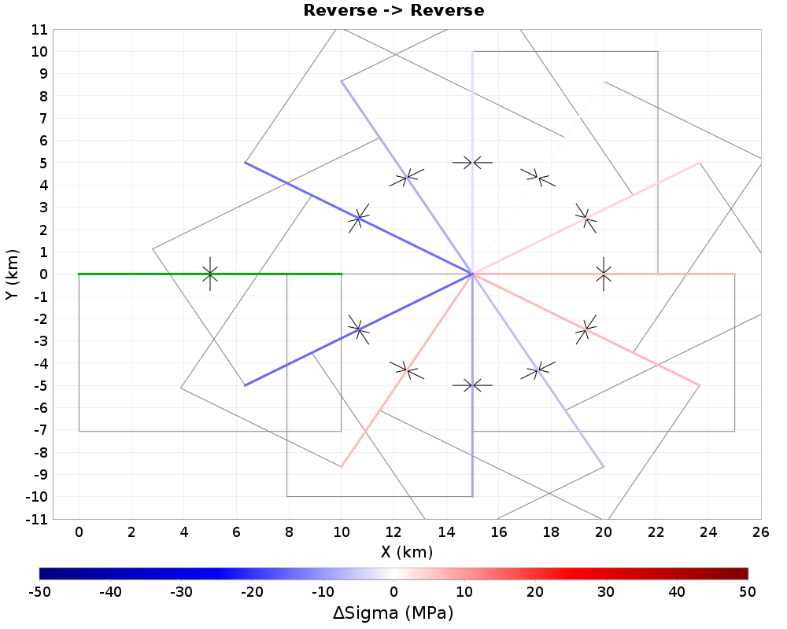 |

| Azimuth Change | &Delta;CFF | &Delta;CFF/Max | &Delta;Tau | &Delta;Tau/Max | &Delta;Sigma | &Delta;Sigma/Max |
|-----|-----|-----|-----|-----|-----|-----|
| -150 | -33.153423 | -0.2947353 | -48.991135 | -0.27407432 | -31.675428 | -1.9548763 |
| -120 | -18.602901 | -0.16538058 | -27.682064 | -0.15378737 | -18.158325 | -1.0969117 |
| -90 | -7.6332164 | -0.06785961 | -11.048549 | -0.06310265 | -6.8306646 | -0.45008913 |
| -60 | 2.3261871 | 0.0206799 | 3.9613736 | 0.019230235 | 3.2703733 | 0.13716255 |
| -30 | 19.64464 | 0.17464167 | 26.005316 | 0.16239926 | 12.721352 | 1.1583372 |
| 0 | 112.485405 | 1.0 | 120.96508 | 0.9298998 | 16.959345 | 6.6326504 |
| 30 | -5.5593944 | -0.049423248 | -23.162773 | -0.04595867 | 3.3566597 | -0.32780713 |
| 60 | -14.588547 | -0.1296928 | -25.35306 | -0.120601304 | -21.529024 | -0.86020696 |
| 90 | -34.81493 | -0.30950618 | -43.926506 | -0.28780976 | -18.223148 | -2.0528464 |
| 120 | -71.23399 | -0.63327324 | -84.75756 | -0.58888066 | -27.047121 | -4.20028 |
| 150 | -67.07974 | -0.5963417 | -93.21824 | -0.5545381 | -52.27699 | -3.9553263 |

### Reverse -> Normal
*[(top)](#table-of-contents)*

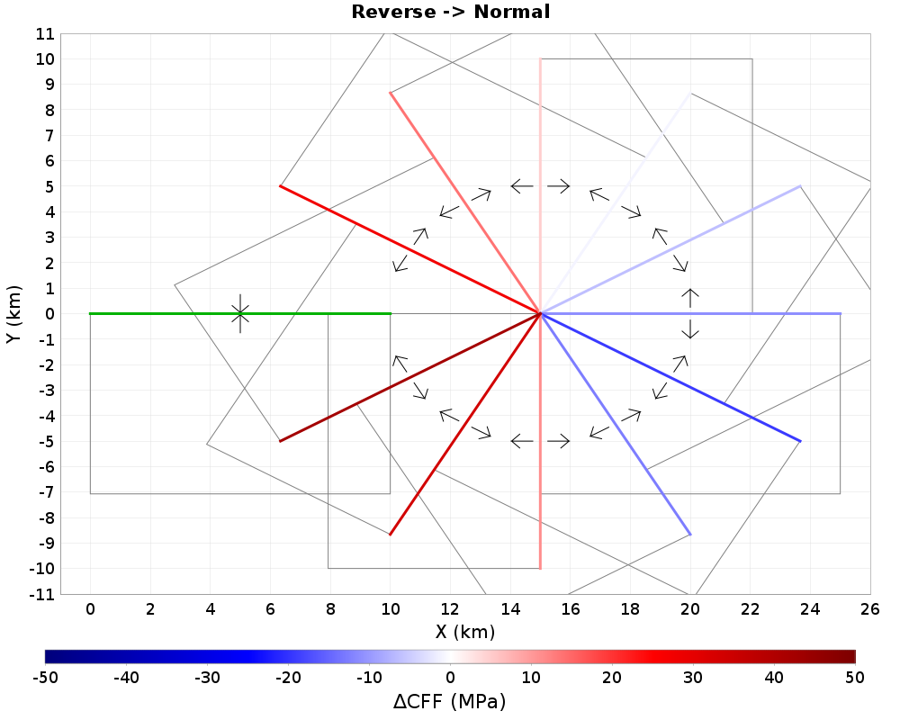

| &Delta;Tau | &Delta;Sigma |
|-----|-----|
|  |  |

| Azimuth Change | &Delta;CFF | &Delta;CFF/Max | &Delta;Tau | &Delta;Tau/Max | &Delta;Sigma | &Delta;Sigma/Max |
|-----|-----|-----|-----|-----|-----|-----|
| -150 | 64.82885 | 0.5543729 | 48.991135 | 0.69545245 | -31.675428 | 3.8226035 |
| -120 | 36.761227 | 0.3143574 | 27.682064 | 0.3943566 | -18.158325 | 2.167609 |
| -90 | 14.4638815 | 0.123685434 | 11.048549 | 0.1551615 | -6.8306646 | 0.85285616 |
| -60 | -5.5965605 | -0.047858037 | -3.9613736 | -0.06003718 | 3.2703733 | -0.3299986 |
| -30 | -32.36599 | -0.2767723 | -26.005316 | -0.34720662 | 12.721352 | -1.9084458 |
| 0 | -129.44475 | -1.1069249 | -120.96508 | -1.3886205 | 16.959345 | -7.6326504 |
| 30 | 18.91568 | 0.16175424 | 23.162773 | 0.20291823 | 3.3566597 | 1.1153544 |
| 60 | 36.117573 | 0.3088533 | 25.35306 | 0.38745177 | -21.529024 | 2.129656 |
| 90 | 53.03808 | 0.45354617 | 43.926506 | 0.56896675 | -18.223148 | 3.127366 |
| 120 | 98.28112 | 0.8404343 | 84.75756 | 1.0543121 | -27.047121 | 5.795101 |
| 150 | 116.940865 | 1.0 | 93.21824 | 1.2544848 | -52.27699 | 6.8953648 |

## Normal
*[(top)](#table-of-contents)*

### Normal -> Right-Lateral Strike-Slip
*[(top)](#table-of-contents)*

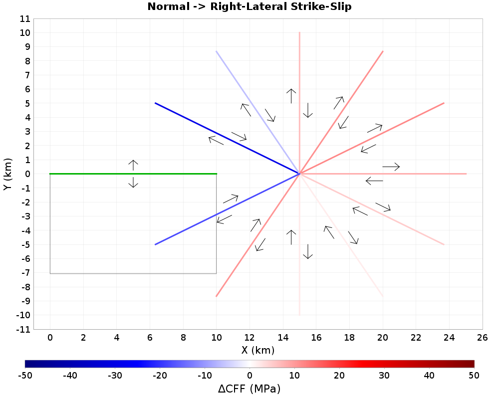

| &Delta;Tau | &Delta;Sigma |
|-----|-----|
|  | 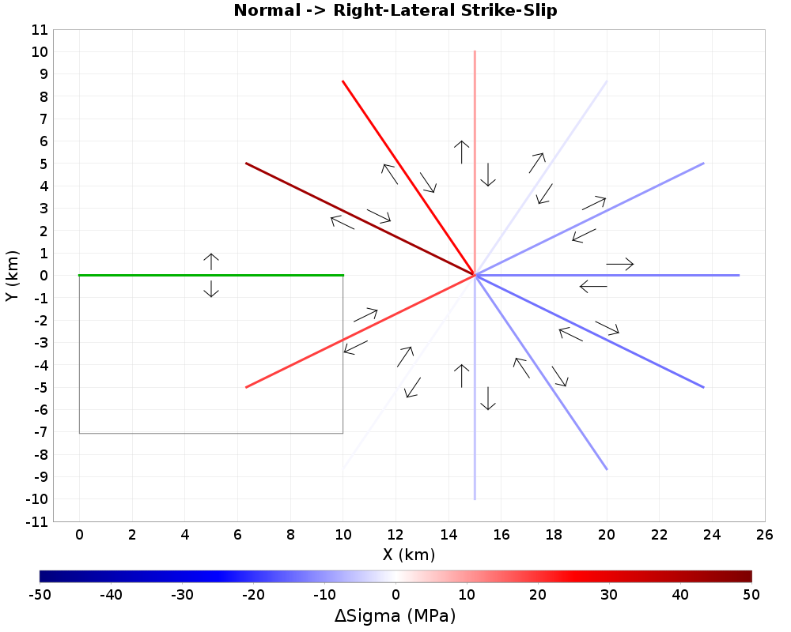 |

| Azimuth Change | &Delta;CFF | &Delta;CFF/Max | &Delta;Tau | &Delta;Tau/Max | &Delta;Sigma | &Delta;Sigma/Max |
|-----|-----|-----|-----|-----|-----|-----|
| -150 | -3.7804825 | -0.0878054 | 42.20473 | -0.006670706 | 91.97043 | -0.033565506 |
| -120 | 31.270477 | 0.7262874 | 53.902233 | 0.05517713 | 45.263508 | 0.27763903 |
| -90 | 43.055237 | 1.0 | 46.037212 | 0.07597148 | 5.963951 | 0.38227156 |
| -60 | 37.770306 | 0.8772523 | 27.489265 | 0.06664615 | -20.562082 | 0.33534858 |
| -30 | 22.870602 | 0.53119206 | 6.265241 | 0.040355448 | -33.21072 | 0.20305961 |
| 0 | 5.1419706 | 0.11942729 | -11.705614 | 0.009073068 | -33.695168 | 0.045653656 |
| 30 | -10.360226 | -0.24062636 | -22.784029 | -0.01828074 | -24.847607 | -0.091984615 |
| 60 | -21.241728 | -0.4933599 | -26.192266 | -0.037481282 | -9.901079 | -0.18859746 |
| 90 | -9.517719 | -0.22105832 | 566.72894 | -0.016794128 | 11.42846 | -0.084504314 |
| 120 | -71.99824 | -1.6722294 | -52.793804 | -0.12704174 | 47.5112 | -0.63924575 |
| 150 | -109.39619 | -2.5408335 | -59.15571 | -0.19303088 | 112.62998 | -0.9712883 |

### Normal -> Left-Lateral Strike-Slip
*[(top)](#table-of-contents)*

| &Delta;Tau | &Delta;Sigma |
|-----|-----|
| 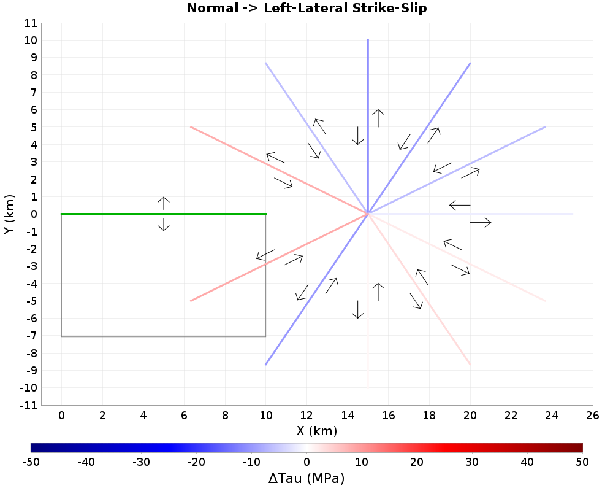 |  |

| Azimuth Change | &Delta;CFF | &Delta;CFF/Max | &Delta;Tau | &Delta;Tau/Max | &Delta;Sigma | &Delta;Sigma/Max |
|-----|-----|-----|-----|-----|-----|-----|
| -150 | -88.18995 | -2.504839 | -42.20473 | -1.4908104 | 91.97043 | -0.78300595 |
| -120 | -76.53399 | -2.1737773 | -53.902233 | -1.2937719 | 45.263508 | -0.679517 |
| -90 | -49.01919 | -1.3922808 | -46.037212 | -0.82864684 | 5.963951 | -0.43522328 |
| -60 | -17.208223 | -0.48876125 | -27.489265 | -0.2908971 | -20.562082 | -0.15278547 |
| -30 | 10.340118 | 0.29368803 | -6.265241 | 0.17479494 | -33.21072 | 0.09180609 |
| 0 | 28.553198 | 0.81099 | 11.705614 | 0.48267868 | -33.695168 | 0.2535133 |
| 30 | 35.207832 | 1.0 | 22.784029 | 0.59517217 | -24.847607 | 0.31259733 |
| 60 | 31.142807 | 0.88454205 | 26.192266 | 0.5264548 | -9.901079 | 0.27650547 |
| 90 | -1.3067591 | -0.037115578 | -566.72894 | -0.022090161 | 11.42846 | -0.01160223 |
| 120 | 29.038206 | 0.82476556 | 52.793804 | 0.4908775 | 47.5112 | 0.2578195 |
| 150 | 2.8407152 | 0.080684185 | 59.15571 | 0.04802098 | 112.62998 | 0.02522166 |

### Normal -> Reverse
*[(top)](#table-of-contents)*

| &Delta;Tau | &Delta;Sigma |
|-----|-----|
|  | 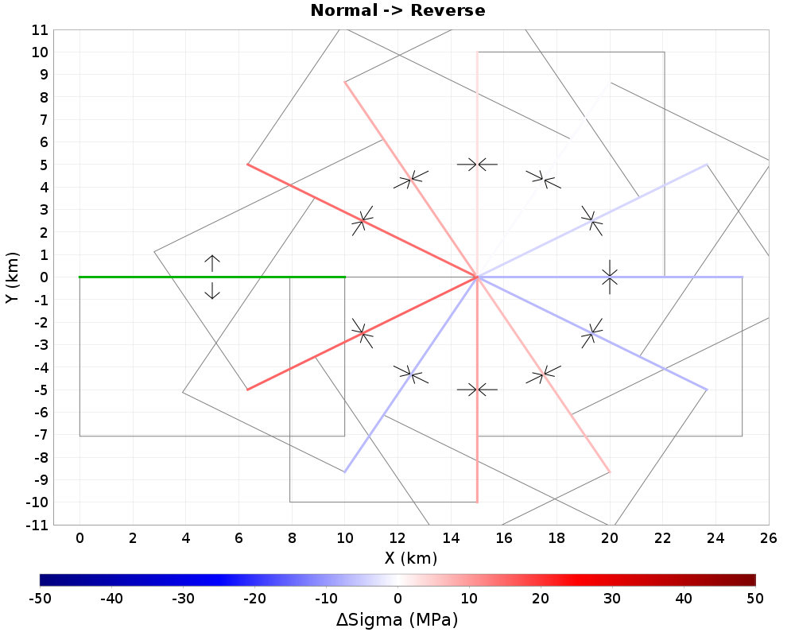 |

| Azimuth Change | &Delta;CFF | &Delta;CFF/Max | &Delta;Tau | &Delta;Tau/Max | &Delta;Sigma | &Delta;Sigma/Max |
|-----|-----|-----|-----|-----|-----|-----|
| -150 | 33.153423 | 0.46541572 | 48.991135 | 0.35565382 | 31.675428 | 0.63418764 |
| -120 | 18.602901 | 0.26115203 | 27.682064 | 0.1995629 | 18.158325 | 0.35585257 |
| -90 | 7.6332164 | 0.10715693 | 11.048549 | 0.08188544 | 6.8306646 | 0.14601484 |
| -60 | -2.3261871 | -0.032655574 | -3.9613736 | -0.024954205 | -3.2703733 | -0.04449734 |
| -30 | -19.64464 | -0.27577618 | -26.005316 | -0.21073815 | -12.721352 | -0.37577984 |
| 0 | -112.485405 | -1.5790973 | -120.96508 | -1.2066889 | -16.959345 | -2.1517193 |
| 30 | 5.5593944 | 0.07804412 | 23.162773 | 0.05963848 | -3.3566597 | 0.10634495 |
| 60 | 14.588547 | 0.20479754 | 25.35306 | 0.15649885 | 21.529024 | 0.27906248 |
| 90 | 34.81493 | 0.48874038 | 43.926506 | 0.37347767 | 18.223148 | 0.66597044 |
| 120 | 71.23399 | 1.0 | 84.75756 | 0.76416373 | 27.047121 | 1.3626262 |
| 150 | 67.07974 | 0.94168156 | 93.21824 | 0.7195989 | 52.27699 | 1.28316 |

### Normal -> Normal
*[(top)](#table-of-contents)*

| &Delta;Tau | &Delta;Sigma |
|-----|-----|
|  |  |

| Azimuth Change | &Delta;CFF | &Delta;CFF/Max | &Delta;Tau | &Delta;Tau/Max | &Delta;Sigma | &Delta;Sigma/Max |
|-----|-----|-----|-----|-----|-----|-----|
| -150 | -64.82885 | -0.50082254 | -48.991135 | -0.5359303 | 31.675428 | -1.240103 |
| -120 | -36.761227 | -0.28399163 | -27.682064 | -0.3038995 | 18.158325 | -0.7032009 |
| -90 | -14.4638815 | -0.11173787 | -11.048549 | -0.11957072 | 6.8306646 | -0.27667776 |
| -60 | 5.5965605 | 0.043235127 | 3.9613736 | 0.046265915 | -3.2703733 | 0.1070559 |
| -30 | 32.36599 | 0.2500371 | 26.005316 | 0.26756474 | -12.721352 | 0.619125 |
| 0 | 129.44475 | 1.0 | 120.96508 | 1.0701002 | -16.959345 | 2.4761324 |
| 30 | -18.91568 | -0.14612937 | -23.162773 | -0.15637307 | -3.3566597 | -0.36183566 |
| 60 | -36.117573 | -0.2790192 | -25.35306 | -0.2985785 | 21.529024 | -0.6908885 |
| 90 | -53.03808 | -0.40973526 | -43.926506 | -0.43845776 | 18.223148 | -1.0145588 |
| 120 | -98.28112 | -0.7592515 | -84.75756 | -0.81247514 | 27.047121 | -1.8800071 |
| 150 | -116.940865 | -0.90340364 | -93.21824 | -0.96673244 | 52.27699 | -2.236947 |

