# Random Field Loss Debug

Random field dubugging with the following parameters:

* 10 randomly chosen ruptures
* 5 randomly chosen assets
* 100 random fields
* 1000 randomly sampled (from a normal distribution) between-event values

The mean of all 1000 between-event values is 0.037164226

## Table Of Contents
* [Rupture 135839, M7.2476196](#rupture-135839-m72476196)
  * [Rupture 135839, Asset0](#rupture-135839-asset0)
  * [Rupture 135839, Asset1](#rupture-135839-asset1)
  * [Rupture 135839, Asset2](#rupture-135839-asset2)
  * [Rupture 135839, Asset3](#rupture-135839-asset3)
  * [Rupture 135839, Asset4](#rupture-135839-asset4)
* [Rupture 205629, M7.104012](#rupture-205629-m7104012)
  * [Rupture 205629, Asset0](#rupture-205629-asset0)
  * [Rupture 205629, Asset1](#rupture-205629-asset1)
  * [Rupture 205629, Asset2](#rupture-205629-asset2)
  * [Rupture 205629, Asset3](#rupture-205629-asset3)
  * [Rupture 205629, Asset4](#rupture-205629-asset4)
* [Rupture 81057, M7.0598035](#rupture-81057-m70598035)
  * [Rupture 81057, Asset0](#rupture-81057-asset0)
  * [Rupture 81057, Asset1](#rupture-81057-asset1)
  * [Rupture 81057, Asset2](#rupture-81057-asset2)
  * [Rupture 81057, Asset3](#rupture-81057-asset3)
  * [Rupture 81057, Asset4](#rupture-81057-asset4)
* [Rupture 215437, M7.700723](#rupture-215437-m7700723)
  * [Rupture 215437, Asset0](#rupture-215437-asset0)
  * [Rupture 215437, Asset1](#rupture-215437-asset1)
  * [Rupture 215437, Asset2](#rupture-215437-asset2)
  * [Rupture 215437, Asset3](#rupture-215437-asset3)
  * [Rupture 215437, Asset4](#rupture-215437-asset4)
* [Rupture 187237, M7.2455945](#rupture-187237-m72455945)
  * [Rupture 187237, Asset0](#rupture-187237-asset0)
  * [Rupture 187237, Asset1](#rupture-187237-asset1)
  * [Rupture 187237, Asset2](#rupture-187237-asset2)
  * [Rupture 187237, Asset3](#rupture-187237-asset3)
  * [Rupture 187237, Asset4](#rupture-187237-asset4)
* [Rupture 103472, M7.0620694](#rupture-103472-m70620694)
  * [Rupture 103472, Asset0](#rupture-103472-asset0)
  * [Rupture 103472, Asset1](#rupture-103472-asset1)
  * [Rupture 103472, Asset2](#rupture-103472-asset2)
  * [Rupture 103472, Asset3](#rupture-103472-asset3)
  * [Rupture 103472, Asset4](#rupture-103472-asset4)
* [Rupture 169293, M7.9014773](#rupture-169293-m79014773)
  * [Rupture 169293, Asset0](#rupture-169293-asset0)
  * [Rupture 169293, Asset1](#rupture-169293-asset1)
  * [Rupture 169293, Asset2](#rupture-169293-asset2)
  * [Rupture 169293, Asset3](#rupture-169293-asset3)
  * [Rupture 169293, Asset4](#rupture-169293-asset4)
* [Rupture 208188, M8.023331](#rupture-208188-m8023331)
  * [Rupture 208188, Asset0](#rupture-208188-asset0)
  * [Rupture 208188, Asset1](#rupture-208188-asset1)
  * [Rupture 208188, Asset2](#rupture-208188-asset2)
  * [Rupture 208188, Asset3](#rupture-208188-asset3)
  * [Rupture 208188, Asset4](#rupture-208188-asset4)
* [Rupture 68673, M8.155491](#rupture-68673-m8155491)
  * [Rupture 68673, Asset0](#rupture-68673-asset0)
  * [Rupture 68673, Asset1](#rupture-68673-asset1)
  * [Rupture 68673, Asset2](#rupture-68673-asset2)
  * [Rupture 68673, Asset3](#rupture-68673-asset3)
  * [Rupture 68673, Asset4](#rupture-68673-asset4)
* [Rupture 42699, M7.9970284](#rupture-42699-m79970284)
  * [Rupture 42699, Asset0](#rupture-42699-asset0)
  * [Rupture 42699, Asset1](#rupture-42699-asset1)
  * [Rupture 42699, Asset2](#rupture-42699-asset2)
  * [Rupture 42699, Asset3](#rupture-42699-asset3)
  * [Rupture 42699, Asset4](#rupture-42699-asset4)
## Rupture 135839, M7.2476196
*[(top)](#table-of-contents)*

### Rupture 135839, Asset0
*[(top)](#table-of-contents)*

Asset parameters:

* value: 28152.0
* J-B distance to rupture: 694.690385092882
* Vulnerability function: W1-h-RES1-DF
* GMPE ln mean: -6.1232867
* GMPE phi/tau/total std devs: 0.63/t0.36/t0.7256032

**Loss Values**

| Description | Loss Value |
|-----|-----|
| Mean Loss (GMPE) | 2.5730964E-4 |
| Mean Loss (100000 random fields) | 0.019453032 |
| Mean Loss using rand-field exceed probs | 0.0012151059 |

| 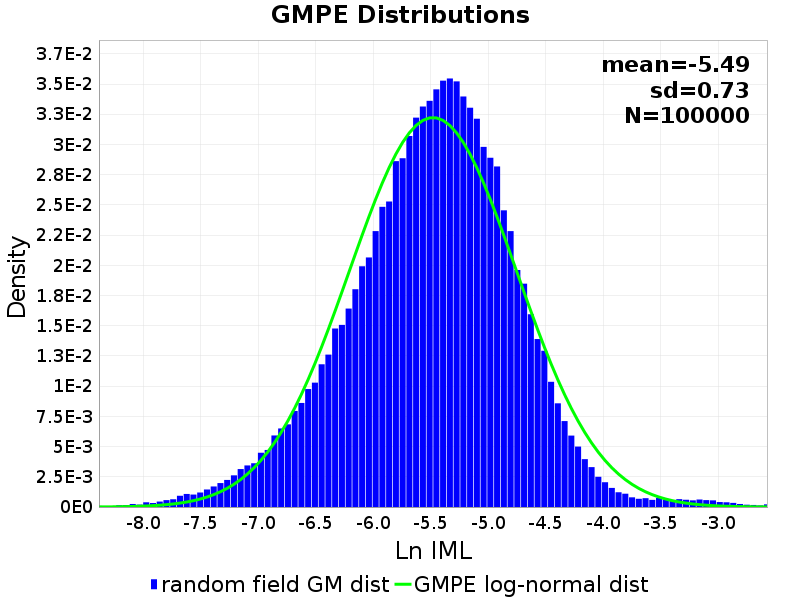 |  |
|-----|-----|
| 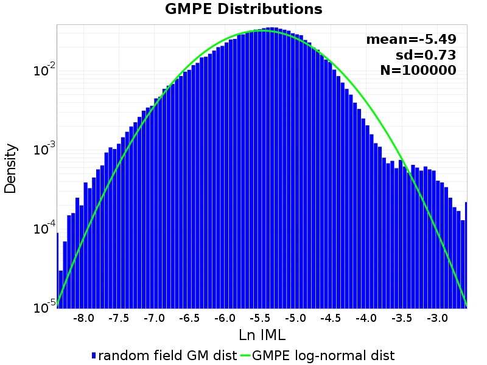 |  |
|  | 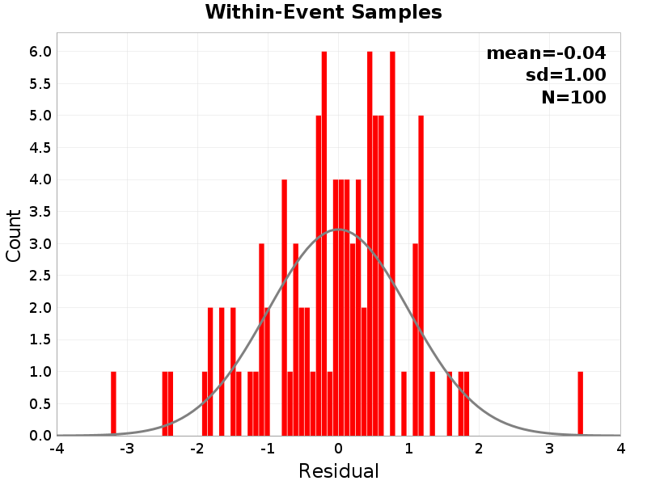 |
|  | 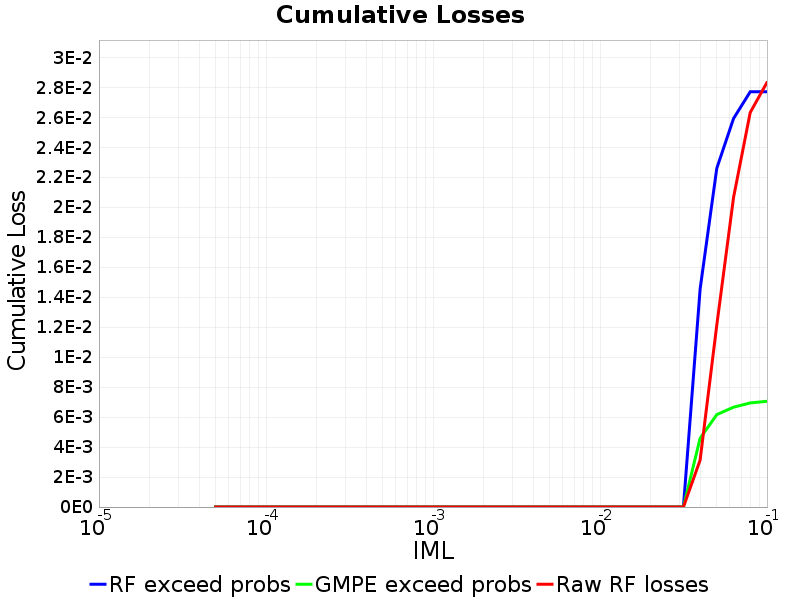 |

### Rupture 135839, Asset1
*[(top)](#table-of-contents)*

Asset parameters:

* value: 173.0
* J-B distance to rupture: 14.043580684469827
* Vulnerability function: RM1L-m-RES1-DF
* GMPE ln mean: -1.3732768
* GMPE phi/tau/total std devs: 0.63/t0.36/t0.7256032

**Loss Values**

| Description | Loss Value |
|-----|-----|
| Mean Loss (GMPE) | 11.342175 |
| Mean Loss (100000 random fields) | 11.725416 |
| Mean Loss using rand-field exceed probs | 10.205882 |

|  | 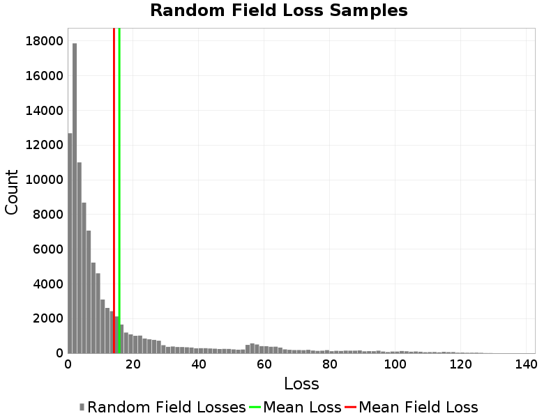 |
|-----|-----|
| 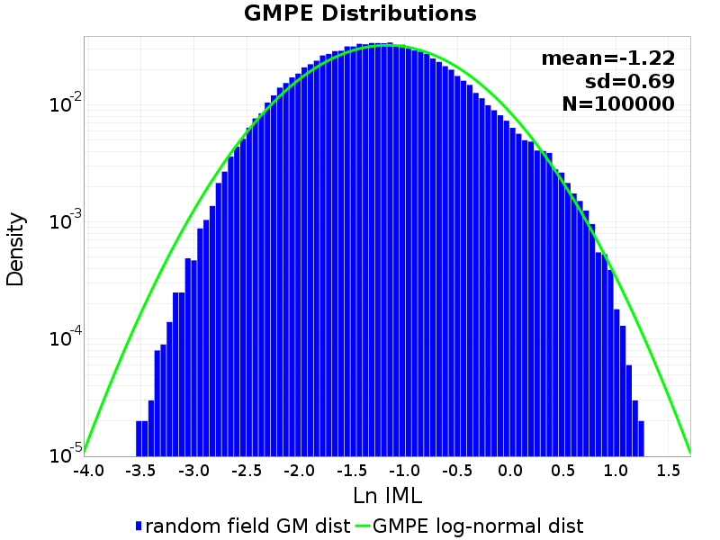 | 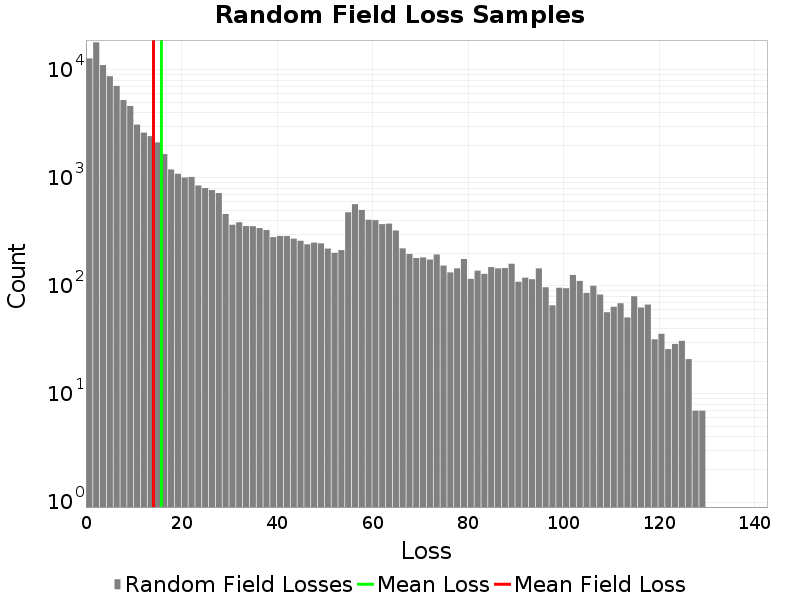 |
|  |  |
|  |  |

### Rupture 135839, Asset2
*[(top)](#table-of-contents)*

Asset parameters:

* value: 127.0
* J-B distance to rupture: 273.5062053170421
* Vulnerability function: RM1L-l-RES1-DF
* GMPE ln mean: -3.6035054
* GMPE phi/tau/total std devs: 0.6295386/t0.35955814/t0.72498333

**Loss Values**

| Description | Loss Value |
|-----|-----|
| Mean Loss (GMPE) | 0.14406106 |
| Mean Loss (100000 random fields) | 0.059422918 |
| Mean Loss using rand-field exceed probs | 0.13138944 |

|  | 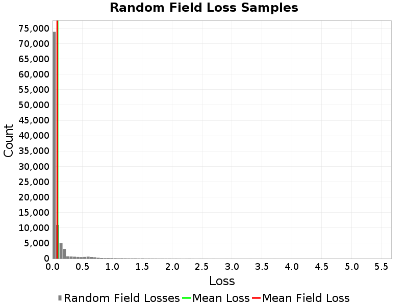 |
|-----|-----|
|  | 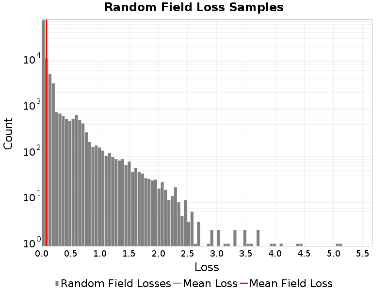 |
|  |  |
| 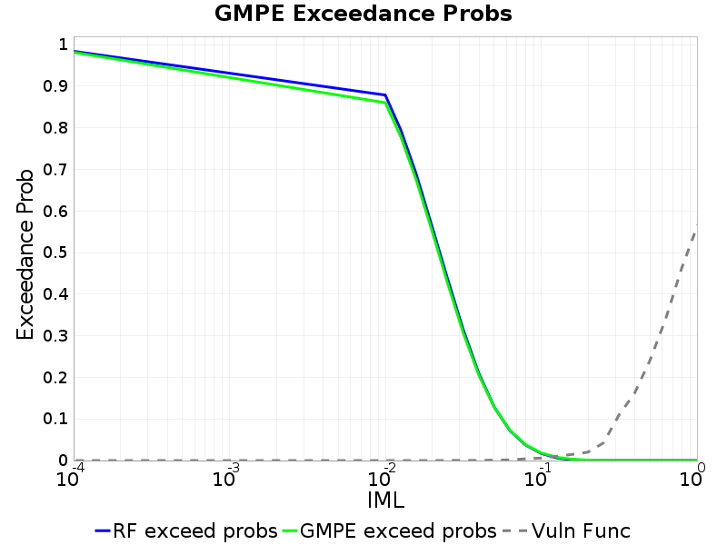 |  |

### Rupture 135839, Asset3
*[(top)](#table-of-contents)*

Asset parameters:

* value: 8363.0
* J-B distance to rupture: 447.8401003616335
* Vulnerability function: W1-h-RES1-DF
* GMPE ln mean: -4.5772963
* GMPE phi/tau/total std devs: 0.63/t0.36/t0.7256032

**Loss Values**

| Description | Loss Value |
|-----|-----|
| Mean Loss (GMPE) | 0.08914284 |
| Mean Loss (100000 random fields) | 0.33296448 |
| Mean Loss using rand-field exceed probs | 0.08804993 |

|  | 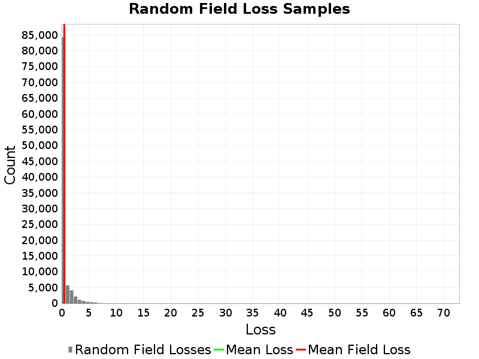 |
|-----|-----|
|  | 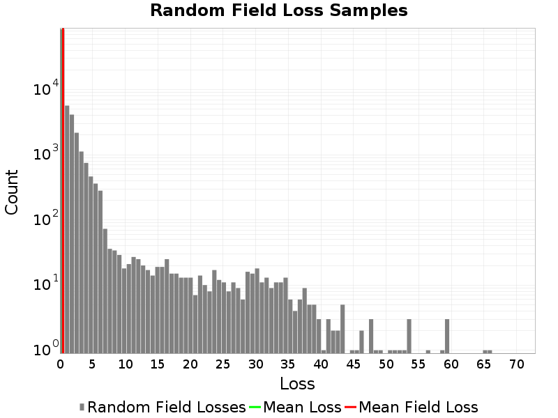 |
|  |  |
|  |  |

### Rupture 135839, Asset4
*[(top)](#table-of-contents)*

Asset parameters:

* value: 26997.0
* J-B distance to rupture: 34.65936164836105
* Vulnerability function: W1-m-RES1-DF
* GMPE ln mean: -1.4465866
* GMPE phi/tau/total std devs: 0.61022574/t0.3408569/t0.69896984

**Loss Values**

| Description | Loss Value |
|-----|-----|
| Mean Loss (GMPE) | 804.4842 |
| Mean Loss (100000 random fields) | 624.4492 |
| Mean Loss using rand-field exceed probs | 756.6421 |

|  |  |
|-----|-----|
|  |  |
|  |  |
|  |  |

## Rupture 205629, M7.104012
*[(top)](#table-of-contents)*

### Rupture 205629, Asset0
*[(top)](#table-of-contents)*

Asset parameters:

* value: 28152.0
* J-B distance to rupture: 455.31765368287483
* Vulnerability function: W1-h-RES1-DF
* GMPE ln mean: -4.318542
* GMPE phi/tau/total std devs: 0.6288648/t0.35891256/t0.7240782

**Loss Values**

| Description | Loss Value |
|-----|-----|
| Mean Loss (GMPE) | 0.7227647 |
| Mean Loss (100000 random fields) | 0.079163425 |
| Mean Loss using rand-field exceed probs | 0.75079924 |

|  |  |
|-----|-----|
|  |  |
|  |  |
|  |  |

### Rupture 205629, Asset1
*[(top)](#table-of-contents)*

Asset parameters:

* value: 173.0
* J-B distance to rupture: 221.97881822486164
* Vulnerability function: RM1L-m-RES1-DF
* GMPE ln mean: -3.7369099
* GMPE phi/tau/total std devs: 0.63/t0.36/t0.7256032

**Loss Values**

| Description | Loss Value |
|-----|-----|
| Mean Loss (GMPE) | 0.073542394 |
| Mean Loss (100000 random fields) | 0.11113554 |
| Mean Loss using rand-field exceed probs | 0.08858034 |

|  |  |
|-----|-----|
| 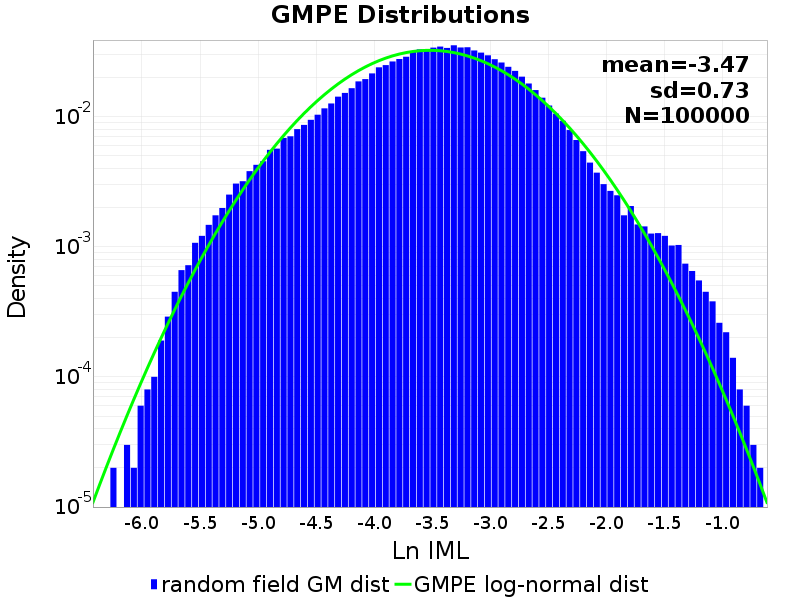 |  |
|  |  |
|  |  |

### Rupture 205629, Asset2
*[(top)](#table-of-contents)*

Asset parameters:

* value: 127.0
* J-B distance to rupture: 518.5566534689463
* Vulnerability function: RM1L-l-RES1-DF
* GMPE ln mean: -4.848132
* GMPE phi/tau/total std devs: 0.62986654/t0.35987222/t0.72542393

**Loss Values**

| Description | Loss Value |
|-----|-----|
| Mean Loss (GMPE) | 0.0050842203 |
| Mean Loss (100000 random fields) | 0.00156972 |
| Mean Loss using rand-field exceed probs | 0.0047403295 |

| 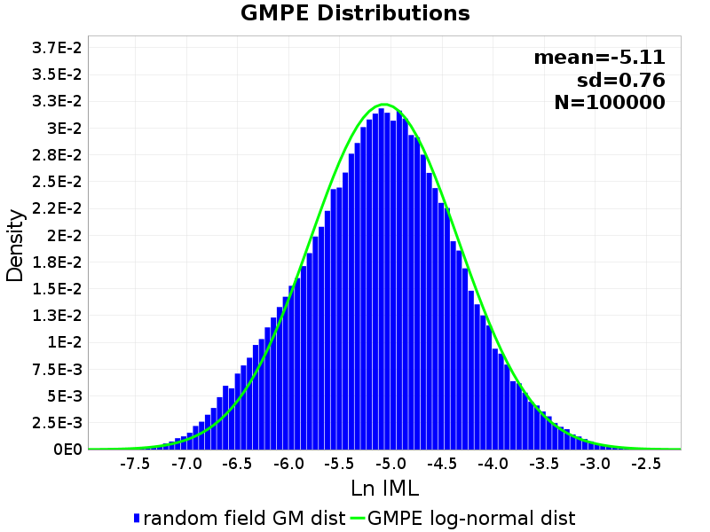 |  |
|-----|-----|
| 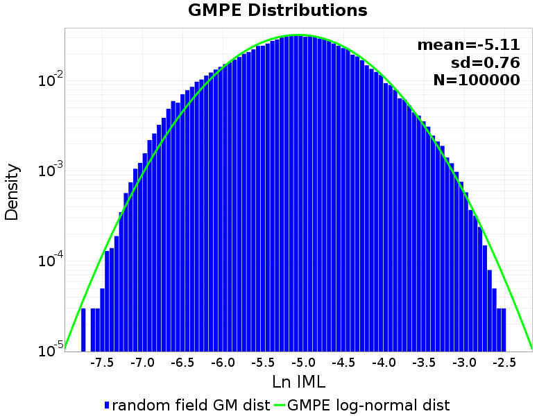 |  |
|  |  |
|  | 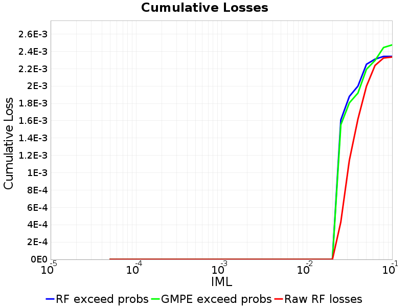 |

### Rupture 205629, Asset3
*[(top)](#table-of-contents)*

Asset parameters:

* value: 8363.0
* J-B distance to rupture: 206.3980025623005
* Vulnerability function: W1-h-RES1-DF
* GMPE ln mean: -3.646181
* GMPE phi/tau/total std devs: 0.63/t0.36/t0.7256032

**Loss Values**

| Description | Loss Value |
|-----|-----|
| Mean Loss (GMPE) | 1.7082796 |
| Mean Loss (100000 random fields) | 3.13053 |
| Mean Loss using rand-field exceed probs | 1.0046855 |

| 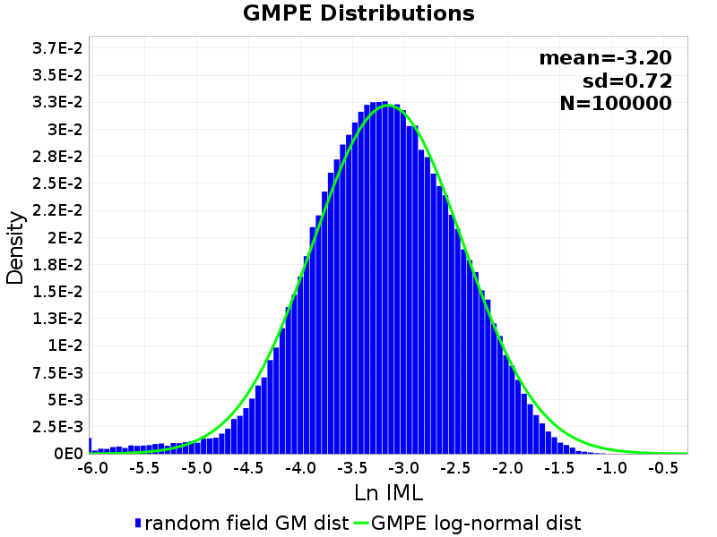 |  |
|-----|-----|
|  |  |
|  | 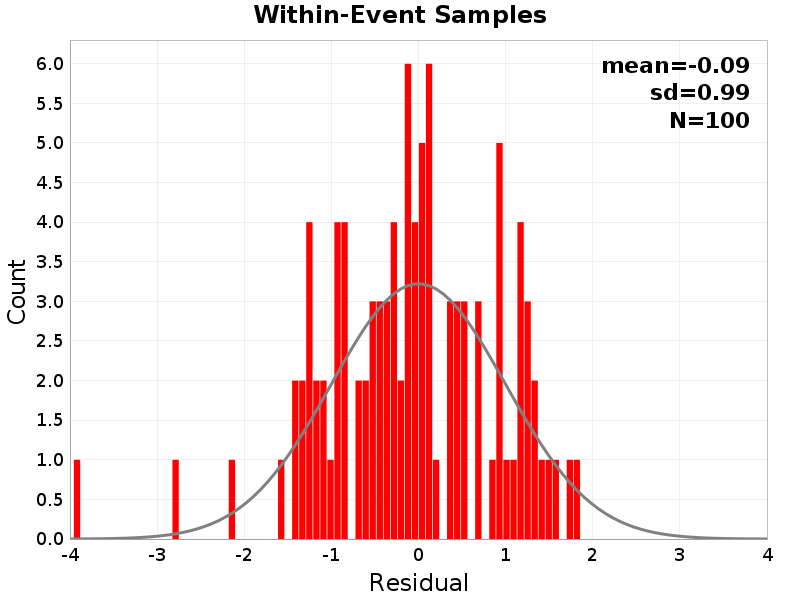 |
| 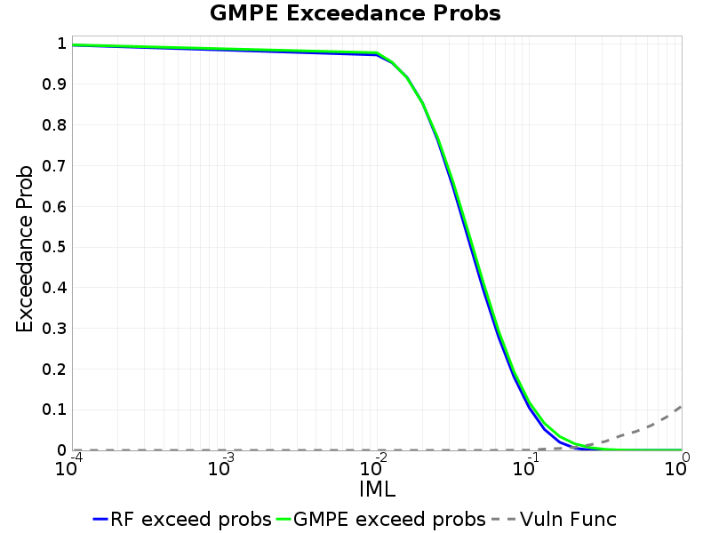 | 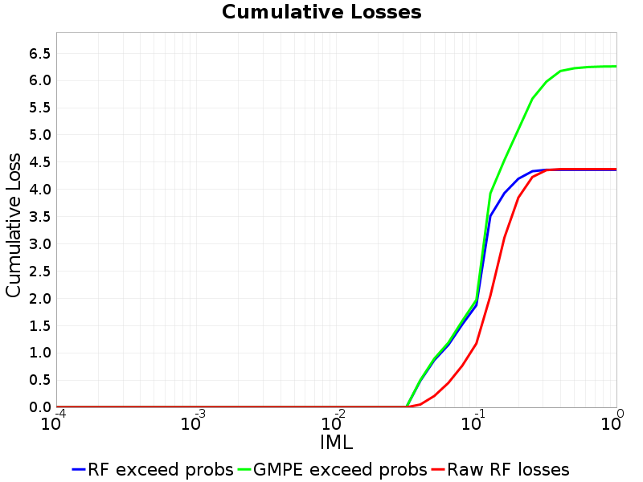 |

### Rupture 205629, Asset4
*[(top)](#table-of-contents)*

Asset parameters:

* value: 26997.0
* J-B distance to rupture: 154.41544744535676
* Vulnerability function: W1-m-RES1-DF
* GMPE ln mean: -2.8310452
* GMPE phi/tau/total std devs: 0.62498957/t0.35519016/t0.71886855

**Loss Values**

| Description | Loss Value |
|-----|-----|
| Mean Loss (GMPE) | 58.49787 |
| Mean Loss (100000 random fields) | 43.845127 |
| Mean Loss using rand-field exceed probs | 57.254192 |

|  | 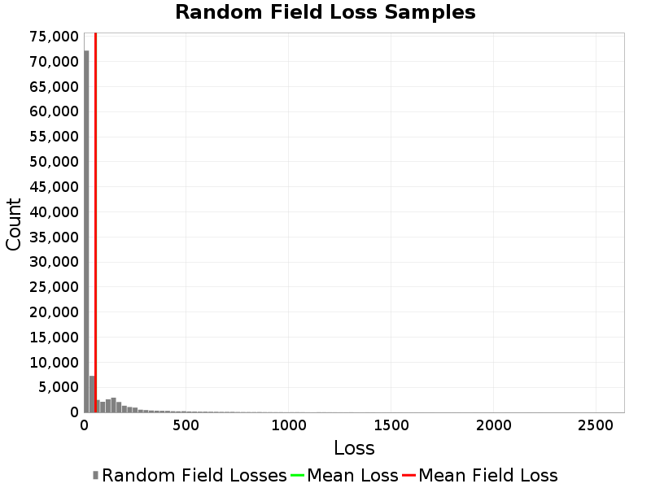 |
|-----|-----|
|  |  |
|  |  |
|  | 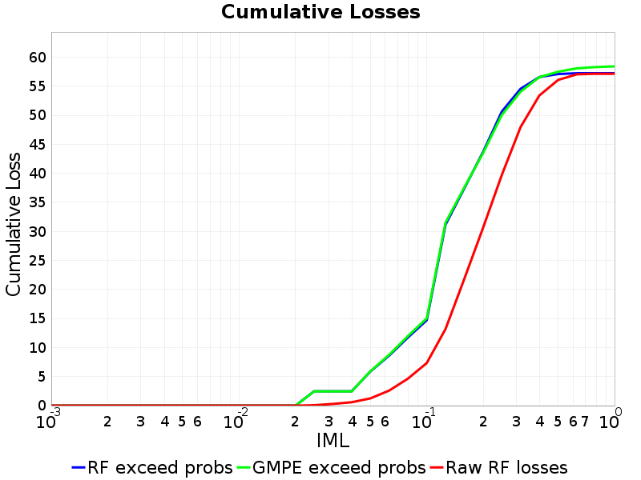 |

## Rupture 81057, M7.0598035
*[(top)](#table-of-contents)*

### Rupture 81057, Asset0
*[(top)](#table-of-contents)*

Asset parameters:

* value: 28152.0
* J-B distance to rupture: 620.5196004039326
* Vulnerability function: W1-h-RES1-DF
* GMPE ln mean: -5.006503
* GMPE phi/tau/total std devs: 0.6294292/t0.3594534/t0.72483647

**Loss Values**

| Description | Loss Value |
|-----|-----|
| Mean Loss (GMPE) | 0.058152128 |
| Mean Loss (100000 random fields) | 0.0 |
| Mean Loss using rand-field exceed probs | 0.0035447183 |

|  |  |
|-----|-----|
|  | 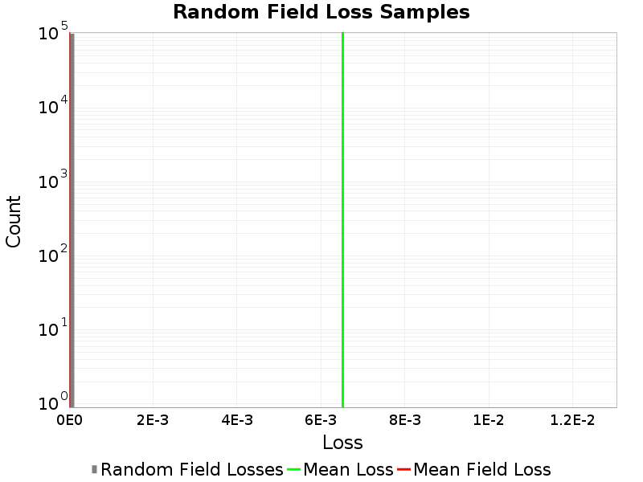 |
|  |  |
|  |  |

### Rupture 81057, Asset1
*[(top)](#table-of-contents)*

Asset parameters:

* value: 173.0
* J-B distance to rupture: 56.80155166346245
* Vulnerability function: RM1L-m-RES1-DF
* GMPE ln mean: -2.431589
* GMPE phi/tau/total std devs: 0.63/t0.36/t0.7256032

**Loss Values**

| Description | Loss Value |
|-----|-----|
| Mean Loss (GMPE) | 1.4616925 |
| Mean Loss (100000 random fields) | 1.4006596 |
| Mean Loss using rand-field exceed probs | 1.1446087 |

|  | 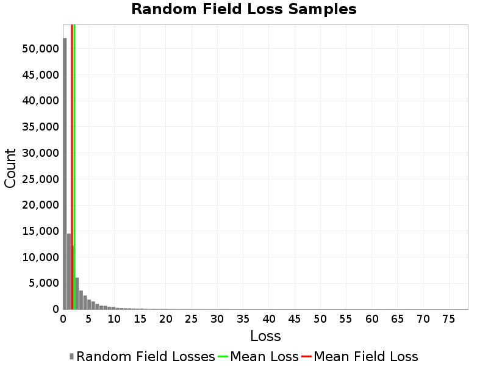 |
|-----|-----|
| 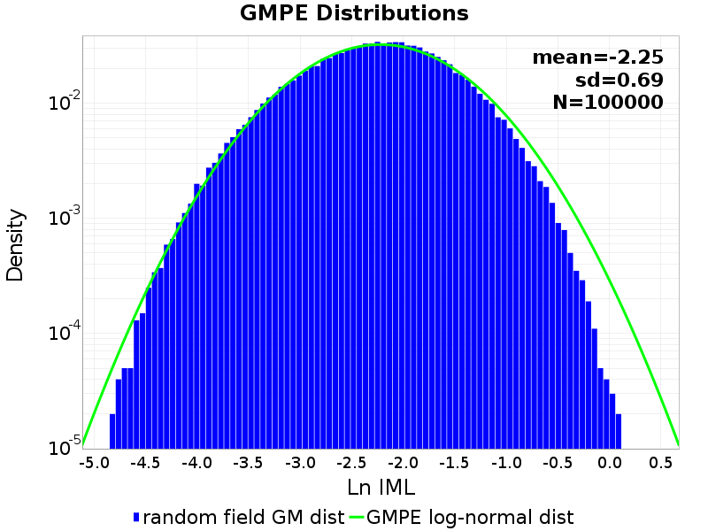 |  |
|  |  |
|  | 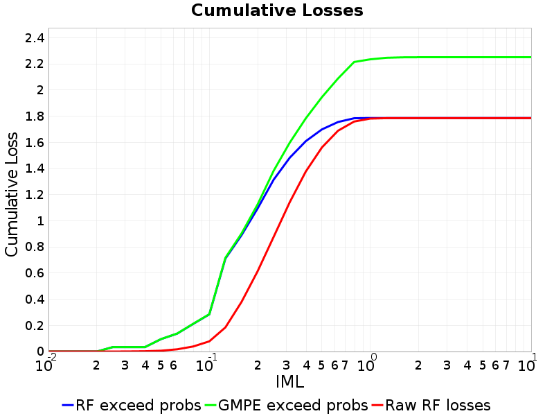 |

### Rupture 81057, Asset2
*[(top)](#table-of-contents)*

Asset parameters:

* value: 127.0
* J-B distance to rupture: 361.62884408989186
* Vulnerability function: RM1L-l-RES1-DF
* GMPE ln mean: -4.2620726
* GMPE phi/tau/total std devs: 0.6297605/t0.3597707/t0.7252815

**Loss Values**

| Description | Loss Value |
|-----|-----|
| Mean Loss (GMPE) | 0.027650652 |
| Mean Loss (100000 random fields) | 0.006195695 |
| Mean Loss using rand-field exceed probs | 0.017293284 |

|  |  |
|-----|-----|
|  | 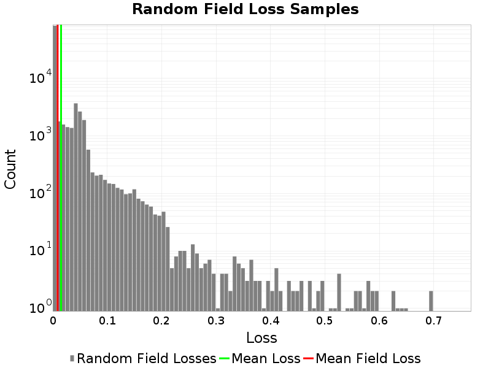 |
|  |  |
|  |  |

### Rupture 81057, Asset3
*[(top)](#table-of-contents)*

Asset parameters:

* value: 8363.0
* J-B distance to rupture: 374.71615824900556
* Vulnerability function: W1-h-RES1-DF
* GMPE ln mean: -4.5361624
* GMPE phi/tau/total std devs: 0.63/t0.36/t0.7256032

**Loss Values**

| Description | Loss Value |
|-----|-----|
| Mean Loss (GMPE) | 0.10313732 |
| Mean Loss (100000 random fields) | 0.15675607 |
| Mean Loss using rand-field exceed probs | 0.033051375 |

| 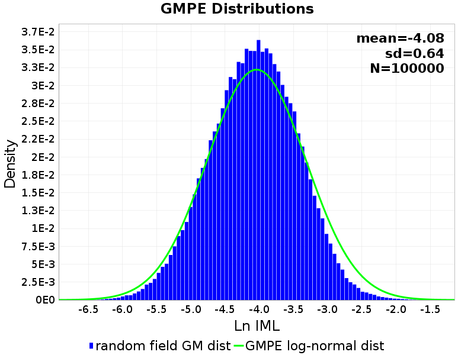 |  |
|-----|-----|
|  |  |
|  |  |
|  |  |

### Rupture 81057, Asset4
*[(top)](#table-of-contents)*

Asset parameters:

* value: 26997.0
* J-B distance to rupture: 18.314450029417543
* Vulnerability function: W1-m-RES1-DF
* GMPE ln mean: -1.155249
* GMPE phi/tau/total std devs: 0.6036888/t0.3344283/t0.69013214

**Loss Values**

| Description | Loss Value |
|-----|-----|
| Mean Loss (GMPE) | 1268.956 |
| Mean Loss (100000 random fields) | 1029.3333 |
| Mean Loss using rand-field exceed probs | 1233.6437 |

|  | 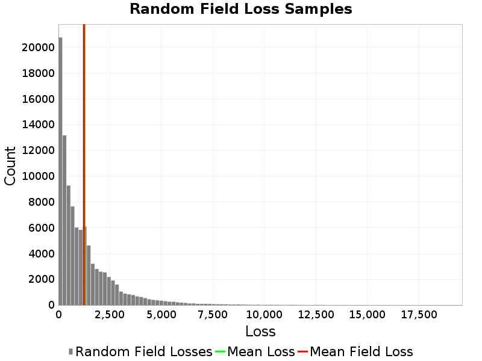 |
|-----|-----|
|  | 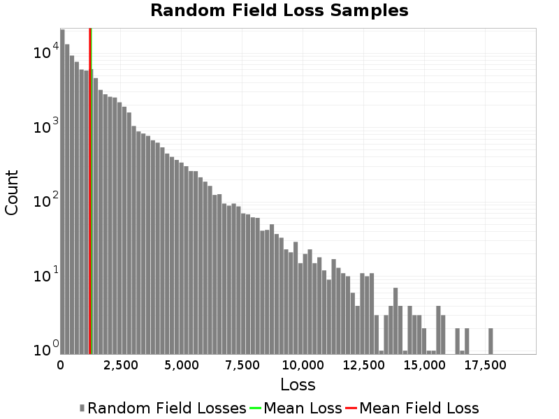 |
|  |  |
|  | 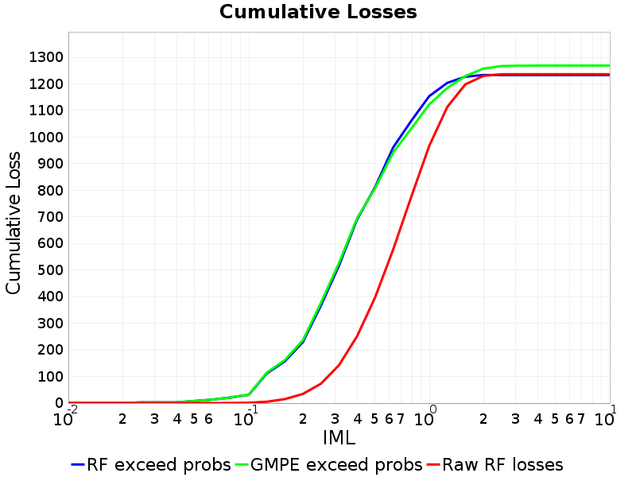 |

## Rupture 215437, M7.700723
*[(top)](#table-of-contents)*

### Rupture 215437, Asset0
*[(top)](#table-of-contents)*

Asset parameters:

* value: 28152.0
* J-B distance to rupture: 71.05894884501028
* Vulnerability function: W1-h-RES1-DF
* GMPE ln mean: -1.4786611
* GMPE phi/tau/total std devs: 0.61083996/t0.3414583/t0.6997994

**Loss Values**

| Description | Loss Value |
|-----|-----|
| Mean Loss (GMPE) | 611.8853 |
| Mean Loss (100000 random fields) | 239.63196 |
| Mean Loss using rand-field exceed probs | 591.9932 |

|  | 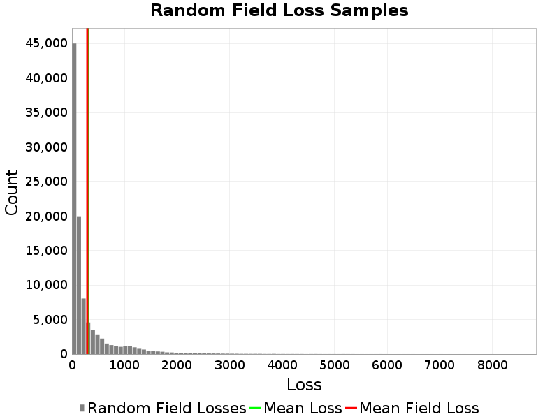 |
|-----|-----|
| 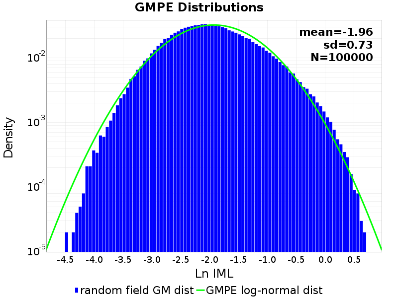 |  |
|  |  |
| 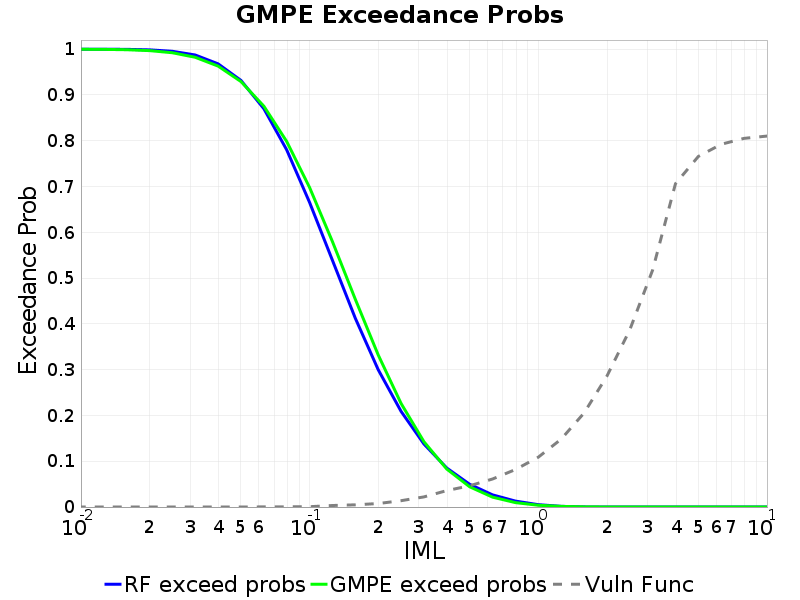 | 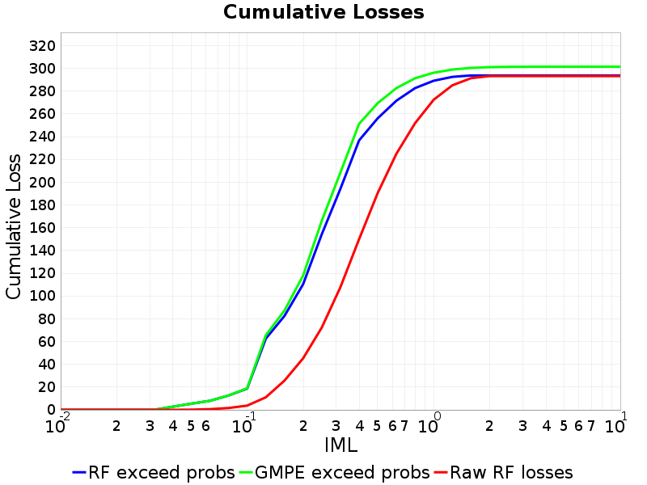 |

### Rupture 215437, Asset1
*[(top)](#table-of-contents)*

Asset parameters:

* value: 173.0
* J-B distance to rupture: 534.3368058887747
* Vulnerability function: RM1L-m-RES1-DF
* GMPE ln mean: -4.14995
* GMPE phi/tau/total std devs: 0.63/t0.36/t0.7256032

**Loss Values**

| Description | Loss Value |
|-----|-----|
| Mean Loss (GMPE) | 0.025829807 |
| Mean Loss (100000 random fields) | 0.03875321 |
| Mean Loss using rand-field exceed probs | 0.03001006 |

|  | 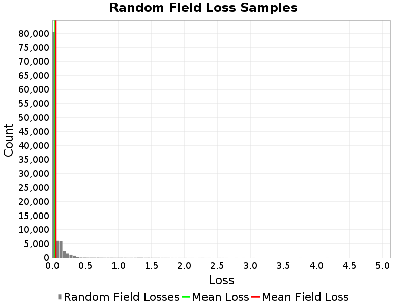 |
|-----|-----|
|  |  |
|  |  |
|  |  |

### Rupture 215437, Asset2
*[(top)](#table-of-contents)*

Asset parameters:

* value: 127.0
* J-B distance to rupture: 791.8061611004053
* Vulnerability function: RM1L-l-RES1-DF
* GMPE ln mean: -4.784628
* GMPE phi/tau/total std devs: 0.62985784/t0.35986385/t0.7254122

**Loss Values**

| Description | Loss Value |
|-----|-----|
| Mean Loss (GMPE) | 0.0061978516 |
| Mean Loss (100000 random fields) | 0.001103376 |
| Mean Loss using rand-field exceed probs | 0.0034931907 |

|  | 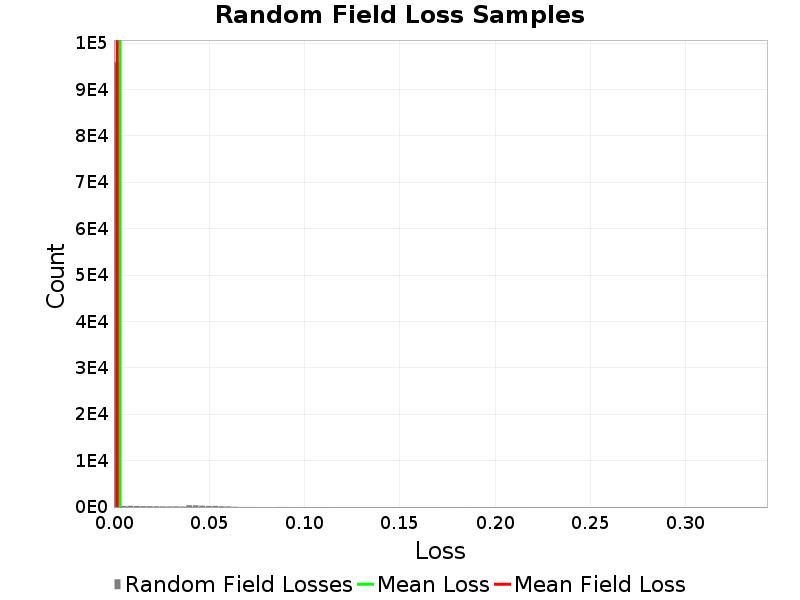 |
|-----|-----|
|  |  |
|  |  |
|  | 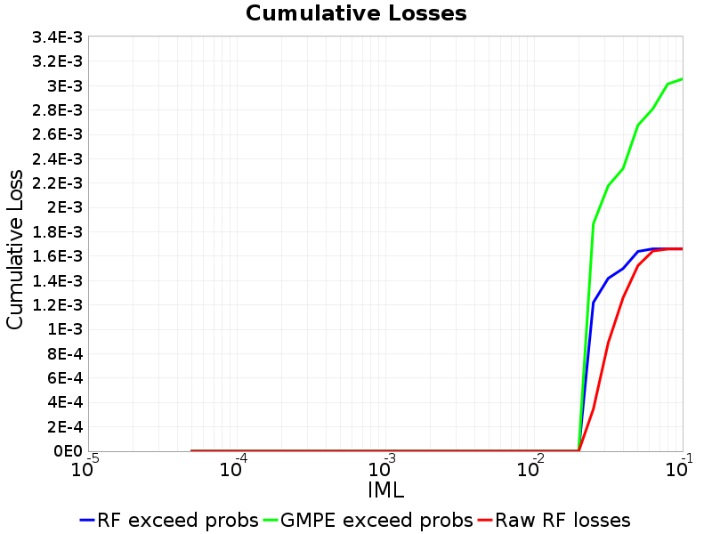 |

### Rupture 215437, Asset3
*[(top)](#table-of-contents)*

Asset parameters:

* value: 8363.0
* J-B distance to rupture: 45.2838460115642
* Vulnerability function: W1-h-RES1-DF
* GMPE ln mean: -1.6329422
* GMPE phi/tau/total std devs: 0.63/t0.36/t0.7256032

**Loss Values**

| Description | Loss Value |
|-----|-----|
| Mean Loss (GMPE) | 147.60178 |
| Mean Loss (100000 random fields) | 212.47745 |
| Mean Loss using rand-field exceed probs | 132.83281 |

|  | 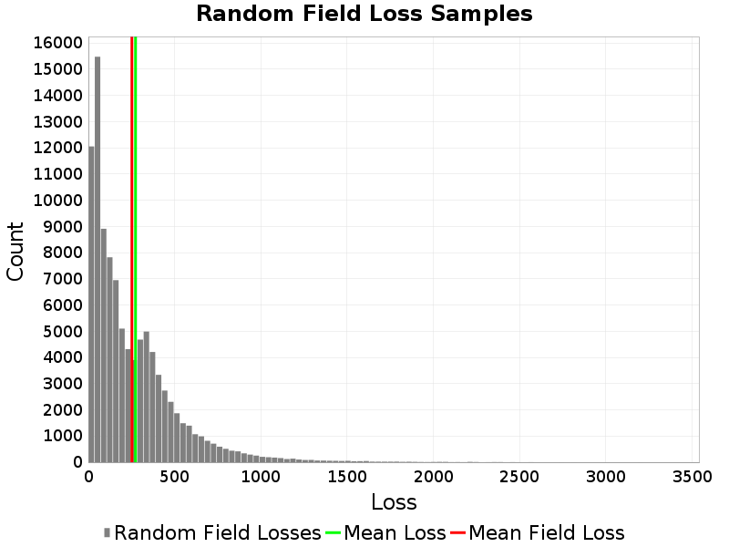 |
|-----|-----|
|  | 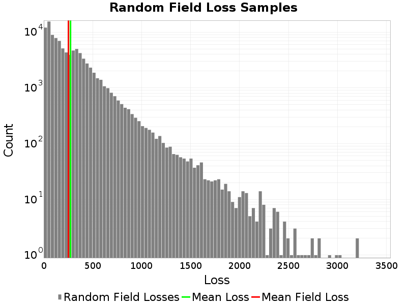 |
|  | 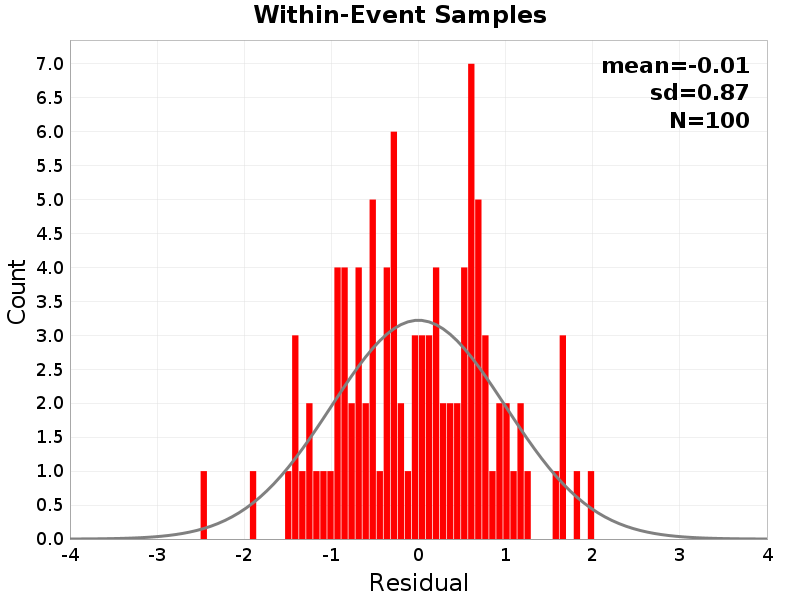 |
|  | 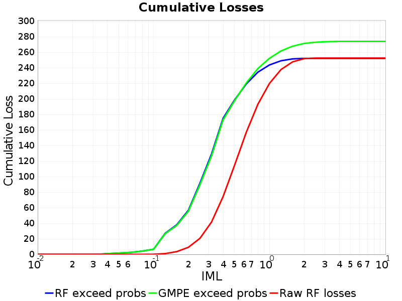 |

### Rupture 215437, Asset4
*[(top)](#table-of-contents)*

Asset parameters:

* value: 26997.0
* J-B distance to rupture: 459.82072382638347
* Vulnerability function: W1-m-RES1-DF
* GMPE ln mean: -3.3911812
* GMPE phi/tau/total std devs: 0.62713397/t0.3572519/t0.721752

**Loss Values**

| Description | Loss Value |
|-----|-----|
| Mean Loss (GMPE) | 15.539383 |
| Mean Loss (100000 random fields) | 15.047129 |
| Mean Loss using rand-field exceed probs | 20.122307 |

|  |  |
|-----|-----|
|  |  |
|  |  |
| 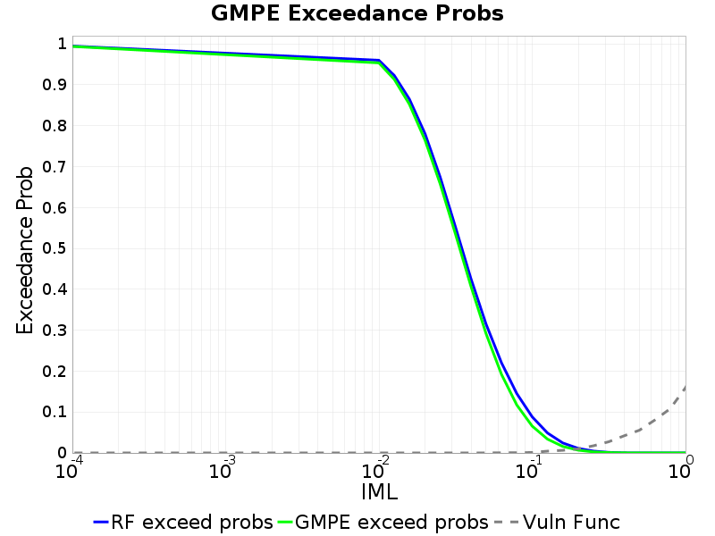 | 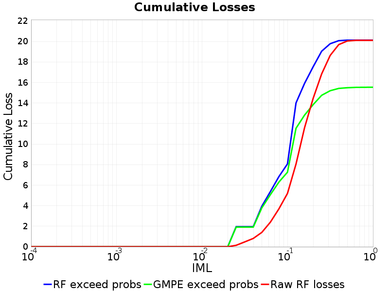 |

## Rupture 187237, M7.2455945
*[(top)](#table-of-contents)*

### Rupture 187237, Asset0
*[(top)](#table-of-contents)*

Asset parameters:

* value: 28152.0
* J-B distance to rupture: 220.42899827010416
* Vulnerability function: W1-h-RES1-DF
* GMPE ln mean: -2.999414
* GMPE phi/tau/total std devs: 0.6257636/t0.35593492/t0.71990955

**Loss Values**

| Description | Loss Value |
|-----|-----|
| Mean Loss (GMPE) | 30.992783 |
| Mean Loss (100000 random fields) | 3.7998724 |
| Mean Loss using rand-field exceed probs | 21.548 |

|  |  |
|-----|-----|
| 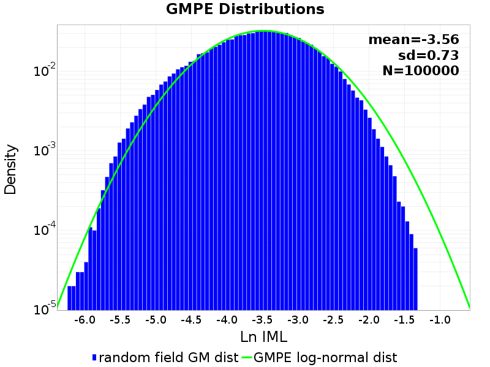 | 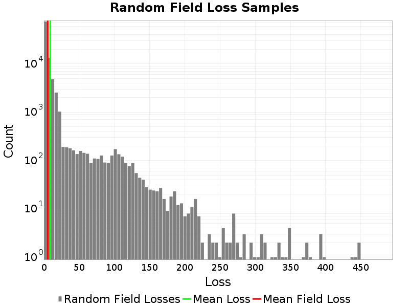 |
|  |  |
| 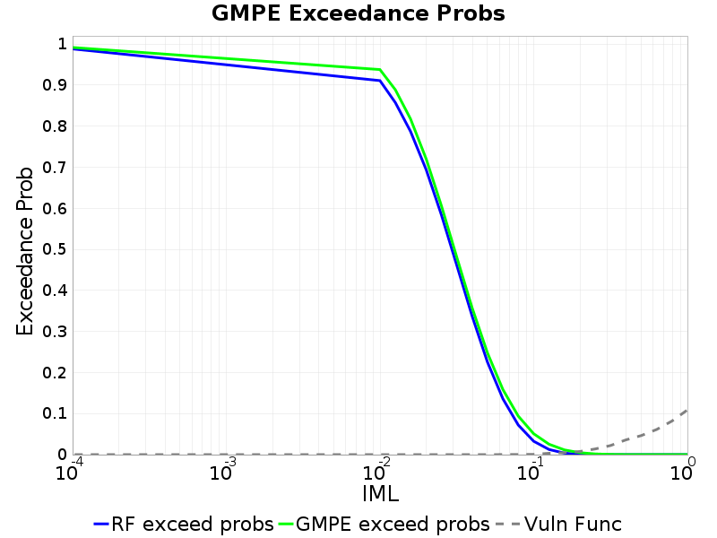 |  |

### Rupture 187237, Asset1
*[(top)](#table-of-contents)*

Asset parameters:

* value: 173.0
* J-B distance to rupture: 459.6791921461773
* Vulnerability function: RM1L-m-RES1-DF
* GMPE ln mean: -4.564933
* GMPE phi/tau/total std devs: 0.63/t0.36/t0.7256032

**Loss Values**

| Description | Loss Value |
|-----|-----|
| Mean Loss (GMPE) | 0.008419954 |
| Mean Loss (100000 random fields) | 0.010000092 |
| Mean Loss using rand-field exceed probs | 0.007501959 |

|  | 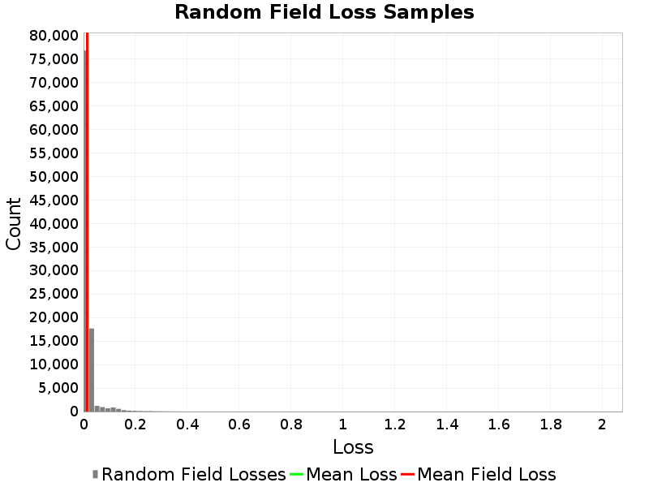 |
|-----|-----|
| 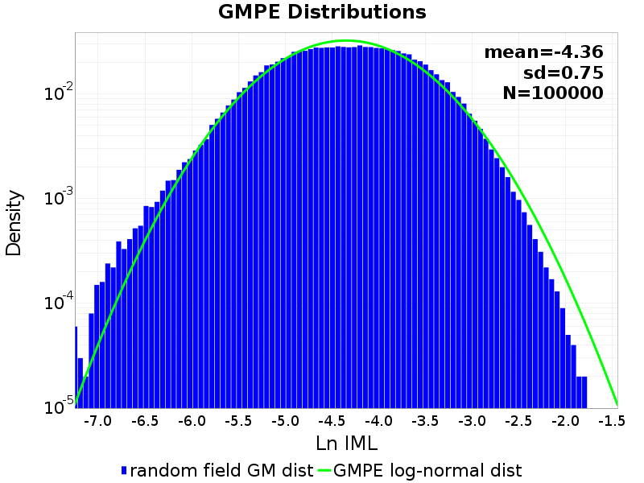 | 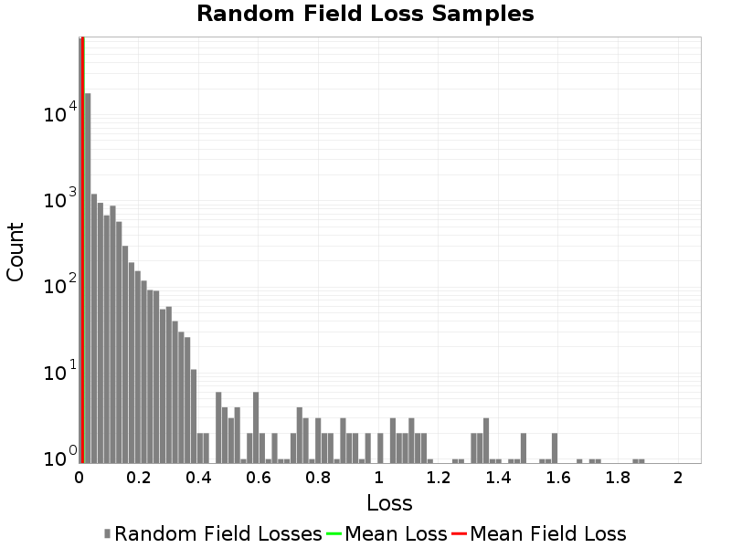 |
|  |  |
|  | 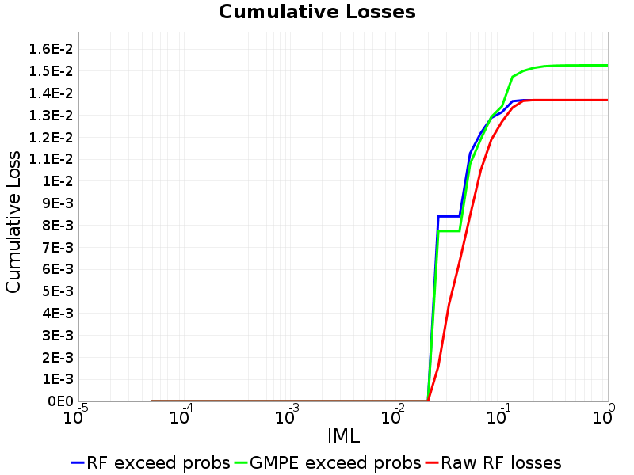 |

### Rupture 187237, Asset2
*[(top)](#table-of-contents)*

Asset parameters:

* value: 127.0
* J-B distance to rupture: 718.6404783019321
* Vulnerability function: RM1L-l-RES1-DF
* GMPE ln mean: -5.2870007
* GMPE phi/tau/total std devs: 0.6299139/t0.35991758/t0.72548753

**Loss Values**

| Description | Loss Value |
|-----|-----|
| Mean Loss (GMPE) | 0.0011448545 |
| Mean Loss (100000 random fields) | 4.9911E-5 |
| Mean Loss using rand-field exceed probs | 3.9510013E-4 |

|  | 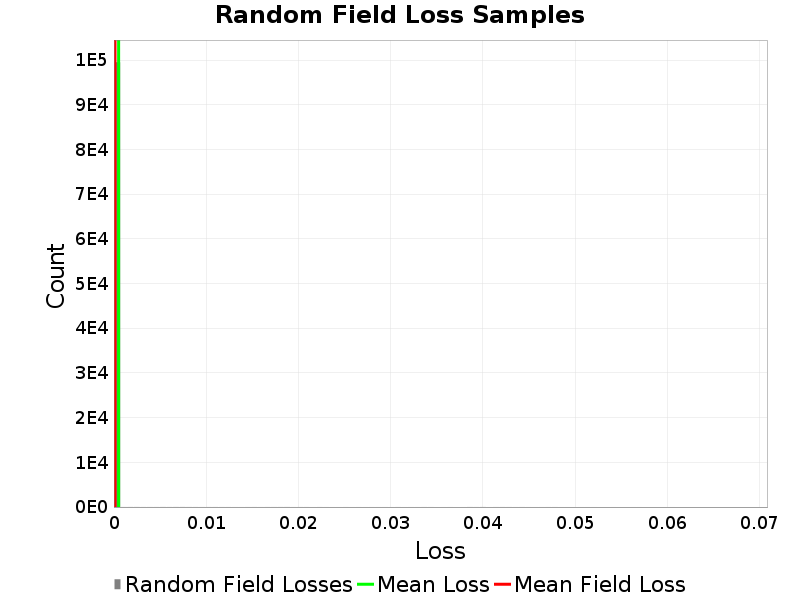 |
|-----|-----|
|  | 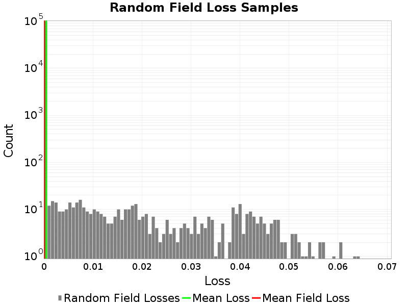 |
|  |  |
|  |  |

### Rupture 187237, Asset3
*[(top)](#table-of-contents)*

Asset parameters:

* value: 8363.0
* J-B distance to rupture: 25.110251940672537
* Vulnerability function: W1-h-RES1-DF
* GMPE ln mean: -1.5886256
* GMPE phi/tau/total std devs: 0.63/t0.36/t0.7256032

**Loss Values**

| Description | Loss Value |
|-----|-----|
| Mean Loss (GMPE) | 158.58223 |
| Mean Loss (100000 random fields) | 291.16467 |
| Mean Loss using rand-field exceed probs | 192.62454 |

|  |  |
|-----|-----|
|  |  |
|  |  |
|  |  |

### Rupture 187237, Asset4
*[(top)](#table-of-contents)*

Asset parameters:

* value: 26997.0
* J-B distance to rupture: 385.1454560877946
* Vulnerability function: W1-m-RES1-DF
* GMPE ln mean: -3.7677114
* GMPE phi/tau/total std devs: 0.62803197/t0.35811388/t0.722959

**Loss Values**

| Description | Loss Value |
|-----|-----|
| Mean Loss (GMPE) | 5.9639564 |
| Mean Loss (100000 random fields) | 5.1951947 |
| Mean Loss using rand-field exceed probs | 6.8714337 |

|  |  |
|-----|-----|
|  |  |
|  | 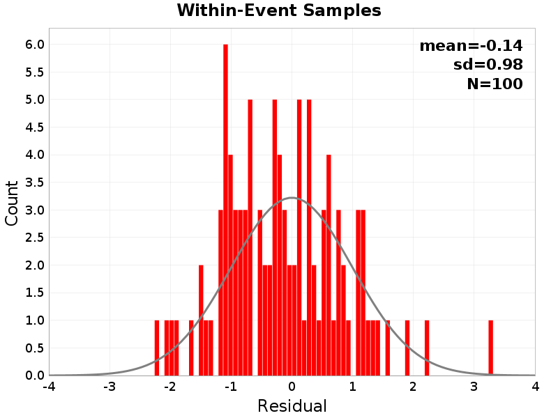 |
| 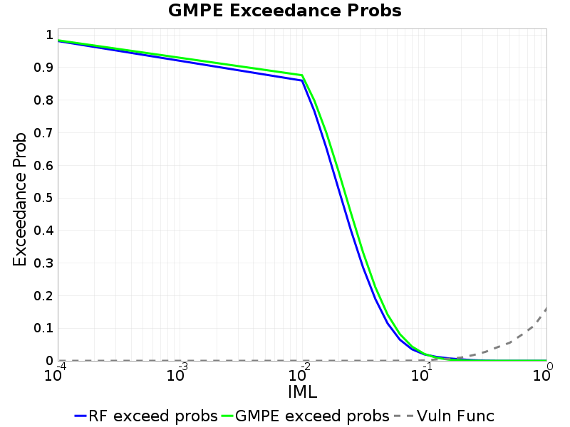 | 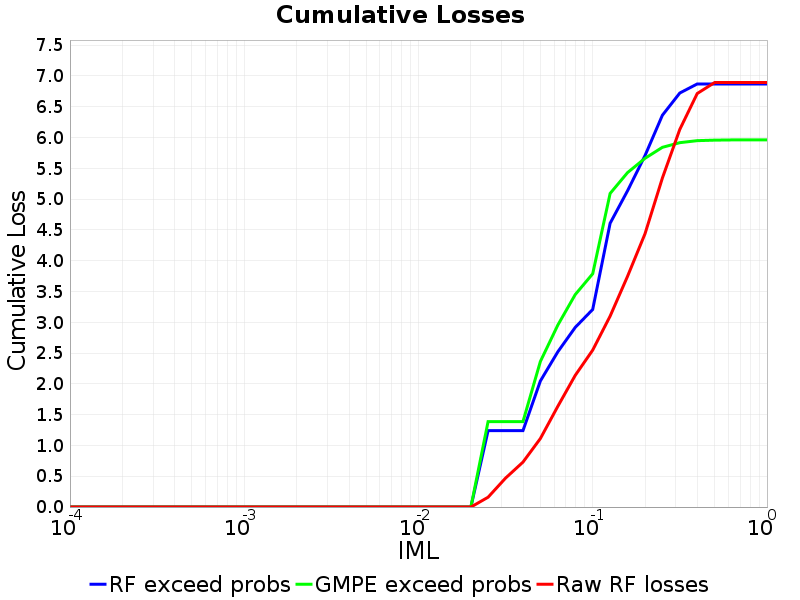 |

## Rupture 103472, M7.0620694
*[(top)](#table-of-contents)*

### Rupture 103472, Asset0
*[(top)](#table-of-contents)*

Asset parameters:

* value: 28152.0
* J-B distance to rupture: 664.6072172908746
* Vulnerability function: W1-h-RES1-DF
* GMPE ln mean: -5.144235
* GMPE phi/tau/total std devs: 0.62950265/t0.3595237/t0.7249351

**Loss Values**

| Description | Loss Value |
|-----|-----|
| Mean Loss (GMPE) | 0.03285042 |
| Mean Loss (100000 random fields) | 0.01351296 |
| Mean Loss using rand-field exceed probs | 0.10213157 |

|  |  |
|-----|-----|
|  | 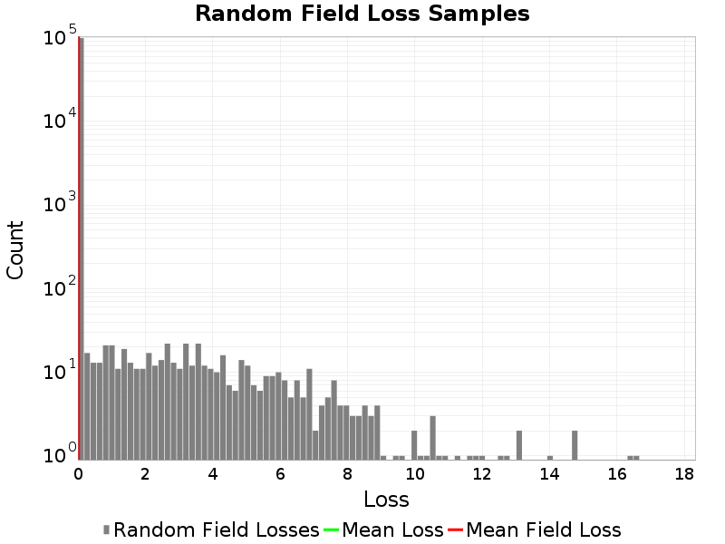 |
|  | 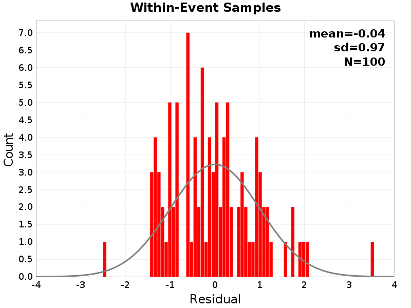 |
|  |  |

### Rupture 103472, Asset1
*[(top)](#table-of-contents)*

Asset parameters:

* value: 173.0
* J-B distance to rupture: 17.032477551146595
* Vulnerability function: RM1L-m-RES1-DF
* GMPE ln mean: -1.4741915
* GMPE phi/tau/total std devs: 0.63/t0.36/t0.7256032

**Loss Values**

| Description | Loss Value |
|-----|-----|
| Mean Loss (GMPE) | 9.502183 |
| Mean Loss (100000 random fields) | 9.3404045 |
| Mean Loss using rand-field exceed probs | 7.9232564 |

|  |  |
|-----|-----|
|  | 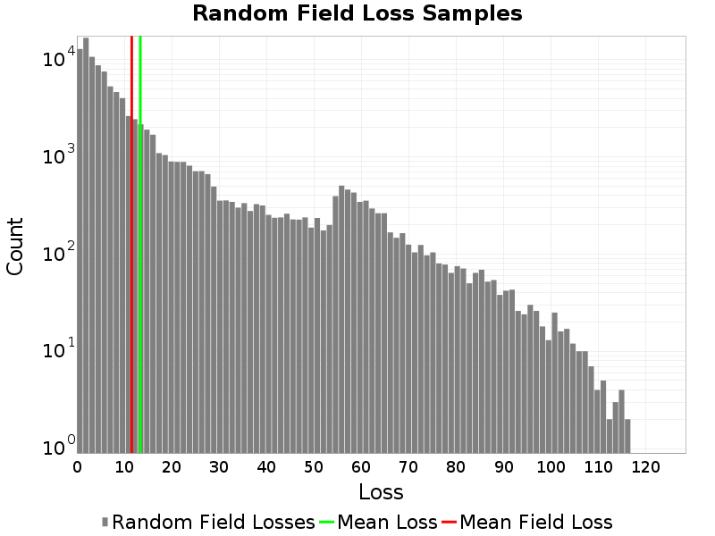 |
|  | 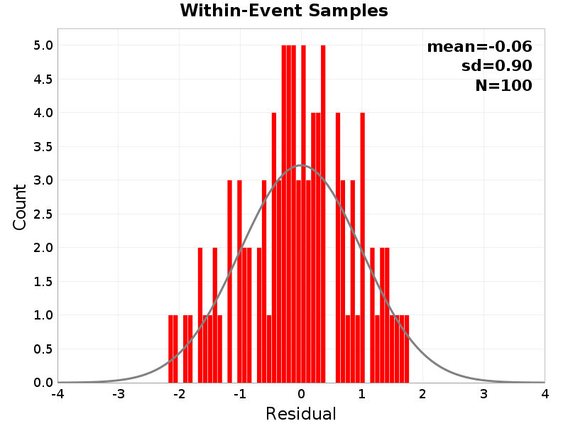 |
| 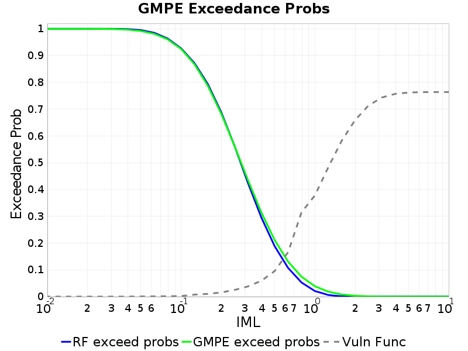 | 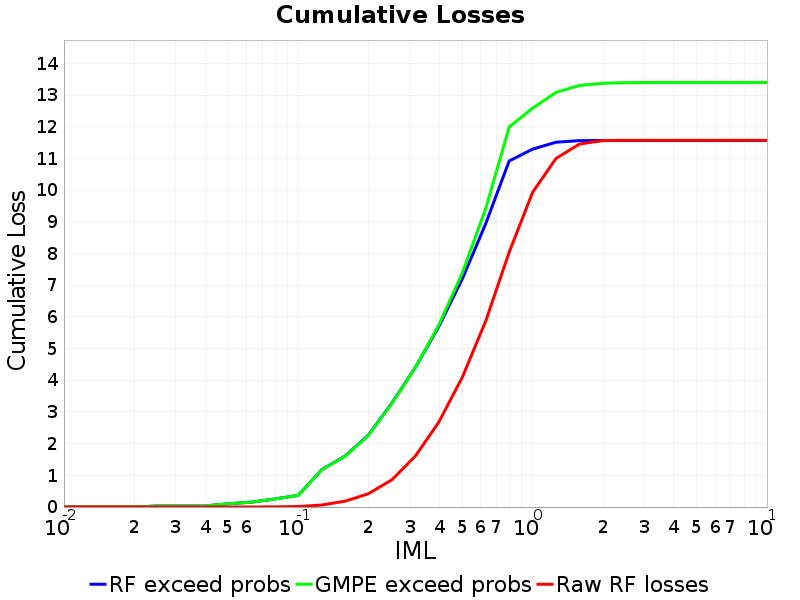 |

### Rupture 103472, Asset2
*[(top)](#table-of-contents)*

Asset parameters:

* value: 127.0
* J-B distance to rupture: 289.6538168599644
* Vulnerability function: RM1L-l-RES1-DF
* GMPE ln mean: -3.906305
* GMPE phi/tau/total std devs: 0.6296586/t0.3596731/t0.7251446

**Loss Values**

| Description | Loss Value |
|-----|-----|
| Mean Loss (GMPE) | 0.0689893 |
| Mean Loss (100000 random fields) | 0.019786982 |
| Mean Loss using rand-field exceed probs | 0.04746604 |

|  | 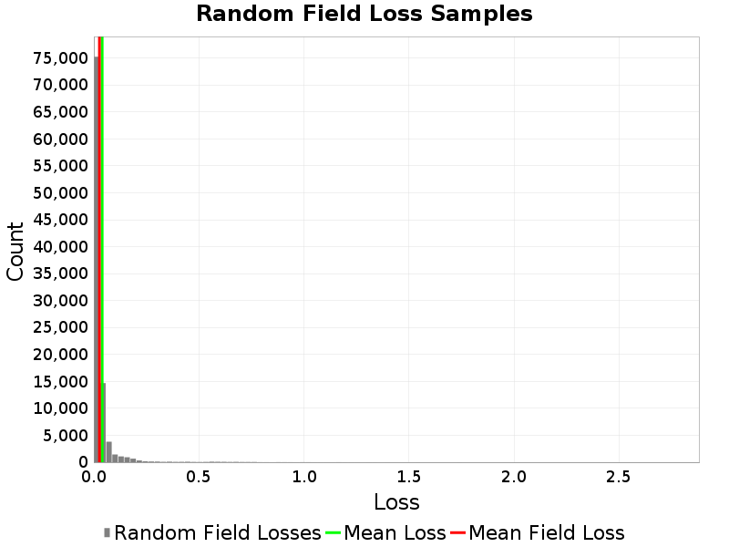 |
|-----|-----|
|  |  |
|  |  |
|  |  |

### Rupture 103472, Asset3
*[(top)](#table-of-contents)*

Asset parameters:

* value: 8363.0
* J-B distance to rupture: 420.35845775898594
* Vulnerability function: W1-h-RES1-DF
* GMPE ln mean: -4.7106028
* GMPE phi/tau/total std devs: 0.63/t0.36/t0.7256032

**Loss Values**

| Description | Loss Value |
|-----|-----|
| Mean Loss (GMPE) | 0.054904424 |
| Mean Loss (100000 random fields) | 0.24211721 |
| Mean Loss using rand-field exceed probs | 0.06517174 |

|  |  |
|-----|-----|
|  | 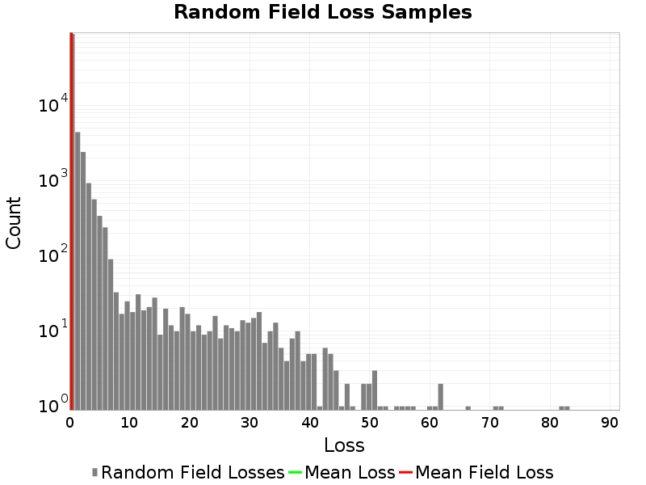 |
|  |  |
|  |  |

### Rupture 103472, Asset4
*[(top)](#table-of-contents)*

Asset parameters:

* value: 26997.0
* J-B distance to rupture: 9.884195532220756
* Vulnerability function: W1-m-RES1-DF
* GMPE ln mean: -0.73613816
* GMPE phi/tau/total std devs: 0.5905011/t0.32128924/t0.6722487

**Loss Values**

| Description | Loss Value |
|-----|-----|
| Mean Loss (GMPE) | 2354.3843 |
| Mean Loss (100000 random fields) | 1830.1992 |
| Mean Loss using rand-field exceed probs | 2183.2104 |

| 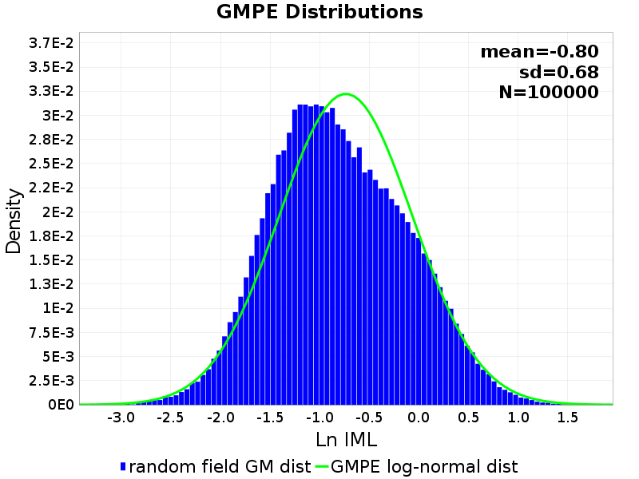 |  |
|-----|-----|
| 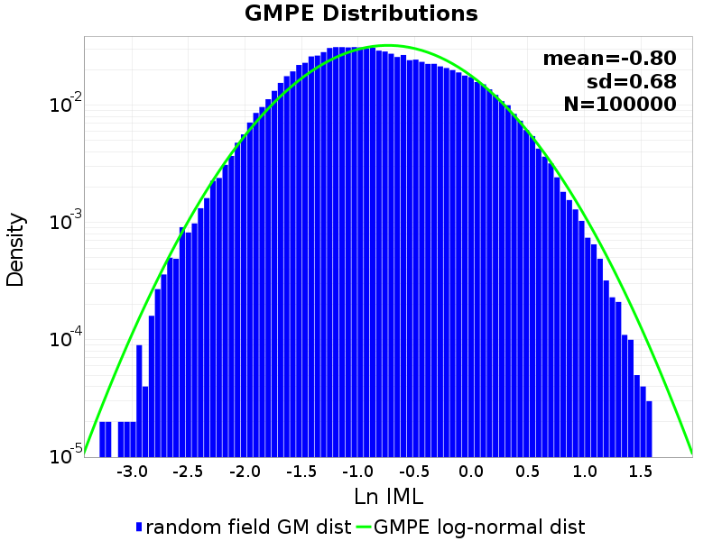 | 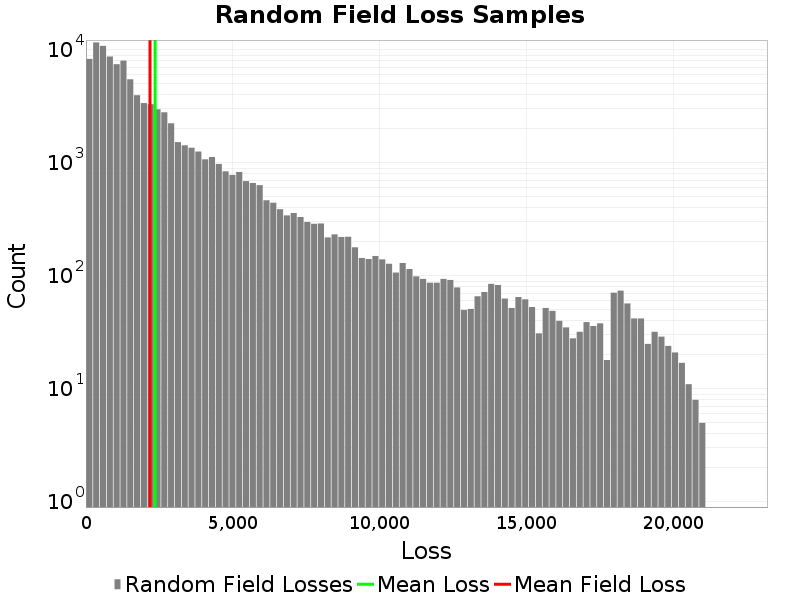 |
|  |  |
| 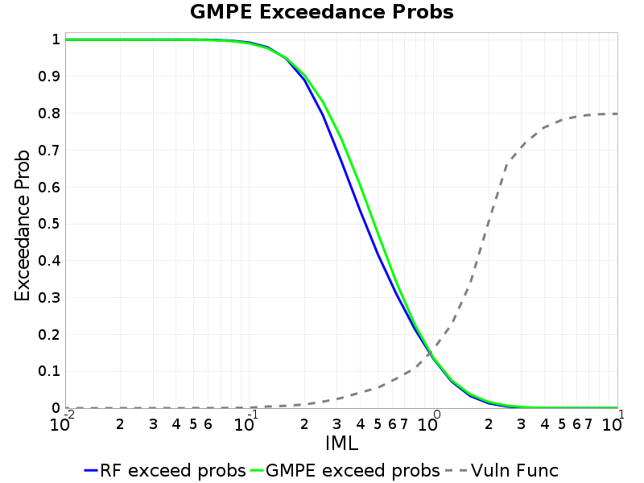 |  |

## Rupture 169293, M7.9014773
*[(top)](#table-of-contents)*

### Rupture 169293, Asset0
*[(top)](#table-of-contents)*

Asset parameters:

* value: 28152.0
* J-B distance to rupture: 648.2448111411015
* Vulnerability function: W1-h-RES1-DF
* GMPE ln mean: -3.7983234
* GMPE phi/tau/total std devs: 0.6280912/t0.35817072/t0.7230386

**Loss Values**

| Description | Loss Value |
|-----|-----|
| Mean Loss (GMPE) | 3.651236 |
| Mean Loss (100000 random fields) | 0.35007012 |
| Mean Loss using rand-field exceed probs | 2.7883196 |

|  |  |
|-----|-----|
|  |  |
|  |  |
|  |  |

### Rupture 169293, Asset1
*[(top)](#table-of-contents)*

Asset parameters:

* value: 173.0
* J-B distance to rupture: 14.01186694590594
* Vulnerability function: RM1L-m-RES1-DF
* GMPE ln mean: -0.91670054
* GMPE phi/tau/total std devs: 0.63/t0.36/t0.7256032

**Loss Values**

| Description | Loss Value |
|-----|-----|
| Mean Loss (GMPE) | 23.49864 |
| Mean Loss (100000 random fields) | 25.708382 |
| Mean Loss using rand-field exceed probs | 23.035704 |

|  | 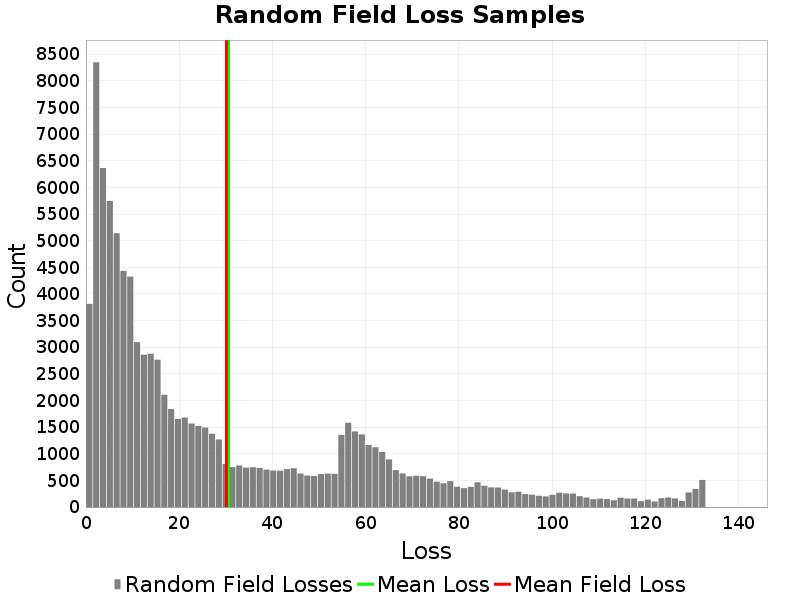 |
|-----|-----|
|  |  |
|  |  |
| 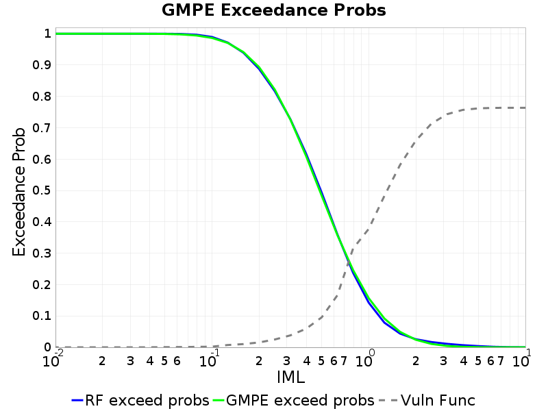 | 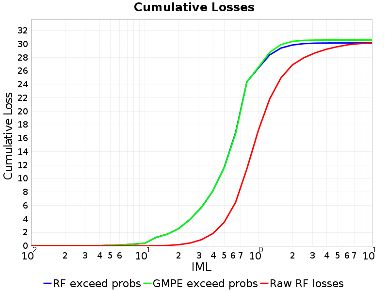 |

### Rupture 169293, Asset2
*[(top)](#table-of-contents)*

Asset parameters:

* value: 127.0
* J-B distance to rupture: 159.32030510236777
* Vulnerability function: RM1L-l-RES1-DF
* GMPE ln mean: -2.1954937
* GMPE phi/tau/total std devs: 0.62814665/t0.35822392/t0.7231131

**Loss Values**

| Description | Loss Value |
|-----|-----|
| Mean Loss (GMPE) | 3.4716687 |
| Mean Loss (100000 random fields) | 1.573672 |
| Mean Loss using rand-field exceed probs | 3.153947 |

|  |  |
|-----|-----|
|  |  |
|  |  |
|  |  |

### Rupture 169293, Asset3
*[(top)](#table-of-contents)*

Asset parameters:

* value: 8363.0
* J-B distance to rupture: 401.91212262700554
* Vulnerability function: W1-h-RES1-DF
* GMPE ln mean: -3.451953
* GMPE phi/tau/total std devs: 0.63/t0.36/t0.7256032

**Loss Values**

| Description | Loss Value |
|-----|-----|
| Mean Loss (GMPE) | 2.9306302 |
| Mean Loss (100000 random fields) | 8.811842 |
| Mean Loss using rand-field exceed probs | 3.4011173 |

|  | 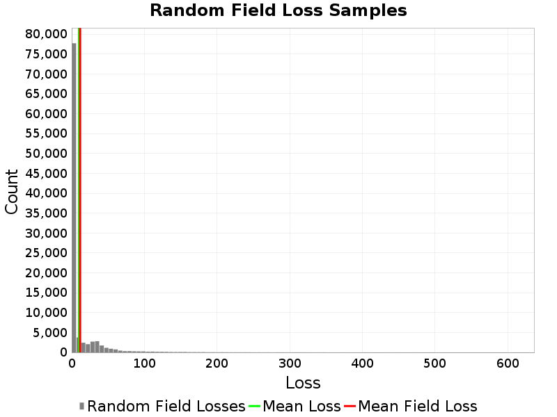 |
|-----|-----|
|  |  |
|  | 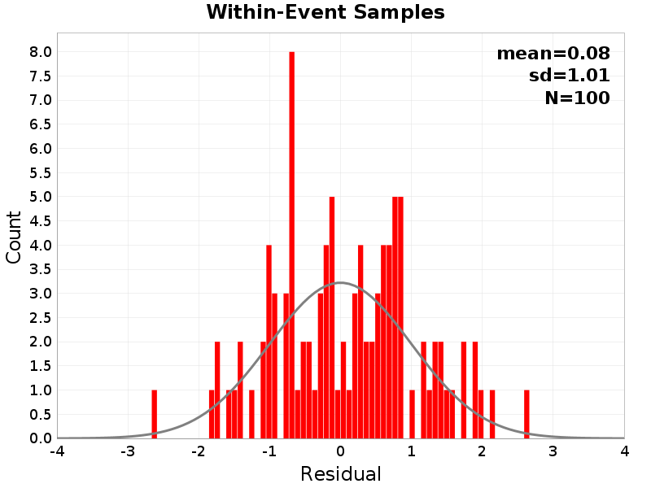 |
| 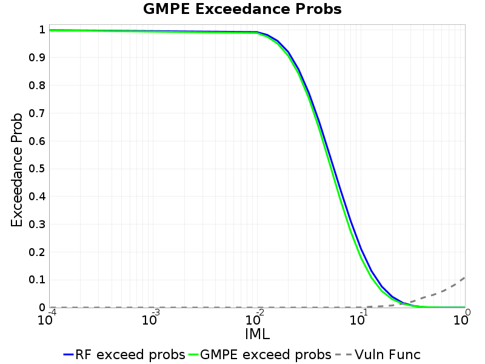 | 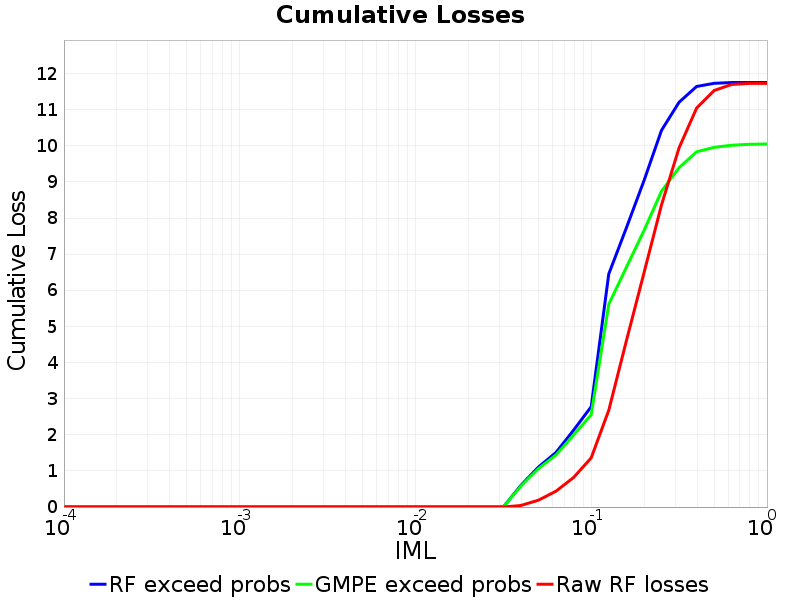 |

### Rupture 169293, Asset4
*[(top)](#table-of-contents)*

Asset parameters:

* value: 26997.0
* J-B distance to rupture: 19.491645292353013
* Vulnerability function: W1-m-RES1-DF
* GMPE ln mean: -0.69447255
* GMPE phi/tau/total std devs: 0.58889043/t0.31966794/t0.6700594

**Loss Values**

| Description | Loss Value |
|-----|-----|
| Mean Loss (GMPE) | 2497.9104 |
| Mean Loss (100000 random fields) | 2086.1199 |
| Mean Loss using rand-field exceed probs | 2485.0344 |

|  |  |
|-----|-----|
| 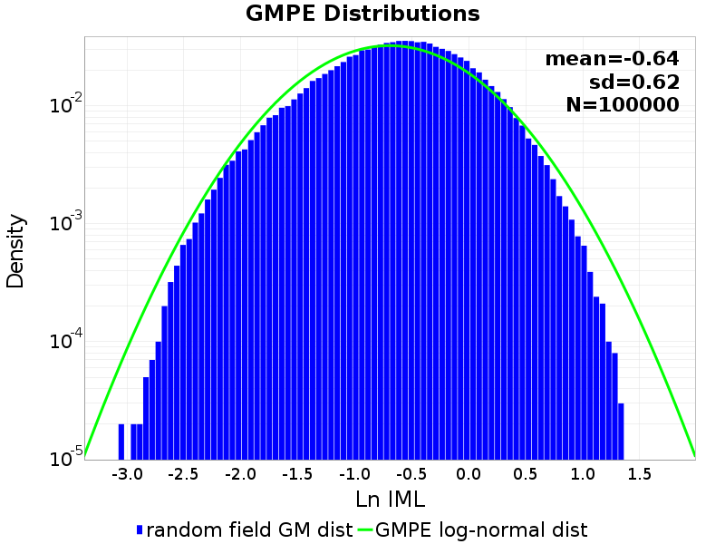 | 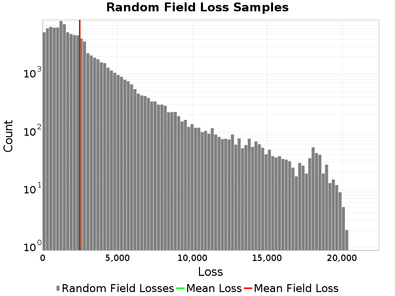 |
|  |  |
|  | 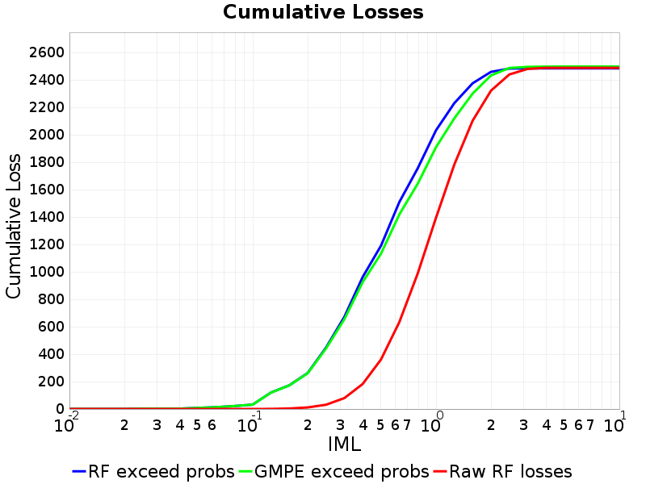 |

## Rupture 208188, M8.023331
*[(top)](#table-of-contents)*

### Rupture 208188, Asset0
*[(top)](#table-of-contents)*

Asset parameters:

* value: 28152.0
* J-B distance to rupture: 588.4067333863293
* Vulnerability function: W1-h-RES1-DF
* GMPE ln mean: -3.4215524
* GMPE phi/tau/total std devs: 0.62721956/t0.35733408/t0.721867

**Loss Values**

| Description | Loss Value |
|-----|-----|
| Mean Loss (GMPE) | 10.519352 |
| Mean Loss (100000 random fields) | 1.0666792 |
| Mean Loss using rand-field exceed probs | 7.2884626 |

|  |  |
|-----|-----|
|  | 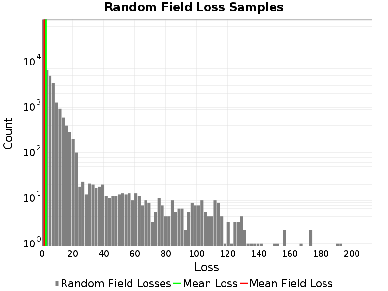 |
|  |  |
|  | 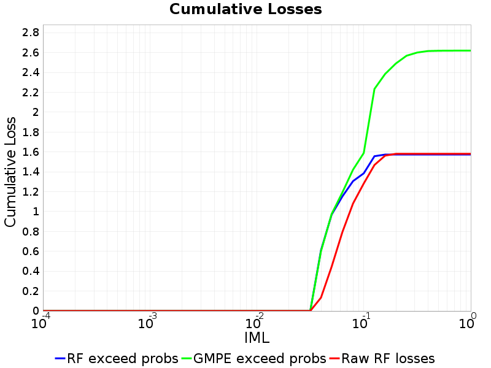 |

### Rupture 208188, Asset1
*[(top)](#table-of-contents)*

Asset parameters:

* value: 173.0
* J-B distance to rupture: 18.002001580033287
* Vulnerability function: RM1L-m-RES1-DF
* GMPE ln mean: -0.96818763
* GMPE phi/tau/total std devs: 0.63/t0.36/t0.7256032

**Loss Values**

| Description | Loss Value |
|-----|-----|
| Mean Loss (GMPE) | 21.78749 |
| Mean Loss (100000 random fields) | 25.379559 |
| Mean Loss using rand-field exceed probs | 22.724823 |

|  | 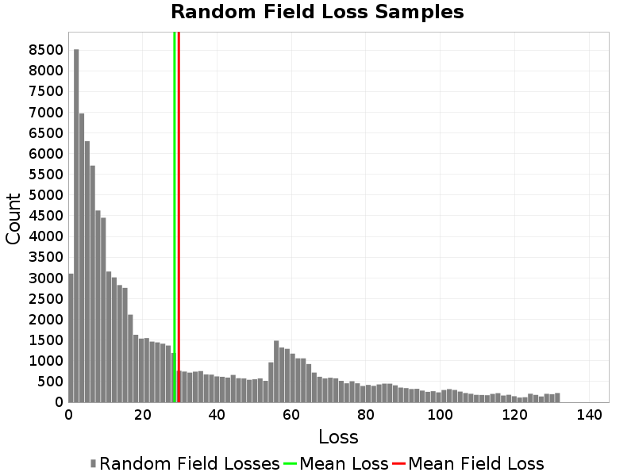 |
|-----|-----|
|  |  |
|  |  |
|  |  |

### Rupture 208188, Asset2
*[(top)](#table-of-contents)*

Asset parameters:

* value: 127.0
* J-B distance to rupture: 159.32030510236777
* Vulnerability function: RM1L-l-RES1-DF
* GMPE ln mean: -2.0559607
* GMPE phi/tau/total std devs: 0.6278766/t0.35796475/t0.7227501

**Loss Values**

| Description | Loss Value |
|-----|-----|
| Mean Loss (GMPE) | 4.6088448 |
| Mean Loss (100000 random fields) | 2.0189385 |
| Mean Loss using rand-field exceed probs | 4.122661 |

|  | 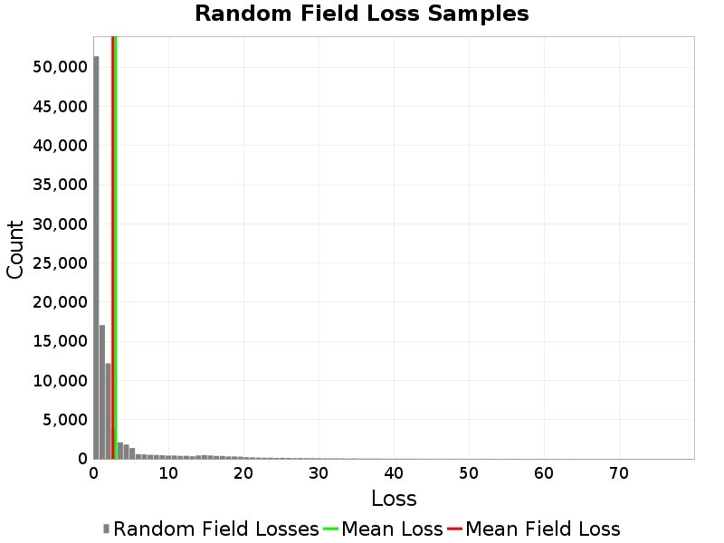 |
|-----|-----|
|  |  |
|  |  |
|  | 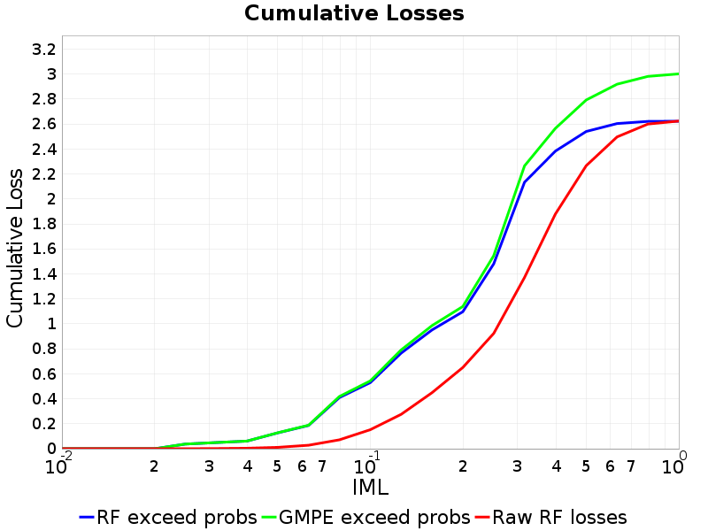 |

### Rupture 208188, Asset3
*[(top)](#table-of-contents)*

Asset parameters:

* value: 8363.0
* J-B distance to rupture: 339.4894788682204
* Vulnerability function: W1-h-RES1-DF
* GMPE ln mean: -3.0511427
* GMPE phi/tau/total std devs: 0.63/t0.36/t0.7256032

**Loss Values**

| Description | Loss Value |
|-----|-----|
| Mean Loss (GMPE) | 8.29045 |
| Mean Loss (100000 random fields) | 16.8998 |
| Mean Loss using rand-field exceed probs | 6.7079396 |

|  | 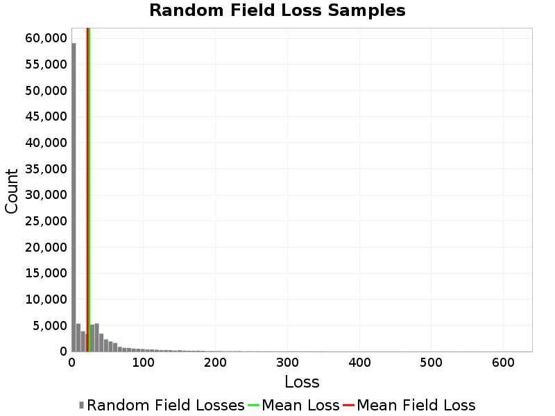 |
|-----|-----|
|  |  |
|  |  |
| 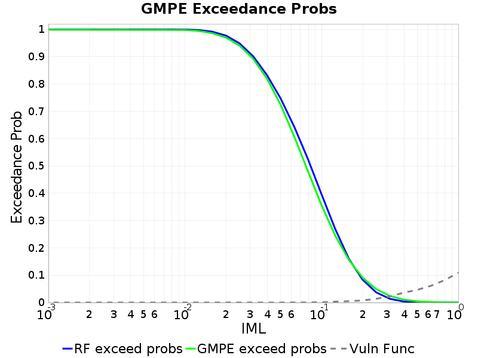 | 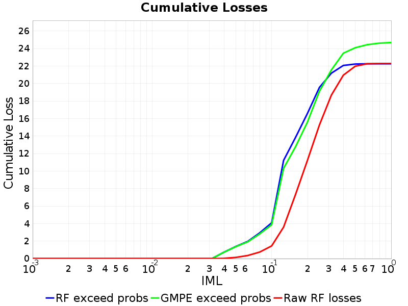 |

### Rupture 208188, Asset4
*[(top)](#table-of-contents)*

Asset parameters:

* value: 26997.0
* J-B distance to rupture: 44.011872161271796
* Vulnerability function: W1-m-RES1-DF
* GMPE ln mean: -1.0012978
* GMPE phi/tau/total std devs: 0.59943056/t0.33021143/t0.6843658

**Loss Values**

| Description | Loss Value |
|-----|-----|
| Mean Loss (GMPE) | 1600.1274 |
| Mean Loss (100000 random fields) | 1356.0746 |
| Mean Loss using rand-field exceed probs | 1620.0619 |

|  |  |
|-----|-----|
|  |  |
|  |  |
| 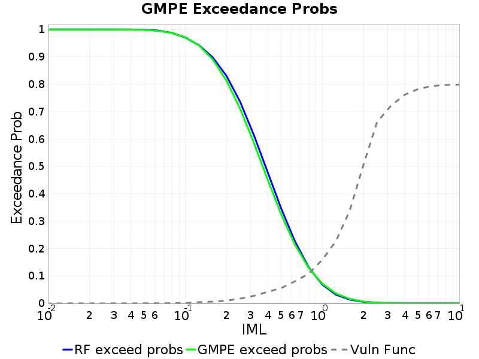 | 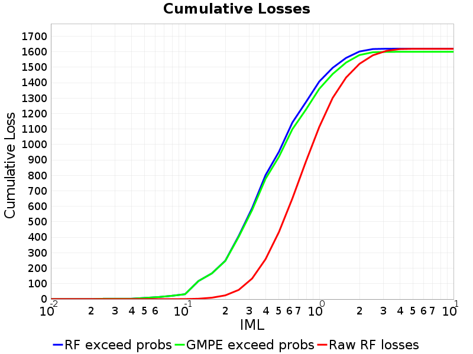 |

## Rupture 68673, M8.155491
*[(top)](#table-of-contents)*

### Rupture 68673, Asset0
*[(top)](#table-of-contents)*

Asset parameters:

* value: 28152.0
* J-B distance to rupture: 104.41240790207684
* Vulnerability function: W1-h-RES1-DF
* GMPE ln mean: -1.3695776
* GMPE phi/tau/total std devs: 0.60867107/t0.33933282/t0.69686955

**Loss Values**

| Description | Loss Value |
|-----|-----|
| Mean Loss (GMPE) | 722.1929 |
| Mean Loss (100000 random fields) | 282.86264 |
| Mean Loss using rand-field exceed probs | 696.09863 |

|  |  |
|-----|-----|
|  | 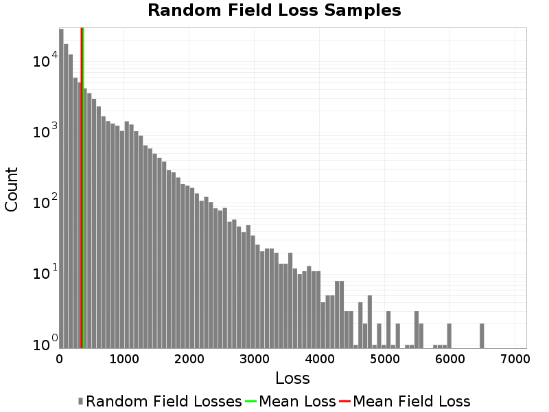 |
|  |  |
|  |  |

### Rupture 68673, Asset1
*[(top)](#table-of-contents)*

Asset parameters:

* value: 173.0
* J-B distance to rupture: 91.13746388295239
* Vulnerability function: RM1L-m-RES1-DF
* GMPE ln mean: -1.7231846
* GMPE phi/tau/total std devs: 0.63/t0.36/t0.7256032

**Loss Values**

| Description | Loss Value |
|-----|-----|
| Mean Loss (GMPE) | 6.0174565 |
| Mean Loss (100000 random fields) | 5.776178 |
| Mean Loss using rand-field exceed probs | 4.836875 |

|  |  |
|-----|-----|
|  |  |
|  |  |
|  |  |

### Rupture 68673, Asset2
*[(top)](#table-of-contents)*

Asset parameters:

* value: 127.0
* J-B distance to rupture: 387.0487389473328
* Vulnerability function: RM1L-l-RES1-DF
* GMPE ln mean: -2.8315165
* GMPE phi/tau/total std devs: 0.62900805/t0.35904983/t0.7242706

**Loss Values**

| Description | Loss Value |
|-----|-----|
| Mean Loss (GMPE) | 0.8642674 |
| Mean Loss (100000 random fields) | 0.5671309 |
| Mean Loss using rand-field exceed probs | 1.2344216 |

|  | 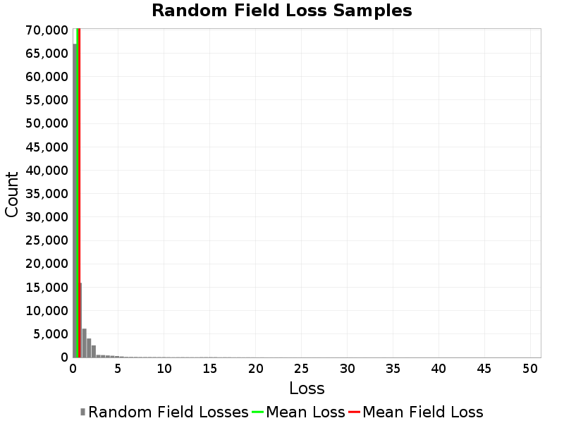 |
|-----|-----|
|  |  |
|  | 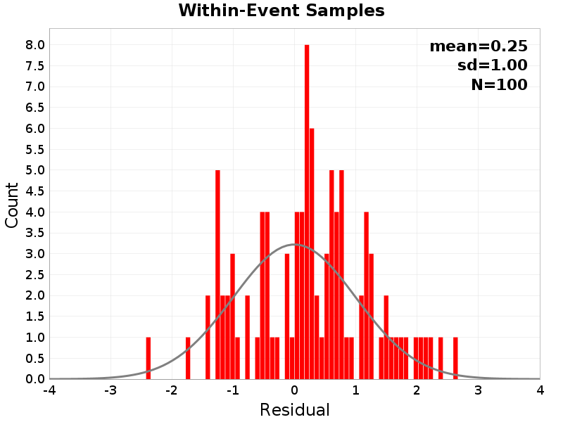 |
|  | 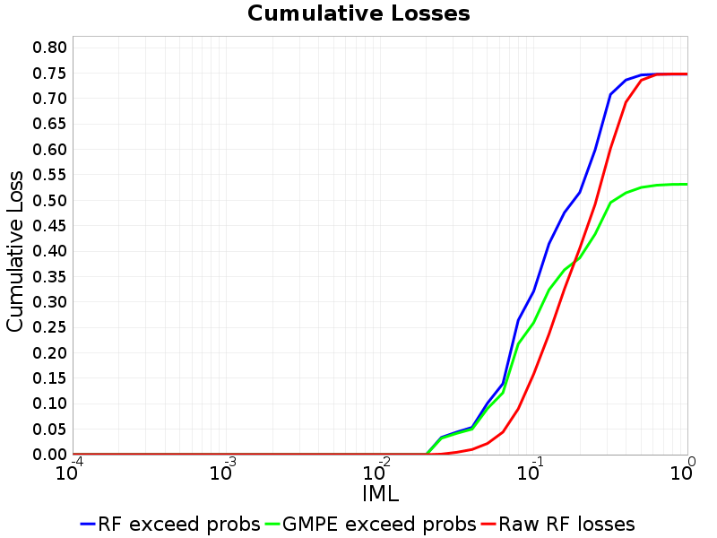 |

### Rupture 68673, Asset3
*[(top)](#table-of-contents)*

Asset parameters:

* value: 8363.0
* J-B distance to rupture: 67.7434958702235
* Vulnerability function: W1-h-RES1-DF
* GMPE ln mean: -1.5454055
* GMPE phi/tau/total std devs: 0.63/t0.36/t0.7256032

**Loss Values**

| Description | Loss Value |
|-----|-----|
| Mean Loss (GMPE) | 169.93304 |
| Mean Loss (100000 random fields) | 278.15805 |
| Mean Loss using rand-field exceed probs | 181.18063 |

|  | 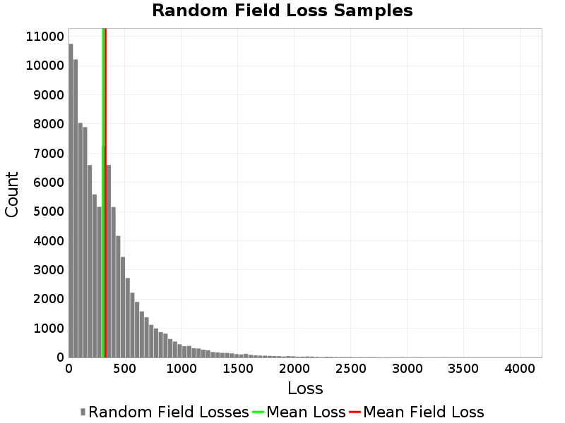 |
|-----|-----|
|  |  |
|  |  |
|  | 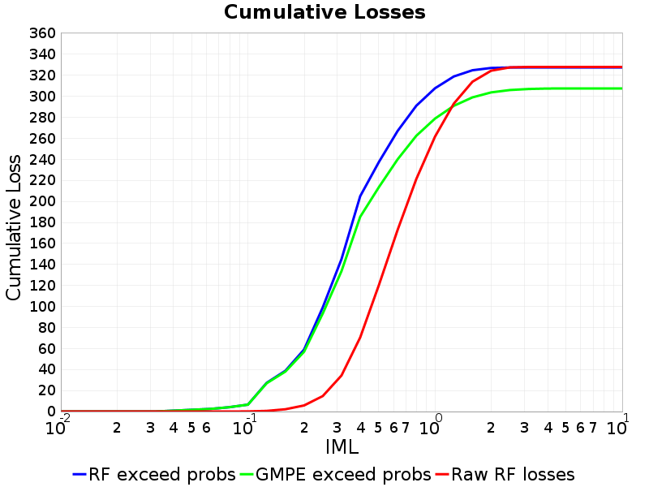 |

### Rupture 68673, Asset4
*[(top)](#table-of-contents)*

Asset parameters:

* value: 26997.0
* J-B distance to rupture: 23.249264023399178
* Vulnerability function: W1-m-RES1-DF
* GMPE ln mean: -0.63563156
* GMPE phi/tau/total std devs: 0.58651066/t0.31726542/t0.66682243

**Loss Values**

| Description | Loss Value |
|-----|-----|
| Mean Loss (GMPE) | 2713.6802 |
| Mean Loss (100000 random fields) | 2311.6165 |
| Mean Loss using rand-field exceed probs | 2740.463 |

| 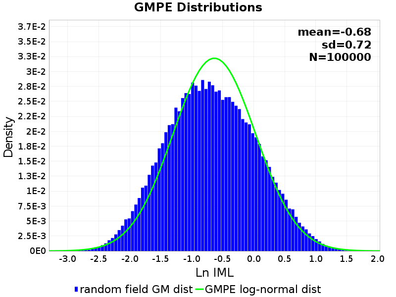 | 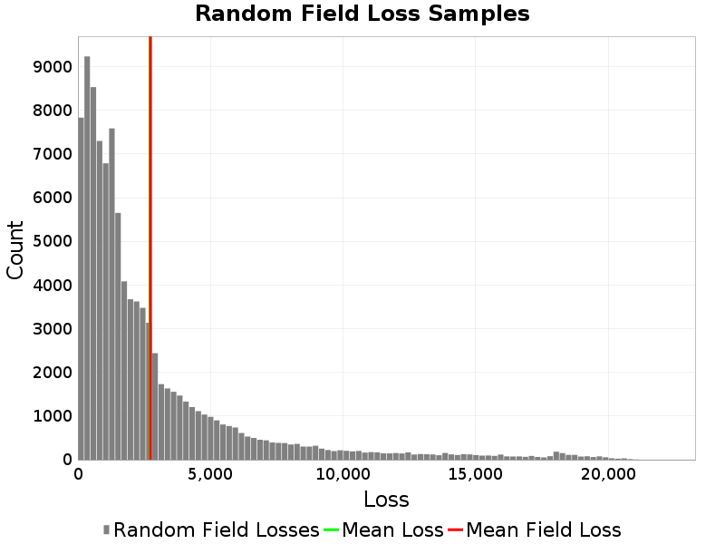 |
|-----|-----|
|  | 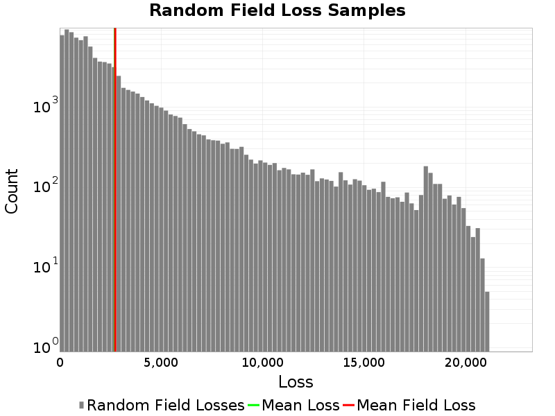 |
|  |  |
|  | 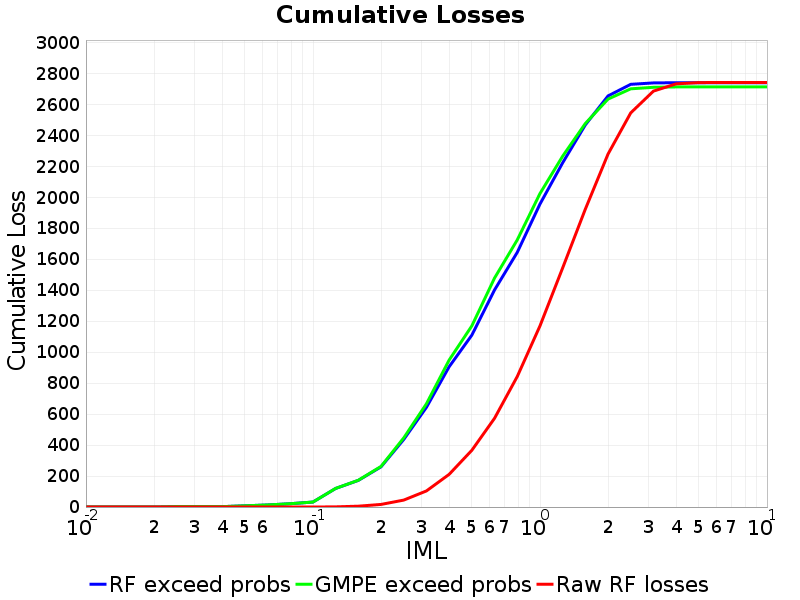 |

## Rupture 42699, M7.9970284
*[(top)](#table-of-contents)*

### Rupture 42699, Asset0
*[(top)](#table-of-contents)*

Asset parameters:

* value: 28152.0
* J-B distance to rupture: 498.8670034348614
* Vulnerability function: W1-h-RES1-DF
* GMPE ln mean: -3.1552143
* GMPE phi/tau/total std devs: 0.62637323/t0.356521/t0.72072923

**Loss Values**

| Description | Loss Value |
|-----|-----|
| Mean Loss (GMPE) | 21.071074 |
| Mean Loss (100000 random fields) | 3.4930158 |
| Mean Loss using rand-field exceed probs | 20.575985 |

|  |  |
|-----|-----|
|  | 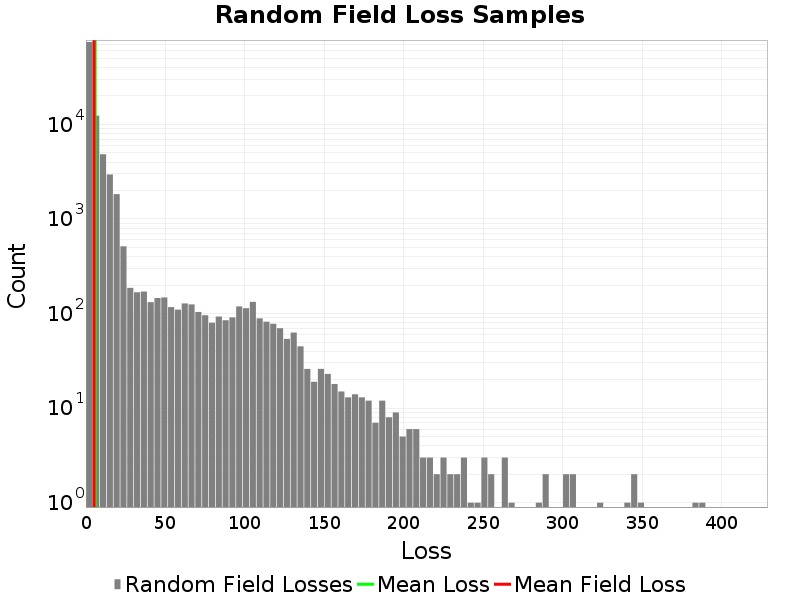 |
|  |  |
|  | 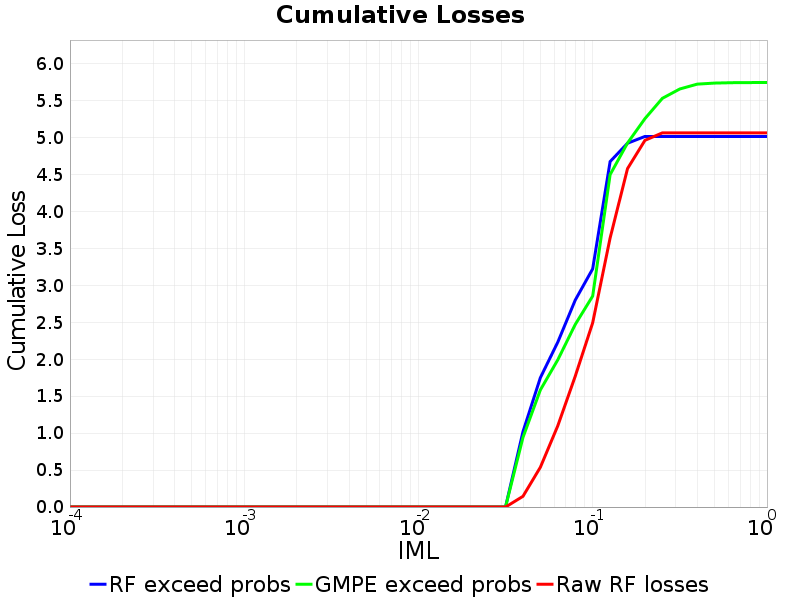 |

### Rupture 42699, Asset1
*[(top)](#table-of-contents)*

Asset parameters:

* value: 173.0
* J-B distance to rupture: 18.002001580033287
* Vulnerability function: RM1L-m-RES1-DF
* GMPE ln mean: -0.97218823
* GMPE phi/tau/total std devs: 0.63/t0.36/t0.7256032

**Loss Values**

| Description | Loss Value |
|-----|-----|
| Mean Loss (GMPE) | 21.658276 |
| Mean Loss (100000 random fields) | 23.632566 |
| Mean Loss using rand-field exceed probs | 21.094027 |

|  |  |
|-----|-----|
|  | 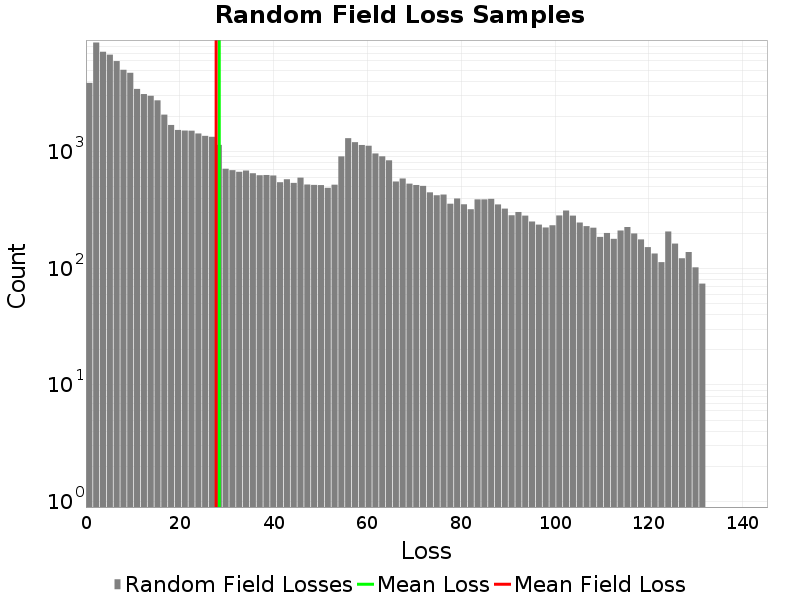 |
|  | 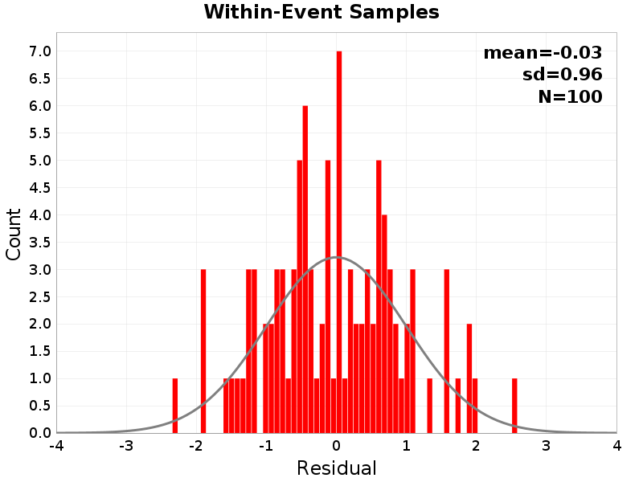 |
|  | 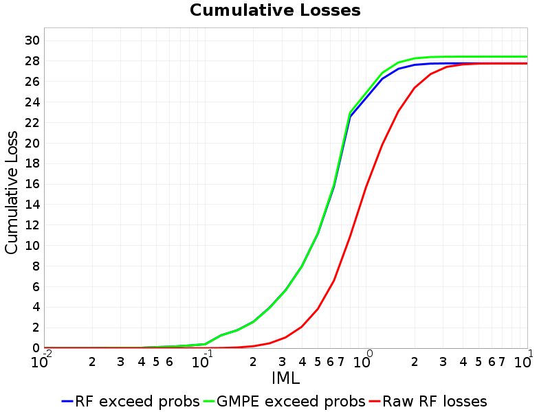 |

### Rupture 42699, Asset2
*[(top)](#table-of-contents)*

Asset parameters:

* value: 127.0
* J-B distance to rupture: 159.32030510236777
* Vulnerability function: RM1L-l-RES1-DF
* GMPE ln mean: -2.0754066
* GMPE phi/tau/total std devs: 0.6279164/t0.35800296/t0.72280365

**Loss Values**

| Description | Loss Value |
|-----|-----|
| Mean Loss (GMPE) | 4.433204 |
| Mean Loss (100000 random fields) | 1.9385916 |
| Mean Loss using rand-field exceed probs | 4.0111947 |

|  |  |
|-----|-----|
| 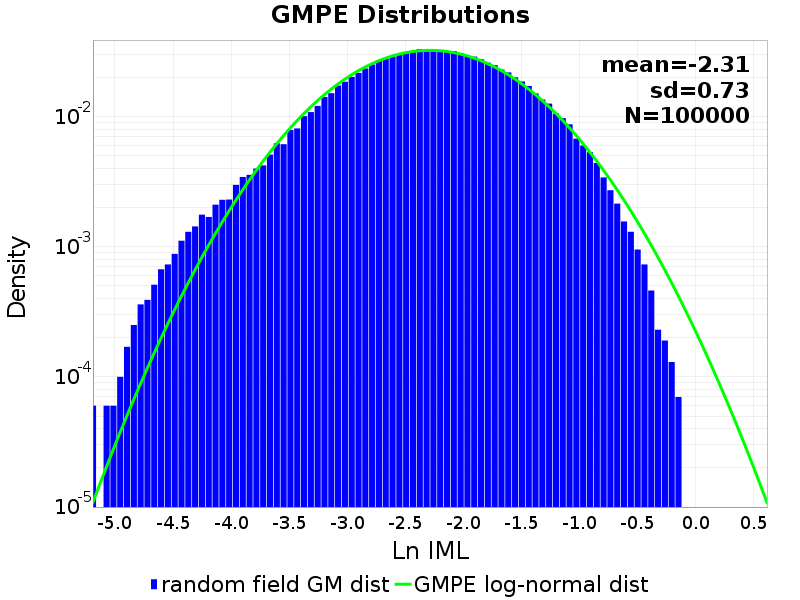 |  |
|  | 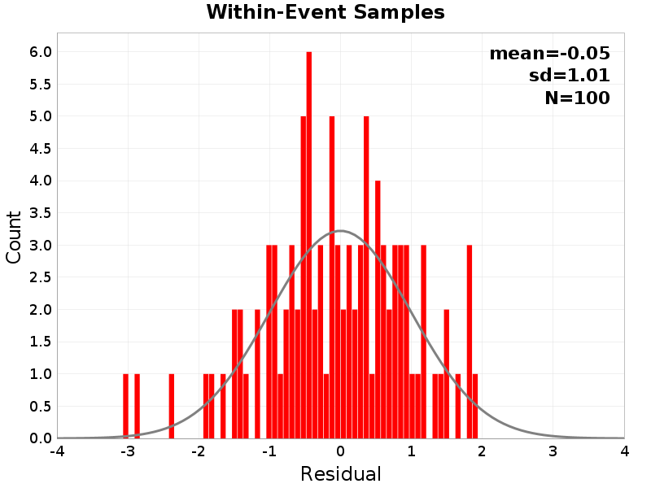 |
|  | 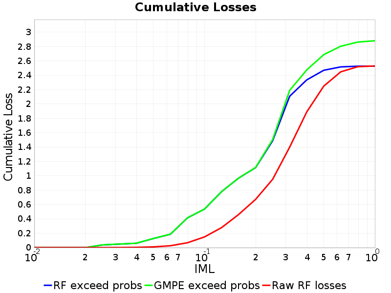 |

### Rupture 42699, Asset3
*[(top)](#table-of-contents)*

Asset parameters:

* value: 8363.0
* J-B distance to rupture: 253.60115106692265
* Vulnerability function: W1-h-RES1-DF
* GMPE ln mean: -2.7313051
* GMPE phi/tau/total std devs: 0.63/t0.36/t0.7256032

**Loss Values**

| Description | Loss Value |
|-----|-----|
| Mean Loss (GMPE) | 17.680477 |
| Mean Loss (100000 random fields) | 43.96194 |
| Mean Loss using rand-field exceed probs | 20.081882 |

|  |  |
|-----|-----|
|  | 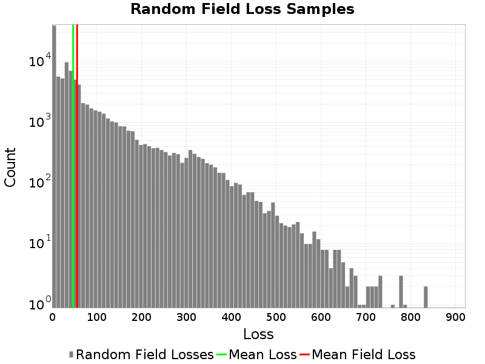 |
|  |  |
|  |  |

### Rupture 42699, Asset4
*[(top)](#table-of-contents)*

Asset parameters:

* value: 26997.0
* J-B distance to rupture: 19.491645292353013
* Vulnerability function: W1-m-RES1-DF
* GMPE ln mean: -0.6359203
* GMPE phi/tau/total std devs: 0.58652264/t0.31727752/t0.6668387

**Loss Values**

| Description | Loss Value |
|-----|-----|
| Mean Loss (GMPE) | 2712.5828 |
| Mean Loss (100000 random fields) | 2449.6174 |
| Mean Loss using rand-field exceed probs | 2882.177 |

| 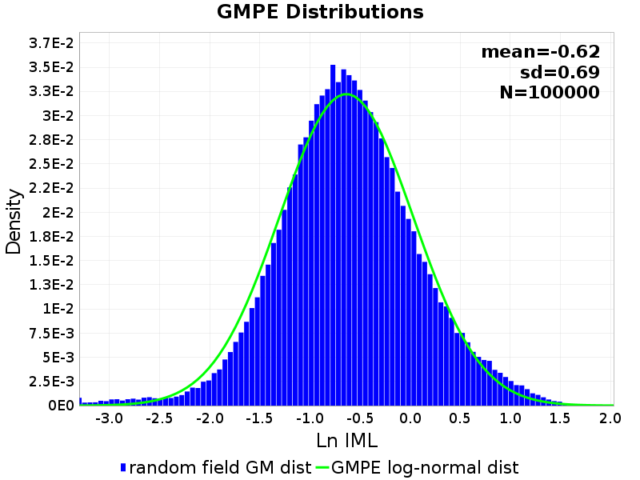 |  |
|-----|-----|
|  |  |
|  |  |
|  |  |

