# Random Field Loss Debug

Random field dubugging with the following parameters:

* 10 randomly chosen ruptures
* 5 randomly chosen assets
* 100 random fields
* 1000 randomly sampled (from a normal distribution) between-event values

The mean of all 1000 between-event values is 0.037164226

## Table Of Contents
* [Rupture 135839, M7.2476196](#rupture-135839-m72476196)
  * [Rupture 135839, Asset0](#rupture-135839-asset0)
  * [Rupture 135839, Asset1](#rupture-135839-asset1)
  * [Rupture 135839, Asset2](#rupture-135839-asset2)
  * [Rupture 135839, Asset3](#rupture-135839-asset3)
  * [Rupture 135839, Asset4](#rupture-135839-asset4)
* [Rupture 205629, M7.104012](#rupture-205629-m7104012)
  * [Rupture 205629, Asset0](#rupture-205629-asset0)
  * [Rupture 205629, Asset1](#rupture-205629-asset1)
  * [Rupture 205629, Asset2](#rupture-205629-asset2)
  * [Rupture 205629, Asset3](#rupture-205629-asset3)
  * [Rupture 205629, Asset4](#rupture-205629-asset4)
* [Rupture 81057, M7.0598035](#rupture-81057-m70598035)
  * [Rupture 81057, Asset0](#rupture-81057-asset0)
  * [Rupture 81057, Asset1](#rupture-81057-asset1)
  * [Rupture 81057, Asset2](#rupture-81057-asset2)
  * [Rupture 81057, Asset3](#rupture-81057-asset3)
  * [Rupture 81057, Asset4](#rupture-81057-asset4)
* [Rupture 215437, M7.700723](#rupture-215437-m7700723)
  * [Rupture 215437, Asset0](#rupture-215437-asset0)
  * [Rupture 215437, Asset1](#rupture-215437-asset1)
  * [Rupture 215437, Asset2](#rupture-215437-asset2)
  * [Rupture 215437, Asset3](#rupture-215437-asset3)
  * [Rupture 215437, Asset4](#rupture-215437-asset4)
* [Rupture 187237, M7.2455945](#rupture-187237-m72455945)
  * [Rupture 187237, Asset0](#rupture-187237-asset0)
  * [Rupture 187237, Asset1](#rupture-187237-asset1)
  * [Rupture 187237, Asset2](#rupture-187237-asset2)
  * [Rupture 187237, Asset3](#rupture-187237-asset3)
  * [Rupture 187237, Asset4](#rupture-187237-asset4)
* [Rupture 103472, M7.0620694](#rupture-103472-m70620694)
  * [Rupture 103472, Asset0](#rupture-103472-asset0)
  * [Rupture 103472, Asset1](#rupture-103472-asset1)
  * [Rupture 103472, Asset2](#rupture-103472-asset2)
  * [Rupture 103472, Asset3](#rupture-103472-asset3)
  * [Rupture 103472, Asset4](#rupture-103472-asset4)
* [Rupture 169293, M7.9014773](#rupture-169293-m79014773)
  * [Rupture 169293, Asset0](#rupture-169293-asset0)
  * [Rupture 169293, Asset1](#rupture-169293-asset1)
  * [Rupture 169293, Asset2](#rupture-169293-asset2)
  * [Rupture 169293, Asset3](#rupture-169293-asset3)
  * [Rupture 169293, Asset4](#rupture-169293-asset4)
* [Rupture 208188, M8.023331](#rupture-208188-m8023331)
  * [Rupture 208188, Asset0](#rupture-208188-asset0)
  * [Rupture 208188, Asset1](#rupture-208188-asset1)
  * [Rupture 208188, Asset2](#rupture-208188-asset2)
  * [Rupture 208188, Asset3](#rupture-208188-asset3)
  * [Rupture 208188, Asset4](#rupture-208188-asset4)
* [Rupture 68673, M8.155491](#rupture-68673-m8155491)
  * [Rupture 68673, Asset0](#rupture-68673-asset0)
  * [Rupture 68673, Asset1](#rupture-68673-asset1)
  * [Rupture 68673, Asset2](#rupture-68673-asset2)
  * [Rupture 68673, Asset3](#rupture-68673-asset3)
  * [Rupture 68673, Asset4](#rupture-68673-asset4)
* [Rupture 42699, M7.9970284](#rupture-42699-m79970284)
  * [Rupture 42699, Asset0](#rupture-42699-asset0)
  * [Rupture 42699, Asset1](#rupture-42699-asset1)
  * [Rupture 42699, Asset2](#rupture-42699-asset2)
  * [Rupture 42699, Asset3](#rupture-42699-asset3)
  * [Rupture 42699, Asset4](#rupture-42699-asset4)
## Rupture 135839, M7.2476196
*[(top)](#table-of-contents)*

### Rupture 135839, Asset0
*[(top)](#table-of-contents)*

Asset parameters:

* value: 28152.0
* J-B distance to rupture: 694.690385092882
* Vulnerability function: W1-h-RES1-DF
* GMPE ln mean: -5.4811554
* GMPE phi/tau/total std devs: 0.63	0.36	0.7256032

**Loss Values**

| Description | Loss Value |
|-----|-----|
| Mean Loss (GMPE) | 0.0073295822 |
| Mean Loss (100000 random fields) | 0.019453032 |
| Mean Loss using rand-field exceed probs | 0.027706414 |

|  |  |
|-----|-----|
|  |  |
|  |  |
| 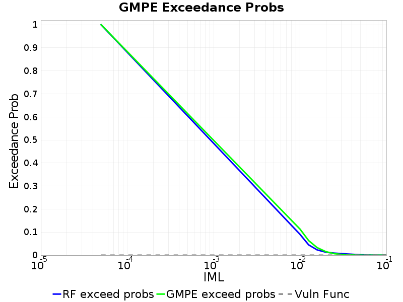 |  |

### Rupture 135839, Asset1
*[(top)](#table-of-contents)*

Asset parameters:

* value: 173.0
* J-B distance to rupture: 14.043580684469827
* Vulnerability function: RM1L-m-RES1-DF
* GMPE ln mean: -1.169849
* GMPE phi/tau/total std devs: 0.62504166	0.35524026	0.7189386

**Loss Values**

| Description | Loss Value |
|-----|-----|
| Mean Loss (GMPE) | 15.782214 |
| Mean Loss (100000 random fields) | 11.725416 |
| Mean Loss using rand-field exceed probs | 14.177285 |

|  |  |
|-----|-----|
|  |  |
|  |  |
|  | 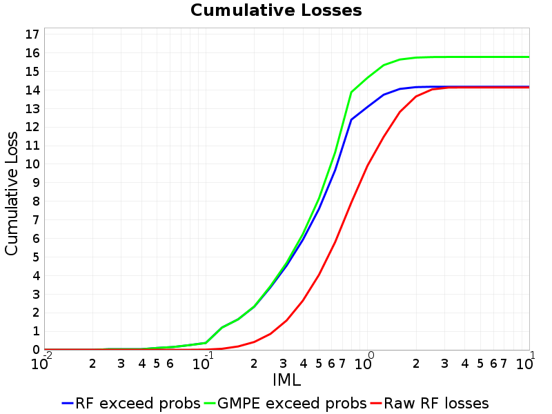 |

### Rupture 135839, Asset2
*[(top)](#table-of-contents)*

Asset parameters:

* value: 127.0
* J-B distance to rupture: 273.5062053170421
* Vulnerability function: RM1L-l-RES1-DF
* GMPE ln mean: -3.8194346
* GMPE phi/tau/total std devs: 0.63	0.36	0.7256032

**Loss Values**

| Description | Loss Value |
|-----|-----|
| Mean Loss (GMPE) | 0.08566205 |
| Mean Loss (100000 random fields) | 0.059422918 |
| Mean Loss using rand-field exceed probs | 0.07874804 |

| 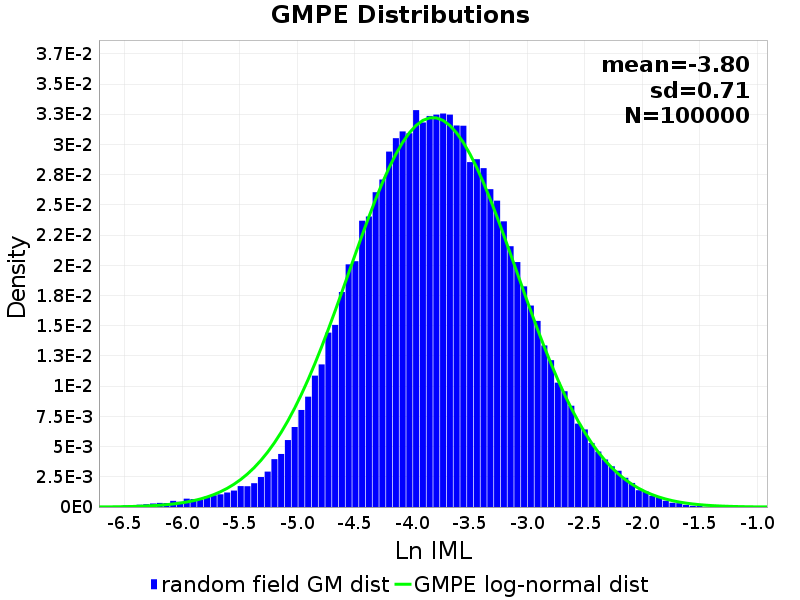 |  |
|-----|-----|
| 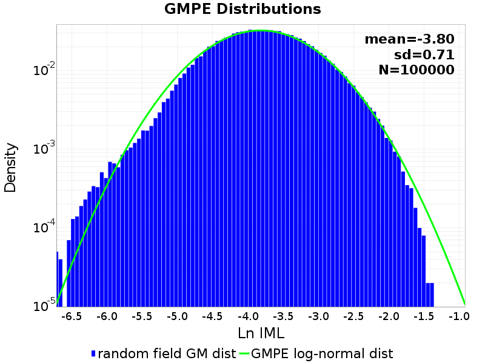 |  |
|  | 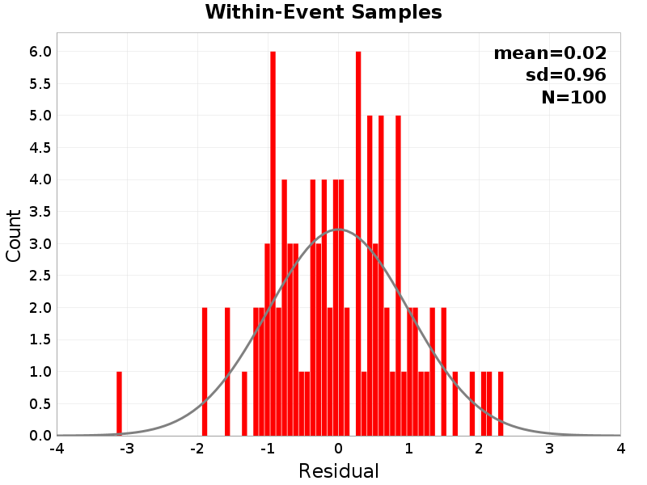 |
|  |  |

### Rupture 135839, Asset3
*[(top)](#table-of-contents)*

Asset parameters:

* value: 8363.0
* J-B distance to rupture: 447.8401003616335
* Vulnerability function: W1-h-RES1-DF
* GMPE ln mean: -4.0803275
* GMPE phi/tau/total std devs: 0.62855977	0.3586201	0.7236683

**Loss Values**

| Description | Loss Value |
|-----|-----|
| Mean Loss (GMPE) | 0.46222234 |
| Mean Loss (100000 random fields) | 0.33296448 |
| Mean Loss using rand-field exceed probs | 0.48902166 |

| 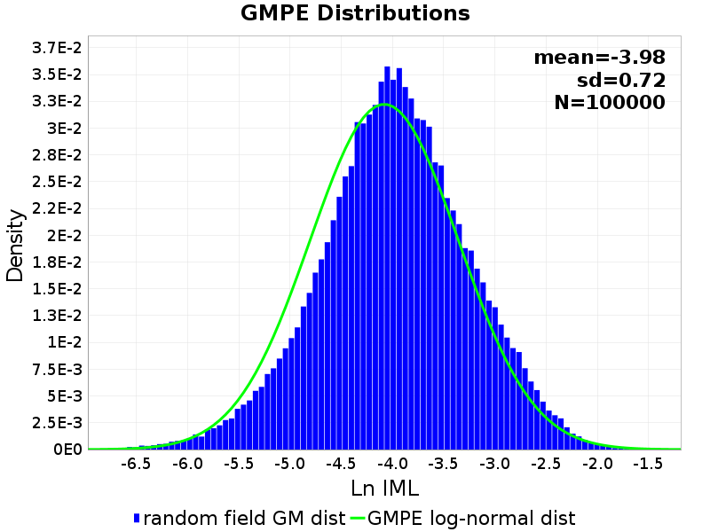 |  |
|-----|-----|
|  |  |
|  | 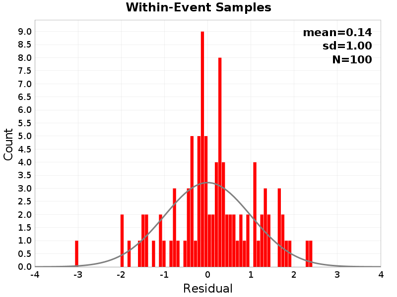 |
|  |  |

### Rupture 135839, Asset4
*[(top)](#table-of-contents)*

Asset parameters:

* value: 26997.0
* J-B distance to rupture: 34.65936164836105
* Vulnerability function: W1-m-RES1-DF
* GMPE ln mean: -1.4465866
* GMPE phi/tau/total std devs: 0.61022574	0.3408569	0.69896984

**Loss Values**

| Description | Loss Value |
|-----|-----|
| Mean Loss (GMPE) | 804.4842 |
| Mean Loss (100000 random fields) | 624.4492 |
| Mean Loss using rand-field exceed probs | 756.6421 |

|  | 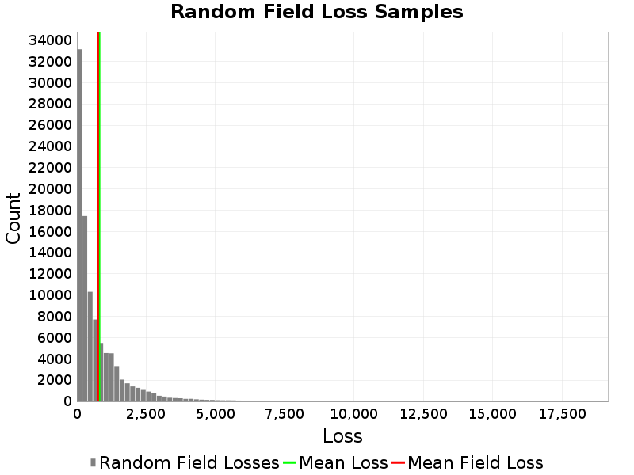 |
|-----|-----|
|  |  |
|  | 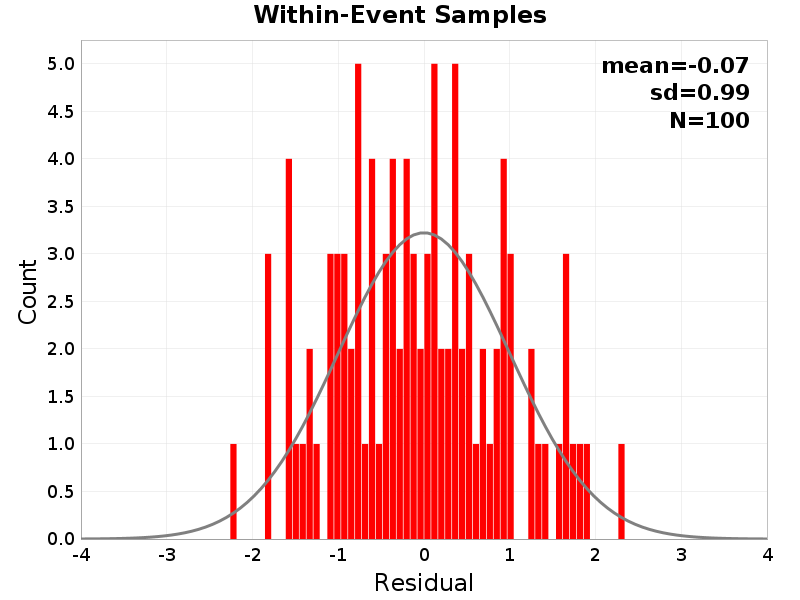 |
| 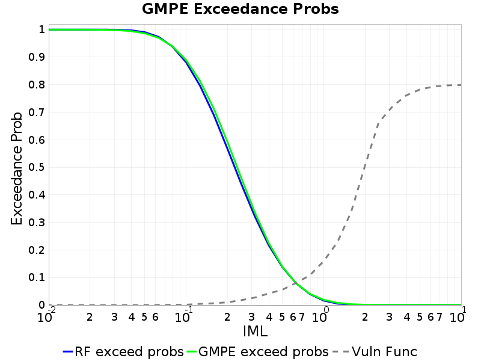 | 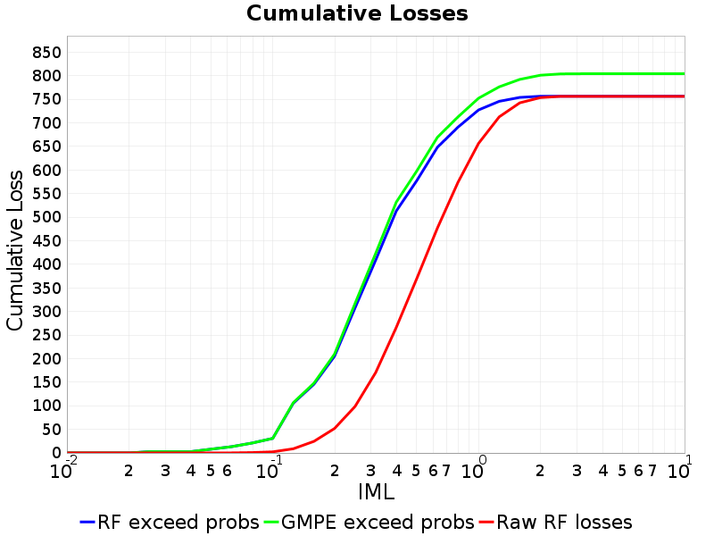 |

## Rupture 205629, M7.104012
*[(top)](#table-of-contents)*

### Rupture 205629, Asset0
*[(top)](#table-of-contents)*

Asset parameters:

* value: 28152.0
* J-B distance to rupture: 455.31765368287483
* Vulnerability function: W1-h-RES1-DF
* GMPE ln mean: -4.816326
* GMPE phi/tau/total std devs: 0.63	0.36	0.7256032

**Loss Values**

| Description | Loss Value |
|-----|-----|
| Mean Loss (GMPE) | 0.124110706 |
| Mean Loss (100000 random fields) | 0.079163425 |
| Mean Loss using rand-field exceed probs | 0.12592804 |

|  | 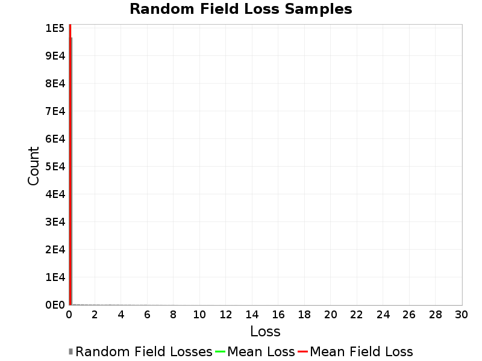 |
|-----|-----|
|  | 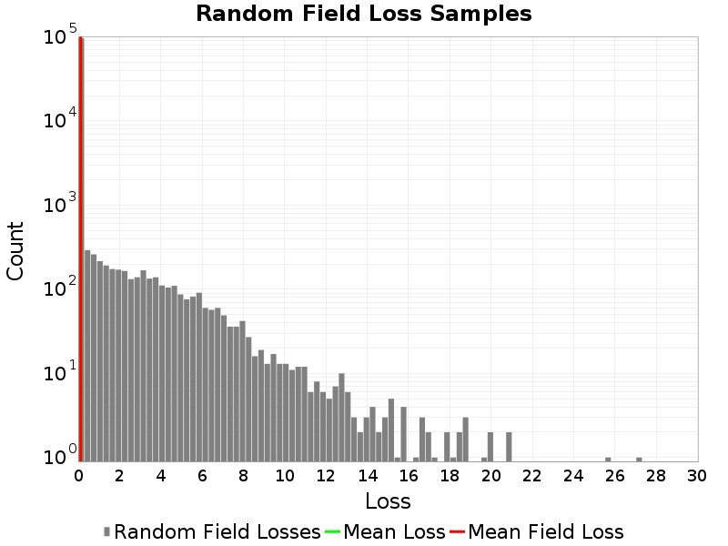 |
|  |  |
|  | 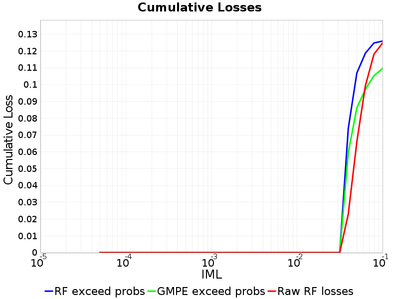 |

### Rupture 205629, Asset1
*[(top)](#table-of-contents)*

Asset parameters:

* value: 173.0
* J-B distance to rupture: 221.97881822486164
* Vulnerability function: RM1L-m-RES1-DF
* GMPE ln mean: -3.5210862
* GMPE phi/tau/total std devs: 0.6294992	0.3595204	0.7249304

**Loss Values**

| Description | Loss Value |
|-----|-----|
| Mean Loss (GMPE) | 0.12440571 |
| Mean Loss (100000 random fields) | 0.11113554 |
| Mean Loss using rand-field exceed probs | 0.14569584 |

|  |  |
|-----|-----|
|  |  |
|  |  |
| 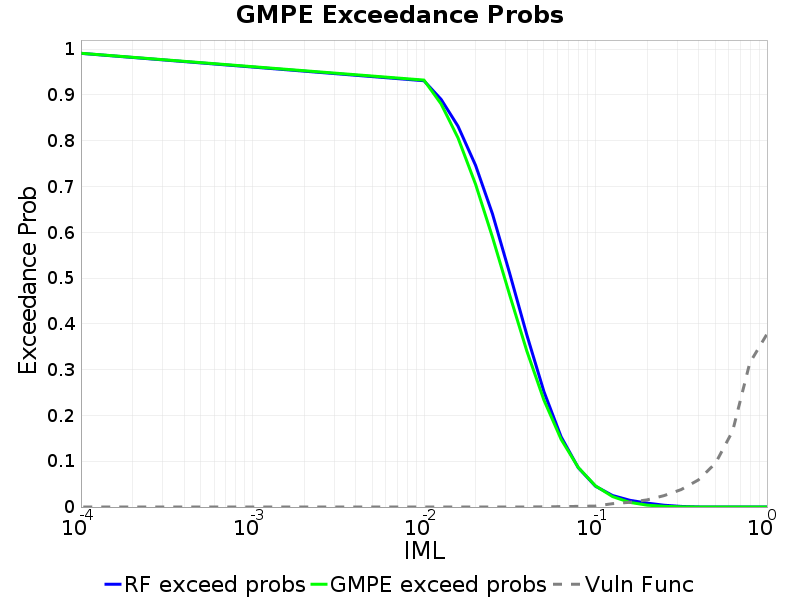 | 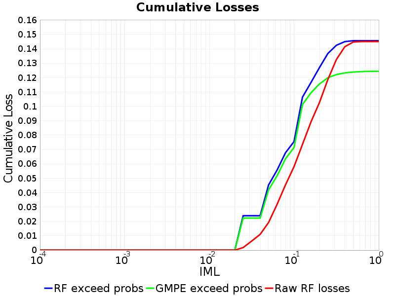 |

### Rupture 205629, Asset2
*[(top)](#table-of-contents)*

Asset parameters:

* value: 127.0
* J-B distance to rupture: 518.5566534689463
* Vulnerability function: RM1L-l-RES1-DF
* GMPE ln mean: -5.0649376
* GMPE phi/tau/total std devs: 0.63	0.36	0.7256032

**Loss Values**

| Description | Loss Value |
|-----|-----|
| Mean Loss (GMPE) | 0.0025063262 |
| Mean Loss (100000 random fields) | 0.00156972 |
| Mean Loss using rand-field exceed probs | 0.002342492 |

|  |  |
|-----|-----|
|  | 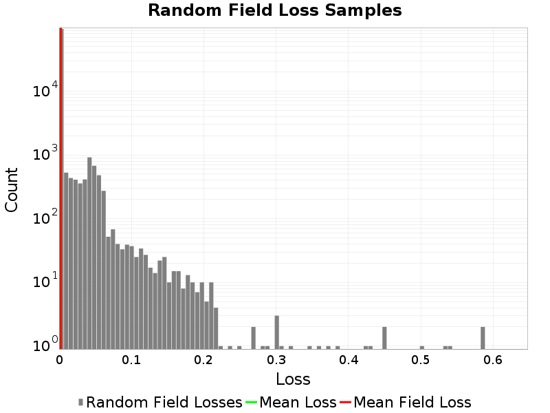 |
| 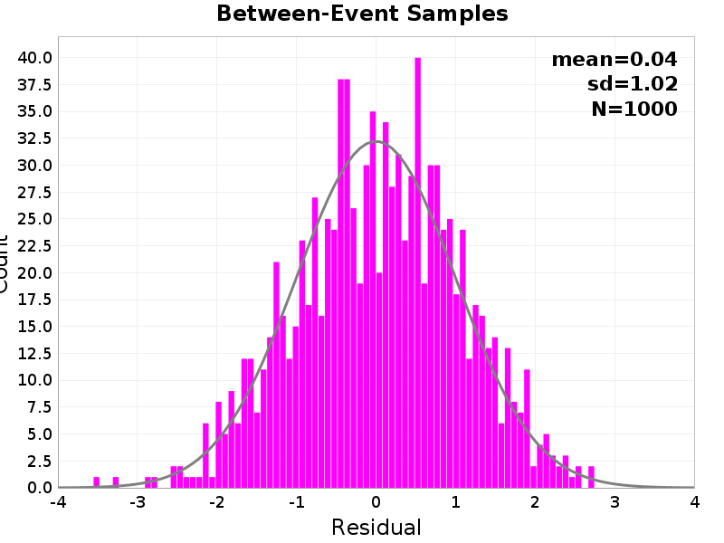 | 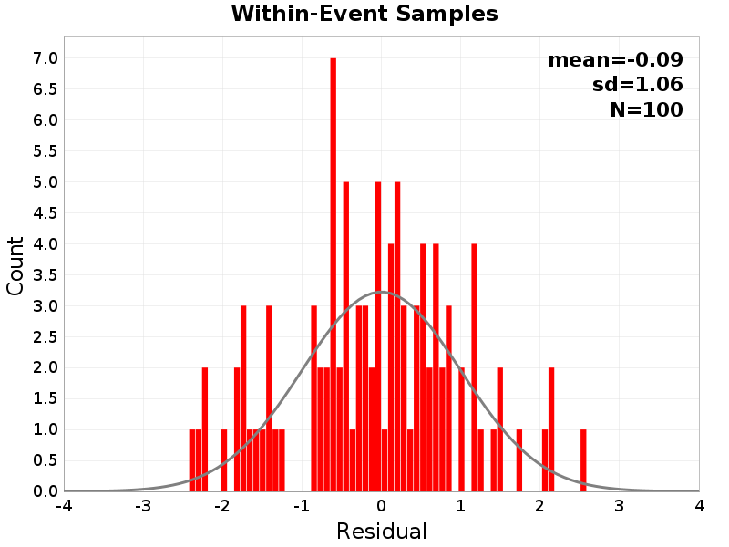 |
|  |  |

### Rupture 205629, Asset3
*[(top)](#table-of-contents)*

Asset parameters:

* value: 8363.0
* J-B distance to rupture: 206.3980025623005
* Vulnerability function: W1-h-RES1-DF
* GMPE ln mean: -3.1550865
* GMPE phi/tau/total std devs: 0.62637275	0.35652056	0.72072864

**Loss Values**

| Description | Loss Value |
|-----|-----|
| Mean Loss (GMPE) | 6.2615194 |
| Mean Loss (100000 random fields) | 3.13053 |
| Mean Loss using rand-field exceed probs | 4.361303 |

|  |  |
|-----|-----|
|  |  |
|  |  |
|  |  |

### Rupture 205629, Asset4
*[(top)](#table-of-contents)*

Asset parameters:

* value: 26997.0
* J-B distance to rupture: 154.41544744535676
* Vulnerability function: W1-m-RES1-DF
* GMPE ln mean: -2.8310452
* GMPE phi/tau/total std devs: 0.62498957	0.35519016	0.71886855

**Loss Values**

| Description | Loss Value |
|-----|-----|
| Mean Loss (GMPE) | 58.49787 |
| Mean Loss (100000 random fields) | 43.845127 |
| Mean Loss using rand-field exceed probs | 57.254192 |

|  |  |
|-----|-----|
|  | 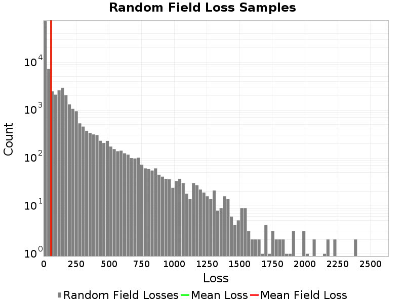 |
|  | 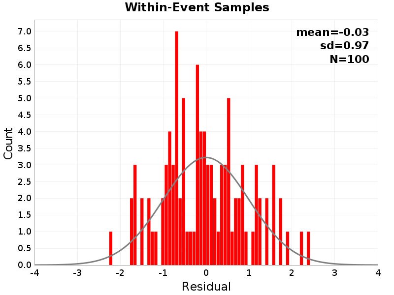 |
|  |  |

## Rupture 81057, M7.0598035
*[(top)](#table-of-contents)*

### Rupture 81057, Asset0
*[(top)](#table-of-contents)*

Asset parameters:

* value: 28152.0
* J-B distance to rupture: 620.5196004039326
* Vulnerability function: W1-h-RES1-DF
* GMPE ln mean: -5.5057936
* GMPE phi/tau/total std devs: 0.63	0.36	0.7256032

**Loss Values**

| Description | Loss Value |
|-----|-----|
| Mean Loss (GMPE) | 0.006521991 |
| Mean Loss (100000 random fields) | 0.0 |
| Mean Loss using rand-field exceed probs | 0.0 |

| 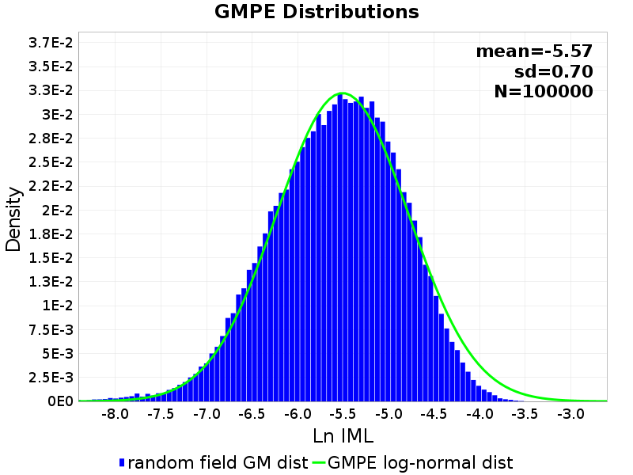 |  |
|-----|-----|
| 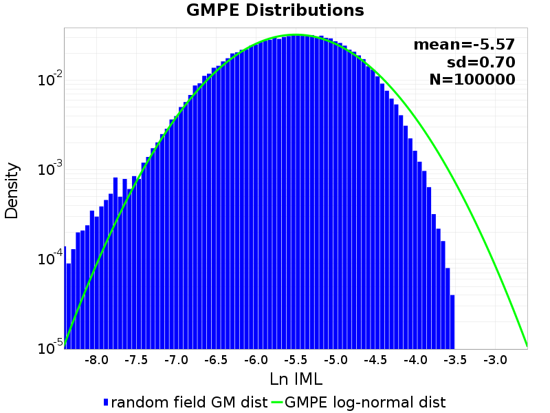 |  |
|  |  |
| 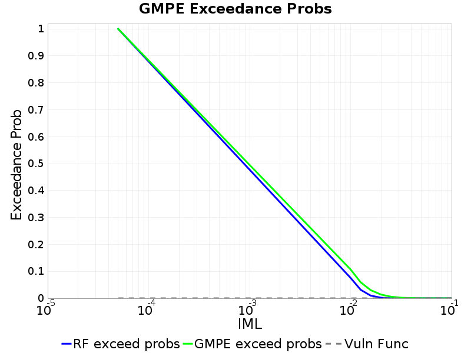 |  |

### Rupture 81057, Asset1
*[(top)](#table-of-contents)*

Asset parameters:

* value: 173.0
* J-B distance to rupture: 56.80155166346245
* Vulnerability function: RM1L-m-RES1-DF
* GMPE ln mean: -2.219313
* GMPE phi/tau/total std devs: 0.62818927	0.3582648	0.7231704

**Loss Values**

| Description | Loss Value |
|-----|-----|
| Mean Loss (GMPE) | 2.2515242 |
| Mean Loss (100000 random fields) | 1.4006596 |
| Mean Loss using rand-field exceed probs | 1.7865195 |

|  |  |
|-----|-----|
|  | 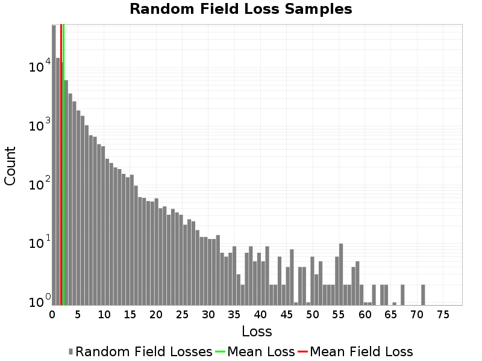 |
|  | 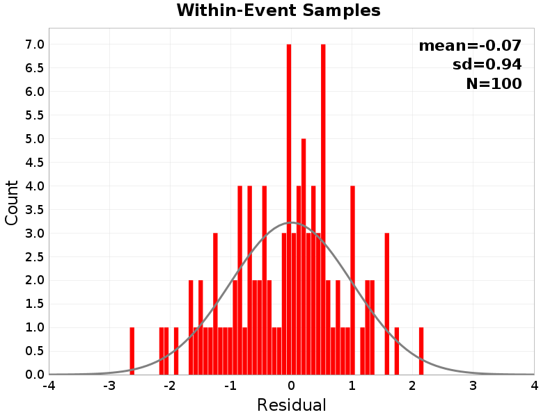 |
| 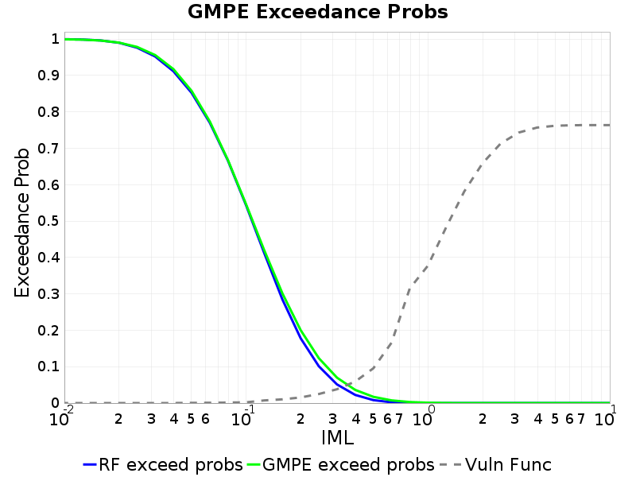 |  |

### Rupture 81057, Asset2
*[(top)](#table-of-contents)*

Asset parameters:

* value: 127.0
* J-B distance to rupture: 361.62884408989186
* Vulnerability function: RM1L-l-RES1-DF
* GMPE ln mean: -4.4785953
* GMPE phi/tau/total std devs: 0.63	0.36	0.7256032

**Loss Values**

| Description | Loss Value |
|-----|-----|
| Mean Loss (GMPE) | 0.015296124 |
| Mean Loss (100000 random fields) | 0.006195695 |
| Mean Loss using rand-field exceed probs | 0.0089679025 |

| 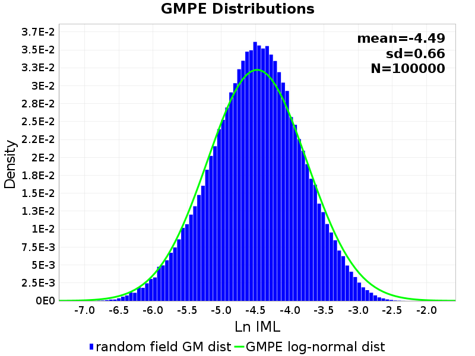 |  |
|-----|-----|
|  |  |
|  | 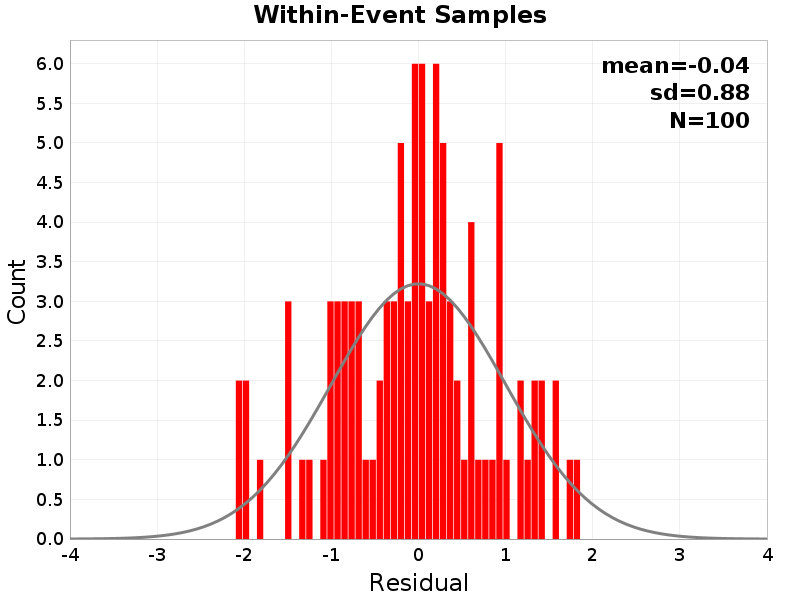 |
|  |  |

### Rupture 81057, Asset3
*[(top)](#table-of-contents)*

Asset parameters:

* value: 8363.0
* J-B distance to rupture: 374.71615824900556
* Vulnerability function: W1-h-RES1-DF
* GMPE ln mean: -4.0393543
* GMPE phi/tau/total std devs: 0.6284996	0.3585624	0.72358745

**Loss Values**

| Description | Loss Value |
|-----|-----|
| Mean Loss (GMPE) | 0.5250391 |
| Mean Loss (100000 random fields) | 0.15675607 |
| Mean Loss using rand-field exceed probs | 0.24069926 |

|  |  |
|-----|-----|
| 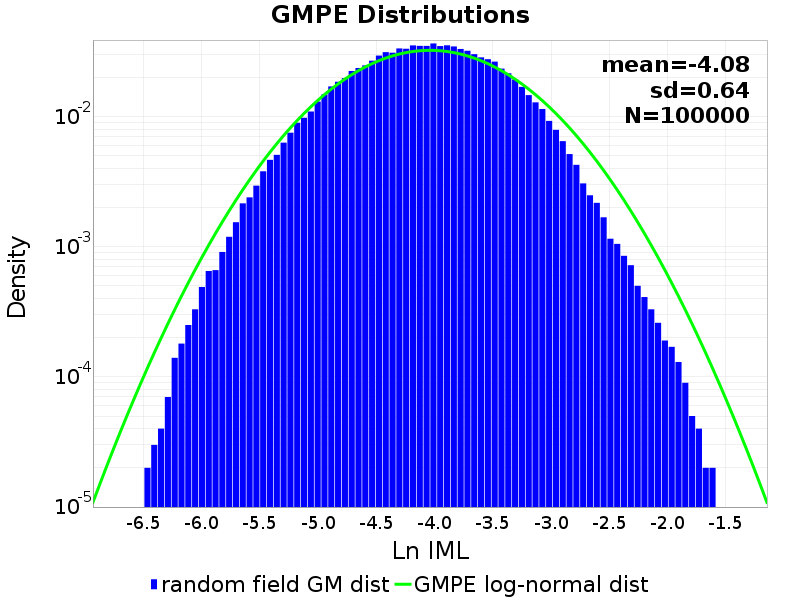 |  |
|  |  |
| 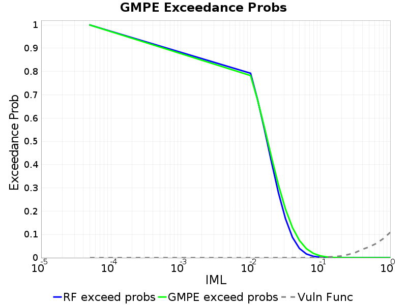 |  |

### Rupture 81057, Asset4
*[(top)](#table-of-contents)*

Asset parameters:

* value: 26997.0
* J-B distance to rupture: 18.314450029417543
* Vulnerability function: W1-m-RES1-DF
* GMPE ln mean: -1.155249
* GMPE phi/tau/total std devs: 0.6036888	0.3344283	0.69013214

**Loss Values**

| Description | Loss Value |
|-----|-----|
| Mean Loss (GMPE) | 1268.956 |
| Mean Loss (100000 random fields) | 1029.3333 |
| Mean Loss using rand-field exceed probs | 1233.6437 |

|  |  |
|-----|-----|
| 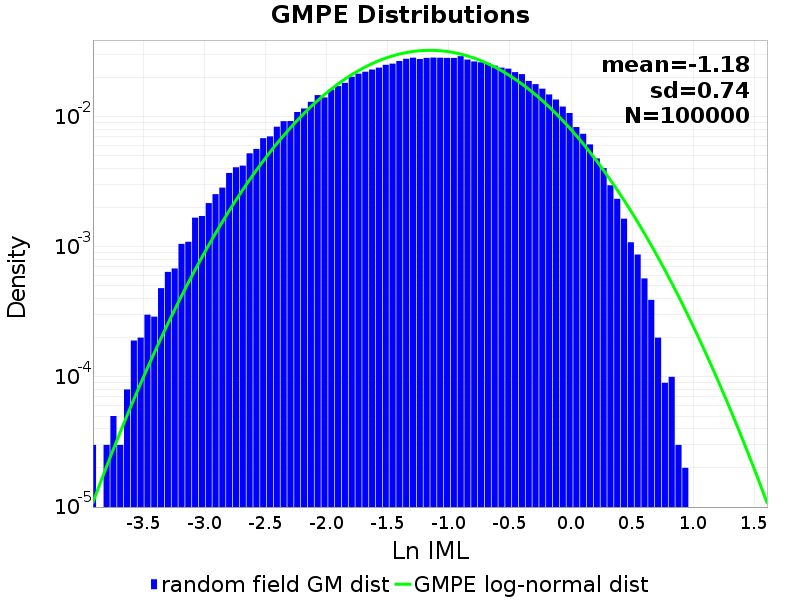 |  |
|  |  |
| 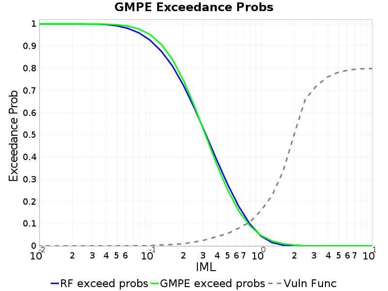 |  |

## Rupture 215437, M7.700723
*[(top)](#table-of-contents)*

### Rupture 215437, Asset0
*[(top)](#table-of-contents)*

Asset parameters:

* value: 28152.0
* J-B distance to rupture: 71.05894884501028
* Vulnerability function: W1-h-RES1-DF
* GMPE ln mean: -1.9264812
* GMPE phi/tau/total std devs: 0.63	0.36	0.7256032

**Loss Values**

| Description | Loss Value |
|-----|-----|
| Mean Loss (GMPE) | 301.51617 |
| Mean Loss (100000 random fields) | 239.63196 |
| Mean Loss using rand-field exceed probs | 293.81006 |

|  |  |
|-----|-----|
|  | 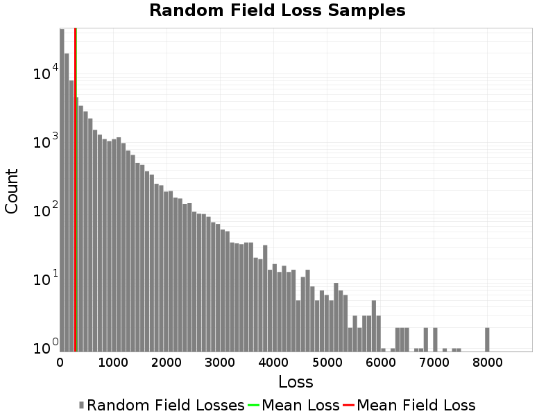 |
|  |  |
|  |  |

### Rupture 215437, Asset1
*[(top)](#table-of-contents)*

Asset parameters:

* value: 173.0
* J-B distance to rupture: 534.3368058887747
* Vulnerability function: RM1L-m-RES1-DF
* GMPE ln mean: -3.9336748
* GMPE phi/tau/total std devs: 0.62966776	0.3596819	0.72515696

**Loss Values**

| Description | Loss Value |
|-----|-----|
| Mean Loss (GMPE) | 0.044866554 |
| Mean Loss (100000 random fields) | 0.03875321 |
| Mean Loss using rand-field exceed probs | 0.052306935 |

|  |  |
|-----|-----|
|  | 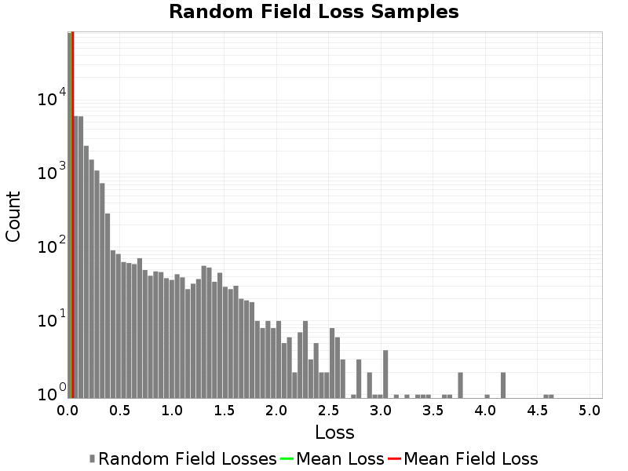 |
|  |  |
| 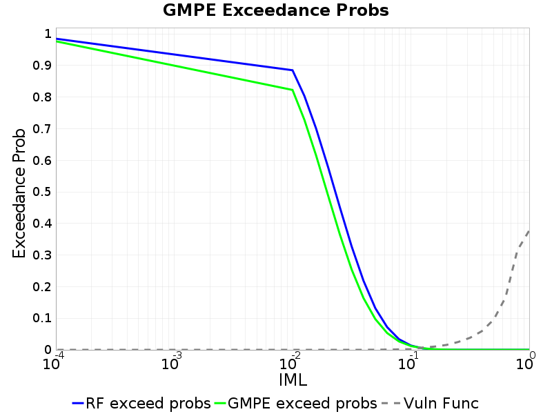 | 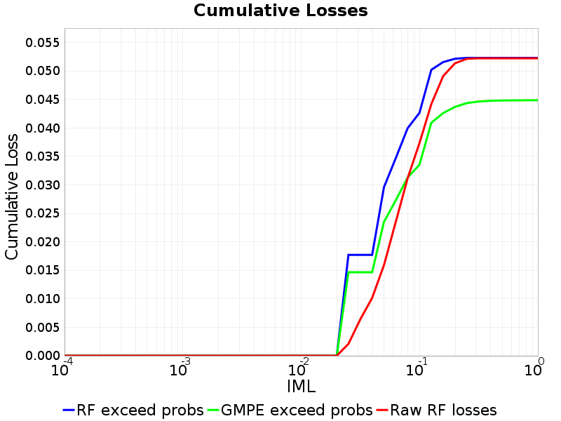 |

### Rupture 215437, Asset2
*[(top)](#table-of-contents)*

Asset parameters:

* value: 127.0
* J-B distance to rupture: 791.8061611004053
* Vulnerability function: RM1L-l-RES1-DF
* GMPE ln mean: -5.00141
* GMPE phi/tau/total std devs: 0.63	0.36	0.7256032

**Loss Values**

| Description | Loss Value |
|-----|-----|
| Mean Loss (GMPE) | 0.0031012553 |
| Mean Loss (100000 random fields) | 0.001103376 |
| Mean Loss using rand-field exceed probs | 0.0016615932 |

| 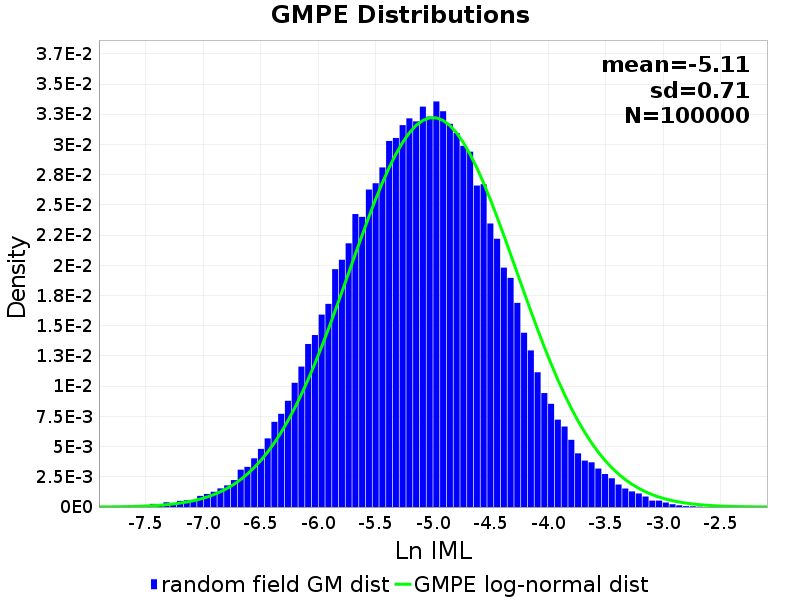 |  |
|-----|-----|
|  |  |
|  |  |
| 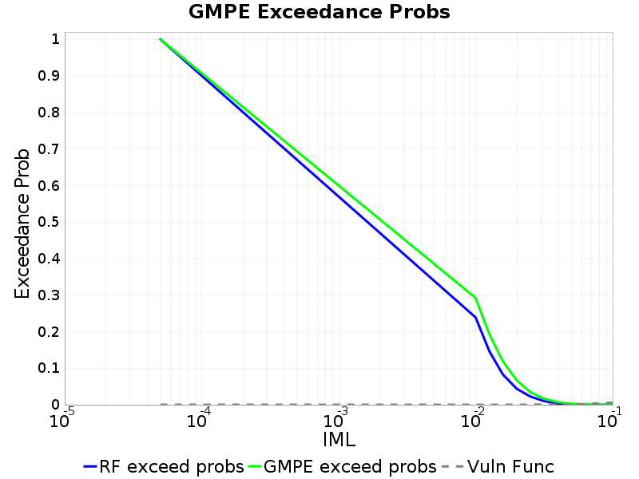 |  |

### Rupture 215437, Asset3
*[(top)](#table-of-contents)*

Asset parameters:

* value: 8363.0
* J-B distance to rupture: 45.2838460115642
* Vulnerability function: W1-h-RES1-DF
* GMPE ln mean: -1.2025274
* GMPE phi/tau/total std devs: 0.6048769	0.33560073	0.6917398

**Loss Values**

| Description | Loss Value |
|-----|-----|
| Mean Loss (GMPE) | 273.9915 |
| Mean Loss (100000 random fields) | 212.47745 |
| Mean Loss using rand-field exceed probs | 252.15826 |

|  |  |
|-----|-----|
| 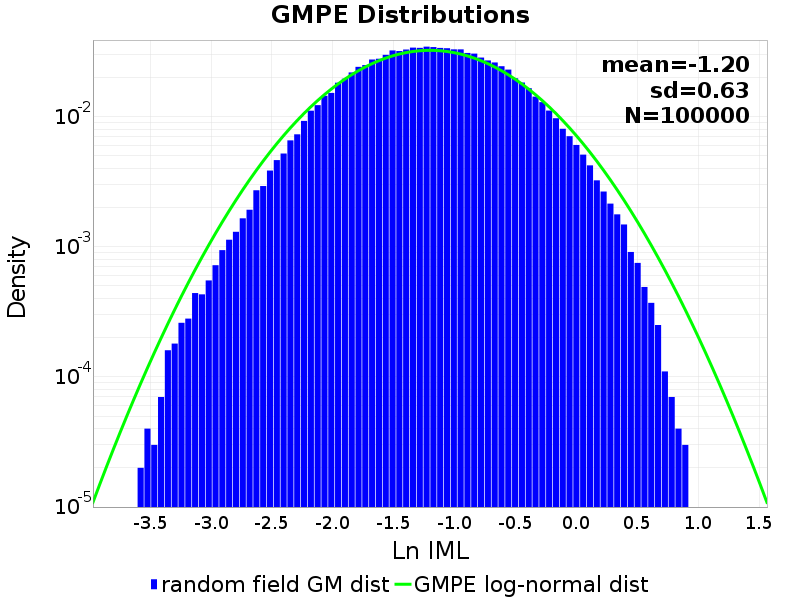 |  |
|  |  |
| 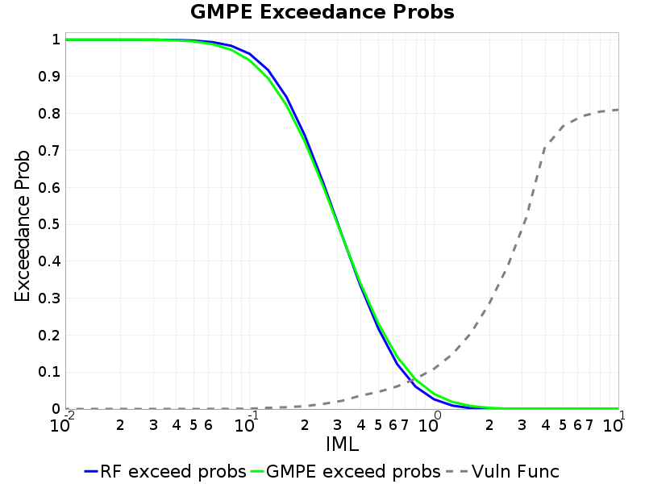 |  |

### Rupture 215437, Asset4
*[(top)](#table-of-contents)*

Asset parameters:

* value: 26997.0
* J-B distance to rupture: 459.82072382638347
* Vulnerability function: W1-m-RES1-DF
* GMPE ln mean: -3.3911812
* GMPE phi/tau/total std devs: 0.62713397	0.3572519	0.721752

**Loss Values**

| Description | Loss Value |
|-----|-----|
| Mean Loss (GMPE) | 15.539383 |
| Mean Loss (100000 random fields) | 15.047129 |
| Mean Loss using rand-field exceed probs | 20.122307 |

|  | 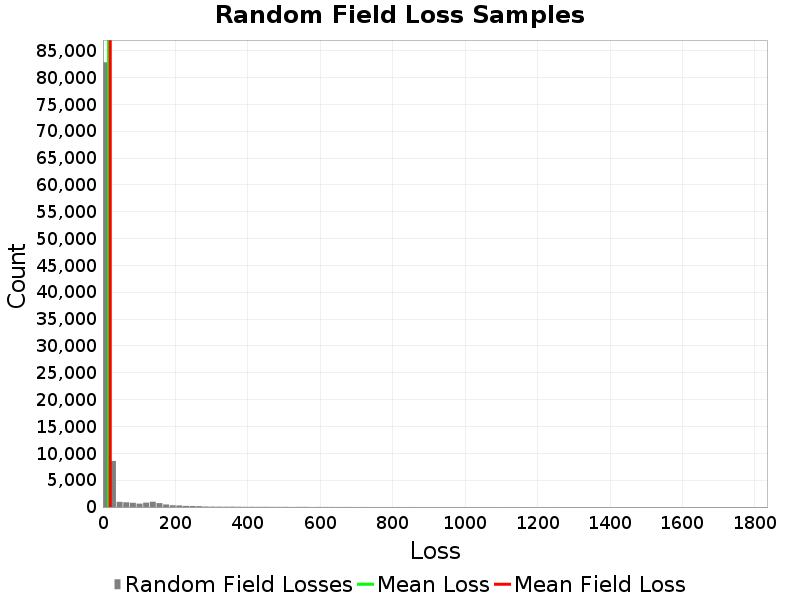 |
|-----|-----|
|  |  |
|  |  |
|  |  |

## Rupture 187237, M7.2455945
*[(top)](#table-of-contents)*

### Rupture 187237, Asset0
*[(top)](#table-of-contents)*

Asset parameters:

* value: 28152.0
* J-B distance to rupture: 220.42899827010416
* Vulnerability function: W1-h-RES1-DF
* GMPE ln mean: -3.4888635
* GMPE phi/tau/total std devs: 0.63	0.36	0.7256032

**Loss Values**

| Description | Loss Value |
|-----|-----|
| Mean Loss (GMPE) | 8.919588 |
| Mean Loss (100000 random fields) | 3.7998724 |
| Mean Loss using rand-field exceed probs | 5.4283786 |

| 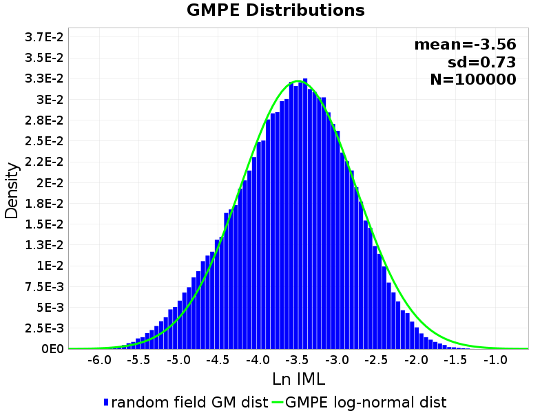 |  |
|-----|-----|
|  |  |
|  | 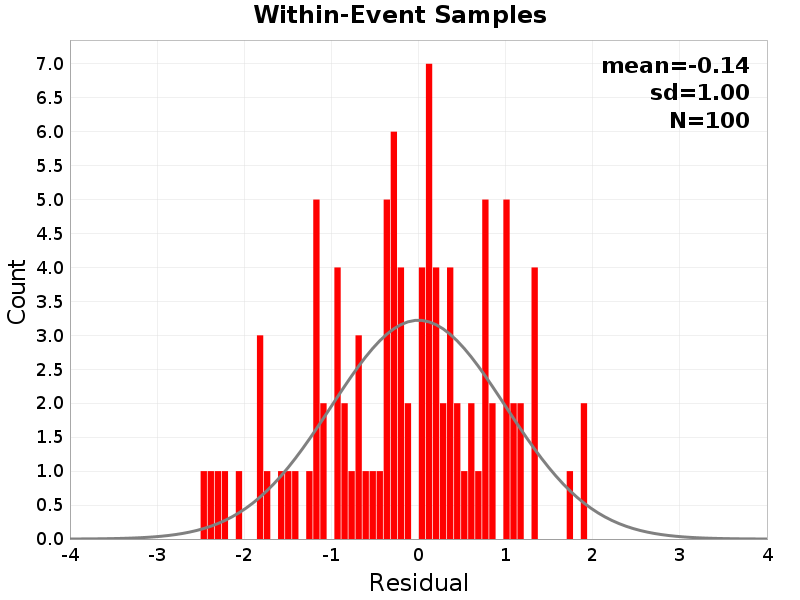 |
|  | 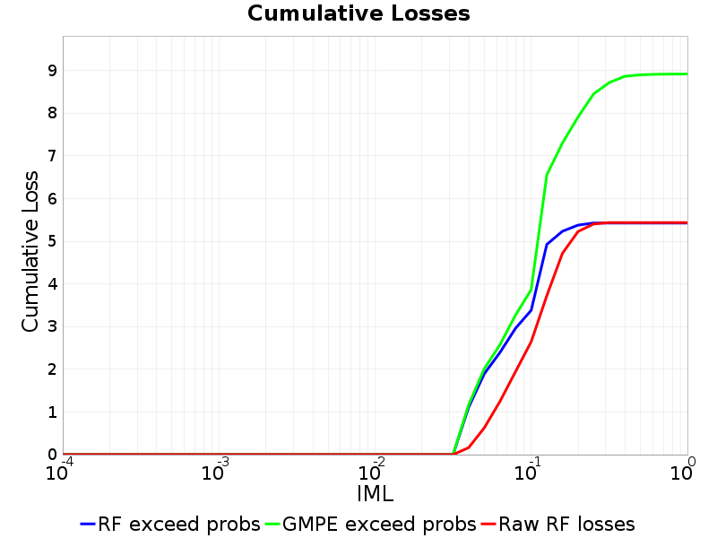 |

### Rupture 187237, Asset1
*[(top)](#table-of-contents)*

Asset parameters:

* value: 173.0
* J-B distance to rupture: 459.6791921461773
* Vulnerability function: RM1L-m-RES1-DF
* GMPE ln mean: -4.348357
* GMPE phi/tau/total std devs: 0.62978023	0.3597896	0.725308

**Loss Values**

| Description | Loss Value |
|-----|-----|
| Mean Loss (GMPE) | 0.015267798 |
| Mean Loss (100000 random fields) | 0.010000092 |
| Mean Loss using rand-field exceed probs | 0.013683956 |

| 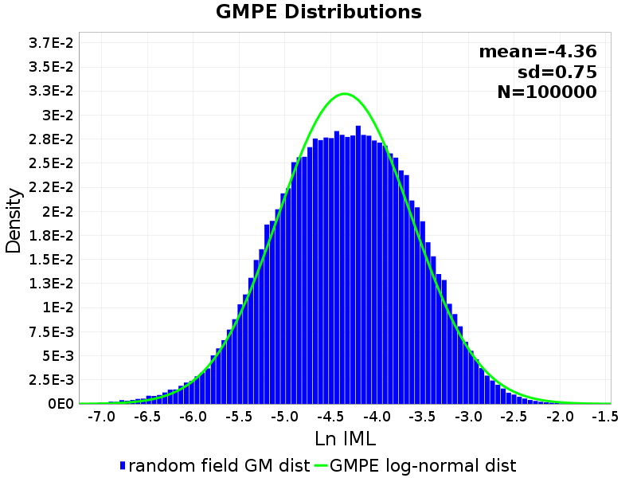 |  |
|-----|-----|
|  |  |
|  |  |
|  |  |

### Rupture 187237, Asset2
*[(top)](#table-of-contents)*

Asset parameters:

* value: 127.0
* J-B distance to rupture: 718.6404783019321
* Vulnerability function: RM1L-l-RES1-DF
* GMPE ln mean: -5.5039325
* GMPE phi/tau/total std devs: 0.63	0.36	0.7256032

**Loss Values**

| Description | Loss Value |
|-----|-----|
| Mean Loss (GMPE) | 5.0171156E-4 |
| Mean Loss (100000 random fields) | 4.9911E-5 |
| Mean Loss using rand-field exceed probs | 1.1166614E-4 |

|  |  |
|-----|-----|
| 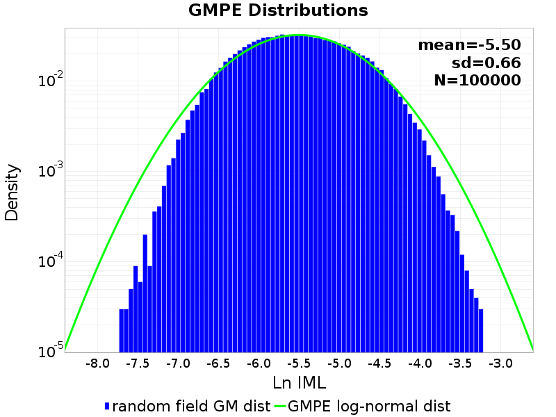 |  |
|  |  |
| 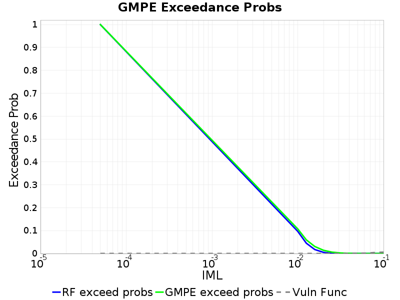 | 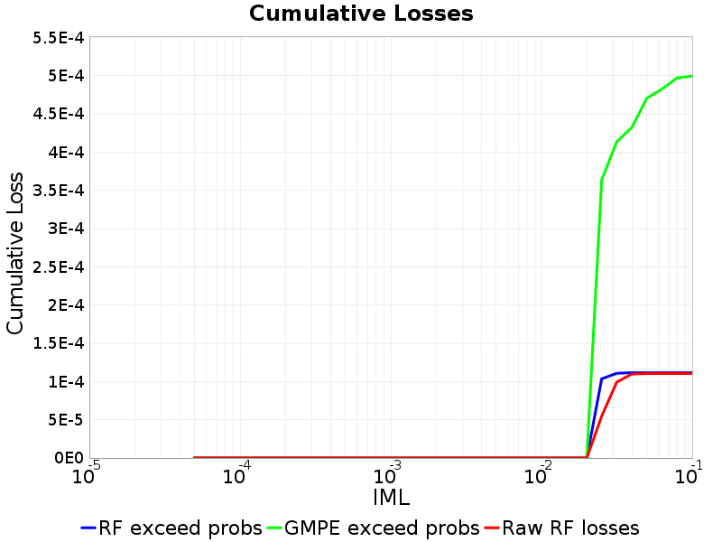 |

### Rupture 187237, Asset3
*[(top)](#table-of-contents)*

Asset parameters:

* value: 8363.0
* J-B distance to rupture: 25.110251940672537
* Vulnerability function: W1-h-RES1-DF
* GMPE ln mean: -1.1612767
* GMPE phi/tau/total std devs: 0.6038432	0.3345808	0.6903412

**Loss Values**

| Description | Loss Value |
|-----|-----|
| Mean Loss (GMPE) | 290.59494 |
| Mean Loss (100000 random fields) | 291.16467 |
| Mean Loss using rand-field exceed probs | 343.34393 |

|  | 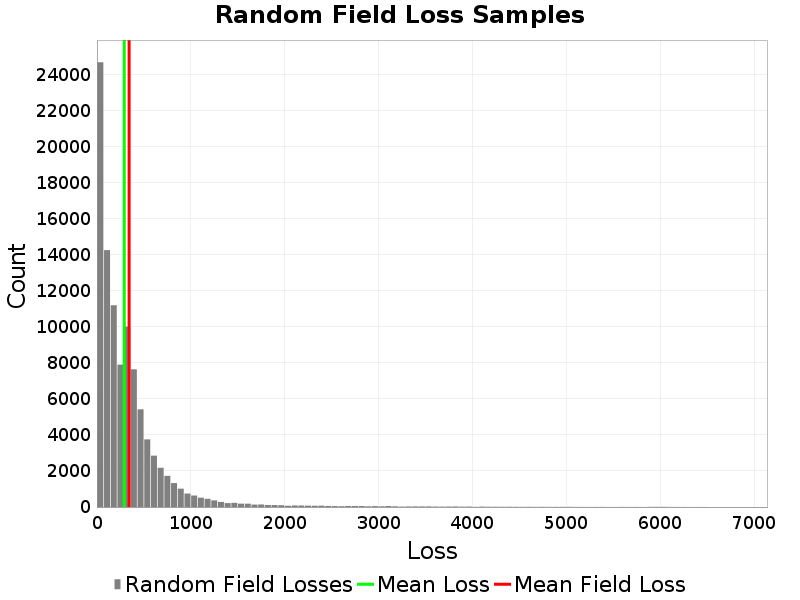 |
|-----|-----|
| 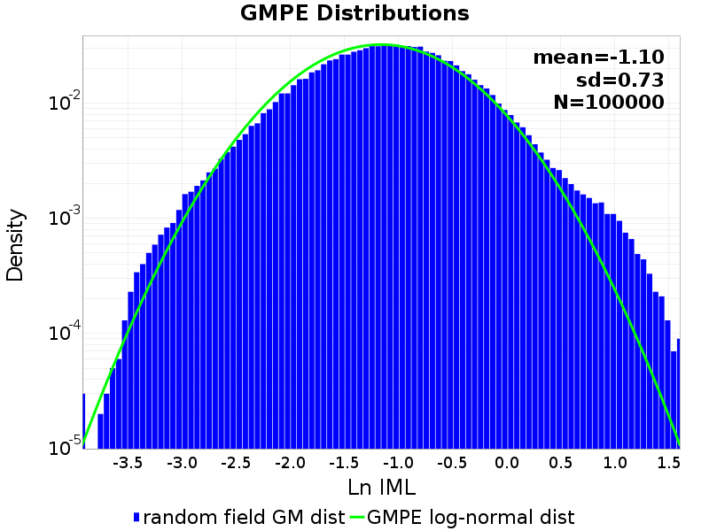 | 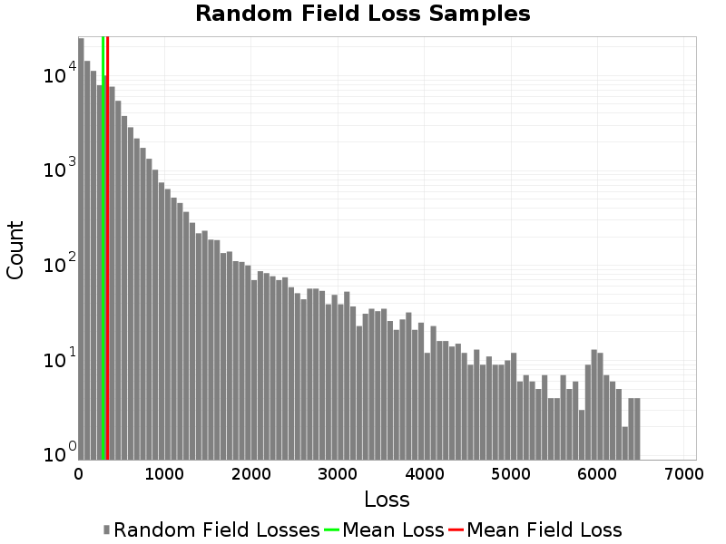 |
|  | 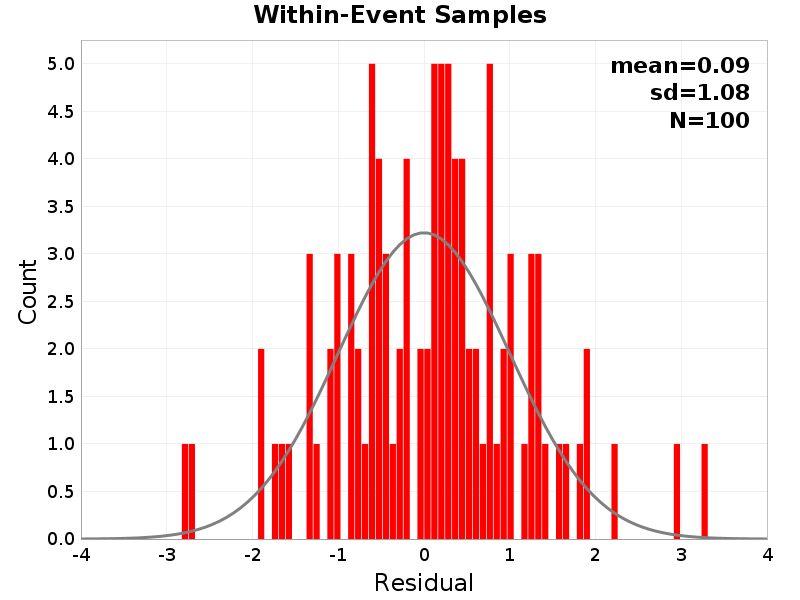 |
| 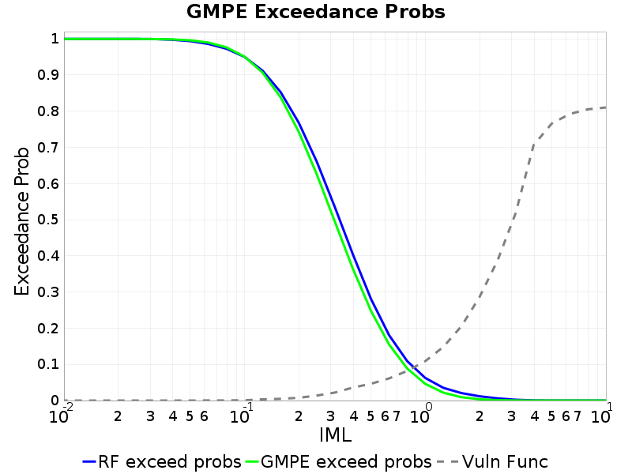 | 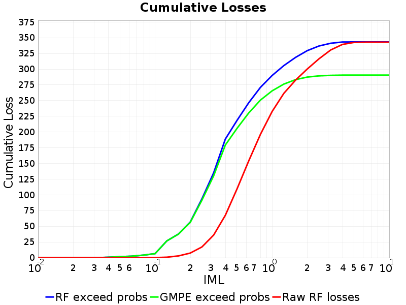 |

### Rupture 187237, Asset4
*[(top)](#table-of-contents)*

Asset parameters:

* value: 26997.0
* J-B distance to rupture: 385.1454560877946
* Vulnerability function: W1-m-RES1-DF
* GMPE ln mean: -3.7677114
* GMPE phi/tau/total std devs: 0.62803197	0.35811388	0.722959

**Loss Values**

| Description | Loss Value |
|-----|-----|
| Mean Loss (GMPE) | 5.9639564 |
| Mean Loss (100000 random fields) | 5.1951947 |
| Mean Loss using rand-field exceed probs | 6.8714337 |

|  | 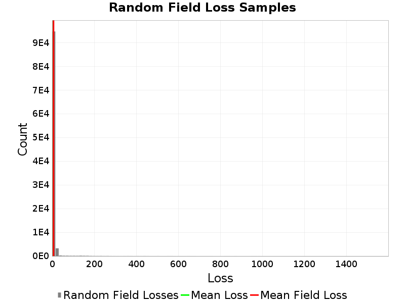 |
|-----|-----|
|  | 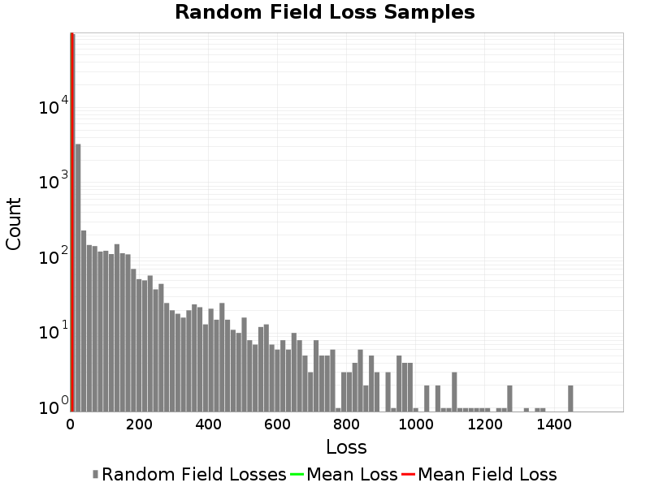 |
|  |  |
|  |  |

## Rupture 103472, M7.0620694
*[(top)](#table-of-contents)*

### Rupture 103472, Asset0
*[(top)](#table-of-contents)*

Asset parameters:

* value: 28152.0
* J-B distance to rupture: 664.6072172908746
* Vulnerability function: W1-h-RES1-DF
* GMPE ln mean: -5.643721
* GMPE phi/tau/total std devs: 0.63	0.36	0.7256032

**Loss Values**

| Description | Loss Value |
|-----|-----|
| Mean Loss (GMPE) | 0.003335919 |
| Mean Loss (100000 random fields) | 0.01351296 |
| Mean Loss using rand-field exceed probs | 0.020431144 |

|  | 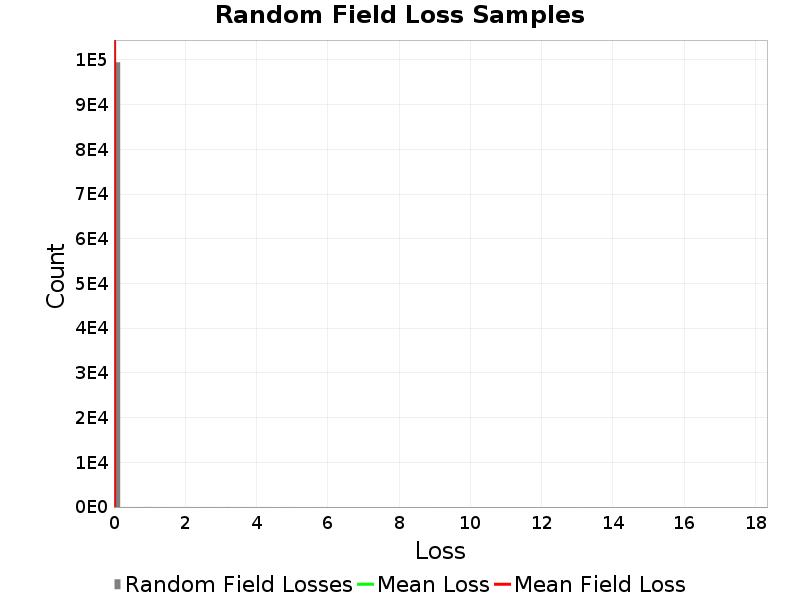 |
|-----|-----|
|  |  |
|  |  |
|  |  |

### Rupture 103472, Asset1
*[(top)](#table-of-contents)*

Asset parameters:

* value: 173.0
* J-B distance to rupture: 17.032477551146595
* Vulnerability function: RM1L-m-RES1-DF
* GMPE ln mean: -1.2694901
* GMPE phi/tau/total std devs: 0.6254843	0.3556662	0.71953386

**Loss Values**

| Description | Loss Value |
|-----|-----|
| Mean Loss (GMPE) | 13.397572 |
| Mean Loss (100000 random fields) | 9.3404045 |
| Mean Loss using rand-field exceed probs | 11.568785 |

| 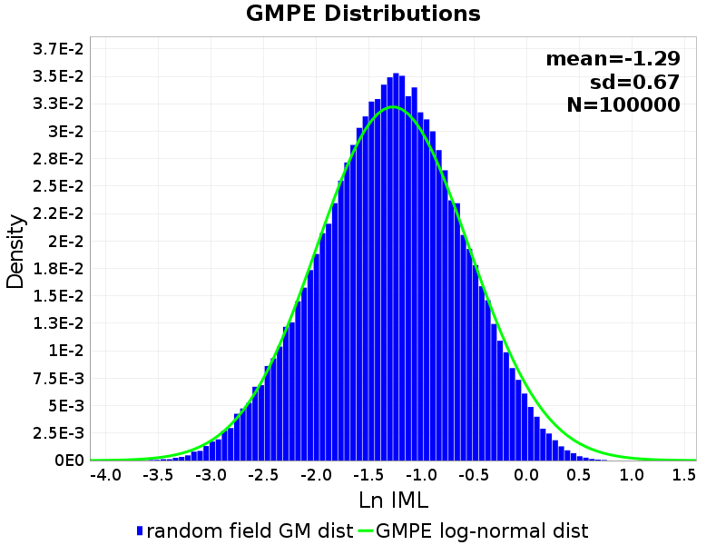 | 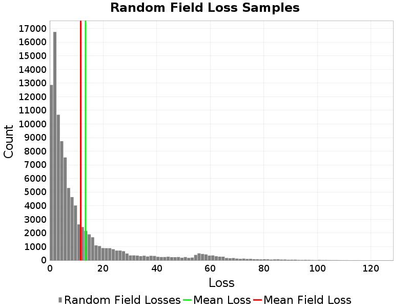 |
|-----|-----|
|  |  |
|  |  |
|  |  |

### Rupture 103472, Asset2
*[(top)](#table-of-contents)*

Asset parameters:

* value: 127.0
* J-B distance to rupture: 289.6538168599644
* Vulnerability function: RM1L-l-RES1-DF
* GMPE ln mean: -4.1225557
* GMPE phi/tau/total std devs: 0.63	0.36	0.7256032

**Loss Values**

| Description | Loss Value |
|-----|-----|
| Mean Loss (GMPE) | 0.03995349 |
| Mean Loss (100000 random fields) | 0.019786982 |
| Mean Loss using rand-field exceed probs | 0.02718265 |

|  |  |
|-----|-----|
| 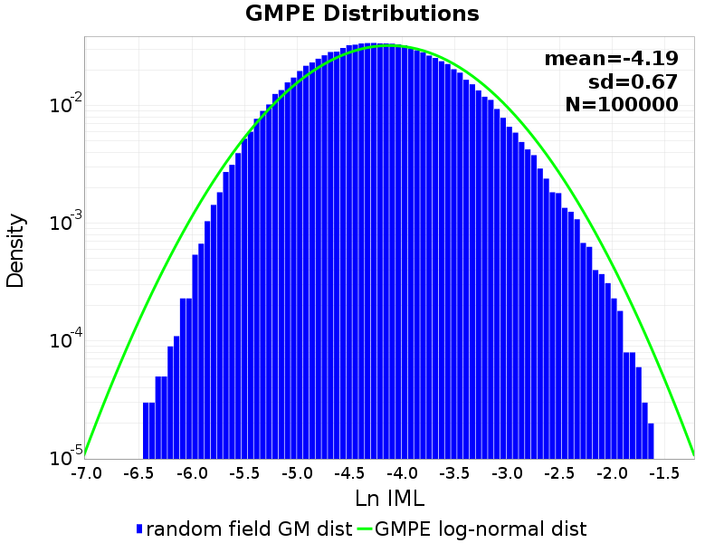 |  |
|  |  |
|  |  |

### Rupture 103472, Asset3
*[(top)](#table-of-contents)*

Asset parameters:

* value: 8363.0
* J-B distance to rupture: 420.35845775898594
* Vulnerability function: W1-h-RES1-DF
* GMPE ln mean: -4.2131553
* GMPE phi/tau/total std devs: 0.62873876	0.3587917	0.7239088

**Loss Values**

| Description | Loss Value |
|-----|-----|
| Mean Loss (GMPE) | 0.3031265 |
| Mean Loss (100000 random fields) | 0.24211721 |
| Mean Loss using rand-field exceed probs | 0.35940528 |

| 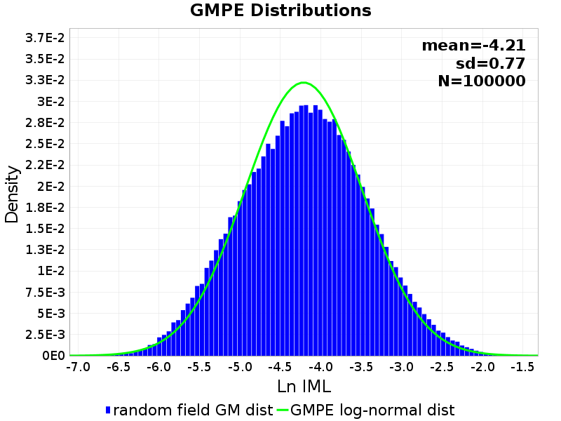 |  |
|-----|-----|
| 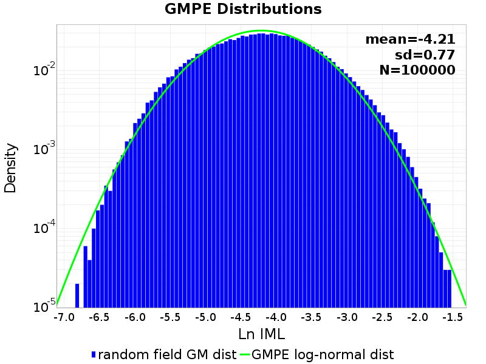 |  |
|  |  |
| 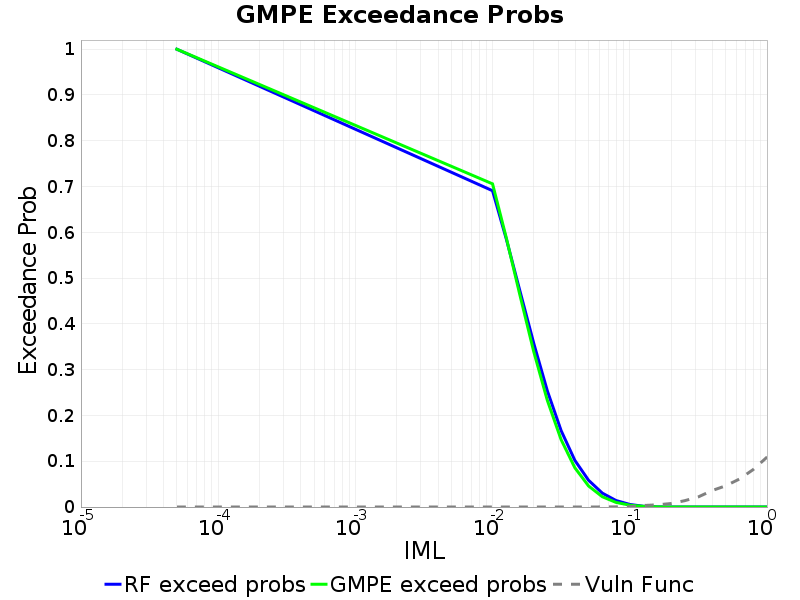 |  |

### Rupture 103472, Asset4
*[(top)](#table-of-contents)*

Asset parameters:

* value: 26997.0
* J-B distance to rupture: 9.884195532220756
* Vulnerability function: W1-m-RES1-DF
* GMPE ln mean: -0.73613816
* GMPE phi/tau/total std devs: 0.5905011	0.32128924	0.6722487

**Loss Values**

| Description | Loss Value |
|-----|-----|
| Mean Loss (GMPE) | 2354.3843 |
| Mean Loss (100000 random fields) | 1830.1992 |
| Mean Loss using rand-field exceed probs | 2183.2104 |

|  | 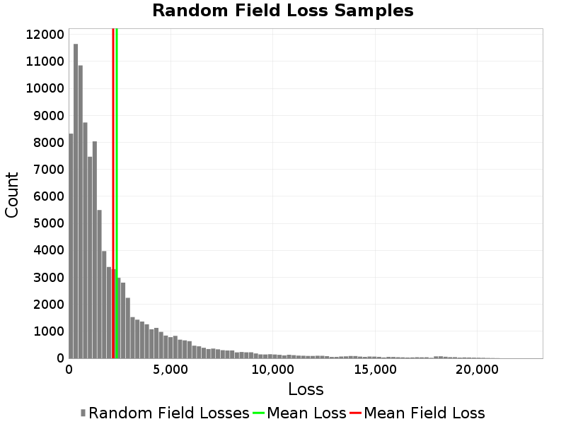 |
|-----|-----|
|  |  |
|  |  |
|  |  |

## Rupture 169293, M7.9014773
*[(top)](#table-of-contents)*

### Rupture 169293, Asset0
*[(top)](#table-of-contents)*

Asset parameters:

* value: 28152.0
* J-B distance to rupture: 648.2448111411015
* Vulnerability function: W1-h-RES1-DF
* GMPE ln mean: -4.294038
* GMPE phi/tau/total std devs: 0.63	0.36	0.7256032

**Loss Values**

| Description | Loss Value |
|-----|-----|
| Mean Loss (GMPE) | 0.79277617 |
| Mean Loss (100000 random fields) | 0.35007012 |
| Mean Loss using rand-field exceed probs | 0.52643746 |

|  |  |
|-----|-----|
|  | 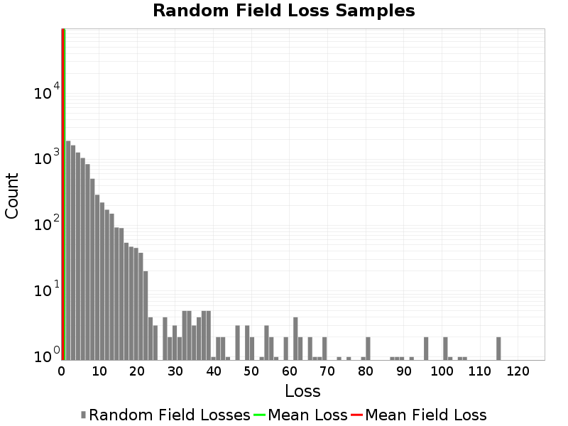 |
|  |  |
| 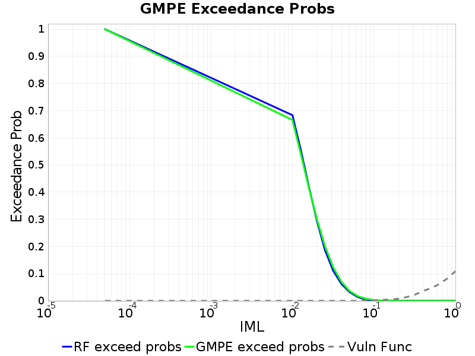 |  |

### Rupture 169293, Asset1
*[(top)](#table-of-contents)*

Asset parameters:

* value: 173.0
* J-B distance to rupture: 14.01186694590594
* Vulnerability function: RM1L-m-RES1-DF
* GMPE ln mean: -0.72076213
* GMPE phi/tau/total std devs: 0.6225097	0.35279965	0.7155319

**Loss Values**

| Description | Loss Value |
|-----|-----|
| Mean Loss (GMPE) | 30.584162 |
| Mean Loss (100000 random fields) | 25.708382 |
| Mean Loss using rand-field exceed probs | 30.1446 |

| 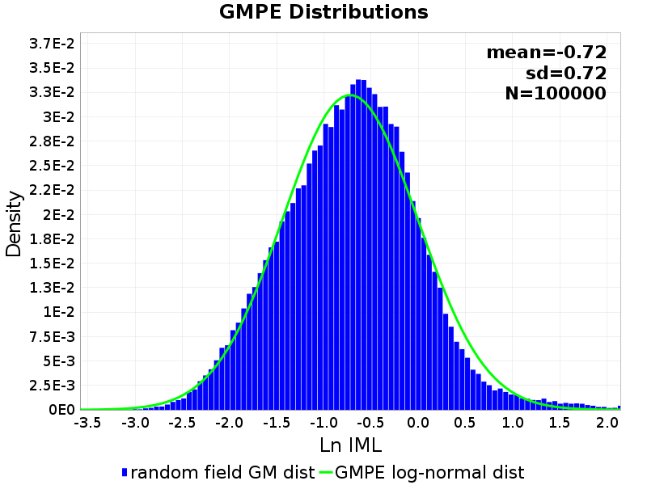 |  |
|-----|-----|
| 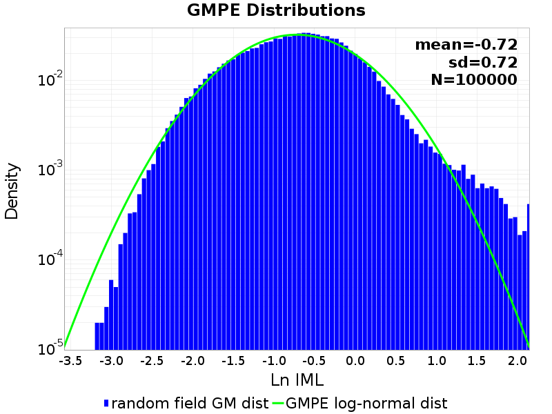 | 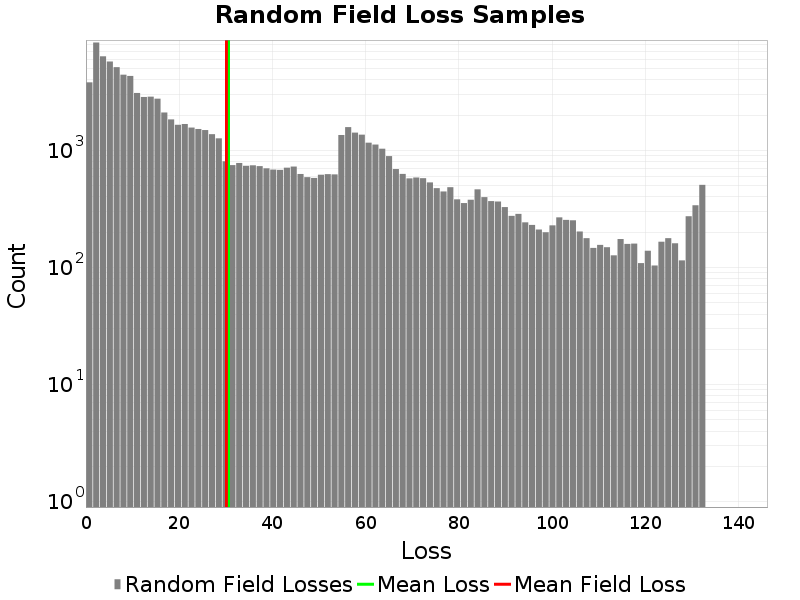 |
|  |  |
|  |  |

### Rupture 169293, Asset2
*[(top)](#table-of-contents)*

Asset parameters:

* value: 127.0
* J-B distance to rupture: 159.32030510236777
* Vulnerability function: RM1L-l-RES1-DF
* GMPE ln mean: -2.407653
* GMPE phi/tau/total std devs: 0.63	0.36	0.7256032

**Loss Values**

| Description | Loss Value |
|-----|-----|
| Mean Loss (GMPE) | 2.2303557 |
| Mean Loss (100000 random fields) | 1.573672 |
| Mean Loss using rand-field exceed probs | 2.0242932 |

|  |  |
|-----|-----|
|  | 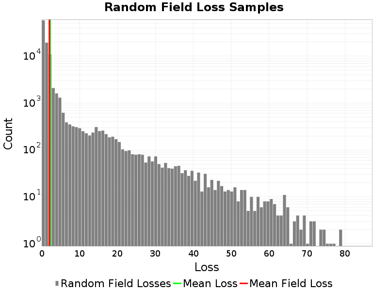 |
|  | 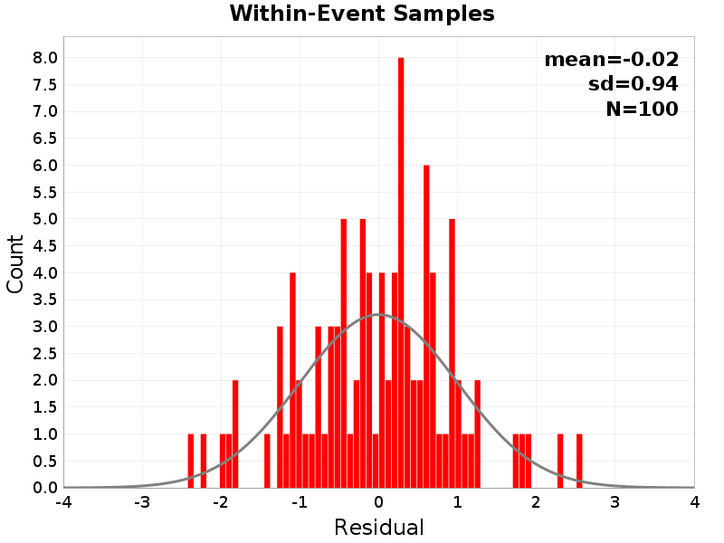 |
|  |  |

### Rupture 169293, Asset3
*[(top)](#table-of-contents)*

Asset parameters:

* value: 8363.0
* J-B distance to rupture: 401.91212262700554
* Vulnerability function: W1-h-RES1-DF
* GMPE ln mean: -2.9629278
* GMPE phi/tau/total std devs: 0.6256067	0.35578397	0.71969855

**Loss Values**

| Description | Loss Value |
|-----|-----|
| Mean Loss (GMPE) | 10.055348 |
| Mean Loss (100000 random fields) | 8.811842 |
| Mean Loss using rand-field exceed probs | 11.7521 |

|  |  |
|-----|-----|
|  |  |
|  |  |
|  |  |

### Rupture 169293, Asset4
*[(top)](#table-of-contents)*

Asset parameters:

* value: 26997.0
* J-B distance to rupture: 19.491645292353013
* Vulnerability function: W1-m-RES1-DF
* GMPE ln mean: -0.69447255
* GMPE phi/tau/total std devs: 0.58889043	0.31966794	0.6700594

**Loss Values**

| Description | Loss Value |
|-----|-----|
| Mean Loss (GMPE) | 2497.9104 |
| Mean Loss (100000 random fields) | 2086.1199 |
| Mean Loss using rand-field exceed probs | 2485.0344 |

| 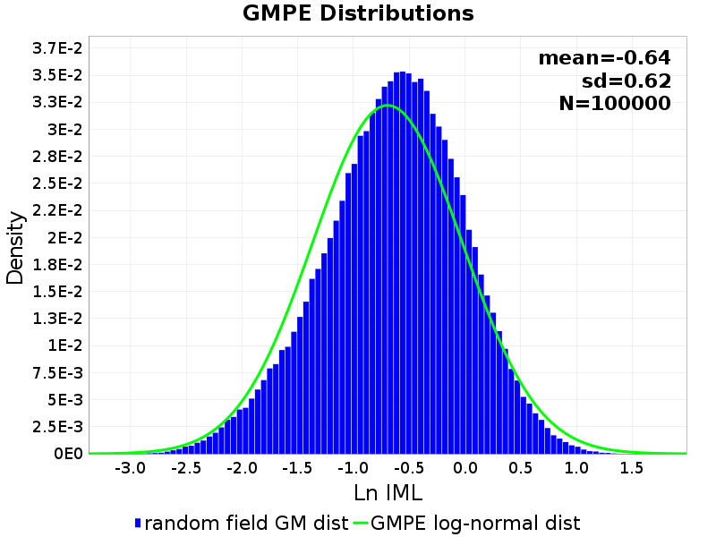 |  |
|-----|-----|
|  |  |
|  | 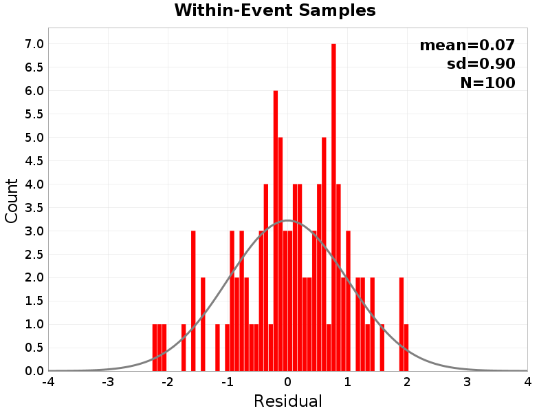 |
| 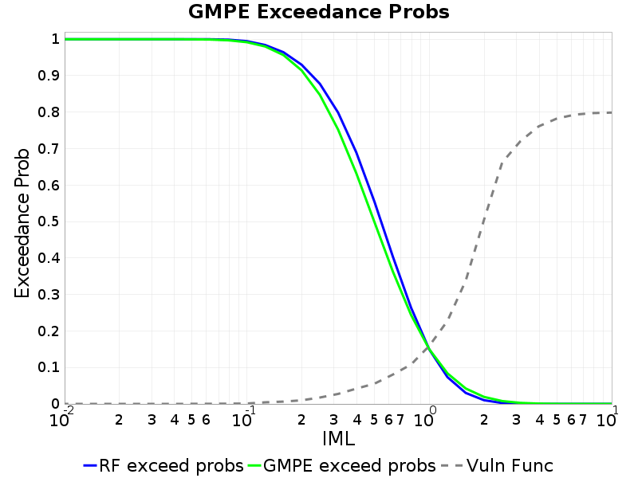 |  |

## Rupture 208188, M8.023331
*[(top)](#table-of-contents)*

### Rupture 208188, Asset0
*[(top)](#table-of-contents)*

Asset parameters:

* value: 28152.0
* J-B distance to rupture: 588.4067333863293
* Vulnerability function: W1-h-RES1-DF
* GMPE ln mean: -3.9149275
* GMPE phi/tau/total std devs: 0.63	0.36	0.7256032

**Loss Values**

| Description | Loss Value |
|-----|-----|
| Mean Loss (GMPE) | 2.619622 |
| Mean Loss (100000 random fields) | 1.0666792 |
| Mean Loss using rand-field exceed probs | 1.5738227 |

| 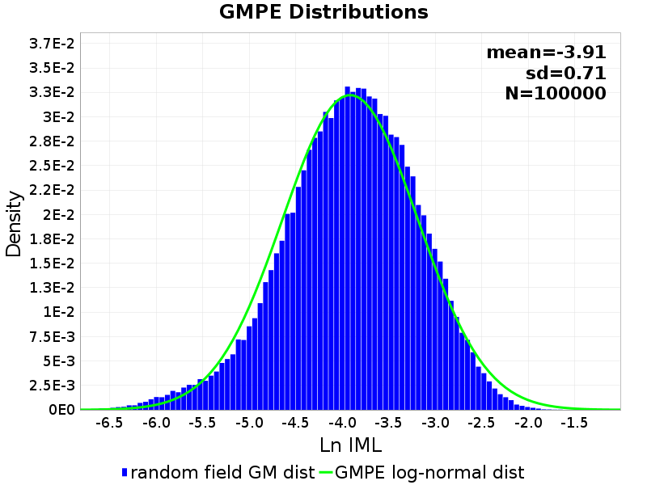 | 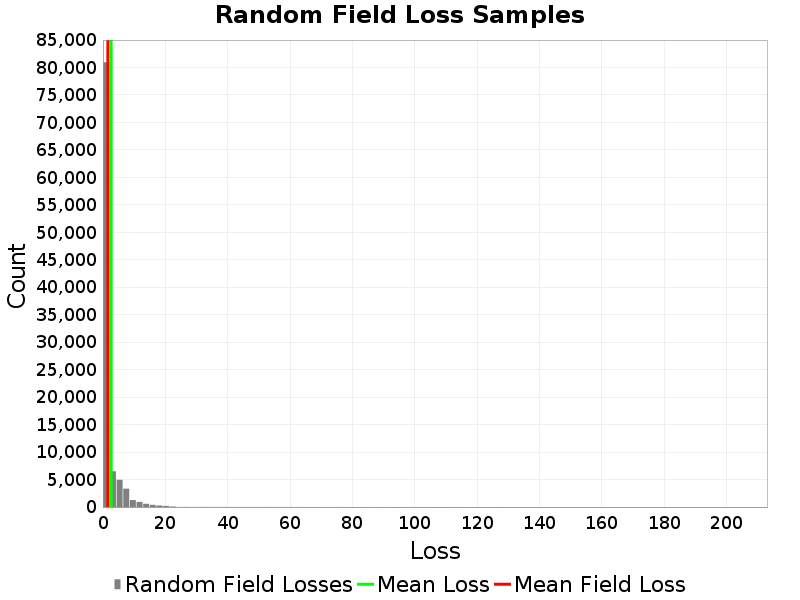 |
|-----|-----|
| 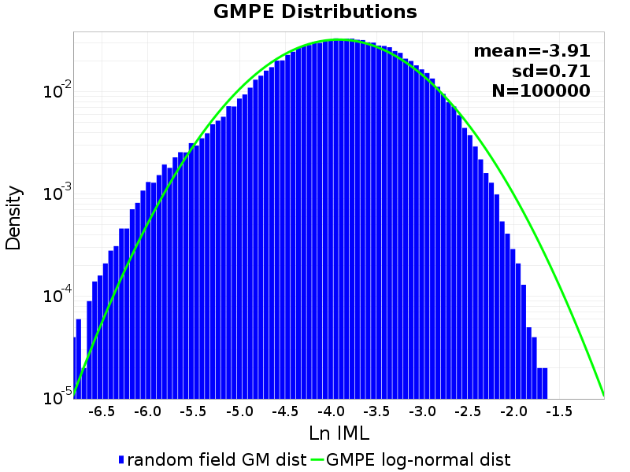 |  |
|  |  |
|  |  |

### Rupture 208188, Asset1
*[(top)](#table-of-contents)*

Asset parameters:

* value: 173.0
* J-B distance to rupture: 18.002001580033287
* Vulnerability function: RM1L-m-RES1-DF
* GMPE ln mean: -0.7712426
* GMPE phi/tau/total std devs: 0.62284297	0.3531213	0.71598047

**Loss Values**

| Description | Loss Value |
|-----|-----|
| Mean Loss (GMPE) | 28.58227 |
| Mean Loss (100000 random fields) | 25.379559 |
| Mean Loss using rand-field exceed probs | 29.729813 |

|  |  |
|-----|-----|
| 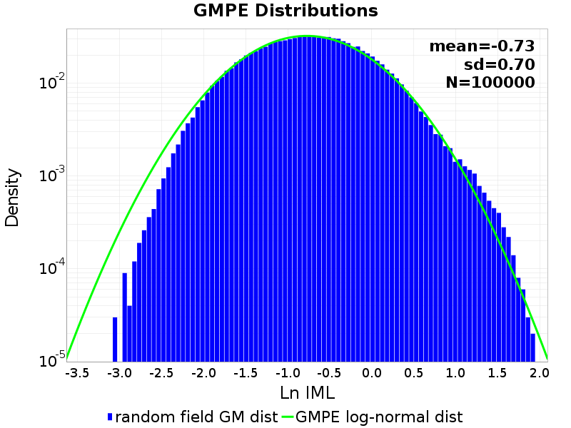 | 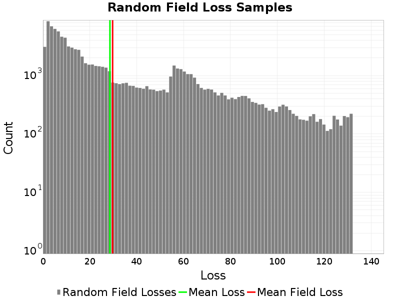 |
|  |  |
| 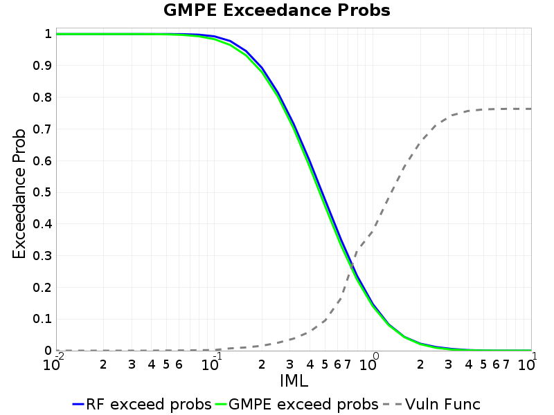 | 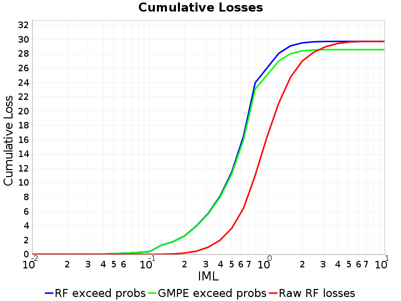 |

### Rupture 208188, Asset2
*[(top)](#table-of-contents)*

Asset parameters:

* value: 127.0
* J-B distance to rupture: 159.32030510236777
* Vulnerability function: RM1L-l-RES1-DF
* GMPE ln mean: -2.2673786
* GMPE phi/tau/total std devs: 0.63	0.36	0.7256032

**Loss Values**

| Description | Loss Value |
|-----|-----|
| Mean Loss (GMPE) | 3.008714 |
| Mean Loss (100000 random fields) | 2.0189385 |
| Mean Loss using rand-field exceed probs | 2.6229517 |

|  |  |
|-----|-----|
|  | 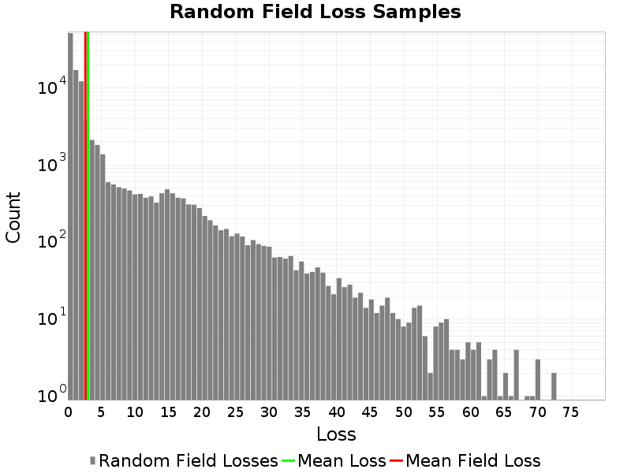 |
|  | 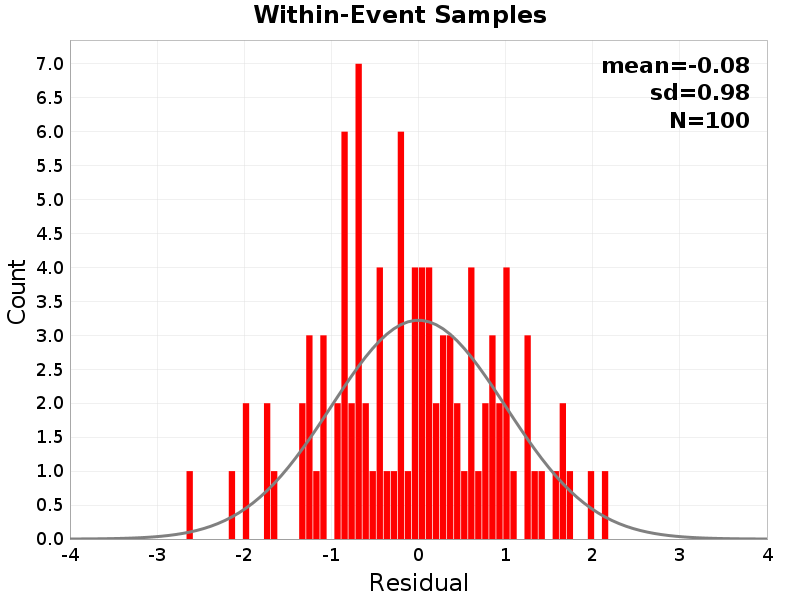 |
|  |  |

### Rupture 208188, Asset3
*[(top)](#table-of-contents)*

Asset parameters:

* value: 8363.0
* J-B distance to rupture: 339.4894788682204
* Vulnerability function: W1-h-RES1-DF
* GMPE ln mean: -2.567874
* GMPE phi/tau/total std devs: 0.62348837	0.35374385	0.71684897

**Loss Values**

| Description | Loss Value |
|-----|-----|
| Mean Loss (GMPE) | 24.741194 |
| Mean Loss (100000 random fields) | 16.8998 |
| Mean Loss using rand-field exceed probs | 22.261518 |

|  |  |
|-----|-----|
|  |  |
|  |  |
|  |  |

### Rupture 208188, Asset4
*[(top)](#table-of-contents)*

Asset parameters:

* value: 26997.0
* J-B distance to rupture: 44.011872161271796
* Vulnerability function: W1-m-RES1-DF
* GMPE ln mean: -1.0012978
* GMPE phi/tau/total std devs: 0.59943056	0.33021143	0.6843658

**Loss Values**

| Description | Loss Value |
|-----|-----|
| Mean Loss (GMPE) | 1600.1274 |
| Mean Loss (100000 random fields) | 1356.0746 |
| Mean Loss using rand-field exceed probs | 1620.0619 |

|  |  |
|-----|-----|
|  | 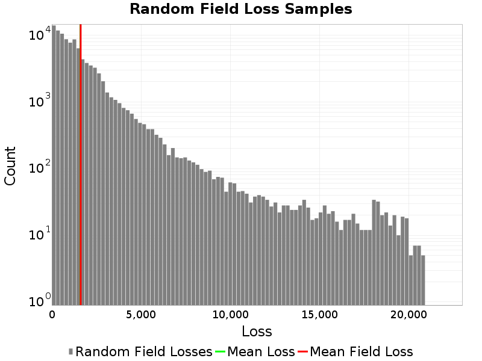 |
|  |  |
|  |  |

## Rupture 68673, M8.155491
*[(top)](#table-of-contents)*

### Rupture 68673, Asset0
*[(top)](#table-of-contents)*

Asset parameters:

* value: 28152.0
* J-B distance to rupture: 104.41240790207684
* Vulnerability function: W1-h-RES1-DF
* GMPE ln mean: -1.8111215
* GMPE phi/tau/total std devs: 0.63	0.36	0.7256032

**Loss Values**

| Description | Loss Value |
|-----|-----|
| Mean Loss (GMPE) | 368.84094 |
| Mean Loss (100000 random fields) | 282.86264 |
| Mean Loss using rand-field exceed probs | 347.85233 |

|  |  |
|-----|-----|
|  |  |
|  |  |
| 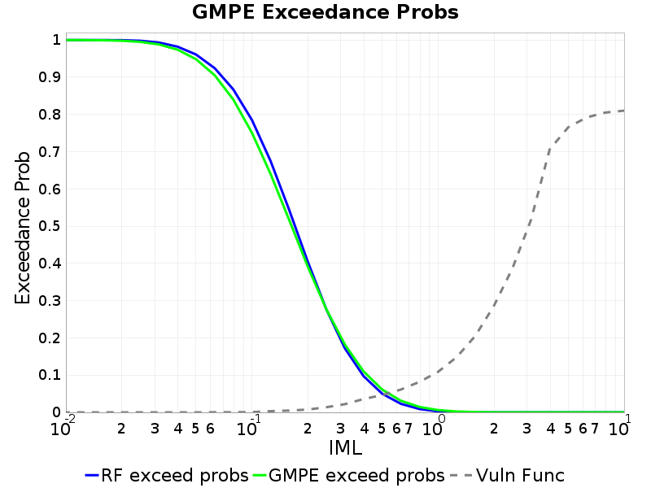 |  |

### Rupture 68673, Asset1
*[(top)](#table-of-contents)*

Asset parameters:

* value: 173.0
* J-B distance to rupture: 91.13746388295239
* Vulnerability function: RM1L-m-RES1-DF
* GMPE ln mean: -1.5158098
* GMPE phi/tau/total std devs: 0.62642473	0.35657054	0.7207985

**Loss Values**

| Description | Loss Value |
|-----|-----|
| Mean Loss (GMPE) | 8.7348995 |
| Mean Loss (100000 random fields) | 5.776178 |
| Mean Loss using rand-field exceed probs | 7.2475667 |

|  | 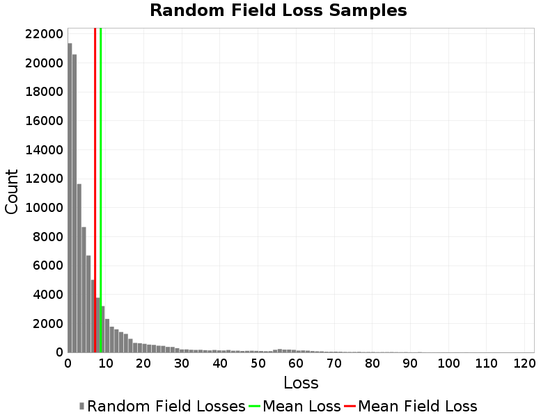 |
|-----|-----|
|  |  |
|  |  |
| 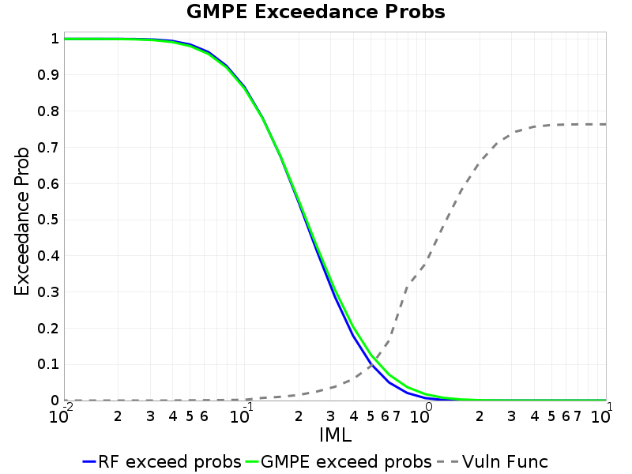 | 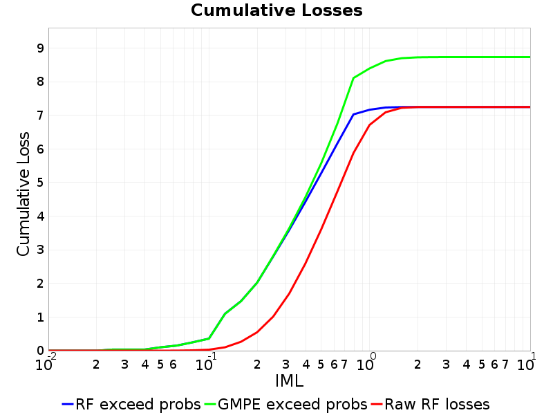 |

### Rupture 68673, Asset2
*[(top)](#table-of-contents)*

Asset parameters:

* value: 127.0
* J-B distance to rupture: 387.0487389473328
* Vulnerability function: RM1L-l-RES1-DF
* GMPE ln mean: -3.0460186
* GMPE phi/tau/total std devs: 0.63	0.36	0.7256032

**Loss Values**

| Description | Loss Value |
|-----|-----|
| Mean Loss (GMPE) | 0.5317186 |
| Mean Loss (100000 random fields) | 0.5671309 |
| Mean Loss using rand-field exceed probs | 0.7478022 |

|  |  |
|-----|-----|
| 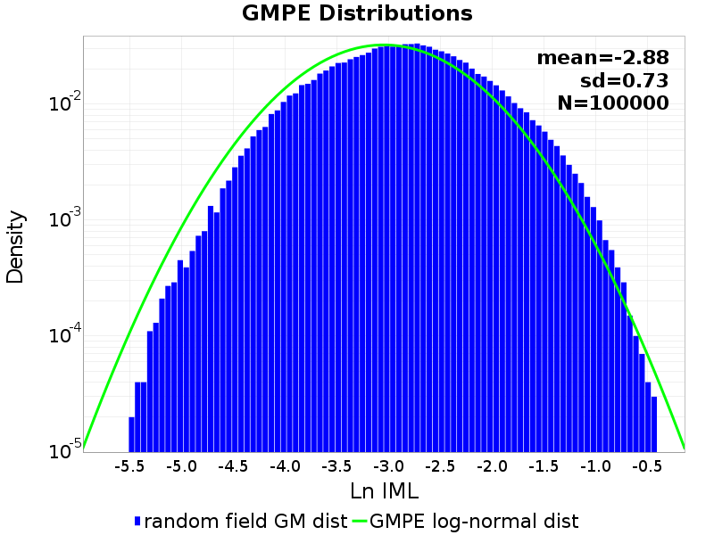 |  |
|  |  |
| 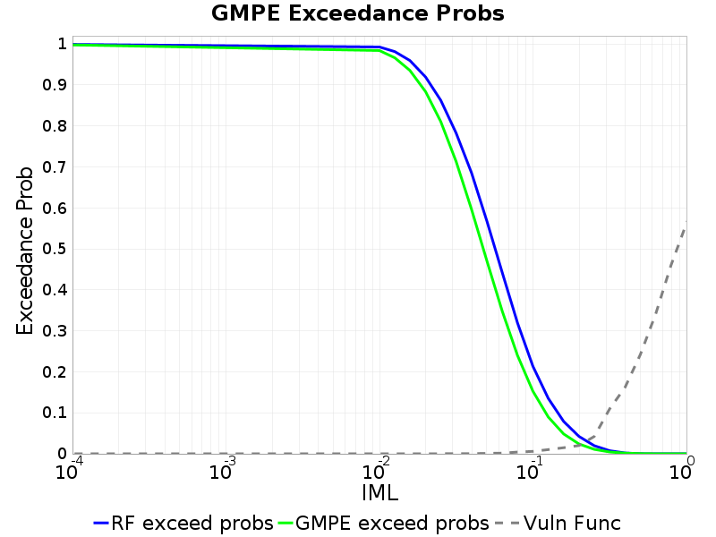 |  |

### Rupture 68673, Asset3
*[(top)](#table-of-contents)*

Asset parameters:

* value: 8363.0
* J-B distance to rupture: 67.7434958702235
* Vulnerability function: W1-h-RES1-DF
* GMPE ln mean: -1.12117
* GMPE phi/tau/total std devs: 0.6027987	0.3335488	0.6889275

**Loss Values**

| Description | Loss Value |
|-----|-----|
| Mean Loss (GMPE) | 307.53253 |
| Mean Loss (100000 random fields) | 278.15805 |
| Mean Loss using rand-field exceed probs | 327.49118 |

|  |  |
|-----|-----|
| 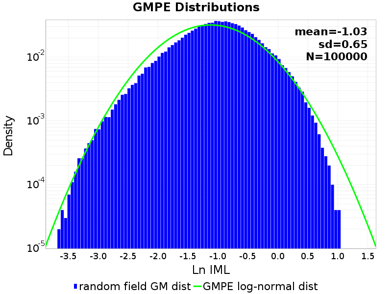 | 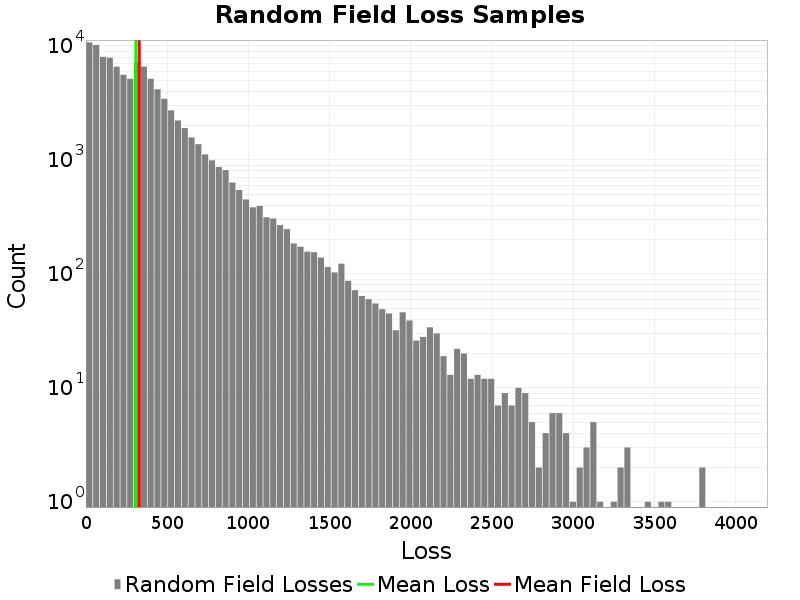 |
|  | 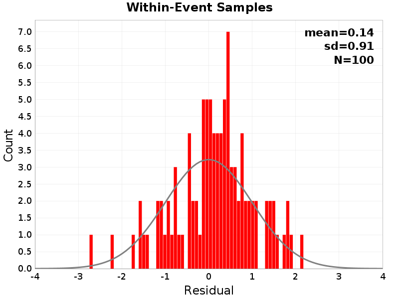 |
| 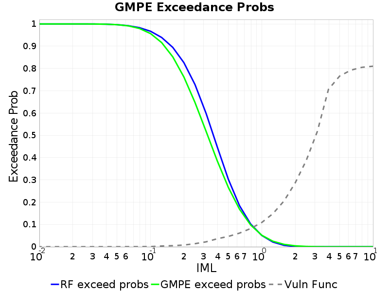 |  |

### Rupture 68673, Asset4
*[(top)](#table-of-contents)*

Asset parameters:

* value: 26997.0
* J-B distance to rupture: 23.249264023399178
* Vulnerability function: W1-m-RES1-DF
* GMPE ln mean: -0.63563156
* GMPE phi/tau/total std devs: 0.58651066	0.31726542	0.66682243

**Loss Values**

| Description | Loss Value |
|-----|-----|
| Mean Loss (GMPE) | 2713.6802 |
| Mean Loss (100000 random fields) | 2311.6165 |
| Mean Loss using rand-field exceed probs | 2740.463 |

|  |  |
|-----|-----|
|  |  |
|  |  |
|  |  |

## Rupture 42699, M7.9970284
*[(top)](#table-of-contents)*

### Rupture 42699, Asset0
*[(top)](#table-of-contents)*

Asset parameters:

* value: 28152.0
* J-B distance to rupture: 498.8670034348614
* Vulnerability function: W1-h-RES1-DF
* GMPE ln mean: -3.6463103
* GMPE phi/tau/total std devs: 0.63	0.36	0.7256032

**Loss Values**

| Description | Loss Value |
|-----|-----|
| Mean Loss (GMPE) | 5.7483997 |
| Mean Loss (100000 random fields) | 3.4930158 |
| Mean Loss using rand-field exceed probs | 5.0182056 |

|  |  |
|-----|-----|
|  |  |
|  |  |
|  |  |

### Rupture 42699, Asset1
*[(top)](#table-of-contents)*

Asset parameters:

* value: 173.0
* J-B distance to rupture: 18.002001580033287
* Vulnerability function: RM1L-m-RES1-DF
* GMPE ln mean: -0.77516687
* GMPE phi/tau/total std devs: 0.62286836	0.35314578	0.7160146

**Loss Values**

| Description | Loss Value |
|-----|-----|
| Mean Loss (GMPE) | 28.430164 |
| Mean Loss (100000 random fields) | 23.632566 |
| Mean Loss using rand-field exceed probs | 27.781096 |

|  |  |
|-----|-----|
|  |  |
|  |  |
|  |  |

### Rupture 42699, Asset2
*[(top)](#table-of-contents)*

Asset parameters:

* value: 127.0
* J-B distance to rupture: 159.32030510236777
* Vulnerability function: RM1L-l-RES1-DF
* GMPE ln mean: -2.2869341
* GMPE phi/tau/total std devs: 0.63	0.36	0.7256032

**Loss Values**

| Description | Loss Value |
|-----|-----|
| Mean Loss (GMPE) | 2.8872013 |
| Mean Loss (100000 random fields) | 1.9385916 |
| Mean Loss using rand-field exceed probs | 2.5266547 |

|  |  |
|-----|-----|
|  |  |
|  |  |
| 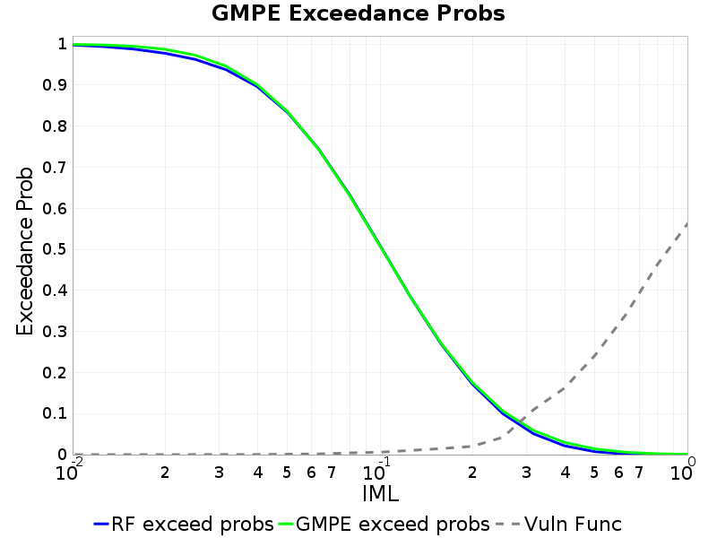 |  |

### Rupture 42699, Asset3
*[(top)](#table-of-contents)*

Asset parameters:

* value: 8363.0
* J-B distance to rupture: 253.60115106692265
* Vulnerability function: W1-h-RES1-DF
* GMPE ln mean: -2.2545636
* GMPE phi/tau/total std devs: 0.6211083	0.35144582	0.71364534

**Loss Values**

| Description | Loss Value |
|-----|-----|
| Mean Loss (GMPE) | 47.11329 |
| Mean Loss (100000 random fields) | 43.96194 |
| Mean Loss using rand-field exceed probs | 55.607235 |

|  |  |
|-----|-----|
|  |  |
|  |  |
|  | 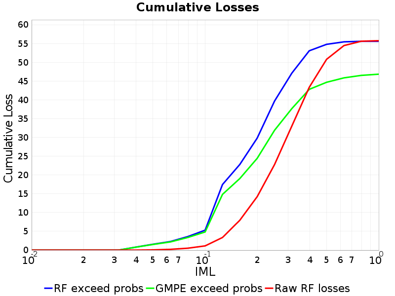 |

### Rupture 42699, Asset4
*[(top)](#table-of-contents)*

Asset parameters:

* value: 26997.0
* J-B distance to rupture: 19.491645292353013
* Vulnerability function: W1-m-RES1-DF
* GMPE ln mean: -0.6359203
* GMPE phi/tau/total std devs: 0.58652264	0.31727752	0.6668387

**Loss Values**

| Description | Loss Value |
|-----|-----|
| Mean Loss (GMPE) | 2712.5828 |
| Mean Loss (100000 random fields) | 2449.6174 |
| Mean Loss using rand-field exceed probs | 2882.177 |

|  | 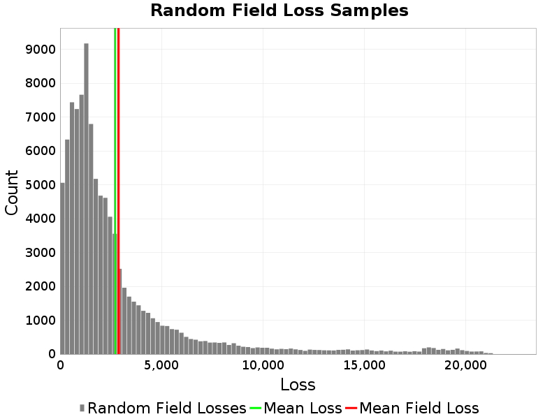 |
|-----|-----|
| 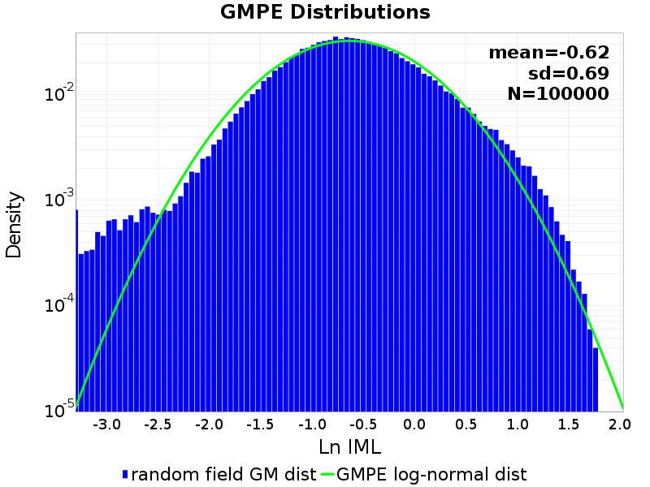 | 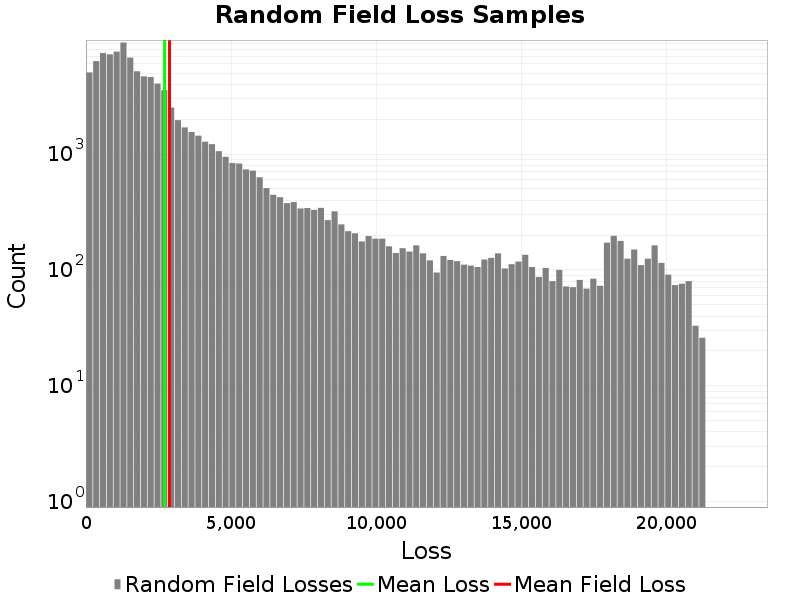 |
|  |  |
|  |  |

