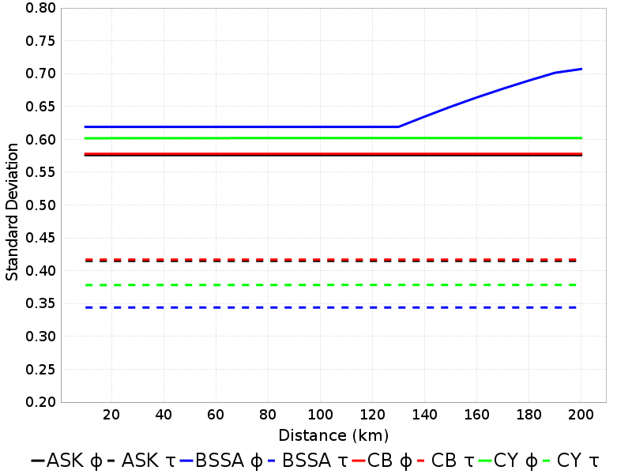
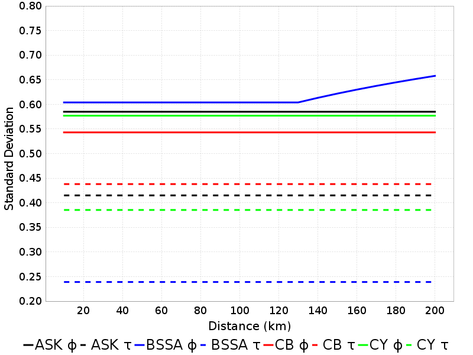
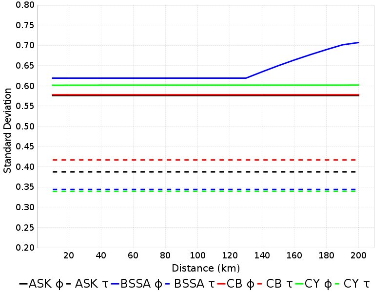
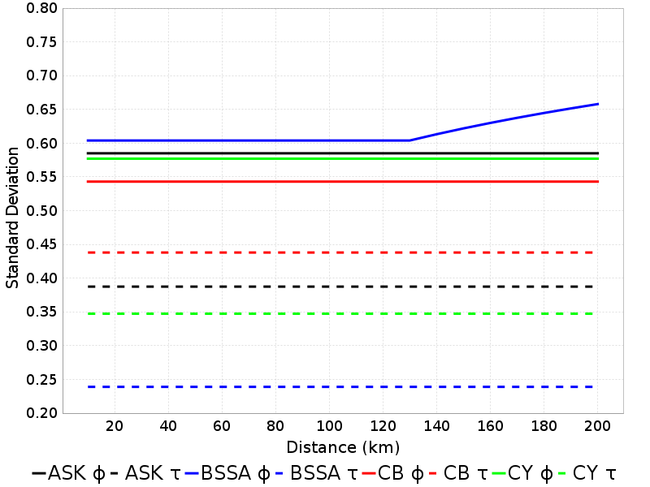
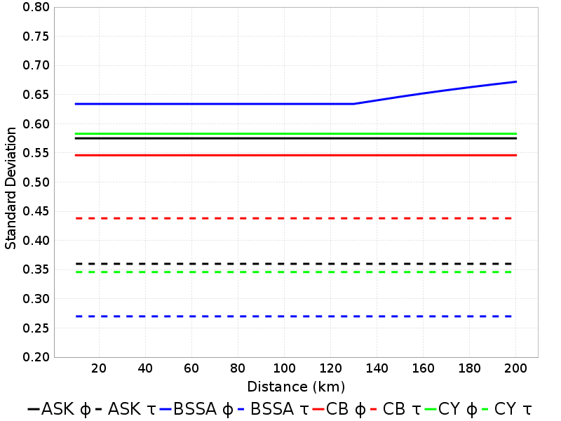
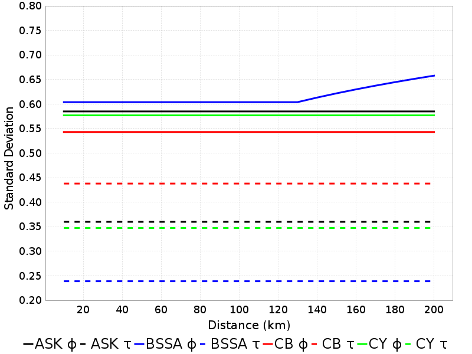
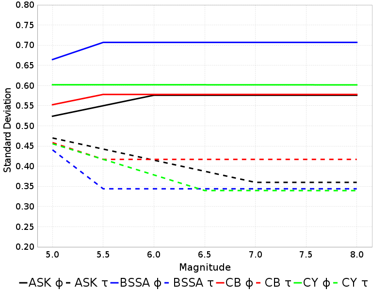
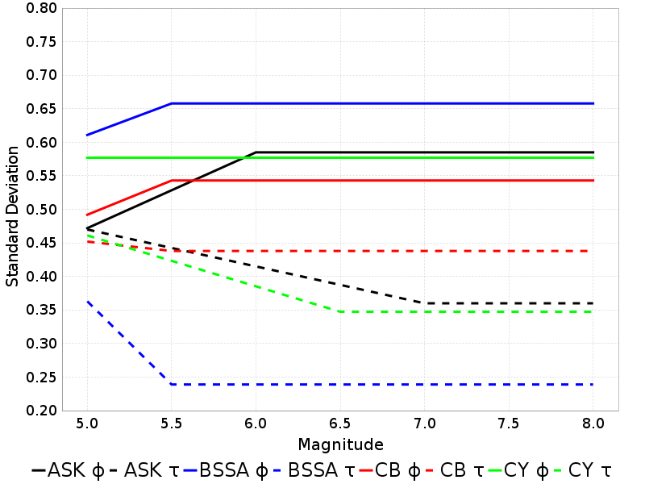
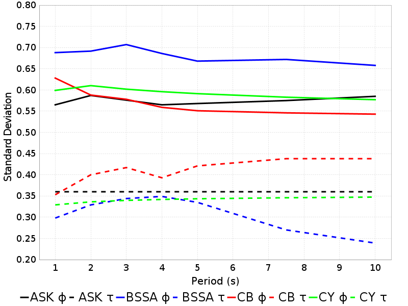

# NGA-West2 Phi/Tau Dependence

## Table Of Contents
* [Constant parameters](#constant-parameters)
* [Summary Table](#summary-table)
* [Distance Dependence](#distance-dependence)
* [Magnitude Dependence](#magnitude-dependence)
* [Period Dependence](#period-dependence)
## Constant parameters
*[(top)](#table-of-contents)*

All calculations hold the following parameters constant:

* Dip: 90
* Fault Type: Strike-Slip
* Vs30: 863
* Vs30 Inferred: false
* Width: 10
* zHyp: 5
* zTop: 0
* rJB = rRup = rX
## Summary Table
*[(top)](#table-of-contents)*

| **Distance (km)** | **Mw** | **Period (s)** | **ASK &phi;** | **ASK &tau;** | **BSSA &phi;** | **BSSA &tau;** | **CB &phi;** | **CB &tau;** | **CY &phi;** | **CY &tau;** |
|-----|-----|-----|-----|-----|-----|-----|-----|-----|-----|-----|
| 20 | 6 | 3 | 0.58 | 0.41 | 0.62 | 0.34 | 0.58 | 0.42 | 0.6 | 0.38 |
| 20 | 6 | 5 | 0.57 | 0.41 | 0.62 | 0.34 | 0.55 | 0.42 | 0.59 | 0.38 |
| 20 | 6 | 7.5 | 0.57 | 0.41 | 0.63 | 0.27 | 0.55 | 0.44 | 0.58 | 0.38 |
| 20 | 6 | 10 | 0.58 | 0.41 | 0.6 | 0.24 | 0.54 | 0.44 | 0.58 | 0.39 |
| 20 | 6.5 | 3 | 0.58 | 0.39 | 0.62 | 0.34 | 0.58 | 0.42 | 0.6 | 0.34 |
| 20 | 6.5 | 5 | 0.57 | 0.39 | 0.62 | 0.34 | 0.55 | 0.42 | 0.59 | 0.34 |
| 20 | 6.5 | 7.5 | 0.57 | 0.39 | 0.63 | 0.27 | 0.55 | 0.44 | 0.58 | 0.35 |
| 20 | 6.5 | 10 | 0.58 | 0.39 | 0.6 | 0.24 | 0.54 | 0.44 | 0.58 | 0.35 |
| 20 | 7 | 3 | 0.58 | 0.36 | 0.62 | 0.34 | 0.58 | 0.42 | 0.6 | 0.34 |
| 20 | 7 | 5 | 0.57 | 0.36 | 0.62 | 0.34 | 0.55 | 0.42 | 0.59 | 0.34 |
| 20 | 7 | 7.5 | 0.57 | 0.36 | 0.63 | 0.27 | 0.55 | 0.44 | 0.58 | 0.35 |
| 20 | 7 | 10 | 0.58 | 0.36 | 0.6 | 0.24 | 0.54 | 0.44 | 0.58 | 0.35 |
| 20 | 7.5 | 3 | 0.58 | 0.36 | 0.62 | 0.34 | 0.58 | 0.42 | 0.6 | 0.34 |
| 20 | 7.5 | 5 | 0.57 | 0.36 | 0.62 | 0.34 | 0.55 | 0.42 | 0.59 | 0.34 |
| 20 | 7.5 | 7.5 | 0.57 | 0.36 | 0.63 | 0.27 | 0.55 | 0.44 | 0.58 | 0.35 |
| 20 | 7.5 | 10 | 0.58 | 0.36 | 0.6 | 0.24 | 0.54 | 0.44 | 0.58 | 0.35 |
| **Distance (km)** | **Mw** | **Period (s)** | **ASK &phi;** | **ASK &tau;** | **BSSA &phi;** | **BSSA &tau;** | **CB &phi;** | **CB &tau;** | **CY &phi;** | **CY &tau;** |
| 50 | 6 | 3 | 0.58 | 0.41 | 0.62 | 0.34 | 0.58 | 0.42 | 0.6 | 0.38 |
| 50 | 6 | 5 | 0.57 | 0.41 | 0.62 | 0.34 | 0.55 | 0.42 | 0.59 | 0.38 |
| 50 | 6 | 7.5 | 0.57 | 0.41 | 0.63 | 0.27 | 0.55 | 0.44 | 0.58 | 0.38 |
| 50 | 6 | 10 | 0.58 | 0.41 | 0.6 | 0.24 | 0.54 | 0.44 | 0.58 | 0.39 |
| 50 | 6.5 | 3 | 0.58 | 0.39 | 0.62 | 0.34 | 0.58 | 0.42 | 0.6 | 0.34 |
| 50 | 6.5 | 5 | 0.57 | 0.39 | 0.62 | 0.34 | 0.55 | 0.42 | 0.59 | 0.34 |
| 50 | 6.5 | 7.5 | 0.57 | 0.39 | 0.63 | 0.27 | 0.55 | 0.44 | 0.58 | 0.35 |
| 50 | 6.5 | 10 | 0.58 | 0.39 | 0.6 | 0.24 | 0.54 | 0.44 | 0.58 | 0.35 |
| 50 | 7 | 3 | 0.58 | 0.36 | 0.62 | 0.34 | 0.58 | 0.42 | 0.6 | 0.34 |
| 50 | 7 | 5 | 0.57 | 0.36 | 0.62 | 0.34 | 0.55 | 0.42 | 0.59 | 0.34 |
| 50 | 7 | 7.5 | 0.57 | 0.36 | 0.63 | 0.27 | 0.55 | 0.44 | 0.58 | 0.35 |
| 50 | 7 | 10 | 0.58 | 0.36 | 0.6 | 0.24 | 0.54 | 0.44 | 0.58 | 0.35 |
| 50 | 7.5 | 3 | 0.58 | 0.36 | 0.62 | 0.34 | 0.58 | 0.42 | 0.6 | 0.34 |
| 50 | 7.5 | 5 | 0.57 | 0.36 | 0.62 | 0.34 | 0.55 | 0.42 | 0.59 | 0.34 |
| 50 | 7.5 | 7.5 | 0.57 | 0.36 | 0.63 | 0.27 | 0.55 | 0.44 | 0.58 | 0.35 |
| 50 | 7.5 | 10 | 0.58 | 0.36 | 0.6 | 0.24 | 0.54 | 0.44 | 0.58 | 0.35 |
| **Distance (km)** | **Mw** | **Period (s)** | **ASK &phi;** | **ASK &tau;** | **BSSA &phi;** | **BSSA &tau;** | **CB &phi;** | **CB &tau;** | **CY &phi;** | **CY &tau;** |
| 100 | 6 | 3 | 0.58 | 0.41 | 0.62 | 0.34 | 0.58 | 0.42 | 0.6 | 0.38 |
| 100 | 6 | 5 | 0.57 | 0.41 | 0.62 | 0.34 | 0.55 | 0.42 | 0.59 | 0.38 |
| 100 | 6 | 7.5 | 0.57 | 0.41 | 0.63 | 0.27 | 0.55 | 0.44 | 0.58 | 0.38 |
| 100 | 6 | 10 | 0.58 | 0.41 | 0.6 | 0.24 | 0.54 | 0.44 | 0.58 | 0.39 |
| 100 | 6.5 | 3 | 0.58 | 0.39 | 0.62 | 0.34 | 0.58 | 0.42 | 0.6 | 0.34 |
| 100 | 6.5 | 5 | 0.57 | 0.39 | 0.62 | 0.34 | 0.55 | 0.42 | 0.59 | 0.34 |
| 100 | 6.5 | 7.5 | 0.57 | 0.39 | 0.63 | 0.27 | 0.55 | 0.44 | 0.58 | 0.35 |
| 100 | 6.5 | 10 | 0.58 | 0.39 | 0.6 | 0.24 | 0.54 | 0.44 | 0.58 | 0.35 |
| 100 | 7 | 3 | 0.58 | 0.36 | 0.62 | 0.34 | 0.58 | 0.42 | 0.6 | 0.34 |
| 100 | 7 | 5 | 0.57 | 0.36 | 0.62 | 0.34 | 0.55 | 0.42 | 0.59 | 0.34 |
| 100 | 7 | 7.5 | 0.57 | 0.36 | 0.63 | 0.27 | 0.55 | 0.44 | 0.58 | 0.35 |
| 100 | 7 | 10 | 0.58 | 0.36 | 0.6 | 0.24 | 0.54 | 0.44 | 0.58 | 0.35 |
| 100 | 7.5 | 3 | 0.58 | 0.36 | 0.62 | 0.34 | 0.58 | 0.42 | 0.6 | 0.34 |
| 100 | 7.5 | 5 | 0.57 | 0.36 | 0.62 | 0.34 | 0.55 | 0.42 | 0.59 | 0.34 |
| 100 | 7.5 | 7.5 | 0.57 | 0.36 | 0.63 | 0.27 | 0.55 | 0.44 | 0.58 | 0.35 |
| 100 | 7.5 | 10 | 0.58 | 0.36 | 0.6 | 0.24 | 0.54 | 0.44 | 0.58 | 0.35 |
| **Distance (km)** | **Mw** | **Period (s)** | **ASK &phi;** | **ASK &tau;** | **BSSA &phi;** | **BSSA &tau;** | **CB &phi;** | **CB &tau;** | **CY &phi;** | **CY &tau;** |
| 200 | 6 | 3 | 0.58 | 0.41 | 0.71 | 0.34 | 0.58 | 0.42 | 0.6 | 0.38 |
| 200 | 6 | 5 | 0.57 | 0.41 | 0.67 | 0.34 | 0.55 | 0.42 | 0.59 | 0.38 |
| 200 | 6 | 7.5 | 0.57 | 0.41 | 0.67 | 0.27 | 0.55 | 0.44 | 0.58 | 0.38 |
| 200 | 6 | 10 | 0.58 | 0.41 | 0.66 | 0.24 | 0.54 | 0.44 | 0.58 | 0.39 |
| 200 | 6.5 | 3 | 0.58 | 0.39 | 0.71 | 0.34 | 0.58 | 0.42 | 0.6 | 0.34 |
| 200 | 6.5 | 5 | 0.57 | 0.39 | 0.67 | 0.34 | 0.55 | 0.42 | 0.59 | 0.34 |
| 200 | 6.5 | 7.5 | 0.57 | 0.39 | 0.67 | 0.27 | 0.55 | 0.44 | 0.58 | 0.35 |
| 200 | 6.5 | 10 | 0.58 | 0.39 | 0.66 | 0.24 | 0.54 | 0.44 | 0.58 | 0.35 |
| 200 | 7 | 3 | 0.58 | 0.36 | 0.71 | 0.34 | 0.58 | 0.42 | 0.6 | 0.34 |
| 200 | 7 | 5 | 0.57 | 0.36 | 0.67 | 0.34 | 0.55 | 0.42 | 0.59 | 0.34 |
| 200 | 7 | 7.5 | 0.57 | 0.36 | 0.67 | 0.27 | 0.55 | 0.44 | 0.58 | 0.35 |
| 200 | 7 | 10 | 0.58 | 0.36 | 0.66 | 0.24 | 0.54 | 0.44 | 0.58 | 0.35 |
| 200 | 7.5 | 3 | 0.58 | 0.36 | 0.71 | 0.34 | 0.58 | 0.42 | 0.6 | 0.34 |
| 200 | 7.5 | 5 | 0.57 | 0.36 | 0.67 | 0.34 | 0.55 | 0.42 | 0.59 | 0.34 |
| 200 | 7.5 | 7.5 | 0.57 | 0.36 | 0.67 | 0.27 | 0.55 | 0.44 | 0.58 | 0.35 |
| 200 | 7.5 | 10 | 0.58 | 0.36 | 0.66 | 0.24 | 0.54 | 0.44 | 0.58 | 0.35 |

## Distance Dependence
*[(top)](#table-of-contents)*

| Mw, Period | 3 s | 5 s | 7.5 s | 10 s |
|-----|-----|-----|-----|-----|
| **6** |  |  |  |  |
| **6.5** |  |  |  |  |
| **7** |  |  |  |  |
| **7.5** |  |  |  |  |

## Magnitude Dependence
*[(top)](#table-of-contents)*

| Distance, Period | 3 s | 5 s | 7.5 s | 10 s |
|-----|-----|-----|-----|-----|
| **20 km** |  |  |  |  |
| **50 km** |  |  |  |  |
| **100 km** |  |  |  |  |
| **200 km** |  |  |  |  |

## Period Dependence
*[(top)](#table-of-contents)*

| Mw, Distance | 20 km | 50 km | 100 km | 200 km |
|-----|-----|-----|-----|-----|
| **6** |  |  |  |  |
| **6.5** |  |  |  |  |
| **7** |  |  |  |  |
| **7.5** |  |  |  |  |

