# Finite Fault Section Reset Results

| **Input # Ruptures** | 60622 |
|-----|-----|
| **Ruptures w/ Finite Surfaces** | 69 |
| **Min Area Fraction**&ast; | 0.5 |
| **Fault Polygon Buffer** | 12 [km] |
| **Remove Polygon Overlap?** | Yes (sorted by mean section distance) |

*&ast; Ruptures are considered to reset a fault section if at least this fraction of the section's area ruptures inside its polygon*

## Table Of Contents
* [M7.5 on 1812/12/08 08:40:39 PST](#m75-on-18121208-084039-pst)
* [M7.1 on 1812/12/21 12:40:39 PST](#m71-on-18121221-124039-pst)
* [M7.4 on 1838/09/10 20:40:39 PST](#m74-on-18380910-204039-pst)
* [M6.5 on 1852/11/29 12:01:39 PST](#m65-on-18521129-120139-pst)
* [M7.9 on 1857/01/09 08:25:39 PST](#m79-on-18570109-082539-pst)
* [M7 on 1868/10/21 07:54:39 PST](#m7-on-18681021-075439-pst)
* [M7.6 on 1872/03/26 02:31:39 PST](#m76-on-18720326-023139-pst)
* [M6.8 on 1872/03/26 06:07:39 PST](#m68-on-18720326-060739-pst)
* [M6.8 on 1872/04/11 11:01:39 PST](#m68-on-18720411-110139-pst)
* [M6.5 on 1885/04/11 20:06:39 PST](#m65-on-18850411-200639-pst)
* [M6.8 on 1890/02/09 04:07:39 PST](#m68-on-18900209-040739-pst)
* [M7.3 on 1892/02/23 23:21:39 PST](#m73-on-18920223-232139-pst)
* [M6.6 on 1892/04/19 02:51:39 PST](#m66-on-18920419-025139-pst)
* [M6.5 on 1892/05/28 03:16:39 PST](#m65-on-18920528-031639-pst)
* [M6.7 on 1899/12/25 04:26:39 PST](#m67-on-18991225-042639-pst)
* [M7.8 on 1906/04/18 05:12:21 PST](#m78-on-19060418-051221-pst)
* [M6.6 on 1915/11/20 16:13:42 PST](#m66-on-19151120-161342-pst)
* [M6.8 on 1918/04/21 15:32:25 PDT](#m68-on-19180421-153225-pdt)
* [M6.8 on 1925/06/29 06:42:16 PST](#m68-on-19250629-064216-pst)
* [M7.1 on 1927/11/04 05:50:53 PST](#m71-on-19271104-055053-pst)
* [M6.4 on 1933/03/10 17:54:09 PST](#m64-on-19330310-175409-pst)
* [M6 on 1934/06/07 20:47:00 PST](#m6-on-19340607-204700-pst)
* [M6.42 on 1934/12/31 10:45:43 PST](#m642-on-19341231-104543-pst)
* [M6 on 1937/03/25 08:49:02 PST](#m6-on-19370325-084902-pst)
* [M6.9 on 1940/05/18 20:36:40 PST](#m69-on-19400518-203640-pst)
* [M6.6 on 1942/10/21 09:22:11 PDT](#m66-on-19421021-092211-pdt)
* [M6.3 on 1946/03/15 05:49:37 PST](#m63-on-19460315-054937-pst)
* [M6.5 on 1947/04/10 07:58:05 PST](#m65-on-19470410-075805-pst)
* [M6 on 1948/12/04 16:43:16 PDT](#m6-on-19481204-164316-pdt)
* [M7.5 on 1952/07/21 04:52:14 PDT](#m75-on-19520721-045214-pdt)
* [M6 on 1952/11/21 23:46:37 PST](#m6-on-19521121-234637-pst)
* [M6.4 on 1954/03/19 01:54:27 PST](#m64-on-19540319-015427-pst)
* [M6.5 on 1954/12/21 11:56:29 PST](#m65-on-19541221-115629-pst)
* [M6.1 on 1959/06/23 07:35:00 PDT](#m61-on-19590623-073500-pdt)
* [M6 on 1966/06/27 21:26:13 PDT](#m6-on-19660627-212613-pdt)
* [M6.6 on 1968/04/08 18:28:58 PST](#m66-on-19680408-182858-pst)
* [M6.6 on 1971/02/09 06:00:41 PST](#m66-on-19710209-060041-pst)
* [M6.51 on 1979/10/15 16:16:53 PDT](#m651-on-19791015-161653-pdt)
* [M6.2 on 1980/05/25 09:33:44 PDT](#m62-on-19800525-093344-pdt)
* [M6 on 1980/05/25 09:49:27 PDT](#m6-on-19800525-094927-pdt)
* [M6.33 on 1980/06/08 20:28:19 PDT](#m633-on-19800608-202819-pdt)
* [M7.3 on 1980/11/08 02:27:33 PST](#m73-on-19801108-022733-pst)
* [M5.9 on 1981/04/26 05:09:28 PDT](#m59-on-19810426-050928-pdt)
* [M6.3 on 1983/05/02 16:42:38 PDT](#m63-on-19830502-164238-pdt)
* [M6.15 on 1984/04/24 13:15:18 PST](#m615-on-19840424-131518-pst)
* [M6.6 on 1984/09/09 20:14:28 PDT](#m66-on-19840909-201428-pdt)
* [M6.08 on 1985/08/04 05:01:55 PDT](#m608-on-19850804-050155-pdt)
* [M6.02 on 1986/07/08 02:20:44 PDT](#m602-on-19860708-022044-pdt)
* [M6.22 on 1986/07/21 07:42:26 PDT](#m622-on-19860721-074226-pdt)
* [M5.98 on 1987/07/31 16:56:57 PDT](#m598-on-19870731-165657-pdt)
* [M5.89 on 1987/10/01 07:42:20 PDT](#m589-on-19871001-074220-pdt)
* [M6.04 on 1987/11/23 17:54:14 PST](#m604-on-19871123-175414-pst)
* [M6.5 on 1987/11/24 05:15:56 PST](#m65-on-19871124-051556-pst)
* [M6.89 on 1989/10/17 17:04:15 PDT](#m689-on-19891017-170415-pdt)
* [M6.12 on 1991/08/17 12:29:40 PDT](#m612-on-19910817-122940-pdt)
* [M6.15 on 1992/04/22 21:50:23 PDT](#m615-on-19920422-215023-pdt)
* [M7.15 on 1992/04/25 11:06:05 PDT](#m715-on-19920425-110605-pdt)
* [M6.45 on 1992/04/26 00:41:40 PDT](#m645-on-19920426-004140-pdt)
* [M6.6 on 1992/04/26 04:18:25 PDT](#m66-on-19920426-041825-pdt)
* [M7.28 on 1992/06/28 04:57:34 PDT](#m728-on-19920628-045734-pdt)
* [M6.49 on 1992/06/28 08:05:30 PDT](#m649-on-19920628-080530-pdt)
* [M6.11 on 1993/05/17 16:20:50 PDT](#m611-on-19930517-162050-pdt)
* [M6.65 on 1994/01/17 04:30:55 PST](#m665-on-19940117-043055-pst)
* [M7.12 on 1999/10/16 02:46:44 PDT](#m712-on-19991016-024644-pdt)
* [M5.86 on 2000/03/16 07:19:56 PST](#m586-on-20000316-071956-pst)
* [M6.55 on 2003/12/22 11:15:56 PST](#m655-on-20031222-111556-pst)
* [M5.97 on 2004/09/28 10:15:24 PDT](#m597-on-20040928-101524-pdt)
* [M6.51 on 2010/01/09 16:27:39 PST](#m651-on-20100109-162739-pst)
* [M7.19 on 2010/04/04 15:40:41 PDT](#m719-on-20100404-154041-pdt)
## M7.5 on 1812/12/08 08:40:39 PST
*[(top)](#table-of-contents)*

| Section Index | Section Name | Match? | Section Area | Rup Area in Raw Poly | Rup Area in No-Overlap Poly | Area Fraction | Sect Distance To Rup | UCERF3 Rupture Section? |
|-----|-----|-----|-----|-----|-----|-----|-----|-----|
| 321 | Cleghorn, Subsection 0 | *NO* | 90.21 [km^2] | 100.51 [km^2] | 0 [km^2] | 0 | mean=3.4 [2.61 4.92] [km] | *NO* |
| 322 | Cleghorn, Subsection 1 | *NO* | 90.21 [km^2] | 87.94 [km^2] | 0 [km^2] | 0 | mean=5.99 [4.25 8.33] [km] | *NO* |
| 323 | Cleghorn, Subsection 2 | *NO* | 90.21 [km^2] | 87.94 [km^2] | 0 [km^2] | 0 | mean=8.35 [7.72 9.81] [km] | *NO* |
| 324 | Cleghorn, Subsection 3 | *NO* | 90.21 [km^2] | 25.13 [km^2] | 0 [km^2] | 0 | mean=11.5 [9.65 13.73] [km] | *NO* |
| 402 | Cucamonga, Subsection 0 | *NO* | 120.69 [km^2] | 25.13 [km^2] | 0 [km^2] | 0 | mean=5.42 [0.31 11.79] [km] | *NO* |
| 622 | Garlock (West), Subsection 0 | *NO* | 99.46 [km^2] | 6.96 [km^2] | 0 [km^2] | 0 | mean=8.01 [6.59 10.43] [km] | *NO* |
| 623 | Garlock (West), Subsection 1 | *NO* | 99.46 [km^2] | 97.45 [km^2] | 0 [km^2] | 0 | mean=8.01 [6.59 10.26] [km] | *NO* |
| 1833 | San Andreas (Mojave N), Subsection 1 | **YES** | 111.38 [km^2] | 104.41 [km^2] | 104.41 [km^2] | 0.94 | mean=0.38 [0 0.64] [km] | **YES** |
| 1834 | San Andreas (Mojave N), Subsection 2 | **YES** | 111.38 [km^2] | 111.38 [km^2] | 111.38 [km^2] | 1 | mean=0.38 [0 0.64] [km] | **YES** |
| 1835 | San Andreas (Mojave N), Subsection 3 | **YES** | 111.38 [km^2] | 111.38 [km^2] | 111.38 [km^2] | 1 | mean=0.38 [0 0.64] [km] | **YES** |
| 1836 | San Andreas (Mojave N), Subsection 4 | **YES** | 111.38 [km^2] | 124.43 [km^2] | 111.38 [km^2] | 1 | mean=0.38 [0 0.64] [km] | **YES** |
| 1837 | San Andreas (Mojave S), Subsection 0 | **YES** | 85.33 [km^2] | 92.29 [km^2] | 92.29 [km^2] | 1.08 | mean=0.37 [0 0.63] [km] | **YES** |
| 1838 | San Andreas (Mojave S), Subsection 1 | **YES** | 85.33 [km^2] | 79.24 [km^2] | 79.24 [km^2] | 0.93 | mean=0.37 [0 0.63] [km] | **YES** |
| 1839 | San Andreas (Mojave S), Subsection 2 | **YES** | 85.33 [km^2] | 85.33 [km^2] | 85.33 [km^2] | 1 | mean=0.37 [0 0.63] [km] | **YES** |
| 1840 | San Andreas (Mojave S), Subsection 3 | **YES** | 85.33 [km^2] | 85.33 [km^2] | 85.33 [km^2] | 1 | mean=0.37 [0 0.63] [km] | **YES** |
| 1841 | San Andreas (Mojave S), Subsection 4 | **YES** | 85.33 [km^2] | 85.33 [km^2] | 85.33 [km^2] | 1 | mean=0.37 [0 0.63] [km] | **YES** |
| 1842 | San Andreas (Mojave S), Subsection 5 | **YES** | 85.33 [km^2] | 85.33 [km^2] | 85.33 [km^2] | 1 | mean=0.37 [0 0.63] [km] | **YES** |
| 1843 | San Andreas (Mojave S), Subsection 6 | **YES** | 85.33 [km^2] | 85.33 [km^2] | 85.33 [km^2] | 1 | mean=0.37 [0 0.63] [km] | **YES** |
| 1844 | San Andreas (Mojave S), Subsection 7 | **YES** | 85.33 [km^2] | 85.33 [km^2] | 85.33 [km^2] | 1 | mean=0.37 [0 0.63] [km] | **YES** |
| 1845 | San Andreas (Mojave S), Subsection 8 | **YES** | 85.33 [km^2] | 85.33 [km^2] | 85.33 [km^2] | 1 | mean=0.37 [0 0.63] [km] | **YES** |
| 1846 | San Andreas (Mojave S), Subsection 9 | **YES** | 85.33 [km^2] | 85.33 [km^2] | 85.33 [km^2] | 1 | mean=0.37 [0 0.63] [km] | **YES** |
| 1847 | San Andreas (Mojave S), Subsection 10 | **YES** | 85.33 [km^2] | 85.33 [km^2] | 85.33 [km^2] | 1 | mean=0.37 [0 0.63] [km] | **YES** |
| 1848 | San Andreas (Mojave S), Subsection 11 | **YES** | 85.33 [km^2] | 85.33 [km^2] | 85.33 [km^2] | 1 | mean=0.37 [0 0.63] [km] | **YES** |
| 1849 | San Andreas (Mojave S), Subsection 12 | **YES** | 85.33 [km^2] | 85.33 [km^2] | 85.33 [km^2] | 1 | mean=0.37 [0 0.63] [km] | **YES** |
| 1850 | San Andreas (Mojave S), Subsection 13 | **YES** | 85.33 [km^2] | 85.33 [km^2] | 85.33 [km^2] | 1 | mean=0.37 [0 0.63] [km] | **YES** |
| 1851 | San Andreas (Mojave S), Subsection 14 | **YES** | 85.33 [km^2] | 97.71 [km^2] | 97.71 [km^2] | 1.15 | mean=0.36 [0 0.57] [km] | **YES** |
| 1852 | San Andreas (North Branch Mill Creek), Subsection 0 | *NO* | 163.57 [km^2] | 69.1 [km^2] | 0 [km^2] | 0 | mean=3.17 [0.24 8.07] [km] | *NO* |
| 1944 | San Andreas (San Bernardino N), Subsection 0 | **YES** | 75.38 [km^2] | 62.82 [km^2] | 62.82 [km^2] | 0.83 | mean=0.12 [0 0.23] [km] | **YES** |
| 1945 | San Andreas (San Bernardino N), Subsection 1 | **YES** | 75.38 [km^2] | 75.38 [km^2] | 75.38 [km^2] | 1 | mean=0.12 [0 0.23] [km] | **YES** |
| 1946 | San Andreas (San Bernardino N), Subsection 2 | **YES** | 75.38 [km^2] | 75.38 [km^2] | 75.38 [km^2] | 1 | mean=0.12 [0 0.23] [km] | **YES** |
| 1947 | San Andreas (San Bernardino N), Subsection 3 | **YES** | 75.38 [km^2] | 75.38 [km^2] | 75.38 [km^2] | 1 | mean=0.12 [0 0.23] [km] | **YES** |
| 1948 | San Andreas (San Bernardino N), Subsection 4 | **YES** | 75.38 [km^2] | 75.38 [km^2] | 75.38 [km^2] | 1 | mean=0.12 [0 0.23] [km] | **YES** |
| 1949 | San Andreas (San Bernardino N), Subsection 5 | **YES** | 75.38 [km^2] | 81.66 [km^2] | 81.66 [km^2] | 1.08 | mean=0.12 [0 0.23] [km] | **YES** |
| 2177 | San Jacinto (Lytle Creek connector), Subsection 0 | *NO* | 111.39 [km^2] | 87.94 [km^2] | 0 [km^2] | 0 | mean=6.11 [4.62 7.79] [km] | *NO* |
| 2178 | San Jacinto (Lytle Creek connector), Subsection 1 | *NO* | 111.39 [km^2] | 100.51 [km^2] | 0 [km^2] | 0 | mean=7.9 [7.18 8.82] [km] | *NO* |
| 2179 | San Jacinto (Lytle Creek connector), Subsection 2 | *NO* | 111.39 [km^2] | 100.51 [km^2] | 0 [km^2] | 0 | mean=8.85 [8.32 9.74] [km] | *NO* |
| 2180 | San Jacinto (San Bernardino), Subsection 0 | *NO* | 115.53 [km^2] | 100.51 [km^2] | 0 [km^2] | 0 | mean=3.58 [3 5.14] [km] | *NO* |
| 2181 | San Jacinto (San Bernardino), Subsection 1 | *NO* | 113.44 [km^2] | 100.51 [km^2] | 0 [km^2] | 0 | mean=3.94 [3.57 5.45] [km] | *NO* |
| 2182 | San Jacinto (San Bernardino), Subsection 2 | *NO* | 107.19 [km^2] | 100.51 [km^2] | 0 [km^2] | 0 | mean=6.43 [4.74 8.45] [km] | *NO* |
| 2183 | San Jacinto (San Bernardino), Subsection 3 | *NO* | 112.82 [km^2] | 56.54 [km^2] | 0 [km^2] | 0 | mean=9.65 [8.16 11.32] [km] | *NO* |

## M7.1 on 1812/12/21 12:40:39 PST
*[(top)](#table-of-contents)*

| Section Index | Section Name | Match? | Section Area | Rup Area in Raw Poly | Rup Area in No-Overlap Poly | Area Fraction | Sect Distance To Rup | UCERF3 Rupture Section? |
|-----|-----|-----|-----|-----|-----|-----|-----|-----|
| 301 | Channel Islands Thrust, Subsection 2 | *NO* | 189.6 [km^2] | 9.34 [km^2] | 9.34 [km^2] | 0.05 | mean=7.95 [5.12 13.37] [km] | *NO* |
| 302 | Channel Islands Thrust, Subsection 3 | *NO* | 189.6 [km^2] | 105.98 [km^2] | 46.47 [km^2] | 0.25 | mean=7.68 [5.66 11.57] [km] | *NO* |
| 303 | Channel Islands Thrust, Subsection 4 | *NO* | 189.6 [km^2] | 70.82 [km^2] | 0 [km^2] | 0 | mean=9.52 [7.86 13.11] [km] | *NO* |
| 304 | Channel Islands Thrust, Subsection 5 | *NO* | 189.6 [km^2] | 56.55 [km^2] | 0 [km^2] | 0 | mean=9.71 [7.9 13.41] [km] | *NO* |
| 305 | Channel Islands Western Deep Ramp, Subsection 0 | **YES** | 200.25 [km^2] | 213.43 [km^2] | 213.43 [km^2] | 1.07 | mean=4.5 [0.37 10.74] [km] | *NO* |
| 306 | Channel Islands Western Deep Ramp, Subsection 1 | **YES** | 200.25 [km^2] | 217.37 [km^2] | 217.37 [km^2] | 1.09 | mean=4.76 [0.29 11.68] [km] | *NO* |
| 307 | Channel Islands Western Deep Ramp, Subsection 2 | **YES** | 200.25 [km^2] | 172.12 [km^2] | 172.12 [km^2] | 0.86 | mean=6.09 [0.34 13.42] [km] | *NO* |
| 308 | Channel Islands Western Deep Ramp, Subsection 3 | **YES** | 200.25 [km^2] | 154.91 [km^2] | 154.91 [km^2] | 0.77 | mean=6.78 [0.35 13.77] [km] | *NO* |
| 309 | Channel Islands Western Deep Ramp, Subsection 4 | *NO* | 200.25 [km^2] | 56.31 [km^2] | 0.98 [km^2] | 0 | mean=8.07 [0.26 15.59] [km] | *NO* |
| 1593 | Pitas Point (Lower West), Subsection 0 | *NO* | 338.41 [km^2] | 52.62 [km^2] | 34.42 [km^2] | 0.1 | mean=15.46 [7.31 28.15] [km] | *NO* |
| 1594 | Pitas Point (Lower West), Subsection 1 | *NO* | 338.41 [km^2] | 32.95 [km^2] | 32.95 [km^2] | 0.1 | mean=16.75 [8.41 29.04] [km] | *NO* |
| 1595 | Pitas Point (Lower West), Subsection 2 | *NO* | 338.41 [km^2] | 75.73 [km^2] | 75.73 [km^2] | 0.22 | mean=13.41 [5.37 27.6] [km] | *NO* |
| 1596 | Pitas Point (Lower)-Montalvo, Subsection 0 | *NO* | 607.58 [km^2] | 98.6 [km^2] | 91.23 [km^2] | 0.15 | mean=15.37 [5.36 33.62] [km] | *NO* |
| 1597 | Pitas Point (Lower)-Montalvo, Subsection 1 | *NO* | 607.58 [km^2] | 227.7 [km^2] | 162.78 [km^2] | 0.27 | mean=13.13 [4.97 28.57] [km] | *NO* |
| 2272 | Santa Cruz Island, Subsection 0 | *NO* | 75.25 [km^2] | 53.11 [km^2] | 6.88 [km^2] | 0.09 | mean=8.48 [3.48 13.93] [km] | *NO* |
| 2273 | Santa Cruz Island, Subsection 1 | *NO* | 75.25 [km^2] | 44.26 [km^2] | 0 [km^2] | 0 | mean=9.26 [4.72 14.49] [km] | *NO* |
| 2274 | Santa Cruz Island, Subsection 2 | *NO* | 75.25 [km^2] | 38.36 [km^2] | 0 [km^2] | 0 | mean=9.64 [5.86 14.52] [km] | *NO* |
| 2275 | Santa Cruz Island, Subsection 3 | *NO* | 75.25 [km^2] | 41.8 [km^2] | 0 [km^2] | 0 | mean=9.73 [5.94 14.63] [km] | *NO* |
| 2276 | Santa Cruz Island, Subsection 4 | *NO* | 75.25 [km^2] | 41.31 [km^2] | 0 [km^2] | 0 | mean=9.9 [6.2 14.7] [km] | *NO* |
| 2277 | Santa Cruz Island, Subsection 5 | *NO* | 75.25 [km^2] | 35.16 [km^2] | 0 [km^2] | 0 | mean=9.96 [6.3 14.74] [km] | *NO* |
| 2287 | Santa Rosa Island, Subsection 0 | *NO* | 32.2 [km^2] | 8.85 [km^2] | 0 [km^2] | 0 | mean=11.08 [8.49 14.06] [km] | *NO* |
| 2288 | Santa Rosa Island, Subsection 1 | *NO* | 32.2 [km^2] | 0.49 [km^2] | 0 [km^2] | 0 | mean=13.19 [11.01 15.59] [km] | *NO* |
| 2524 | Ventura-Pitas Point, Subsection 7 | *NO* | 104.17 [km^2] | 0.49 [km^2] | 0.49 [km^2] | 0 | mean=9.51 [7.79 11.85] [km] | *NO* |

## M7.4 on 1838/09/10 20:40:39 PST
*[(top)](#table-of-contents)*

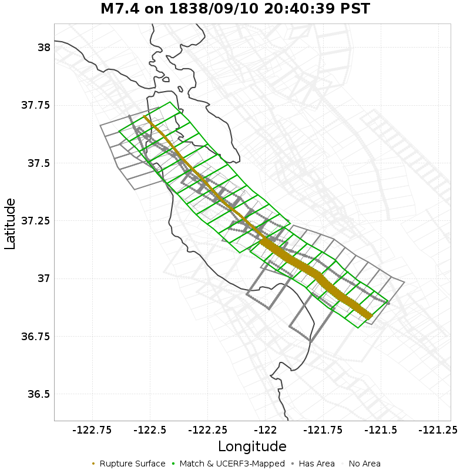

| Section Index | Section Name | Match? | Section Area | Rup Area in Raw Poly | Rup Area in No-Overlap Poly | Area Fraction | Sect Distance To Rup | UCERF3 Rupture Section? |
|-----|-----|-----|-----|-----|-----|-----|-----|-----|
| 178 | Butano 2011 CFM, Subsection 0 | *NO* | 66.39 [km^2] | 91.94 [km^2] | 0 [km^2] | 0 | mean=2.46 [0.29 5.97] [km] | *NO* |
| 179 | Butano 2011 CFM, Subsection 1 | *NO* | 66.39 [km^2] | 91.2 [km^2] | 4.74 [km^2] | 0.07 | mean=1.2 [0.21 3.23] [km] | *NO* |
| 180 | Butano 2011 CFM, Subsection 2 | *NO* | 66.39 [km^2] | 80.99 [km^2] | 0 [km^2] | 0 | mean=1.52 [0.35 4.05] [km] | *NO* |
| 181 | Butano 2011 CFM, Subsection 3 | *NO* | 66.39 [km^2] | 23.14 [km^2] | 0 [km^2] | 0 | mean=3.94 [0.64 7.42] [km] | *NO* |
| 1331 | Monte Vista - Shannon 2011 CFM, Subsection 0 | *NO* | 109.64 [km^2] | 104.13 [km^2] | 0 [km^2] | 0 | mean=3 [0.2 7.45] [km] | *NO* |
| 1332 | Monte Vista - Shannon 2011 CFM, Subsection 1 | *NO* | 109.64 [km^2] | 104.13 [km^2] | 0 [km^2] | 0 | mean=2.01 [0.27 5.36] [km] | *NO* |
| 1333 | Monte Vista - Shannon 2011 CFM, Subsection 2 | *NO* | 109.64 [km^2] | 104.13 [km^2] | 0 [km^2] | 0 | mean=2.34 [0.06 6] [km] | *NO* |
| 1334 | Monte Vista - Shannon 2011 CFM, Subsection 3 | *NO* | 109.64 [km^2] | 92.56 [km^2] | 0 [km^2] | 0 | mean=2.43 [0.22 5.94] [km] | *NO* |
| 1335 | Monte Vista - Shannon 2011 CFM, Subsection 4 | *NO* | 109.64 [km^2] | 92.56 [km^2] | 0 [km^2] | 0 | mean=2.73 [0.2 6.64] [km] | *NO* |
| 1336 | Monte Vista - Shannon 2011 CFM, Subsection 5 | *NO* | 109.64 [km^2] | 23.14 [km^2] | 0 [km^2] | 0 | mean=4.27 [0.53 8.56] [km] | *NO* |
| 1551 | Pilarcitos 2011 CFM, Subsection 0 | *NO* | 40.06 [km^2] | 57.85 [km^2] | 0 [km^2] | 0 | mean=0.61 [0.13 1.46] [km] | *NO* |
| 1552 | Pilarcitos 2011 CFM, Subsection 1 | *NO* | 40.06 [km^2] | 57.85 [km^2] | 0 [km^2] | 0 | mean=0.54 [0.14 1.23] [km] | *NO* |
| 1553 | Pilarcitos 2011 CFM, Subsection 2 | *NO* | 40.06 [km^2] | 69.42 [km^2] | 0 [km^2] | 0 | mean=0.86 [0.15 1.95] [km] | *NO* |
| 1554 | Pilarcitos 2011 CFM, Subsection 3 | *NO* | 40.06 [km^2] | 57.85 [km^2] | 0 [km^2] | 0 | mean=1.68 [0.49 2.84] [km] | *NO* |
| 1555 | Pilarcitos 2011 CFM, Subsection 4 | *NO* | 40.06 [km^2] | 57.85 [km^2] | 0 [km^2] | 0 | mean=2.4 [1.36 3.31] [km] | *NO* |
| 1556 | Pilarcitos 2011 CFM, Subsection 5 | *NO* | 40.06 [km^2] | 57.85 [km^2] | 0 [km^2] | 0 | mean=2.08 [0.95 3.19] [km] | *NO* |
| 1557 | Pilarcitos 2011 CFM, Subsection 6 | *NO* | 40.06 [km^2] | 57.85 [km^2] | 0 [km^2] | 0 | mean=1.58 [0.74 2.49] [km] | *NO* |
| 1558 | Pilarcitos 2011 CFM, Subsection 7 | *NO* | 40.06 [km^2] | 57.85 [km^2] | 0 [km^2] | 0 | mean=2.48 [1.04 3.97] [km] | *NO* |
| 1559 | Pilarcitos 2011 CFM, Subsection 8 | *NO* | 40.06 [km^2] | 69.42 [km^2] | 0 [km^2] | 0 | mean=3.96 [2.47 5.45] [km] | *NO* |
| 1560 | Pilarcitos 2011 CFM, Subsection 9 | *NO* | 40.06 [km^2] | 57.85 [km^2] | 0 [km^2] | 0 | mean=5.06 [3.95 5.98] [km] | *NO* |
| 1561 | Pilarcitos 2011 CFM, Subsection 10 | *NO* | 40.06 [km^2] | 57.85 [km^2] | 0 [km^2] | 0 | mean=5.39 [4.55 6.23] [km] | *NO* |
| 1928 | San Andreas (Peninsula) 2011 CFM, Subsection 0 | **YES** | 80.99 [km^2] | 87.01 [km^2] | 87.01 [km^2] | 1.07 | mean=0.24 [0 0.44] [km] | **YES** |
| 1929 | San Andreas (Peninsula) 2011 CFM, Subsection 1 | **YES** | 80.99 [km^2] | 75.2 [km^2] | 75.2 [km^2] | 0.93 | mean=0.24 [0 0.44] [km] | **YES** |
| 1930 | San Andreas (Peninsula) 2011 CFM, Subsection 2 | **YES** | 80.99 [km^2] | 86.77 [km^2] | 86.77 [km^2] | 1.07 | mean=0.24 [0 0.44] [km] | **YES** |
| 1931 | San Andreas (Peninsula) 2011 CFM, Subsection 3 | **YES** | 80.99 [km^2] | 75.2 [km^2] | 75.2 [km^2] | 0.93 | mean=0.24 [0 0.44] [km] | **YES** |
| 1932 | San Andreas (Peninsula) 2011 CFM, Subsection 4 | **YES** | 80.99 [km^2] | 86.77 [km^2] | 86.77 [km^2] | 1.07 | mean=0.24 [0 0.44] [km] | **YES** |
| 1933 | San Andreas (Peninsula) 2011 CFM, Subsection 5 | **YES** | 80.99 [km^2] | 80.99 [km^2] | 80.99 [km^2] | 1 | mean=0.24 [0 0.44] [km] | **YES** |
| 1934 | San Andreas (Peninsula) 2011 CFM, Subsection 6 | **YES** | 80.99 [km^2] | 80.99 [km^2] | 80.99 [km^2] | 1 | mean=0.24 [0 0.44] [km] | **YES** |
| 1935 | San Andreas (Peninsula) 2011 CFM, Subsection 7 | **YES** | 80.99 [km^2] | 80.99 [km^2] | 80.99 [km^2] | 1 | mean=0.24 [0 0.44] [km] | **YES** |
| 1936 | San Andreas (Peninsula) 2011 CFM, Subsection 8 | **YES** | 80.99 [km^2] | 75.2 [km^2] | 75.2 [km^2] | 0.93 | mean=0.24 [0 0.44] [km] | **YES** |
| 1937 | San Andreas (Peninsula) 2011 CFM, Subsection 9 | **YES** | 80.99 [km^2] | 86.77 [km^2] | 86.77 [km^2] | 1.07 | mean=0.24 [0 0.44] [km] | **YES** |
| 1938 | San Andreas (Peninsula) 2011 CFM, Subsection 10 | **YES** | 80.99 [km^2] | 80.99 [km^2] | 80.99 [km^2] | 1 | mean=0.24 [0 0.44] [km] | **YES** |
| 1939 | San Andreas (Peninsula) 2011 CFM, Subsection 11 | **YES** | 80.99 [km^2] | 75.2 [km^2] | 75.2 [km^2] | 0.93 | mean=0.24 [0 0.44] [km] | **YES** |
| 1965 | San Andreas (Santa Cruz Mts) 2011 CFM, Subsection 0 | **YES** | 106.15 [km^2] | 114.31 [km^2] | 107.81 [km^2] | 1.02 | mean=0.27 [0 0.46] [km] | **YES** |
| 1966 | San Andreas (Santa Cruz Mts) 2011 CFM, Subsection 1 | **YES** | 106.15 [km^2] | 106.63 [km^2] | 106.15 [km^2] | 1 | mean=0.27 [0 0.46] [km] | **YES** |
| 1967 | San Andreas (Santa Cruz Mts) 2011 CFM, Subsection 2 | **YES** | 106.15 [km^2] | 106.63 [km^2] | 106.15 [km^2] | 1 | mean=0.27 [0 0.46] [km] | **YES** |
| 1968 | San Andreas (Santa Cruz Mts) 2011 CFM, Subsection 3 | **YES** | 106.15 [km^2] | 106.78 [km^2] | 106.54 [km^2] | 1 | mean=0.27 [0 0.46] [km] | **YES** |
| 1969 | San Andreas (Santa Cruz Mts) 2011 CFM, Subsection 4 | **YES** | 104.94 [km^2] | 105.27 [km^2] | 105.27 [km^2] | 1 | mean=0.24 [0 0.45] [km] | **YES** |
| 1970 | San Andreas (Santa Cruz Mts) 2011 CFM, Subsection 5 | **YES** | 102.97 [km^2] | 102.44 [km^2] | 102.44 [km^2] | 0.99 | mean=0.09 [0 0.18] [km] | **YES** |
| 1971 | San Andreas (Santa Cruz Mts) 2011 CFM, Subsection 6 | **YES** | 95.5 [km^2] | 94.74 [km^2] | 94.74 [km^2] | 0.99 | mean=0.13 [0 0.26] [km] | **YES** |
| 1972 | San Andreas (Santa Cruz Mts) 2011 CFM, Subsection 7 | **YES** | 84.92 [km^2] | 78.86 [km^2] | 78.86 [km^2] | 0.93 | mean=0.26 [0 0.47] [km] | **YES** |
| 2120 | San Gregorio (North) 2011 CFM, Subsection 5 | *NO* | 65.2 [km^2] | 52.06 [km^2] | 0 [km^2] | 0 | mean=5.74 [5.37 6.36] [km] | *NO* |
| 2121 | San Gregorio (North) 2011 CFM, Subsection 6 | *NO* | 65.2 [km^2] | 69.42 [km^2] | 0 [km^2] | 0 | mean=7.22 [6.23 8.26] [km] | *NO* |
| 2122 | San Gregorio (North) 2011 CFM, Subsection 7 | *NO* | 65.2 [km^2] | 80.99 [km^2] | 0 [km^2] | 0 | mean=9.2 [8.14 10.18] [km] | *NO* |
| 2123 | San Gregorio (North) 2011 CFM, Subsection 8 | *NO* | 65.2 [km^2] | 69.42 [km^2] | 0 [km^2] | 0 | mean=10.82 [10.08 11.32] [km] | *NO* |
| 2124 | San Gregorio (North) 2011 CFM, Subsection 9 | *NO* | 65.2 [km^2] | 69.42 [km^2] | 0 [km^2] | 0 | mean=11.44 [11.3 11.58] [km] | *NO* |
| 2125 | San Gregorio (North) 2011 CFM, Subsection 10 | *NO* | 65.2 [km^2] | 11.57 [km^2] | 0 [km^2] | 0 | mean=11.83 [11.56 12.18] [km] | *NO* |
| 2345 | Sargent 2011 CFM, Subsection 0 | *NO* | 64.88 [km^2] | 86.72 [km^2] | 0 [km^2] | 0 | mean=2.18 [0.39 4.22] [km] | *NO* |
| 2346 | Sargent 2011 CFM, Subsection 1 | *NO* | 61.16 [km^2] | 82.46 [km^2] | 0 [km^2] | 0 | mean=3.98 [2.17 5.64] [km] | *NO* |
| 2347 | Sargent 2011 CFM, Subsection 2 | *NO* | 53.2 [km^2] | 88.62 [km^2] | 0 [km^2] | 0 | mean=5.16 [3.79 6.46] [km] | *NO* |
| 2348 | Sargent 2011 CFM, Subsection 3 | *NO* | 27.32 [km^2] | 90.73 [km^2] | 0 [km^2] | 0 | mean=5.89 [5.27 6.59] [km] | *NO* |
| 2349 | Sargent 2011 CFM, Subsection 4 | *NO* | 26.91 [km^2] | 89.81 [km^2] | 0 [km^2] | 0 | mean=6.32 [5.37 7.25] [km] | *NO* |
| 2350 | Sargent 2011 CFM, Subsection 5 | *NO* | 6.83 [km^2] | 85.81 [km^2] | 0 [km^2] | 0 | mean=7.59 [6.91 8.26] [km] | *NO* |
| 2351 | Sargent 2011 CFM, Subsection 6 | *NO* | 6.83 [km^2] | 75.58 [km^2] | 0 [km^2] | 0 | mean=8.15 [8 8.32] [km] | *NO* |
| 2352 | Sargent 2011 CFM, Subsection 7 | *NO* | 6.83 [km^2] | 72.18 [km^2] | 0 [km^2] | 0 | mean=8.28 [8 8.57] [km] | *NO* |
| 2353 | Sargent 2011 CFM, Subsection 8 | *NO* | 6.83 [km^2] | 42.46 [km^2] | 0 [km^2] | 0 | mean=9.18 [8.35 10.12] [km] | *NO* |
| 2601 | Zayante-Vergeles 2011 CFM, Subsection 3 | *NO* | 240.26 [km^2] | 13.74 [km^2] | 0 [km^2] | 0 | mean=14.58 [6.59 22.92] [km] | *NO* |
| 2603 | Zayante-Vergeles 2011 CFM, Subsection 5 | *NO* | 240.26 [km^2] | 0.47 [km^2] | 0 [km^2] | 0 | mean=14.94 [7.05 22.95] [km] | *NO* |

## M6.5 on 1852/11/29 12:01:39 PST
*[(top)](#table-of-contents)*

## M7.9 on 1857/01/09 08:25:39 PST
*[(top)](#table-of-contents)*

| Section Index | Section Name | Match? | Section Area | Rup Area in Raw Poly | Rup Area in No-Overlap Poly | Area Fraction | Sect Distance To Rup | UCERF3 Rupture Section? |
|-----|-----|-----|-----|-----|-----|-----|-----|-----|
| 126 | Big Pine (East), Subsection 0 | *NO* | 79.09 [km^2] | 105.31 [km^2] | 0 [km^2] | 0 | mean=1.84 [0.28 4.91] [km] | *NO* |
| 622 | Garlock (West), Subsection 0 | *NO* | 99.46 [km^2] | 138.47 [km^2] | 0 [km^2] | 0 | mean=2.69 [1.29 4.68] [km] | *NO* |
| 623 | Garlock (West), Subsection 1 | *NO* | 99.46 [km^2] | 97.45 [km^2] | 0 [km^2] | 0 | mean=7.37 [4.64 10.25] [km] | *NO* |
| 1352 | Morales (East), Subsection 0 | *NO* | 86.65 [km^2] | 97.55 [km^2] | 0 [km^2] | 0 | mean=3.23 [0.3 8.08] [km] | *NO* |
| 1353 | Morales (East), Subsection 1 | *NO* | 86.65 [km^2] | 97.55 [km^2] | 0 [km^2] | 0 | mean=3.51 [0.2 9.03] [km] | *NO* |
| 1354 | Morales (East), Subsection 2 | *NO* | 86.65 [km^2] | 83.62 [km^2] | 0 [km^2] | 0 | mean=4.81 [0.34 11.36] [km] | *NO* |
| 1606 | Pleito, Subsection 0 | *NO* | 148.4 [km^2] | 133.69 [km^2] | 0 [km^2] | 0 | mean=3.25 [0.22 8.78] [km] | *NO* |
| 1607 | Pleito, Subsection 1 | *NO* | 148.4 [km^2] | 65.58 [km^2] | 0 [km^2] | 0 | mean=6.16 [0.04 14.66] [km] | *NO* |
| 1610 | Pleito, Subsection 4 | *NO* | 148.4 [km^2] | 53.65 [km^2] | 0 [km^2] | 0 | mean=6.29 [0.47 12.84] [km] | *NO* |
| 1772 | San Andreas (Big Bend), Subsection 0 | **YES** | 107.37 [km^2] | 107.63 [km^2] | 107.63 [km^2] | 1 | mean=0.36 [0 0.63] [km] | **YES** |
| 1773 | San Andreas (Big Bend), Subsection 1 | **YES** | 107.37 [km^2] | 107.37 [km^2] | 107.37 [km^2] | 1 | mean=0.36 [0 0.63] [km] | **YES** |
| 1774 | San Andreas (Big Bend), Subsection 2 | **YES** | 106.72 [km^2] | 106.76 [km^2] | 106.76 [km^2] | 1 | mean=0.33 [0 0.63] [km] | **YES** |
| 1775 | San Andreas (Big Bend), Subsection 3 | **YES** | 104.15 [km^2] | 104.31 [km^2] | 104.31 [km^2] | 1 | mean=0.3 [0 0.57] [km] | **YES** |
| 1776 | San Andreas (Big Bend), Subsection 4 | **YES** | 104.15 [km^2] | 104.15 [km^2] | 104.15 [km^2] | 1 | mean=0.3 [0 0.57] [km] | **YES** |
| 1777 | San Andreas (Big Bend), Subsection 5 | **YES** | 106.81 [km^2] | 106.65 [km^2] | 106.65 [km^2] | 1 | mean=0.33 [0 0.63] [km] | **YES** |
| 1778 | San Andreas (Big Bend), Subsection 6 | **YES** | 107.37 [km^2] | 121.01 [km^2] | 121.01 [km^2] | 1.13 | mean=0.35 [0 0.63] [km] | **YES** |
| 1779 | San Andreas (Carrizo) rev, Subsection 0 | **YES** | 111.49 [km^2] | 117.18 [km^2] | 104.52 [km^2] | 0.94 | mean=0.35 [0 0.64] [km] | **YES** |
| 1780 | San Andreas (Carrizo) rev, Subsection 1 | **YES** | 111.49 [km^2] | 104.52 [km^2] | 104.52 [km^2] | 0.94 | mean=0.38 [0 0.64] [km] | **YES** |
| 1781 | San Andreas (Carrizo) rev, Subsection 2 | **YES** | 111.49 [km^2] | 111.49 [km^2] | 111.49 [km^2] | 1 | mean=0.38 [0 0.64] [km] | **YES** |
| 1782 | San Andreas (Carrizo) rev, Subsection 3 | **YES** | 111.49 [km^2] | 111.49 [km^2] | 111.49 [km^2] | 1 | mean=0.38 [0 0.64] [km] | **YES** |
| 1783 | San Andreas (Carrizo) rev, Subsection 4 | **YES** | 111.49 [km^2] | 111.49 [km^2] | 111.49 [km^2] | 1 | mean=0.38 [0 0.64] [km] | **YES** |
| 1784 | San Andreas (Carrizo) rev, Subsection 5 | **YES** | 111.49 [km^2] | 111.49 [km^2] | 111.49 [km^2] | 1 | mean=0.38 [0 0.64] [km] | **YES** |
| 1785 | San Andreas (Carrizo) rev, Subsection 6 | **YES** | 111.49 [km^2] | 111.49 [km^2] | 111.49 [km^2] | 1 | mean=0.38 [0 0.64] [km] | **YES** |
| 1786 | San Andreas (Carrizo) rev, Subsection 7 | **YES** | 111.49 [km^2] | 125.17 [km^2] | 111.49 [km^2] | 1 | mean=0.38 [0 0.64] [km] | **YES** |
| 1787 | San Andreas (Cholame) rev, Subsection 0 | **YES** | 68.25 [km^2] | 80.9 [km^2] | 80.9 [km^2] | 1.19 | mean=0.16 [0 0.31] [km] | **YES** |
| 1788 | San Andreas (Cholame) rev, Subsection 1 | **YES** | 68.25 [km^2] | 68.25 [km^2] | 68.25 [km^2] | 1 | mean=0.16 [0 0.31] [km] | **YES** |
| 1789 | San Andreas (Cholame) rev, Subsection 2 | **YES** | 68.25 [km^2] | 62.56 [km^2] | 62.56 [km^2] | 0.92 | mean=0.16 [0 0.31] [km] | **YES** |
| 1790 | San Andreas (Cholame) rev, Subsection 3 | **YES** | 68.25 [km^2] | 73.94 [km^2] | 73.94 [km^2] | 1.08 | mean=0.16 [0 0.31] [km] | **YES** |
| 1791 | San Andreas (Cholame) rev, Subsection 4 | **YES** | 68.25 [km^2] | 68.17 [km^2] | 68.17 [km^2] | 1 | mean=0.16 [0 0.31] [km] | **YES** |
| 1792 | San Andreas (Cholame) rev, Subsection 5 | **YES** | 67.32 [km^2] | 67.22 [km^2] | 67.22 [km^2] | 1 | mean=0.19 [0 0.35] [km] | **YES** |
| 1793 | San Andreas (Cholame) rev, Subsection 6 | **YES** | 66.2 [km^2] | 66.2 [km^2] | 66.2 [km^2] | 1 | mean=0.26 [0 0.48] [km] | **YES** |
| 1794 | San Andreas (Cholame) rev, Subsection 7 | **YES** | 66.2 [km^2] | 66.2 [km^2] | 66.2 [km^2] | 1 | mean=0.26 [0 0.48] [km] | **YES** |
| 1795 | San Andreas (Cholame) rev, Subsection 8 | **YES** | 66.2 [km^2] | 66.2 [km^2] | 66.2 [km^2] | 1 | mean=0.26 [0 0.48] [km] | **YES** |
| 1796 | San Andreas (Cholame) rev, Subsection 9 | **YES** | 66.2 [km^2] | 66.2 [km^2] | 66.2 [km^2] | 1 | mean=0.26 [0 0.48] [km] | **YES** |
| 1797 | San Andreas (Cholame) rev, Subsection 10 | **YES** | 66.2 [km^2] | 63.01 [km^2] | 63.01 [km^2] | 0.95 | mean=0.26 [0 0.48] [km] | **YES** |
| 1832 | San Andreas (Mojave N), Subsection 0 | **YES** | 111.38 [km^2] | 111.13 [km^2] | 97.45 [km^2] | 0.88 | mean=0.38 [0 0.64] [km] | **YES** |
| 1833 | San Andreas (Mojave N), Subsection 1 | **YES** | 111.38 [km^2] | 111.38 [km^2] | 111.38 [km^2] | 1 | mean=0.38 [0 0.64] [km] | **YES** |
| 1834 | San Andreas (Mojave N), Subsection 2 | **YES** | 111.38 [km^2] | 111.38 [km^2] | 111.38 [km^2] | 1 | mean=0.38 [0 0.64] [km] | **YES** |
| 1835 | San Andreas (Mojave N), Subsection 3 | **YES** | 111.38 [km^2] | 111.38 [km^2] | 111.38 [km^2] | 1 | mean=0.38 [0 0.64] [km] | **YES** |
| 1836 | San Andreas (Mojave N), Subsection 4 | **YES** | 111.38 [km^2] | 124.43 [km^2] | 111.38 [km^2] | 1 | mean=0.38 [0 0.64] [km] | **YES** |
| 1837 | San Andreas (Mojave S), Subsection 0 | **YES** | 85.33 [km^2] | 92.29 [km^2] | 92.29 [km^2] | 1.08 | mean=0.37 [0 0.63] [km] | **YES** |
| 1838 | San Andreas (Mojave S), Subsection 1 | **YES** | 85.33 [km^2] | 79.24 [km^2] | 79.24 [km^2] | 0.93 | mean=0.37 [0 0.63] [km] | **YES** |
| 1839 | San Andreas (Mojave S), Subsection 2 | **YES** | 85.33 [km^2] | 85.33 [km^2] | 85.33 [km^2] | 1 | mean=0.37 [0 0.63] [km] | **YES** |
| 1840 | San Andreas (Mojave S), Subsection 3 | **YES** | 85.33 [km^2] | 85.33 [km^2] | 85.33 [km^2] | 1 | mean=0.37 [0 0.63] [km] | **YES** |
| 1841 | San Andreas (Mojave S), Subsection 4 | **YES** | 85.33 [km^2] | 85.33 [km^2] | 85.33 [km^2] | 1 | mean=0.37 [0 0.63] [km] | **YES** |
| 1842 | San Andreas (Mojave S), Subsection 5 | **YES** | 85.33 [km^2] | 85.33 [km^2] | 85.33 [km^2] | 1 | mean=0.37 [0 0.63] [km] | **YES** |
| 1843 | San Andreas (Mojave S), Subsection 6 | **YES** | 85.33 [km^2] | 85.33 [km^2] | 85.33 [km^2] | 1 | mean=0.37 [0 0.63] [km] | **YES** |
| 1844 | San Andreas (Mojave S), Subsection 7 | **YES** | 85.33 [km^2] | 85.33 [km^2] | 85.33 [km^2] | 1 | mean=0.37 [0 0.63] [km] | **YES** |
| 1845 | San Andreas (Mojave S), Subsection 8 | **YES** | 85.33 [km^2] | 85.33 [km^2] | 85.33 [km^2] | 1 | mean=0.37 [0 0.63] [km] | **YES** |
| 1846 | San Andreas (Mojave S), Subsection 9 | **YES** | 85.33 [km^2] | 85.33 [km^2] | 85.33 [km^2] | 1 | mean=0.37 [0 0.63] [km] | **YES** |
| 1847 | San Andreas (Mojave S), Subsection 10 | **YES** | 85.33 [km^2] | 85.33 [km^2] | 85.33 [km^2] | 1 | mean=0.37 [0 0.63] [km] | **YES** |
| 1848 | San Andreas (Mojave S), Subsection 11 | **YES** | 85.33 [km^2] | 85.33 [km^2] | 85.33 [km^2] | 1 | mean=0.37 [0 0.63] [km] | **YES** |
| 1849 | San Andreas (Mojave S), Subsection 12 | **YES** | 85.33 [km^2] | 85.33 [km^2] | 85.33 [km^2] | 1 | mean=0.37 [0 0.63] [km] | **YES** |
| 1850 | San Andreas (Mojave S), Subsection 13 | **YES** | 85.33 [km^2] | 85.33 [km^2] | 85.33 [km^2] | 1 | mean=0.37 [0 0.63] [km] | **YES** |
| 1851 | San Andreas (Mojave S), Subsection 14 | **YES** | 85.33 [km^2] | 91.43 [km^2] | 91.43 [km^2] | 1.07 | mean=0.37 [0 0.66] [km] | **YES** |
| 1920 | San Andreas (Parkfield), Subsection 0 | **YES** | 23.24 [km^2] | 30.82 [km^2] | 22.98 [km^2] | 0.99 | mean=0.3 [0 0.53] [km] | **YES** |
| 1921 | San Andreas (Parkfield), Subsection 1 | **YES** | 20.59 [km^2] | 20.32 [km^2] | 20.32 [km^2] | 0.99 | mean=0.36 [0 0.65] [km] | **YES** |
| 1922 | San Andreas (Parkfield), Subsection 2 | **YES** | 17.93 [km^2] | 17.66 [km^2] | 17.66 [km^2] | 0.99 | mean=0.23 [0 0.45] [km] | **YES** |
| 1923 | San Andreas (Parkfield), Subsection 3 | **YES** | 15.27 [km^2] | 15.01 [km^2] | 15.01 [km^2] | 0.98 | mean=0.34 [0 0.57] [km] | **YES** |
| 1924 | San Andreas (Parkfield), Subsection 4 | **YES** | 12.62 [km^2] | 10.09 [km^2] | 10.09 [km^2] | 0.8 | mean=0.27 [0 0.5] [km] | **YES** |
| 1925 | San Andreas (Parkfield), Subsection 5 | **YES** | 9.96 [km^2] | 10.23 [km^2] | 10.23 [km^2] | 1.03 | mean=0.3 [0 0.52] [km] | **YES** |
| 1926 | San Andreas (Parkfield), Subsection 6 | *NO* | 7.3 [km^2] | 1 [km^2] | 1 [km^2] | 0.14 | mean=2.55 [0.13 5.02] [km] | *NO* |
| 2203 | San Juan, Subsection 0 | *NO* | 73.9 [km^2] | 31.21 [km^2] | 0 [km^2] | 0 | mean=3.13 [2.07 4.89] [km] | *NO* |
| 2204 | San Juan, Subsection 1 | *NO* | 73.9 [km^2] | 74.04 [km^2] | 0 [km^2] | 0 | mean=3.87 [3.3 4.52] [km] | *NO* |
| 2205 | San Juan, Subsection 2 | *NO* | 73.9 [km^2] | 66.2 [km^2] | 0 [km^2] | 0 | mean=5.23 [4.38 6.38] [km] | *NO* |
| 2206 | San Juan, Subsection 3 | *NO* | 73.9 [km^2] | 77.24 [km^2] | 0 [km^2] | 0 | mean=7.49 [6.37 8.67] [km] | *NO* |
| 2207 | San Juan, Subsection 4 | *NO* | 73.9 [km^2] | 77.24 [km^2] | 0 [km^2] | 0 | mean=9.81 [8.69 10.98] [km] | *NO* |
| 2208 | San Juan, Subsection 5 | *NO* | 73.9 [km^2] | 22.07 [km^2] | 0 [km^2] | 0 | mean=12.05 [11.01 13.01] [km] | *NO* |

## M7 on 1868/10/21 07:54:39 PST
*[(top)](#table-of-contents)*

| Section Index | Section Name | Match? | Section Area | Rup Area in Raw Poly | Rup Area in No-Overlap Poly | Area Fraction | Sect Distance To Rup | UCERF3 Rupture Section? |
|-----|-----|-----|-----|-----|-----|-----|-----|-----|
| 199 | Calaveras (Central) 2011 CFM, Subsection 8 | *NO* | 53.76 [km^2] | 11.37 [km^2] | 0 [km^2] | 0 | mean=2.97 [1.92 4.86] [km] | *NO* |
| 200 | Calaveras (Central) 2011 CFM, Subsection 9 | *NO* | 56 [km^2] | 71.43 [km^2] | 0 [km^2] | 0 | mean=2.89 [2.01 3.74] [km] | *NO* |
| 203 | Calaveras (No) 2011 CFM, Subsection 2 | *NO* | 11.19 [km^2] | 1.83 [km^2] | 0 [km^2] | 0 | mean=7.02 [5.79 8.35] [km] | *NO* |
| 204 | Calaveras (No) 2011 CFM, Subsection 3 | *NO* | 53.44 [km^2] | 38.86 [km^2] | 0 [km^2] | 0 | mean=6.3 [4.38 8.64] [km] | *NO* |
| 205 | Calaveras (No) 2011 CFM, Subsection 4 | *NO* | 69.48 [km^2] | 69.95 [km^2] | 0 [km^2] | 0 | mean=5.65 [3.21 8.2] [km] | *NO* |
| 206 | Calaveras (No) 2011 CFM, Subsection 5 | *NO* | 72.87 [km^2] | 72.67 [km^2] | 0 [km^2] | 0 | mean=4.43 [1.77 7.26] [km] | *NO* |
| 207 | Calaveras (No) 2011 CFM, Subsection 6 | *NO* | 81.65 [km^2] | 97.85 [km^2] | 0 [km^2] | 0 | mean=2.49 [0.52 6.24] [km] | *NO* |
| 580 | Franklin 2011 CFM, Subsection 0 | *NO* | 75.29 [km^2] | 2.91 [km^2] | 0 [km^2] | 0 | mean=12.45 [10.37 15.02] [km] | *NO* |
| 818 | Hayward (No) 2011 CFM, Subsection 0 | *NO* | 47.83 [km^2] | 5.36 [km^2] | 2.01 [km^2] | 0.04 | mean=2.59 [0.58 4.95] [km] | *NO* |
| 828 | Hayward (So) 2011 CFM, Subsection 0 | **YES** | 89.17 [km^2] | 82.8 [km^2] | 82.8 [km^2] | 0.93 | mean=0.28 [0 0.49] [km] | **YES** |
| 829 | Hayward (So) 2011 CFM, Subsection 1 | **YES** | 89.17 [km^2] | 89.17 [km^2] | 89.17 [km^2] | 1 | mean=0.28 [0 0.48] [km] | **YES** |
| 830 | Hayward (So) 2011 CFM, Subsection 2 | **YES** | 70.87 [km^2] | 72.18 [km^2] | 72.18 [km^2] | 1.02 | mean=0.28 [0 0.5] [km] | **YES** |
| 831 | Hayward (So) 2011 CFM, Subsection 3 | **YES** | 70.4 [km^2] | 70.43 [km^2] | 70.43 [km^2] | 1 | mean=0.3 [0 0.51] [km] | **YES** |
| 832 | Hayward (So) 2011 CFM, Subsection 4 | **YES** | 70.4 [km^2] | 70.4 [km^2] | 70.4 [km^2] | 1 | mean=0.3 [0 0.51] [km] | **YES** |
| 833 | Hayward (So) 2011 CFM, Subsection 5 | **YES** | 70.4 [km^2] | 70.4 [km^2] | 70.4 [km^2] | 1 | mean=0.29 [0 0.5] [km] | **YES** |
| 834 | Hayward (So) 2011 CFM, Subsection 6 | **YES** | 75.07 [km^2] | 74.74 [km^2] | 74.74 [km^2] | 1 | mean=0.26 [0 0.48] [km] | **YES** |
| 835 | Hayward (So) 2011 CFM, Subsection 7 | **YES** | 75.09 [km^2] | 78.44 [km^2] | 78.44 [km^2] | 1.04 | mean=0.26 [0 0.49] [km] | **YES** |
| 842 | Hayward (So) extension 2011 CFM, Subsection 6 | *NO* | 13.58 [km^2] | 0.23 [km^2] | 0 [km^2] | 0 | mean=2.85 [1.29 4.21] [km] | *NO* |
| 1283 | Mission (connected) 2011 CFM, Subsection 0 | *NO* | 10.73 [km^2] | 29.71 [km^2] | 0 [km^2] | 0 | mean=1.41 [0.4 2.96] [km] | *NO* |
| 1284 | Mission (connected) 2011 CFM, Subsection 1 | *NO* | 10.73 [km^2] | 20.57 [km^2] | 0 [km^2] | 0 | mean=1.23 [0.4 2.88] [km] | *NO* |
| 1285 | Mission (connected) 2011 CFM, Subsection 2 | *NO* | 10.73 [km^2] | 25.14 [km^2] | 0 [km^2] | 0 | mean=1.27 [0.38 2.98] [km] | *NO* |
| 1286 | Mission (connected) 2011 CFM, Subsection 3 | *NO* | 10.73 [km^2] | 25.14 [km^2] | 0 [km^2] | 0 | mean=1.54 [0.57 3.11] [km] | *NO* |
| 1287 | Mission (connected) 2011 CFM, Subsection 4 | *NO* | 10.73 [km^2] | 23.31 [km^2] | 0 [km^2] | 0 | mean=1.89 [0.95 3.32] [km] | *NO* |
| 1288 | Mission (connected) 2011 CFM, Subsection 5 | *NO* | 10.73 [km^2] | 27 [km^2] | 0 [km^2] | 0 | mean=2.19 [1.24 3.51] [km] | *NO* |
| 1289 | Mission (connected) 2011 CFM, Subsection 6 | *NO* | 10.73 [km^2] | 22.55 [km^2] | 0 [km^2] | 0 | mean=2.52 [1.6 3.77] [km] | *NO* |
| 1290 | Mission (connected) 2011 CFM, Subsection 7 | *NO* | 10.73 [km^2] | 28.07 [km^2] | 0 [km^2] | 0 | mean=2.93 [2.05 4.09] [km] | *NO* |
| 1291 | Mission (connected) 2011 CFM, Subsection 8 | *NO* | 10.73 [km^2] | 23.83 [km^2] | 0 [km^2] | 0 | mean=3.22 [2.41 4.11] [km] | *NO* |
| 1292 | Mission (connected) 2011 CFM, Subsection 9 | *NO* | 10.73 [km^2] | 35.94 [km^2] | 0 [km^2] | 0 | mean=3.24 [2.61 3.87] [km] | *NO* |
| 1293 | Mission (connected) 2011 CFM, Subsection 10 | *NO* | 10.73 [km^2] | 25.48 [km^2] | 0 [km^2] | 0 | mean=3.2 [2.57 3.83] [km] | *NO* |
| 1294 | Mission (connected) 2011 CFM, Subsection 11 | *NO* | 10.73 [km^2] | 35.03 [km^2] | 0 [km^2] | 0 | mean=3.11 [2.49 3.74] [km] | *NO* |
| 2387 | Silver Creek 2011 CFM, Subsection 6 | *NO* | 55.55 [km^2] | 0.45 [km^2] | 0 [km^2] | 0 | mean=7.48 [6.74 8.35] [km] | *NO* |
| 2388 | Silver Creek 2011 CFM, Subsection 7 | *NO* | 55.55 [km^2] | 25.93 [km^2] | 0 [km^2] | 0 | mean=5.72 [4.33 6.94] [km] | *NO* |
| 2389 | Silver Creek 2011 CFM, Subsection 8 | *NO* | 55.55 [km^2] | 51.47 [km^2] | 0 [km^2] | 0 | mean=3.36 [2.32 4.35] [km] | *NO* |

## M7.6 on 1872/03/26 02:31:39 PST
*[(top)](#table-of-contents)*

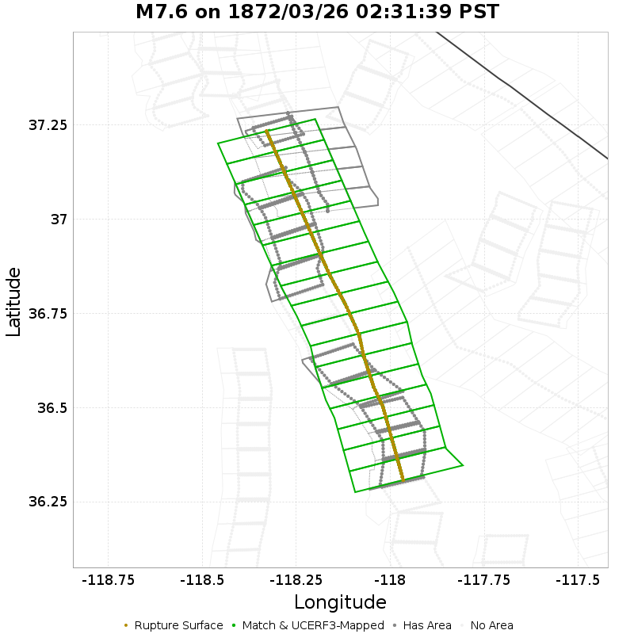

| Section Index | Section Name | Match? | Section Area | Rup Area in Raw Poly | Rup Area in No-Overlap Poly | Area Fraction | Sect Distance To Rup | UCERF3 Rupture Section? |
|-----|-----|-----|-----|-----|-----|-----|-----|-----|
| 976 | Independence rev 2011, Subsection 0 | *NO* | 160.94 [km^2] | 99.43 [km^2] | 0 [km^2] | 0 | mean=3.3 [0.08 9.26] [km] | *NO* |
| 977 | Independence rev 2011, Subsection 1 | *NO* | 160.94 [km^2] | 55.24 [km^2] | 0 [km^2] | 0 | mean=5.72 [0.37 12.57] [km] | *NO* |
| 980 | Independence rev 2011, Subsection 4 | *NO* | 160.94 [km^2] | 11.05 [km^2] | 0 [km^2] | 0 | mean=7.18 [0.61 13.59] [km] | *NO* |
| 981 | Independence rev 2011, Subsection 5 | *NO* | 160.94 [km^2] | 110.48 [km^2] | 0 [km^2] | 0 | mean=4.42 [0.42 10.56] [km] | *NO* |
| 982 | Independence rev 2011, Subsection 6 | *NO* | 160.94 [km^2] | 110.48 [km^2] | 0 [km^2] | 0 | mean=3.94 [0.35 9.08] [km] | *NO* |
| 983 | Independence rev 2011, Subsection 7 | *NO* | 160.94 [km^2] | 110.48 [km^2] | 0 [km^2] | 0 | mean=4.85 [0.22 11.02] [km] | *NO* |
| 1478 | Owens Valley, Subsection 0 | **YES** | 77.34 [km^2] | 82.86 [km^2] | 82.86 [km^2] | 1.07 | mean=0.38 [0 0.64] [km] | **YES** |
| 1479 | Owens Valley, Subsection 1 | **YES** | 77.34 [km^2] | 77.34 [km^2] | 77.34 [km^2] | 1 | mean=0.38 [0 0.64] [km] | **YES** |
| 1480 | Owens Valley, Subsection 2 | **YES** | 77.34 [km^2] | 77.34 [km^2] | 77.34 [km^2] | 1 | mean=0.38 [0 0.64] [km] | **YES** |
| 1481 | Owens Valley, Subsection 3 | **YES** | 77.34 [km^2] | 77.34 [km^2] | 77.34 [km^2] | 1 | mean=0.38 [0 0.64] [km] | **YES** |
| 1482 | Owens Valley, Subsection 4 | **YES** | 77.34 [km^2] | 77.34 [km^2] | 77.34 [km^2] | 1 | mean=0.38 [0 0.64] [km] | **YES** |
| 1483 | Owens Valley, Subsection 5 | **YES** | 77.34 [km^2] | 77.34 [km^2] | 77.34 [km^2] | 1 | mean=0.38 [0 0.64] [km] | **YES** |
| 1484 | Owens Valley, Subsection 6 | **YES** | 77.34 [km^2] | 77.34 [km^2] | 77.34 [km^2] | 1 | mean=0.38 [0 0.64] [km] | **YES** |
| 1485 | Owens Valley, Subsection 7 | **YES** | 77.34 [km^2] | 77.34 [km^2] | 77.34 [km^2] | 1 | mean=0.38 [0 0.64] [km] | **YES** |
| 1486 | Owens Valley, Subsection 8 | **YES** | 77.34 [km^2] | 77.34 [km^2] | 77.34 [km^2] | 1 | mean=0.38 [0 0.64] [km] | **YES** |
| 1487 | Owens Valley, Subsection 9 | **YES** | 77.34 [km^2] | 66.29 [km^2] | 66.29 [km^2] | 0.86 | mean=0.38 [0 0.64] [km] | **YES** |
| 1488 | Owens Valley, Subsection 10 | **YES** | 77.34 [km^2] | 88.39 [km^2] | 88.39 [km^2] | 1.14 | mean=0.38 [0 0.64] [km] | **YES** |
| 1489 | Owens Valley, Subsection 11 | **YES** | 77.34 [km^2] | 71.81 [km^2] | 71.81 [km^2] | 0.93 | mean=0.38 [0 0.64] [km] | **YES** |
| 1490 | Owens Valley, Subsection 12 | **YES** | 77.34 [km^2] | 82.86 [km^2] | 82.86 [km^2] | 1.07 | mean=0.38 [0 0.64] [km] | **YES** |
| 1491 | Owens Valley, Subsection 13 | **YES** | 77.34 [km^2] | 77.34 [km^2] | 77.34 [km^2] | 1 | mean=0.38 [0 0.64] [km] | **YES** |
| 1492 | Owens Valley, Subsection 14 | **YES** | 77.34 [km^2] | 77.34 [km^2] | 77.34 [km^2] | 1 | mean=0.38 [0 0.64] [km] | **YES** |
| 1493 | Owens Valley, Subsection 15 | **YES** | 77.34 [km^2] | 77.34 [km^2] | 77.34 [km^2] | 1 | mean=0.38 [0 0.64] [km] | **YES** |
| 1494 | Owens Valley, Subsection 16 | **YES** | 77.34 [km^2] | 71.81 [km^2] | 71.81 [km^2] | 0.93 | mean=0.38 [0 0.64] [km] | **YES** |
| 1495 | Owens Valley Keough Hot Springs, Subsection 0 | *NO* | 87.63 [km^2] | 49.72 [km^2] | 0 [km^2] | 0 | mean=3.4 [0.24 7.92] [km] | *NO* |
| 2378 | Sierra Nevada  (No Extension), Subsection 1 | *NO* | 137.16 [km^2] | 93.91 [km^2] | 0 [km^2] | 0 | mean=2.88 [0.41 6.93] [km] | *NO* |
| 2379 | Sierra Nevada  (No Extension), Subsection 2 | *NO* | 137.16 [km^2] | 99.43 [km^2] | 0 [km^2] | 0 | mean=3.32 [0.15 8.01] [km] | *NO* |
| 2380 | Sierra Nevada  (No Extension), Subsection 3 | *NO* | 137.16 [km^2] | 99.43 [km^2] | 0 [km^2] | 0 | mean=2.92 [0.25 7.24] [km] | *NO* |
| 2550 | White Mountains, Subsection 0 | *NO* | 71.97 [km^2] | 77.34 [km^2] | 0 [km^2] | 0 | mean=6.12 [5.82 6.52] [km] | *NO* |
| 2551 | White Mountains, Subsection 1 | *NO* | 71.97 [km^2] | 66.29 [km^2] | 0 [km^2] | 0 | mean=6.02 [5.82 6.23] [km] | *NO* |
| 2552 | White Mountains, Subsection 2 | *NO* | 71.97 [km^2] | 77.34 [km^2] | 0 [km^2] | 0 | mean=6.39 [6.22 6.54] [km] | *NO* |
| 2553 | White Mountains, Subsection 3 | *NO* | 71.97 [km^2] | 77.34 [km^2] | 0 [km^2] | 0 | mean=6.39 [6.25 6.53] [km] | *NO* |
| 2554 | White Mountains, Subsection 4 | *NO* | 71.97 [km^2] | 16.57 [km^2] | 0 [km^2] | 0 | mean=6.54 [6.2 7.36] [km] | *NO* |

## M6.8 on 1872/03/26 06:07:39 PST
*[(top)](#table-of-contents)*

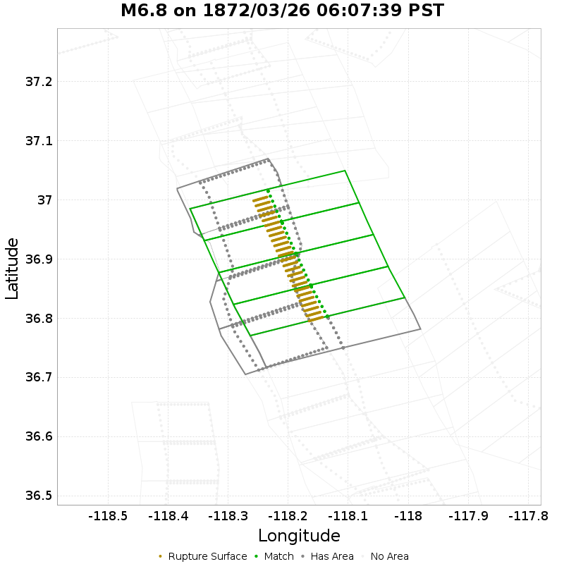

| Section Index | Section Name | Match? | Section Area | Rup Area in Raw Poly | Rup Area in No-Overlap Poly | Area Fraction | Sect Distance To Rup | UCERF3 Rupture Section? |
|-----|-----|-----|-----|-----|-----|-----|-----|-----|
| 979 | Independence rev 2011, Subsection 3 | *NO* | 160.94 [km^2] | 1.27 [km^2] | 0 [km^2] | 0 | mean=7.23 [3.15 11.97] [km] | *NO* |
| 980 | Independence rev 2011, Subsection 4 | *NO* | 160.94 [km^2] | 44.61 [km^2] | 0 [km^2] | 0 | mean=6.04 [1.2 11.07] [km] | *NO* |
| 981 | Independence rev 2011, Subsection 5 | *NO* | 160.94 [km^2] | 109.5 [km^2] | 0 [km^2] | 0 | mean=3.45 [0.19 8.2] [km] | *NO* |
| 982 | Independence rev 2011, Subsection 6 | *NO* | 160.94 [km^2] | 30.42 [km^2] | 0 [km^2] | 0 | mean=4.2 [0.5 8.69] [km] | *NO* |
| 1486 | Owens Valley, Subsection 8 | *NO* | 77.34 [km^2] | 2.28 [km^2] | 2.28 [km^2] | 0.03 | mean=4.05 [0.95 7.01] [km] | *NO* |
| 1487 | Owens Valley, Subsection 9 | **YES** | 77.34 [km^2] | 76.8 [km^2] | 76.8 [km^2] | 0.99 | mean=1.52 [0.55 2.56] [km] | *NO* |
| 1488 | Owens Valley, Subsection 10 | **YES** | 77.34 [km^2] | 73 [km^2] | 73 [km^2] | 0.94 | mean=1.41 [0.6 2.27] [km] | *NO* |
| 1489 | Owens Valley, Subsection 11 | **YES** | 77.34 [km^2] | 85.17 [km^2] | 85.17 [km^2] | 1.1 | mean=1.44 [0.65 2.32] [km] | *NO* |
| 1490 | Owens Valley, Subsection 12 | **YES** | 77.34 [km^2] | 54.75 [km^2] | 54.75 [km^2] | 0.71 | mean=1.5 [0.58 2.56] [km] | *NO* |

## M6.8 on 1872/04/11 11:01:39 PST
*[(top)](#table-of-contents)*

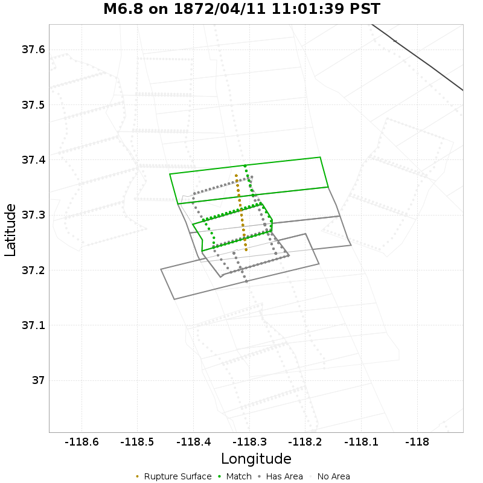

| Section Index | Section Name | Match? | Section Area | Rup Area in Raw Poly | Rup Area in No-Overlap Poly | Area Fraction | Sect Distance To Rup | UCERF3 Rupture Section? |
|-----|-----|-----|-----|-----|-----|-----|-----|-----|
| 1494 | Owens Valley, Subsection 16 | *NO* | 77.34 [km^2] | 5.94 [km^2] | 0 [km^2] | 0 | mean=3.92 [2.09 6.51] [km] | *NO* |
| 1495 | Owens Valley Keough Hot Springs, Subsection 0 | *NO* | 87.63 [km^2] | 29.72 [km^2] | 29.72 [km^2] | 0.34 | mean=3.13 [0.6 6.79] [km] | *NO* |
| 1496 | Owens Valley Keough Hot Springs, Subsection 1 | **YES** | 87.63 [km^2] | 59.44 [km^2] | 59.44 [km^2] | 0.68 | mean=2.61 [0.3 6.12] [km] | *NO* |
| 1497 | Owens Valley Keough Hot Springs, Subsection 2 | *NO* | 87.63 [km^2] | 71.33 [km^2] | 0 [km^2] | 0 | mean=3.03 [0.14 7.4] [km] | *NO* |
| 2554 | White Mountains, Subsection 4 | *NO* | 71.97 [km^2] | 53.5 [km^2] | 0 [km^2] | 0 | mean=4.05 [3.51 4.93] [km] | *NO* |
| 2555 | White Mountains, Subsection 5 | *NO* | 71.97 [km^2] | 71.33 [km^2] | 35.66 [km^2] | 0.5 | mean=2.92 [2.27 3.69] [km] | *NO* |
| 2556 | White Mountains, Subsection 6 | **YES** | 71.97 [km^2] | 53.5 [km^2] | 53.5 [km^2] | 0.74 | mean=2.09 [1.82 2.72] [km] | *NO* |

## M6.5 on 1885/04/11 20:06:39 PST
*[(top)](#table-of-contents)*

| Section Index | Section Name | Match? | Section Area | Rup Area in Raw Poly | Rup Area in No-Overlap Poly | Area Fraction | Sect Distance To Rup | UCERF3 Rupture Section? |
|-----|-----|-----|-----|-----|-----|-----|-----|-----|
| 1814 | San Andreas (Creeping Section) 2011 CFM, Subsection 3 | **YES** | 6.93 [km^2] | 27.88 [km^2] | 27.88 [km^2] | 4.02 | mean=4.16 [3.51 5.26] [km] | *NO* |
| 1815 | San Andreas (Creeping Section) 2011 CFM, Subsection 4 | **YES** | 6.93 [km^2] | 66.91 [km^2] | 66.91 [km^2] | 9.65 | mean=4.19 [3.63 4.75] [km] | *NO* |
| 1816 | San Andreas (Creeping Section) 2011 CFM, Subsection 5 | **YES** | 6.93 [km^2] | 64.37 [km^2] | 64.37 [km^2] | 9.29 | mean=4.62 [4.06 5.18] [km] | *NO* |
| 1817 | San Andreas (Creeping Section) 2011 CFM, Subsection 6 | **YES** | 6.93 [km^2] | 60.57 [km^2] | 60.57 [km^2] | 8.74 | mean=5.16 [4.5 5.86] [km] | *NO* |
| 1818 | San Andreas (Creeping Section) 2011 CFM, Subsection 7 | *NO* | 6.93 [km^2] | 3.29 [km^2] | 3.29 [km^2] | 0.48 | mean=6.6 [5.18 8.52] [km] | *NO* |

## M6.8 on 1890/02/09 04:07:39 PST
*[(top)](#table-of-contents)*

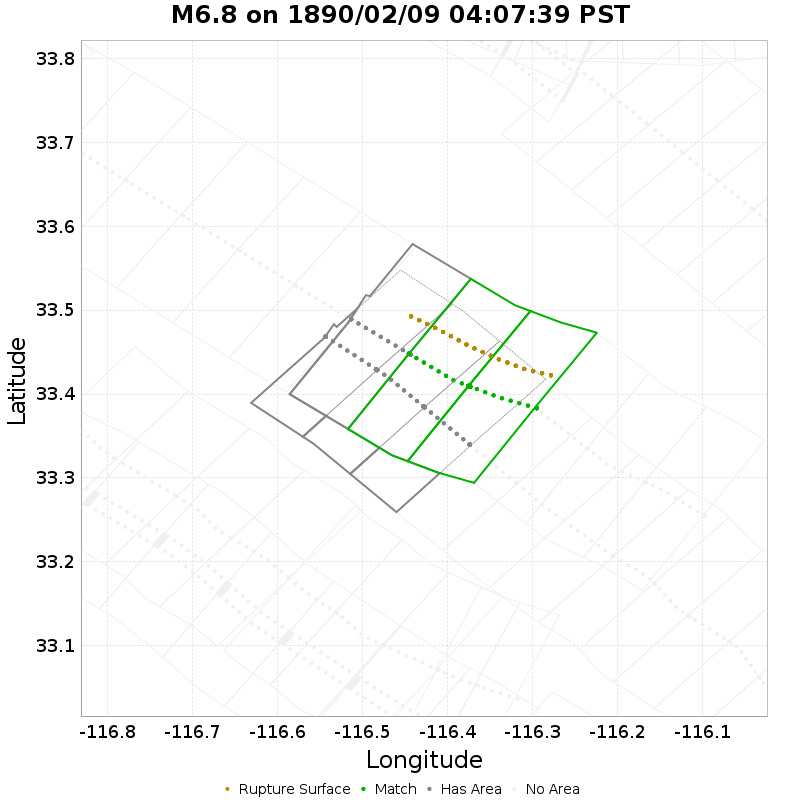

| Section Index | Section Name | Match? | Section Area | Rup Area in Raw Poly | Rup Area in No-Overlap Poly | Area Fraction | Sect Distance To Rup | UCERF3 Rupture Section? |
|-----|-----|-----|-----|-----|-----|-----|-----|-----|
| 2165 | San Jacinto (Clark) rev, Subsection 0 | *NO* | 118.01 [km^2] | 31.13 [km^2] | 31.13 [km^2] | 0.26 | mean=5.12 [4.15 8.06] [km] | *NO* |
| 2166 | San Jacinto (Clark) rev, Subsection 1 | **YES** | 118.01 [km^2] | 99.62 [km^2] | 99.62 [km^2] | 0.84 | mean=4.91 [4.42 6.71] [km] | *NO* |
| 2167 | San Jacinto (Clark) rev, Subsection 2 | **YES** | 118.01 [km^2] | 80.94 [km^2] | 80.94 [km^2] | 0.69 | mean=4.86 [4.48 6.62] [km] | *NO* |
| 2171 | San Jacinto (Coyote Creek), Subsection 0 | *NO* | 113.67 [km^2] | 31.13 [km^2] | 0 [km^2] | 0 | mean=8.55 [7.89 10.47] [km] | *NO* |
| 2172 | San Jacinto (Coyote Creek), Subsection 1 | *NO* | 113.67 [km^2] | 87.17 [km^2] | 0 [km^2] | 0 | mean=8.81 [8.02 10.26] [km] | *NO* |
| 2173 | San Jacinto (Coyote Creek), Subsection 2 | *NO* | 113.67 [km^2] | 74.72 [km^2] | 0 [km^2] | 0 | mean=10.57 [9.49 12.27] [km] | *NO* |

## M7.3 on 1892/02/23 23:21:39 PST
*[(top)](#table-of-contents)*

| Section Index | Section Name | Match? | Section Area | Rup Area in Raw Poly | Rup Area in No-Overlap Poly | Area Fraction | Sect Distance To Rup | UCERF3 Rupture Section? |
|-----|-----|-----|-----|-----|-----|-----|-----|-----|
| 1048 | Laguna Salada, Subsection 6 | *NO* | 44.13 [km^2] | 3.15 [km^2] | 3.15 [km^2] | 0.07 | mean=3.24 [0.36 6.65] [km] | *NO* |
| 1049 | Laguna Salada, Subsection 7 | **YES** | 44.13 [km^2] | 44.13 [km^2] | 44.13 [km^2] | 1 | mean=0.28 [0 0.5] [km] | **YES** |
| 1050 | Laguna Salada, Subsection 8 | **YES** | 44.13 [km^2] | 40.98 [km^2] | 40.98 [km^2] | 0.93 | mean=0.28 [0 0.5] [km] | **YES** |
| 1051 | Laguna Salada, Subsection 9 | **YES** | 44.13 [km^2] | 47.28 [km^2] | 47.28 [km^2] | 1.07 | mean=0.28 [0 0.5] [km] | **YES** |
| 1052 | Laguna Salada, Subsection 10 | **YES** | 44.13 [km^2] | 40.98 [km^2] | 40.98 [km^2] | 0.93 | mean=0.28 [0 0.5] [km] | **YES** |
| 1053 | Laguna Salada, Subsection 11 | **YES** | 44.13 [km^2] | 44.13 [km^2] | 44.13 [km^2] | 1 | mean=0.28 [0 0.5] [km] | **YES** |

## M6.6 on 1892/04/19 02:51:39 PST
*[(top)](#table-of-contents)*

| Section Index | Section Name | Match? | Section Area | Rup Area in Raw Poly | Rup Area in No-Overlap Poly | Area Fraction | Sect Distance To Rup | UCERF3 Rupture Section? |
|-----|-----|-----|-----|-----|-----|-----|-----|-----|
| 706 | Great Valley 04b Gordon Valley, Subsection 0 | **YES** | 93.69 [km^2] | 71.14 [km^2] | 71.14 [km^2] | 0.76 | mean=2.5 [0.19 5.9] [km] | *NO* |
| 707 | Great Valley 04b Gordon Valley, Subsection 1 | **YES** | 93.69 [km^2] | 110.66 [km^2] | 110.66 [km^2] | 1.18 | mean=1.97 [0.3 4.35] [km] | *NO* |
| 708 | Great Valley 04b Gordon Valley, Subsection 2 | **YES** | 93.69 [km^2] | 86.95 [km^2] | 86.95 [km^2] | 0.93 | mean=2.08 [0.33 4.65] [km] | *NO* |
| 775 | Green Valley 2011 CFM, Subsection 0 | *NO* | 34.59 [km^2] | 34.58 [km^2] | 0 [km^2] | 0 | mean=8.46 [7.77 9.56] [km] | *NO* |
| 776 | Green Valley 2011 CFM, Subsection 1 | *NO* | 34.59 [km^2] | 27.67 [km^2] | 0 [km^2] | 0 | mean=8.97 [8.31 10.02] [km] | *NO* |
| 777 | Green Valley 2011 CFM, Subsection 2 | *NO* | 34.59 [km^2] | 0.25 [km^2] | 0 [km^2] | 0 | mean=9.93 [8.87 11.73] [km] | *NO* |
| 952 | Hunting Creek - Berryessa 2011 CFM, Subsection 0 | *NO* | 34.02 [km^2] | 24.45 [km^2] | 0 [km^2] | 0 | mean=9.36 [7.15 11.73] [km] | *NO* |

## M6.5 on 1892/05/28 03:16:39 PST
*[(top)](#table-of-contents)*

| Section Index | Section Name | Match? | Section Area | Rup Area in Raw Poly | Rup Area in No-Overlap Poly | Area Fraction | Sect Distance To Rup | UCERF3 Rupture Section? |
|-----|-----|-----|-----|-----|-----|-----|-----|-----|
| 2159 | San Jacinto (Borrego), Subsection 0 | **YES** | 70.39 [km^2] | 70.39 [km^2] | 70.39 [km^2] | 1 | mean=0.32 [0 0.52] [km] | **YES** |
| 2160 | San Jacinto (Borrego), Subsection 1 | **YES** | 63.83 [km^2] | 58.51 [km^2] | 58.51 [km^2] | 0.92 | mean=0.31 [0 0.51] [km] | **YES** |
| 2161 | San Jacinto (Borrego), Subsection 2 | **YES** | 52.36 [km^2] | 53.32 [km^2] | 53.32 [km^2] | 1.02 | mean=0.3 [0 0.51] [km] | **YES** |
| 2162 | San Jacinto (Borrego), Subsection 3 | *NO* | 37.93 [km^2] | 4.36 [km^2] | 4.36 [km^2] | 0.12 | mean=2.99 [0.03 5.93] [km] | *NO* |
| 2170 | San Jacinto (Clark) rev, Subsection 5 | *NO* | 118.01 [km^2] | 64.52 [km^2] | 0 [km^2] | 0 | mean=10.33 [10.19 11.04] [km] | *NO* |
| 2176 | San Jacinto (Coyote Creek), Subsection 5 | *NO* | 110.26 [km^2] | 5.87 [km^2] | 0 [km^2] | 0 | mean=3.75 [0.15 7.53] [km] | *NO* |

## M6.7 on 1899/12/25 04:26:39 PST
*[(top)](#table-of-contents)*

| Section Index | Section Name | Match? | Section Area | Rup Area in Raw Poly | Rup Area in No-Overlap Poly | Area Fraction | Sect Distance To Rup | UCERF3 Rupture Section? |
|-----|-----|-----|-----|-----|-----|-----|-----|-----|
| 2153 | San Jacinto (Anza) rev, Subsection 0 | **YES** | 125.44 [km^2] | 139.47 [km^2] | 97.02 [km^2] | 0.77 | mean=1.86 [1.38 4.7] [km] | *NO* |
| 2154 | San Jacinto (Anza) rev, Subsection 1 | **YES** | 125.44 [km^2] | 84.9 [km^2] | 84.9 [km^2] | 0.68 | mean=1.87 [1.31 4.74] [km] | *NO* |
| 2155 | San Jacinto (Anza) rev, Subsection 2 | *NO* | 125.44 [km^2] | 18.19 [km^2] | 18.19 [km^2] | 0.15 | mean=4.01 [1.53 8.41] [km] | *NO* |
| 2190 | San Jacinto (Stepovers Combined), Subsection 2 | **YES** | 98.65 [km^2] | 54.58 [km^2] | 54.58 [km^2] | 0.55 | mean=1.79 [0.69 5.04] [km] | *NO* |
| 2191 | San Jacinto (Stepovers Combined), Subsection 3 | **YES** | 98.65 [km^2] | 72.77 [km^2] | 72.77 [km^2] | 0.74 | mean=1.44 [0.69 4.67] [km] | *NO* |

## M7.8 on 1906/04/18 05:12:21 PST
*[(top)](#table-of-contents)*

| Section Index | Section Name | Match? | Section Area | Rup Area in Raw Poly | Rup Area in No-Overlap Poly | Area Fraction | Sect Distance To Rup | UCERF3 Rupture Section? |
|-----|-----|-----|-----|-----|-----|-----|-----|-----|
| 178 | Butano 2011 CFM, Subsection 0 | *NO* | 66.39 [km^2] | 91.94 [km^2] | 0 [km^2] | 0 | mean=2.46 [0.29 5.97] [km] | *NO* |
| 179 | Butano 2011 CFM, Subsection 1 | *NO* | 66.39 [km^2] | 91.2 [km^2] | 4.74 [km^2] | 0.07 | mean=1.2 [0.21 3.23] [km] | *NO* |
| 180 | Butano 2011 CFM, Subsection 2 | *NO* | 66.39 [km^2] | 80.99 [km^2] | 0 [km^2] | 0 | mean=1.52 [0.35 4.05] [km] | *NO* |
| 181 | Butano 2011 CFM, Subsection 3 | *NO* | 66.39 [km^2] | 23.14 [km^2] | 0 [km^2] | 0 | mean=3.94 [0.64 7.42] [km] | *NO* |
| 217 | Calaveras (So) 2011 CFM, Subsection 0 | *NO* | 31.51 [km^2] | 9.8 [km^2] | 0 [km^2] | 0 | mean=10.24 [8.94 11.89] [km] | *NO* |
| 1026 | King Range 2011 CFM, Subsection 0 | *NO* | 72.56 [km^2] | 31.47 [km^2] | 0 [km^2] | 0 | mean=3.84 [0.24 9.37] [km] | *NO* |
| 1027 | King Range 2011 CFM, Subsection 1 | *NO* | 72.56 [km^2] | 53.95 [km^2] | 0 [km^2] | 0 | mean=3.04 [0.31 7.11] [km] | *NO* |
| 1028 | King Range 2011 CFM, Subsection 2 | *NO* | 72.56 [km^2] | 62.95 [km^2] | 0 [km^2] | 0 | mean=2.91 [0.19 6.25] [km] | *NO* |
| 1029 | King Range 2011 CFM, Subsection 3 | *NO* | 72.56 [km^2] | 53.95 [km^2] | 0 [km^2] | 0 | mean=3.22 [0.21 7.88] [km] | *NO* |
| 1030 | King Range 2011 CFM, Subsection 4 | *NO* | 72.56 [km^2] | 53.95 [km^2] | 0 [km^2] | 0 | mean=3.45 [0.1 8.16] [km] | *NO* |
| 1031 | King Range 2011 CFM, Subsection 5 | *NO* | 72.56 [km^2] | 62.95 [km^2] | 0 [km^2] | 0 | mean=3.1 [0.21 7.39] [km] | *NO* |
| 1032 | King Range 2011 CFM, Subsection 6 | *NO* | 72.56 [km^2] | 62.95 [km^2] | 0 [km^2] | 0 | mean=2.88 [0.54 6.58] [km] | *NO* |
| 1247 | Mendocino, Subsection 0 | *NO* | 44.57 [km^2] | 4.5 [km^2] | 4.5 [km^2] | 0.1 | mean=2.51 [0.01 5] [km] | *NO* |
| 1331 | Monte Vista - Shannon 2011 CFM, Subsection 0 | *NO* | 109.64 [km^2] | 104.13 [km^2] | 0 [km^2] | 0 | mean=3 [0.2 7.45] [km] | *NO* |
| 1332 | Monte Vista - Shannon 2011 CFM, Subsection 1 | *NO* | 109.64 [km^2] | 104.13 [km^2] | 0 [km^2] | 0 | mean=2.01 [0.27 5.36] [km] | *NO* |
| 1333 | Monte Vista - Shannon 2011 CFM, Subsection 2 | *NO* | 109.64 [km^2] | 104.13 [km^2] | 0 [km^2] | 0 | mean=2.34 [0.06 6] [km] | *NO* |
| 1334 | Monte Vista - Shannon 2011 CFM, Subsection 3 | *NO* | 109.64 [km^2] | 92.56 [km^2] | 0 [km^2] | 0 | mean=2.43 [0.22 5.94] [km] | *NO* |
| 1335 | Monte Vista - Shannon 2011 CFM, Subsection 4 | *NO* | 109.64 [km^2] | 92.56 [km^2] | 0 [km^2] | 0 | mean=2.73 [0.2 6.64] [km] | *NO* |
| 1336 | Monte Vista - Shannon 2011 CFM, Subsection 5 | *NO* | 109.64 [km^2] | 23.14 [km^2] | 0 [km^2] | 0 | mean=4.27 [0.53 8.56] [km] | *NO* |
| 1551 | Pilarcitos 2011 CFM, Subsection 0 | *NO* | 40.06 [km^2] | 57.85 [km^2] | 0 [km^2] | 0 | mean=0.61 [0.13 1.46] [km] | *NO* |
| 1552 | Pilarcitos 2011 CFM, Subsection 1 | *NO* | 40.06 [km^2] | 57.85 [km^2] | 0 [km^2] | 0 | mean=0.54 [0.14 1.23] [km] | *NO* |
| 1553 | Pilarcitos 2011 CFM, Subsection 2 | *NO* | 40.06 [km^2] | 69.42 [km^2] | 0 [km^2] | 0 | mean=0.86 [0.15 1.95] [km] | *NO* |
| 1554 | Pilarcitos 2011 CFM, Subsection 3 | *NO* | 40.06 [km^2] | 57.85 [km^2] | 0 [km^2] | 0 | mean=1.68 [0.49 2.84] [km] | *NO* |
| 1555 | Pilarcitos 2011 CFM, Subsection 4 | *NO* | 40.06 [km^2] | 57.85 [km^2] | 0 [km^2] | 0 | mean=2.4 [1.36 3.31] [km] | *NO* |
| 1556 | Pilarcitos 2011 CFM, Subsection 5 | *NO* | 40.06 [km^2] | 57.85 [km^2] | 0 [km^2] | 0 | mean=2.08 [0.95 3.19] [km] | *NO* |
| 1557 | Pilarcitos 2011 CFM, Subsection 6 | *NO* | 40.06 [km^2] | 57.85 [km^2] | 0 [km^2] | 0 | mean=1.58 [0.74 2.49] [km] | *NO* |
| 1558 | Pilarcitos 2011 CFM, Subsection 7 | *NO* | 40.06 [km^2] | 57.85 [km^2] | 0 [km^2] | 0 | mean=2.48 [1.04 3.97] [km] | *NO* |
| 1559 | Pilarcitos 2011 CFM, Subsection 8 | *NO* | 40.06 [km^2] | 69.42 [km^2] | 0 [km^2] | 0 | mean=3.96 [2.47 5.45] [km] | *NO* |
| 1560 | Pilarcitos 2011 CFM, Subsection 9 | *NO* | 40.06 [km^2] | 57.85 [km^2] | 0 [km^2] | 0 | mean=5.06 [3.95 5.98] [km] | *NO* |
| 1561 | Pilarcitos 2011 CFM, Subsection 10 | *NO* | 40.06 [km^2] | 57.85 [km^2] | 0 [km^2] | 0 | mean=5.39 [4.55 6.23] [km] | *NO* |
| 1623 | Point Reyes 2011 connector, Subsection 0 | *NO* | 49.56 [km^2] | 57.85 [km^2] | 0 [km^2] | 0 | mean=2.7 [0.16 5.81] [km] | *NO* |
| 1624 | Point Reyes 2011 connector, Subsection 1 | *NO* | 49.56 [km^2] | 23.14 [km^2] | 0 [km^2] | 0 | mean=3.19 [0.12 6.42] [km] | *NO* |
| 1831 | San Andreas (Creeping Section) 2011 CFM, Subsection 20 | *NO* | 45.06 [km^2] | 13.07 [km^2] | 0 [km^2] | 0 | mean=3.53 [0.83 6.39] [km] | *NO* |
| 1864 | San Andreas (North Coast) 2011 CFM, Subsection 0 | **YES** | 58.68 [km^2] | 69.35 [km^2] | 69.35 [km^2] | 1.18 | mean=0.24 [0 0.44] [km] | **YES** |
| 1865 | San Andreas (North Coast) 2011 CFM, Subsection 1 | **YES** | 58.68 [km^2] | 58.68 [km^2] | 58.68 [km^2] | 1 | mean=0.24 [0 0.44] [km] | **YES** |
| 1866 | San Andreas (North Coast) 2011 CFM, Subsection 2 | **YES** | 58.68 [km^2] | 53.79 [km^2] | 53.79 [km^2] | 0.92 | mean=0.24 [0 0.44] [km] | **YES** |
| 1867 | San Andreas (North Coast) 2011 CFM, Subsection 3 | **YES** | 58.68 [km^2] | 63.57 [km^2] | 63.57 [km^2] | 1.08 | mean=0.24 [0 0.44] [km] | **YES** |
| 1868 | San Andreas (North Coast) 2011 CFM, Subsection 4 | **YES** | 58.68 [km^2] | 58.68 [km^2] | 58.68 [km^2] | 1 | mean=0.24 [0 0.44] [km] | **YES** |
| 1869 | San Andreas (North Coast) 2011 CFM, Subsection 5 | **YES** | 58.68 [km^2] | 53.79 [km^2] | 53.79 [km^2] | 0.92 | mean=0.24 [0 0.44] [km] | **YES** |
| 1870 | San Andreas (North Coast) 2011 CFM, Subsection 6 | **YES** | 58.68 [km^2] | 63.57 [km^2] | 63.57 [km^2] | 1.08 | mean=0.24 [0 0.44] [km] | **YES** |
| 1871 | San Andreas (North Coast) 2011 CFM, Subsection 7 | **YES** | 58.68 [km^2] | 53.79 [km^2] | 53.79 [km^2] | 0.92 | mean=0.24 [0 0.44] [km] | **YES** |
| 1872 | San Andreas (North Coast) 2011 CFM, Subsection 8 | **YES** | 58.68 [km^2] | 58.68 [km^2] | 58.68 [km^2] | 1 | mean=0.24 [0 0.44] [km] | **YES** |
| 1873 | San Andreas (North Coast) 2011 CFM, Subsection 9 | **YES** | 58.68 [km^2] | 63.57 [km^2] | 63.57 [km^2] | 1.08 | mean=0.24 [0 0.44] [km] | **YES** |
| 1874 | San Andreas (North Coast) 2011 CFM, Subsection 10 | **YES** | 58.68 [km^2] | 53.79 [km^2] | 53.79 [km^2] | 0.92 | mean=0.24 [0 0.44] [km] | **YES** |
| 1875 | San Andreas (North Coast) 2011 CFM, Subsection 11 | **YES** | 58.68 [km^2] | 63.57 [km^2] | 63.57 [km^2] | 1.08 | mean=0.24 [0 0.44] [km] | **YES** |
| 1876 | San Andreas (North Coast) 2011 CFM, Subsection 12 | **YES** | 58.68 [km^2] | 58.68 [km^2] | 58.68 [km^2] | 1 | mean=0.24 [0 0.44] [km] | **YES** |
| 1877 | San Andreas (North Coast) 2011 CFM, Subsection 13 | **YES** | 58.68 [km^2] | 53.79 [km^2] | 53.79 [km^2] | 0.92 | mean=0.24 [0 0.44] [km] | **YES** |
| 1878 | San Andreas (North Coast) 2011 CFM, Subsection 14 | **YES** | 58.68 [km^2] | 63.57 [km^2] | 63.57 [km^2] | 1.08 | mean=0.24 [0 0.44] [km] | **YES** |
| 1879 | San Andreas (North Coast) 2011 CFM, Subsection 15 | **YES** | 58.68 [km^2] | 58.68 [km^2] | 58.68 [km^2] | 1 | mean=0.24 [0 0.44] [km] | **YES** |
| 1880 | San Andreas (North Coast) 2011 CFM, Subsection 16 | **YES** | 58.68 [km^2] | 58.68 [km^2] | 58.68 [km^2] | 1 | mean=0.24 [0 0.44] [km] | **YES** |
| 1881 | San Andreas (North Coast) 2011 CFM, Subsection 17 | **YES** | 58.68 [km^2] | 58.68 [km^2] | 58.68 [km^2] | 1 | mean=0.24 [0 0.44] [km] | **YES** |
| 1882 | San Andreas (North Coast) 2011 CFM, Subsection 18 | **YES** | 58.68 [km^2] | 48.9 [km^2] | 48.9 [km^2] | 0.83 | mean=0.24 [0 0.44] [km] | **YES** |
| 1883 | San Andreas (North Coast) 2011 CFM, Subsection 19 | **YES** | 58.68 [km^2] | 68.45 [km^2] | 68.45 [km^2] | 1.17 | mean=0.24 [0 0.44] [km] | **YES** |
| 1884 | San Andreas (North Coast) 2011 CFM, Subsection 20 | **YES** | 58.68 [km^2] | 58.68 [km^2] | 58.68 [km^2] | 1 | mean=0.24 [0 0.44] [km] | **YES** |
| 1885 | San Andreas (North Coast) 2011 CFM, Subsection 21 | **YES** | 58.68 [km^2] | 58.68 [km^2] | 58.68 [km^2] | 1 | mean=0.24 [0 0.44] [km] | **YES** |
| 1886 | San Andreas (North Coast) 2011 CFM, Subsection 22 | **YES** | 58.68 [km^2] | 58.68 [km^2] | 58.68 [km^2] | 1 | mean=0.24 [0 0.44] [km] | **YES** |
| 1887 | San Andreas (North Coast) 2011 CFM, Subsection 23 | **YES** | 58.68 [km^2] | 58.68 [km^2] | 58.68 [km^2] | 1 | mean=0.24 [0 0.44] [km] | **YES** |
| 1888 | San Andreas (North Coast) 2011 CFM, Subsection 24 | **YES** | 58.68 [km^2] | 58.68 [km^2] | 58.68 [km^2] | 1 | mean=0.24 [0 0.44] [km] | **YES** |
| 1889 | San Andreas (North Coast) 2011 CFM, Subsection 25 | **YES** | 58.68 [km^2] | 53.79 [km^2] | 53.79 [km^2] | 0.92 | mean=0.24 [0 0.44] [km] | **YES** |
| 1890 | San Andreas (North Coast) 2011 CFM, Subsection 26 | **YES** | 58.68 [km^2] | 63.57 [km^2] | 63.57 [km^2] | 1.08 | mean=0.24 [0 0.44] [km] | **YES** |
| 1891 | San Andreas (North Coast) 2011 CFM, Subsection 27 | **YES** | 58.68 [km^2] | 58.68 [km^2] | 58.68 [km^2] | 1 | mean=0.24 [0 0.44] [km] | **YES** |
| 1892 | San Andreas (North Coast) 2011 CFM, Subsection 28 | **YES** | 58.68 [km^2] | 58.68 [km^2] | 58.68 [km^2] | 1 | mean=0.24 [0 0.44] [km] | **YES** |
| 1893 | San Andreas (North Coast) 2011 CFM, Subsection 29 | **YES** | 58.68 [km^2] | 53.79 [km^2] | 53.79 [km^2] | 0.92 | mean=0.24 [0 0.44] [km] | **YES** |
| 1894 | San Andreas (North Coast) 2011 CFM, Subsection 30 | **YES** | 58.68 [km^2] | 63.57 [km^2] | 63.57 [km^2] | 1.08 | mean=0.24 [0 0.44] [km] | **YES** |
| 1895 | San Andreas (North Coast) 2011 CFM, Subsection 31 | **YES** | 58.68 [km^2] | 48.9 [km^2] | 48.9 [km^2] | 0.83 | mean=0.24 [0 0.44] [km] | **YES** |
| 1896 | San Andreas (Offshore) 2011 CFM, Subsection 0 | **YES** | 53.95 [km^2] | 63.34 [km^2] | 63.34 [km^2] | 1.17 | mean=0.24 [0 0.46] [km] | **YES** |
| 1897 | San Andreas (Offshore) 2011 CFM, Subsection 1 | **YES** | 53.95 [km^2] | 53.95 [km^2] | 53.95 [km^2] | 1 | mean=0.24 [0 0.46] [km] | **YES** |
| 1898 | San Andreas (Offshore) 2011 CFM, Subsection 2 | **YES** | 53.95 [km^2] | 49.46 [km^2] | 49.46 [km^2] | 0.92 | mean=0.24 [0 0.46] [km] | **YES** |
| 1899 | San Andreas (Offshore) 2011 CFM, Subsection 3 | **YES** | 53.95 [km^2] | 58.45 [km^2] | 58.45 [km^2] | 1.08 | mean=0.24 [0 0.46] [km] | **YES** |
| 1900 | San Andreas (Offshore) 2011 CFM, Subsection 4 | **YES** | 53.95 [km^2] | 53.95 [km^2] | 53.95 [km^2] | 1 | mean=0.24 [0 0.46] [km] | **YES** |
| 1901 | San Andreas (Offshore) 2011 CFM, Subsection 5 | **YES** | 53.95 [km^2] | 53.95 [km^2] | 53.95 [km^2] | 1 | mean=0.24 [0 0.46] [km] | **YES** |
| 1902 | San Andreas (Offshore) 2011 CFM, Subsection 6 | **YES** | 53.95 [km^2] | 53.95 [km^2] | 53.95 [km^2] | 1 | mean=0.24 [0 0.46] [km] | **YES** |
| 1903 | San Andreas (Offshore) 2011 CFM, Subsection 7 | **YES** | 53.95 [km^2] | 53.95 [km^2] | 53.95 [km^2] | 1 | mean=0.24 [0 0.46] [km] | **YES** |
| 1904 | San Andreas (Offshore) 2011 CFM, Subsection 8 | **YES** | 53.95 [km^2] | 53.95 [km^2] | 53.95 [km^2] | 1 | mean=0.24 [0 0.46] [km] | **YES** |
| 1905 | San Andreas (Offshore) 2011 CFM, Subsection 9 | **YES** | 53.95 [km^2] | 53.95 [km^2] | 53.95 [km^2] | 1 | mean=0.24 [0 0.46] [km] | **YES** |
| 1906 | San Andreas (Offshore) 2011 CFM, Subsection 10 | **YES** | 53.95 [km^2] | 53.95 [km^2] | 53.95 [km^2] | 1 | mean=0.24 [0 0.46] [km] | **YES** |
| 1907 | San Andreas (Offshore) 2011 CFM, Subsection 11 | **YES** | 53.95 [km^2] | 53.95 [km^2] | 53.95 [km^2] | 1 | mean=0.24 [0 0.46] [km] | **YES** |
| 1908 | San Andreas (Offshore) 2011 CFM, Subsection 12 | **YES** | 53.95 [km^2] | 53.95 [km^2] | 53.95 [km^2] | 1 | mean=0.24 [0 0.46] [km] | **YES** |
| 1909 | San Andreas (Offshore) 2011 CFM, Subsection 13 | **YES** | 53.95 [km^2] | 53.95 [km^2] | 53.95 [km^2] | 1 | mean=0.24 [0 0.46] [km] | **YES** |
| 1910 | San Andreas (Offshore) 2011 CFM, Subsection 14 | **YES** | 53.95 [km^2] | 53.95 [km^2] | 53.95 [km^2] | 1 | mean=0.24 [0 0.46] [km] | **YES** |
| 1911 | San Andreas (Offshore) 2011 CFM, Subsection 15 | **YES** | 53.95 [km^2] | 49.46 [km^2] | 49.46 [km^2] | 0.92 | mean=0.24 [0 0.46] [km] | **YES** |
| 1912 | San Andreas (Offshore) 2011 CFM, Subsection 16 | **YES** | 53.95 [km^2] | 58.45 [km^2] | 58.45 [km^2] | 1.08 | mean=0.24 [0 0.46] [km] | **YES** |
| 1913 | San Andreas (Offshore) 2011 CFM, Subsection 17 | **YES** | 53.95 [km^2] | 53.95 [km^2] | 53.95 [km^2] | 1 | mean=0.24 [0 0.46] [km] | **YES** |
| 1914 | San Andreas (Offshore) 2011 CFM, Subsection 18 | **YES** | 53.95 [km^2] | 53.95 [km^2] | 53.95 [km^2] | 1 | mean=0.24 [0 0.46] [km] | **YES** |
| 1915 | San Andreas (Offshore) 2011 CFM, Subsection 19 | **YES** | 53.95 [km^2] | 53.95 [km^2] | 53.95 [km^2] | 1 | mean=0.24 [0 0.46] [km] | **YES** |
| 1916 | San Andreas (Offshore) 2011 CFM, Subsection 20 | **YES** | 53.95 [km^2] | 53.95 [km^2] | 53.95 [km^2] | 1 | mean=0.24 [0 0.46] [km] | **YES** |
| 1917 | San Andreas (Offshore) 2011 CFM, Subsection 21 | **YES** | 53.95 [km^2] | 53.95 [km^2] | 53.95 [km^2] | 1 | mean=0.24 [0 0.46] [km] | **YES** |
| 1918 | San Andreas (Offshore) 2011 CFM, Subsection 22 | **YES** | 53.95 [km^2] | 53.95 [km^2] | 53.95 [km^2] | 1 | mean=0.24 [0 0.46] [km] | **YES** |
| 1919 | San Andreas (Offshore) 2011 CFM, Subsection 23 | **YES** | 53.95 [km^2] | 44.96 [km^2] | 44.96 [km^2] | 0.83 | mean=0.24 [0 0.46] [km] | **YES** |
| 1928 | San Andreas (Peninsula) 2011 CFM, Subsection 0 | **YES** | 80.99 [km^2] | 87.01 [km^2] | 87.01 [km^2] | 1.07 | mean=0.24 [0 0.44] [km] | **YES** |
| 1929 | San Andreas (Peninsula) 2011 CFM, Subsection 1 | **YES** | 80.99 [km^2] | 75.2 [km^2] | 75.2 [km^2] | 0.93 | mean=0.24 [0 0.44] [km] | **YES** |
| 1930 | San Andreas (Peninsula) 2011 CFM, Subsection 2 | **YES** | 80.99 [km^2] | 86.77 [km^2] | 86.77 [km^2] | 1.07 | mean=0.24 [0 0.44] [km] | **YES** |
| 1931 | San Andreas (Peninsula) 2011 CFM, Subsection 3 | **YES** | 80.99 [km^2] | 75.2 [km^2] | 75.2 [km^2] | 0.93 | mean=0.24 [0 0.44] [km] | **YES** |
| 1932 | San Andreas (Peninsula) 2011 CFM, Subsection 4 | **YES** | 80.99 [km^2] | 86.77 [km^2] | 86.77 [km^2] | 1.07 | mean=0.24 [0 0.44] [km] | **YES** |
| 1933 | San Andreas (Peninsula) 2011 CFM, Subsection 5 | **YES** | 80.99 [km^2] | 80.99 [km^2] | 80.99 [km^2] | 1 | mean=0.24 [0 0.44] [km] | **YES** |
| 1934 | San Andreas (Peninsula) 2011 CFM, Subsection 6 | **YES** | 80.99 [km^2] | 80.99 [km^2] | 80.99 [km^2] | 1 | mean=0.24 [0 0.44] [km] | **YES** |
| 1935 | San Andreas (Peninsula) 2011 CFM, Subsection 7 | **YES** | 80.99 [km^2] | 80.99 [km^2] | 80.99 [km^2] | 1 | mean=0.24 [0 0.44] [km] | **YES** |
| 1936 | San Andreas (Peninsula) 2011 CFM, Subsection 8 | **YES** | 80.99 [km^2] | 75.2 [km^2] | 75.2 [km^2] | 0.93 | mean=0.24 [0 0.44] [km] | **YES** |
| 1937 | San Andreas (Peninsula) 2011 CFM, Subsection 9 | **YES** | 80.99 [km^2] | 86.77 [km^2] | 86.77 [km^2] | 1.07 | mean=0.24 [0 0.44] [km] | **YES** |
| 1938 | San Andreas (Peninsula) 2011 CFM, Subsection 10 | **YES** | 80.99 [km^2] | 80.99 [km^2] | 80.99 [km^2] | 1 | mean=0.24 [0 0.44] [km] | **YES** |
| 1939 | San Andreas (Peninsula) 2011 CFM, Subsection 11 | **YES** | 80.99 [km^2] | 80.99 [km^2] | 80.99 [km^2] | 1 | mean=0.24 [0 0.44] [km] | **YES** |
| 1940 | San Andreas (Peninsula) 2011 CFM, Subsection 12 | **YES** | 80.99 [km^2] | 80.99 [km^2] | 80.99 [km^2] | 1 | mean=0.24 [0 0.44] [km] | **YES** |
| 1941 | San Andreas (Peninsula) 2011 CFM, Subsection 13 | **YES** | 80.99 [km^2] | 80.99 [km^2] | 80.99 [km^2] | 1 | mean=0.24 [0 0.44] [km] | **YES** |
| 1942 | San Andreas (Peninsula) 2011 CFM, Subsection 14 | **YES** | 80.99 [km^2] | 80.99 [km^2] | 80.99 [km^2] | 1 | mean=0.24 [0 0.44] [km] | **YES** |
| 1943 | San Andreas (Peninsula) 2011 CFM, Subsection 15 | **YES** | 80.99 [km^2] | 69.42 [km^2] | 69.42 [km^2] | 0.86 | mean=0.24 [0 0.44] [km] | **YES** |
| 1965 | San Andreas (Santa Cruz Mts) 2011 CFM, Subsection 0 | **YES** | 106.15 [km^2] | 114.31 [km^2] | 107.81 [km^2] | 1.02 | mean=0.27 [0 0.46] [km] | **YES** |
| 1966 | San Andreas (Santa Cruz Mts) 2011 CFM, Subsection 1 | **YES** | 106.15 [km^2] | 106.63 [km^2] | 106.15 [km^2] | 1 | mean=0.27 [0 0.46] [km] | **YES** |
| 1967 | San Andreas (Santa Cruz Mts) 2011 CFM, Subsection 2 | **YES** | 106.15 [km^2] | 106.63 [km^2] | 106.15 [km^2] | 1 | mean=0.27 [0 0.46] [km] | **YES** |
| 1968 | San Andreas (Santa Cruz Mts) 2011 CFM, Subsection 3 | **YES** | 106.15 [km^2] | 106.78 [km^2] | 106.54 [km^2] | 1 | mean=0.27 [0 0.46] [km] | **YES** |
| 1969 | San Andreas (Santa Cruz Mts) 2011 CFM, Subsection 4 | **YES** | 104.94 [km^2] | 105.27 [km^2] | 105.27 [km^2] | 1 | mean=0.24 [0 0.45] [km] | **YES** |
| 1970 | San Andreas (Santa Cruz Mts) 2011 CFM, Subsection 5 | **YES** | 102.97 [km^2] | 102.44 [km^2] | 102.44 [km^2] | 0.99 | mean=0.09 [0 0.18] [km] | **YES** |
| 1971 | San Andreas (Santa Cruz Mts) 2011 CFM, Subsection 6 | **YES** | 95.5 [km^2] | 94.74 [km^2] | 94.74 [km^2] | 0.99 | mean=0.13 [0 0.26] [km] | **YES** |
| 1972 | San Andreas (Santa Cruz Mts) 2011 CFM, Subsection 7 | **YES** | 84.92 [km^2] | 84.92 [km^2] | 84.92 [km^2] | 1 | mean=0.26 [0 0.47] [km] | **YES** |
| 1973 | San Andreas (Santa Cruz Mts) 2011 CFM, Subsection 8 | **YES** | 84.92 [km^2] | 78.86 [km^2] | 78.86 [km^2] | 0.93 | mean=0.26 [0 0.47] [km] | **YES** |
| 2115 | San Gregorio (North) 2011 CFM, Subsection 0 | *NO* | 65.2 [km^2] | 58.68 [km^2] | 0 [km^2] | 0 | mean=0.91 [0.36 1.62] [km] | *NO* |
| 2116 | San Gregorio (North) 2011 CFM, Subsection 1 | *NO* | 65.2 [km^2] | 80.09 [km^2] | 0 [km^2] | 0 | mean=1.79 [1.49 2.14] [km] | *NO* |
| 2117 | San Gregorio (North) 2011 CFM, Subsection 2 | *NO* | 65.2 [km^2] | 69.42 [km^2] | 0 [km^2] | 0 | mean=2.42 [2.05 2.78] [km] | *NO* |
| 2118 | San Gregorio (North) 2011 CFM, Subsection 3 | *NO* | 65.2 [km^2] | 80.99 [km^2] | 0 [km^2] | 0 | mean=3.18 [2.73 3.65] [km] | *NO* |
| 2119 | San Gregorio (North) 2011 CFM, Subsection 4 | *NO* | 65.2 [km^2] | 69.42 [km^2] | 0 [km^2] | 0 | mean=4.11 [3.61 4.64] [km] | *NO* |
| 2120 | San Gregorio (North) 2011 CFM, Subsection 5 | *NO* | 65.2 [km^2] | 80.99 [km^2] | 0 [km^2] | 0 | mean=5.44 [4.58 6.36] [km] | *NO* |
| 2121 | San Gregorio (North) 2011 CFM, Subsection 6 | *NO* | 65.2 [km^2] | 69.42 [km^2] | 0 [km^2] | 0 | mean=7.22 [6.23 8.26] [km] | *NO* |
| 2122 | San Gregorio (North) 2011 CFM, Subsection 7 | *NO* | 65.2 [km^2] | 80.99 [km^2] | 0 [km^2] | 0 | mean=9.2 [8.14 10.18] [km] | *NO* |
| 2123 | San Gregorio (North) 2011 CFM, Subsection 8 | *NO* | 65.2 [km^2] | 69.42 [km^2] | 0 [km^2] | 0 | mean=10.82 [10.08 11.32] [km] | *NO* |
| 2124 | San Gregorio (North) 2011 CFM, Subsection 9 | *NO* | 65.2 [km^2] | 69.42 [km^2] | 0 [km^2] | 0 | mean=11.44 [11.3 11.58] [km] | *NO* |
| 2125 | San Gregorio (North) 2011 CFM, Subsection 10 | *NO* | 65.2 [km^2] | 11.57 [km^2] | 0 [km^2] | 0 | mean=11.83 [11.56 12.18] [km] | *NO* |
| 2345 | Sargent 2011 CFM, Subsection 0 | *NO* | 64.88 [km^2] | 86.72 [km^2] | 0 [km^2] | 0 | mean=2.18 [0.39 4.22] [km] | *NO* |
| 2346 | Sargent 2011 CFM, Subsection 1 | *NO* | 61.16 [km^2] | 82.46 [km^2] | 0 [km^2] | 0 | mean=3.98 [2.17 5.64] [km] | *NO* |
| 2347 | Sargent 2011 CFM, Subsection 2 | *NO* | 53.2 [km^2] | 88.62 [km^2] | 0 [km^2] | 0 | mean=5.16 [3.79 6.46] [km] | *NO* |
| 2348 | Sargent 2011 CFM, Subsection 3 | *NO* | 27.32 [km^2] | 90.73 [km^2] | 0 [km^2] | 0 | mean=5.89 [5.27 6.59] [km] | *NO* |
| 2349 | Sargent 2011 CFM, Subsection 4 | *NO* | 26.91 [km^2] | 89.81 [km^2] | 0 [km^2] | 0 | mean=6.32 [5.37 7.25] [km] | *NO* |
| 2350 | Sargent 2011 CFM, Subsection 5 | *NO* | 6.83 [km^2] | 85.81 [km^2] | 0 [km^2] | 0 | mean=7.59 [6.91 8.26] [km] | *NO* |
| 2351 | Sargent 2011 CFM, Subsection 6 | *NO* | 6.83 [km^2] | 75.58 [km^2] | 0 [km^2] | 0 | mean=8.15 [8 8.32] [km] | *NO* |
| 2352 | Sargent 2011 CFM, Subsection 7 | *NO* | 6.83 [km^2] | 72.18 [km^2] | 0 [km^2] | 0 | mean=8.28 [8 8.57] [km] | *NO* |
| 2353 | Sargent 2011 CFM, Subsection 8 | *NO* | 6.83 [km^2] | 72.79 [km^2] | 0 [km^2] | 0 | mean=9.17 [8.35 10.07] [km] | *NO* |
| 2354 | Sargent 2011 CFM, Subsection 9 | *NO* | 6.83 [km^2] | 54.36 [km^2] | 0 [km^2] | 0 | mean=10.67 [9.8 11.52] [km] | *NO* |
| 2601 | Zayante-Vergeles 2011 CFM, Subsection 3 | *NO* | 240.26 [km^2] | 13.74 [km^2] | 0 [km^2] | 0 | mean=14.58 [6.59 22.92] [km] | *NO* |
| 2603 | Zayante-Vergeles 2011 CFM, Subsection 5 | *NO* | 240.26 [km^2] | 0.47 [km^2] | 0 [km^2] | 0 | mean=14.94 [7.05 22.95] [km] | *NO* |
| 2605 | Zayante-Vergeles 2011 CFM, Subsection 7 | *NO* | 240.26 [km^2] | 45.26 [km^2] | 0 [km^2] | 0 | mean=12.53 [2.56 22.46] [km] | *NO* |

## M6.6 on 1915/11/20 16:13:42 PST
*[(top)](#table-of-contents)*

## M6.8 on 1918/04/21 15:32:25 PDT
*[(top)](#table-of-contents)*

| Section Index | Section Name | Match? | Section Area | Rup Area in Raw Poly | Rup Area in No-Overlap Poly | Area Fraction | Sect Distance To Rup | UCERF3 Rupture Section? |
|-----|-----|-----|-----|-----|-----|-----|-----|-----|
| 2154 | San Jacinto (Anza) rev, Subsection 1 | **YES** | 125.44 [km^2] | 117.6 [km^2] | 117.6 [km^2] | 0.94 | mean=0.33 [0 0.55] [km] | **YES** |
| 2155 | San Jacinto (Anza) rev, Subsection 2 | **YES** | 125.44 [km^2] | 125.44 [km^2] | 125.44 [km^2] | 1 | mean=0.33 [0 0.55] [km] | **YES** |
| 2156 | San Jacinto (Anza) rev, Subsection 3 | **YES** | 125.44 [km^2] | 125.44 [km^2] | 125.44 [km^2] | 1 | mean=0.33 [0 0.55] [km] | **YES** |
| 2157 | San Jacinto (Anza) rev, Subsection 4 | *NO* | 125.44 [km^2] | 7.84 [km^2] | 7.84 [km^2] | 0.06 | mean=4.04 [0 8.01] [km] | *NO* |

## M6.8 on 1925/06/29 06:42:16 PST
*[(top)](#table-of-contents)*

| Section Index | Section Name | Match? | Section Area | Rup Area in Raw Poly | Rup Area in No-Overlap Poly | Area Fraction | Sect Distance To Rup | UCERF3 Rupture Section? |
|-----|-----|-----|-----|-----|-----|-----|-----|-----|
| 305 | Channel Islands Western Deep Ramp, Subsection 0 | *NO* | 200.25 [km^2] | 0.76 [km^2] | 0.76 [km^2] | 0 | mean=13.88 [3.81 25.28] [km] | *NO* |
| 1593 | Pitas Point (Lower West), Subsection 0 | *NO* | 338.41 [km^2] | 116.35 [km^2] | 84.34 [km^2] | 0.25 | mean=10.85 [0.28 24.2] [km] | *NO* |
| 1594 | Pitas Point (Lower West), Subsection 1 | *NO* | 338.41 [km^2] | 42.93 [km^2] | 42.93 [km^2] | 0.13 | mean=13.38 [2.29 26.44] [km] | *NO* |
| 1597 | Pitas Point (Lower)-Montalvo, Subsection 1 | *NO* | 607.58 [km^2] | 137.69 [km^2] | 137.69 [km^2] | 0.23 | mean=9.16 [0.08 24.71] [km] | *NO* |

## M7.1 on 1927/11/04 05:50:53 PST
*[(top)](#table-of-contents)*

## M6.4 on 1933/03/10 17:54:09 PST
*[(top)](#table-of-contents)*

| Section Index | Section Name | Match? | Section Area | Rup Area in Raw Poly | Rup Area in No-Overlap Poly | Area Fraction | Sect Distance To Rup | UCERF3 Rupture Section? |
|-----|-----|-----|-----|-----|-----|-----|-----|-----|
| 341 | Compton, Subsection 0 | *NO* | 354.88 [km^2] | 104.26 [km^2] | 0 [km^2] | 0 | mean=11.56 [0.4 23.97] [km] | *NO* |
| 1387 | Newport-Inglewood alt 1, Subsection 1 | **YES** | 98.13 [km^2] | 92 [km^2] | 92 [km^2] | 0.94 | mean=0.38 [0 0.67] [km] | **YES** |
| 1388 | Newport-Inglewood alt 1, Subsection 2 | **YES** | 98.13 [km^2] | 98.13 [km^2] | 98.13 [km^2] | 1 | mean=0.38 [0 0.67] [km] | **YES** |
| 1389 | Newport-Inglewood alt 1, Subsection 3 | *NO* | 98.13 [km^2] | 6.13 [km^2] | 6.13 [km^2] | 0.06 | mean=3.54 [0 7.01] [km] | *NO* |

## M6 on 1934/06/07 20:47:00 PST
*[(top)](#table-of-contents)*

| Section Index | Section Name | Match? | Section Area | Rup Area in Raw Poly | Rup Area in No-Overlap Poly | Area Fraction | Sect Distance To Rup | UCERF3 Rupture Section? |
|-----|-----|-----|-----|-----|-----|-----|-----|-----|
| 1920 | San Andreas (Parkfield), Subsection 0 | *NO* | 23.24 [km^2] | 2.06 [km^2] | 2.06 [km^2] | 0.09 | mean=2.26 [0.45 4.59] [km] | *NO* |
| 1921 | San Andreas (Parkfield), Subsection 1 | **YES** | 20.59 [km^2] | 20.32 [km^2] | 20.32 [km^2] | 0.99 | mean=0.36 [0 0.65] [km] | **YES** |
| 1922 | San Andreas (Parkfield), Subsection 2 | **YES** | 17.93 [km^2] | 17.66 [km^2] | 17.66 [km^2] | 0.99 | mean=0.23 [0 0.45] [km] | **YES** |
| 1923 | San Andreas (Parkfield), Subsection 3 | **YES** | 15.27 [km^2] | 15.01 [km^2] | 15.01 [km^2] | 0.98 | mean=0.34 [0 0.57] [km] | **YES** |
| 1924 | San Andreas (Parkfield), Subsection 4 | **YES** | 12.62 [km^2] | 10.09 [km^2] | 10.09 [km^2] | 0.8 | mean=0.27 [0 0.5] [km] | **YES** |
| 1925 | San Andreas (Parkfield), Subsection 5 | **YES** | 9.96 [km^2] | 10.23 [km^2] | 10.23 [km^2] | 1.03 | mean=0.3 [0 0.52] [km] | **YES** |
| 1926 | San Andreas (Parkfield), Subsection 6 | *NO* | 7.3 [km^2] | 1 [km^2] | 1 [km^2] | 0.14 | mean=2.55 [0.13 5.02] [km] | *NO* |
| 2203 | San Juan, Subsection 0 | *NO* | 73.9 [km^2] | 10.29 [km^2] | 0 [km^2] | 0 | mean=3.46 [2.07 6.11] [km] | *NO* |

## M6.42 on 1934/12/31 10:45:43 PST
*[(top)](#table-of-contents)*

| Section Index | Section Name | Match? | Section Area | Rup Area in Raw Poly | Rup Area in No-Overlap Poly | Area Fraction | Sect Distance To Rup | UCERF3 Rupture Section? |
|-----|-----|-----|-----|-----|-----|-----|-----|-----|
| 287 | Cerro Prieto, Subsection 0 | **YES** | 95.71 [km^2] | 84.45 [km^2] | 84.45 [km^2] | 0.88 | mean=5.51 [5.11 6.24] [km] | *NO* |
| 288 | Cerro Prieto, Subsection 1 | **YES** | 95.71 [km^2] | 84.45 [km^2] | 84.45 [km^2] | 0.88 | mean=6.03 [5.63 6.72] [km] | *NO* |
| 289 | Cerro Prieto, Subsection 2 | **YES** | 95.71 [km^2] | 84.45 [km^2] | 84.45 [km^2] | 0.88 | mean=6.21 [4.87 7.06] [km] | *NO* |
| 290 | Cerro Prieto, Subsection 3 | **YES** | 95.71 [km^2] | 265.4 [km^2] | 265.4 [km^2] | 2.77 | mean=2.42 [0.44 5.6] [km] | *NO* |
| 291 | Cerro Prieto, Subsection 4 | **YES** | 95.71 [km^2] | 144.77 [km^2] | 144.77 [km^2] | 1.51 | mean=4.12 [1.61 5.88] [km] | *NO* |
| 292 | Cerro Prieto, Subsection 5 | *NO* | 95.71 [km^2] | 30.16 [km^2] | 30.16 [km^2] | 0.32 | mean=5.05 [4.36 6.72] [km] | *NO* |
| 961 | Imperial, Subsection 0 | *NO* | 51.96 [km^2] | 0.25 [km^2] | 0 [km^2] | 0 | mean=10.94 [9.93 12.21] [km] | *NO* |
| 1048 | Laguna Salada, Subsection 6 | *NO* | 44.13 [km^2] | 72.38 [km^2] | 0 [km^2] | 0 | mean=8.94 [8.58 9.83] [km] | *NO* |
| 1049 | Laguna Salada, Subsection 7 | *NO* | 44.13 [km^2] | 84.45 [km^2] | 0 [km^2] | 0 | mean=8.96 [8.69 9.32] [km] | *NO* |
| 1050 | Laguna Salada, Subsection 8 | *NO* | 44.13 [km^2] | 72.38 [km^2] | 0 [km^2] | 0 | mean=9.35 [9.07 9.7] [km] | *NO* |
| 1051 | Laguna Salada, Subsection 9 | *NO* | 44.13 [km^2] | 84.45 [km^2] | 0 [km^2] | 0 | mean=9.73 [9.45 10.08] [km] | *NO* |
| 1052 | Laguna Salada, Subsection 10 | *NO* | 44.13 [km^2] | 84.45 [km^2] | 0 [km^2] | 0 | mean=10.12 [9.84 10.47] [km] | *NO* |
| 1053 | Laguna Salada, Subsection 11 | **YES** | 44.13 [km^2] | 72.38 [km^2] | 72.38 [km^2] | 1.64 | mean=11.15 [10.23 12.14] [km] | *NO* |
| 1054 | Laguna Salada, Subsection 12 | *NO* | 44.13 [km^2] | 14.83 [km^2] | 14.83 [km^2] | 0.34 | mean=12.11 [11.26 12.81] [km] | *NO* |

## M6 on 1937/03/25 08:49:02 PST
*[(top)](#table-of-contents)*

| Section Index | Section Name | Match? | Section Area | Rup Area in Raw Poly | Rup Area in No-Overlap Poly | Area Fraction | Sect Distance To Rup | UCERF3 Rupture Section? |
|-----|-----|-----|-----|-----|-----|-----|-----|-----|
| 2158 | San Jacinto (Anza) rev, Subsection 5 | *NO* | 125.44 [km^2] | 39.3 [km^2] | 33.26 [km^2] | 0.27 | mean=5.77 [2.96 11.32] [km] | *NO* |
| 2165 | San Jacinto (Clark) rev, Subsection 0 | *NO* | 118.01 [km^2] | 48.37 [km^2] | 48.37 [km^2] | 0.41 | mean=5.71 [2.68 11.28] [km] | *NO* |
| 2166 | San Jacinto (Clark) rev, Subsection 1 | *NO* | 118.01 [km^2] | 9.07 [km^2] | 9.07 [km^2] | 0.08 | mean=6.72 [2.63 12.95] [km] | *NO* |
| 2171 | San Jacinto (Coyote Creek), Subsection 0 | *NO* | 113.67 [km^2] | 48.37 [km^2] | 0 [km^2] | 0 | mean=8.24 [6.37 12.3] [km] | *NO* |
| 2172 | San Jacinto (Coyote Creek), Subsection 1 | *NO* | 113.67 [km^2] | 9.07 [km^2] | 0 [km^2] | 0 | mean=8.71 [6.35 13.41] [km] | *NO* |

## M6.9 on 1940/05/18 20:36:40 PST
*[(top)](#table-of-contents)*

| Section Index | Section Name | Match? | Section Area | Rup Area in Raw Poly | Rup Area in No-Overlap Poly | Area Fraction | Sect Distance To Rup | UCERF3 Rupture Section? |
|-----|-----|-----|-----|-----|-----|-----|-----|-----|
| 166 | Brawley (Seismic Zone) alt 1, Subsection 9 | **YES** | 7.91 [km^2] | 113.01 [km^2] | 4.11 [km^2] | 0.52 | mean=3.19 [2.62 4.2] [km] | *NO* |
| 961 | Imperial, Subsection 0 | **YES** | 51.96 [km^2] | 47.63 [km^2] | 47.63 [km^2] | 0.92 | mean=0.22 [0 0.4] [km] | **YES** |
| 962 | Imperial, Subsection 1 | **YES** | 51.96 [km^2] | 51.96 [km^2] | 51.96 [km^2] | 1 | mean=0.22 [0 0.4] [km] | **YES** |
| 963 | Imperial, Subsection 2 | **YES** | 51.96 [km^2] | 51.96 [km^2] | 51.96 [km^2] | 1 | mean=0.22 [0 0.4] [km] | **YES** |
| 964 | Imperial, Subsection 3 | **YES** | 51.96 [km^2] | 51.96 [km^2] | 51.96 [km^2] | 1 | mean=0.22 [0 0.4] [km] | **YES** |
| 965 | Imperial, Subsection 4 | **YES** | 51.96 [km^2] | 51.96 [km^2] | 51.96 [km^2] | 1 | mean=0.22 [0 0.4] [km] | **YES** |
| 966 | Imperial, Subsection 5 | **YES** | 51.96 [km^2] | 51.96 [km^2] | 51.96 [km^2] | 1 | mean=0.22 [0 0.4] [km] | **YES** |
| 967 | Imperial, Subsection 6 | **YES** | 51.96 [km^2] | 51.96 [km^2] | 51.96 [km^2] | 1 | mean=0.22 [0 0.4] [km] | **YES** |
| 968 | Imperial, Subsection 7 | **YES** | 51.96 [km^2] | 51.96 [km^2] | 51.96 [km^2] | 1 | mean=0.22 [0 0.4] [km] | **YES** |
| 969 | Imperial, Subsection 8 | **YES** | 51.96 [km^2] | 51.96 [km^2] | 51.96 [km^2] | 1 | mean=0.22 [0 0.4] [km] | **YES** |
| 970 | Imperial, Subsection 9 | **YES** | 51.96 [km^2] | 51.96 [km^2] | 51.96 [km^2] | 1 | mean=0.22 [0 0.4] [km] | **YES** |
| 971 | Imperial, Subsection 10 | **YES** | 51.96 [km^2] | 51.96 [km^2] | 51.96 [km^2] | 1 | mean=0.22 [0 0.4] [km] | **YES** |
| 972 | Imperial, Subsection 11 | **YES** | 51.96 [km^2] | 52.18 [km^2] | 52.18 [km^2] | 1 | mean=0.22 [0 0.4] [km] | **YES** |
| 2445 | Superstition Hills, Subsection 5 | *NO* | 76.04 [km^2] | 30.53 [km^2] | 0 [km^2] | 0 | mean=9.84 [8.73 11.4] [km] | *NO* |

## M6.6 on 1942/10/21 09:22:11 PDT
*[(top)](#table-of-contents)*

| Section Index | Section Name | Match? | Section Area | Rup Area in Raw Poly | Rup Area in No-Overlap Poly | Area Fraction | Sect Distance To Rup | UCERF3 Rupture Section? |
|-----|-----|-----|-----|-----|-----|-----|-----|-----|
| 2161 | San Jacinto (Borrego), Subsection 2 | **YES** | 52.36 [km^2] | 48 [km^2] | 48 [km^2] | 0.92 | mean=0.3 [0 0.48] [km] | **YES** |
| 2162 | San Jacinto (Borrego), Subsection 3 | **YES** | 37.93 [km^2] | 39.13 [km^2] | 39.13 [km^2] | 1.03 | mean=0.24 [0 0.46] [km] | **YES** |
| 2163 | San Jacinto (Borrego), Subsection 4 | **YES** | 34.57 [km^2] | 34.85 [km^2] | 34.85 [km^2] | 1.01 | mean=0.26 [0 0.47] [km] | **YES** |
| 2164 | San Jacinto (Borrego), Subsection 5 | **YES** | 37.4 [km^2] | 40.28 [km^2] | 40.28 [km^2] | 1.08 | mean=0.28 [0 0.54] [km] | **YES** |
| 2192 | San Jacinto (Superstition Mtn), Subsection 0 | *NO* | 55.43 [km^2] | 3.12 [km^2] | 0 [km^2] | 0 | mean=3.18 [0.24 6.86] [km] | *NO* |

## M6.3 on 1946/03/15 05:49:37 PST
*[(top)](#table-of-contents)*

| Section Index | Section Name | Match? | Section Area | Rup Area in Raw Poly | Rup Area in No-Overlap Poly | Area Fraction | Sect Distance To Rup | UCERF3 Rupture Section? |
|-----|-----|-----|-----|-----|-----|-----|-----|-----|
| 2355 | Scodie Lineament, Subsection 0 | **YES** | 16.13 [km^2] | 32.43 [km^2] | 32.43 [km^2] | 2.01 | mean=1.32 [0.4 2.53] [km] | *NO* |
| 2356 | Scodie Lineament, Subsection 1 | **YES** | 16.13 [km^2] | 31.93 [km^2] | 31.93 [km^2] | 1.98 | mean=1.25 [0.25 2.47] [km] | *NO* |
| 2357 | Scodie Lineament, Subsection 2 | **YES** | 16.13 [km^2] | 22.11 [km^2] | 22.11 [km^2] | 1.37 | mean=1.22 [0.21 2.43] [km] | *NO* |
| 2358 | Scodie Lineament, Subsection 3 | **YES** | 16.13 [km^2] | 32.43 [km^2] | 32.43 [km^2] | 2.01 | mean=1.24 [0.29 2.39] [km] | *NO* |
| 2359 | Scodie Lineament, Subsection 4 | *NO* | 16.13 [km^2] | 5.4 [km^2] | 5.4 [km^2] | 0.34 | mean=1.95 [0.45 3.53] [km] | *NO* |

## M6.5 on 1947/04/10 07:58:05 PST
*[(top)](#table-of-contents)*

| Section Index | Section Name | Match? | Section Area | Rup Area in Raw Poly | Rup Area in No-Overlap Poly | Area Fraction | Sect Distance To Rup | UCERF3 Rupture Section? |
|-----|-----|-----|-----|-----|-----|-----|-----|-----|
| 186 | Cady, Subsection 0 | *NO* | 79.88 [km^2] | 22.7 [km^2] | 0 [km^2] | 0 | mean=4.98 [3.69 7.97] [km] | *NO* |
| 187 | Cady, Subsection 1 | *NO* | 79.88 [km^2] | 58.02 [km^2] | 0 [km^2] | 0 | mean=7.48 [4.98 10.65] [km] | *NO* |
| 1225 | Manix-Afton Hills, Subsection 2 | **YES** | 77.77 [km^2] | 52.47 [km^2] | 52.47 [km^2] | 0.67 | mean=1.79 [0.47 5.48] [km] | *NO* |
| 1226 | Manix-Afton Hills, Subsection 3 | *NO* | 77.77 [km^2] | 28.25 [km^2] | 28.25 [km^2] | 0.36 | mean=2.11 [0.35 6.19] [km] | *NO* |

## M6 on 1948/12/04 16:43:16 PDT
*[(top)](#table-of-contents)*

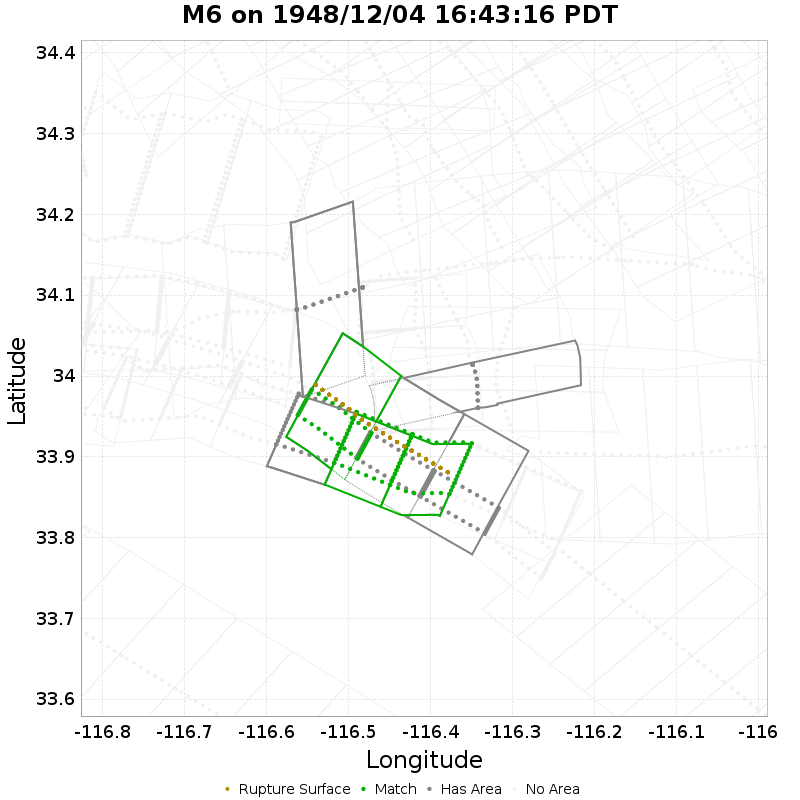

| Section Index | Section Name | Match? | Section Area | Rup Area in Raw Poly | Rup Area in No-Overlap Poly | Area Fraction | Sect Distance To Rup | UCERF3 Rupture Section? |
|-----|-----|-----|-----|-----|-----|-----|-----|-----|
| 558 | Eureka Peak, Subsection 0 | *NO* | 84.89 [km^2] | 12.2 [km^2] | 0 [km^2] | 0 | mean=11.55 [9.19 14.07] [km] | *NO* |
| 1570 | Pinto Mtn, Subsection 2 | *NO* | 105.57 [km^2] | 18.3 [km^2] | 0 [km^2] | 0 | mean=12.25 [10.61 14.85] [km] | *NO* |
| 1860 | San Andreas (North Branch Mill Creek), Subsection 8 | **YES** | 140.85 [km^2] | 103.7 [km^2] | 79.3 [km^2] | 0.56 | mean=3.15 [0.64 7.72] [km] | *NO* |
| 1861 | San Andreas (North Branch Mill Creek), Subsection 9 | *NO* | 140.85 [km^2] | 109.81 [km^2] | 0 [km^2] | 0 | mean=3.27 [0.83 7.77] [km] | *NO* |
| 1862 | San Andreas (North Branch Mill Creek), Subsection 10 | *NO* | 140.85 [km^2] | 18.3 [km^2] | 0 [km^2] | 0 | mean=5.28 [0.89 11.31] [km] | *NO* |
| 1959 | San Andreas (San Gorgonio Pass-Garnet HIll), Subsection 2 | **YES** | 94.91 [km^2] | 67.1 [km^2] | 67.1 [km^2] | 0.71 | mean=2.21 [0.31 5.26] [km] | *NO* |
| 1960 | San Andreas (San Gorgonio Pass-Garnet HIll), Subsection 3 | **YES** | 94.91 [km^2] | 85.4 [km^2] | 85.4 [km^2] | 0.9 | mean=2.75 [0.36 6.6] [km] | *NO* |
| 1961 | San Andreas (San Gorgonio Pass-Garnet HIll), Subsection 4 | *NO* | 94.91 [km^2] | 12.2 [km^2] | 0 [km^2] | 0 | mean=4.44 [0.36 9.07] [km] | *NO* |

## M7.5 on 1952/07/21 04:52:14 PDT
*[(top)](#table-of-contents)*

| Section Index | Section Name | Match? | Section Area | Rup Area in Raw Poly | Rup Area in No-Overlap Poly | Area Fraction | Sect Distance To Rup | UCERF3 Rupture Section? |
|-----|-----|-----|-----|-----|-----|-----|-----|-----|
| 167 | Breckenridge 2011, Subsection 0 | *NO* | 82.93 [km^2] | 8.77 [km^2] | 1.07 [km^2] | 0.01 | mean=4.49 [2.06 7.07] [km] | *NO* |
| 1609 | Pleito, Subsection 3 | *NO* | 148.4 [km^2] | 17.11 [km^2] | 0 [km^2] | 0 | mean=12.56 [5.8 20.4] [km] | *NO* |
| 2568 | White Wolf, Subsection 0 | **YES** | 95.84 [km^2] | 89.85 [km^2] | 89.85 [km^2] | 0.94 | mean=0.31 [0 0.56] [km] | **YES** |
| 2569 | White Wolf, Subsection 1 | **YES** | 95.84 [km^2] | 95.84 [km^2] | 95.84 [km^2] | 1 | mean=0.31 [0 0.56] [km] | **YES** |
| 2570 | White Wolf, Subsection 2 | **YES** | 95.84 [km^2] | 95.84 [km^2] | 95.84 [km^2] | 1 | mean=0.31 [0 0.56] [km] | **YES** |
| 2571 | White Wolf, Subsection 3 | **YES** | 95.84 [km^2] | 95.84 [km^2] | 95.84 [km^2] | 1 | mean=0.31 [0 0.58] [km] | **YES** |
| 2572 | White Wolf, Subsection 4 | **YES** | 95.84 [km^2] | 95.84 [km^2] | 95.84 [km^2] | 1 | mean=0.31 [0 0.55] [km] | **YES** |
| 2573 | White Wolf, Subsection 5 | **YES** | 95.84 [km^2] | 95.84 [km^2] | 95.84 [km^2] | 1 | mean=0.31 [0 0.56] [km] | **YES** |
| 2574 | White Wolf, Subsection 6 | **YES** | 95.84 [km^2] | 95.84 [km^2] | 95.84 [km^2] | 1 | mean=0.31 [0 0.57] [km] | **YES** |
| 2575 | White Wolf, Subsection 7 | **YES** | 95.84 [km^2] | 95.84 [km^2] | 95.84 [km^2] | 1 | mean=0.31 [0 0.57] [km] | **YES** |
| 2576 | White Wolf, Subsection 8 | **YES** | 95.84 [km^2] | 95.84 [km^2] | 95.84 [km^2] | 1 | mean=0.31 [0 0.58] [km] | **YES** |

## M6 on 1952/11/21 23:46:37 PST
*[(top)](#table-of-contents)*

| Section Index | Section Name | Match? | Section Area | Rup Area in Raw Poly | Rup Area in No-Overlap Poly | Area Fraction | Sect Distance To Rup | UCERF3 Rupture Section? |
|-----|-----|-----|-----|-----|-----|-----|-----|-----|
| 912 | Hosgri, Subsection 16 | *NO* | 68.23 [km^2] | 0.5 [km^2] | 0.5 [km^2] | 0.01 | mean=10.11 [7.85 12.71] [km] | *NO* |
| 913 | Hosgri, Subsection 17 | *NO* | 68.23 [km^2] | 15.38 [km^2] | 15.38 [km^2] | 0.23 | mean=8.69 [6.78 11.18] [km] | *NO* |
| 914 | Hosgri, Subsection 18 | *NO* | 68.23 [km^2] | 2.02 [km^2] | 2.02 [km^2] | 0.03 | mean=9.46 [6.89 12.19] [km] | *NO* |

## M6.4 on 1954/03/19 01:54:27 PST
*[(top)](#table-of-contents)*

| Section Index | Section Name | Match? | Section Area | Rup Area in Raw Poly | Rup Area in No-Overlap Poly | Area Fraction | Sect Distance To Rup | UCERF3 Rupture Section? |
|-----|-----|-----|-----|-----|-----|-----|-----|-----|
| 2159 | San Jacinto (Borrego), Subsection 0 | *NO* | 70.39 [km^2] | 59.97 [km^2] | 19.99 [km^2] | 0.28 | mean=9.26 [8.62 10.19] [km] | *NO* |
| 2160 | San Jacinto (Borrego), Subsection 1 | **YES** | 63.83 [km^2] | 44.98 [km^2] | 44.98 [km^2] | 0.7 | mean=10.23 [8.99 11.33] [km] | *NO* |
| 2169 | San Jacinto (Clark) rev, Subsection 4 | *NO* | 118.01 [km^2] | 5 [km^2] | 5 [km^2] | 0.04 | mean=4.3 [0.46 9.77] [km] | *NO* |
| 2170 | San Jacinto (Clark) rev, Subsection 5 | **YES** | 118.01 [km^2] | 79.96 [km^2] | 79.96 [km^2] | 0.68 | mean=2.3 [0.62 6.73] [km] | *NO* |
| 2176 | San Jacinto (Coyote Creek), Subsection 5 | *NO* | 110.26 [km^2] | 44.98 [km^2] | 0 [km^2] | 0 | mean=9.36 [8.41 11.07] [km] | *NO* |

## M6.5 on 1954/12/21 11:56:29 PST
*[(top)](#table-of-contents)*

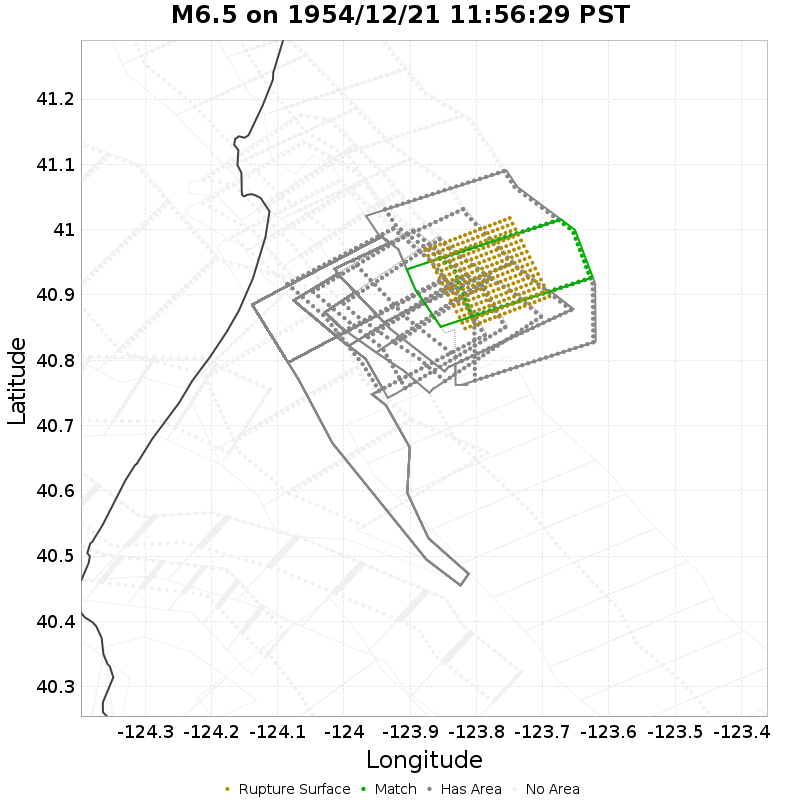

| Section Index | Section Name | Match? | Section Area | Rup Area in Raw Poly | Rup Area in No-Overlap Poly | Area Fraction | Sect Distance To Rup | UCERF3 Rupture Section? |
|-----|-----|-----|-----|-----|-----|-----|-----|-----|
| 101 | Big Lagoon - Bald Mtn 2011 CFM, Subsection 0 | *NO* | 222.99 [km^2] | 20.91 [km^2] | 0 [km^2] | 0 | mean=4.79 [0.51 9.62] [km] | *NO* |
| 102 | Big Lagoon - Bald Mtn 2011 CFM, Subsection 1 | **YES** | 222.99 [km^2] | 183.44 [km^2] | 183.44 [km^2] | 0.82 | mean=2.44 [0.24 6.71] [km] | *NO* |
| 103 | Big Lagoon - Bald Mtn 2011 CFM, Subsection 2 | *NO* | 222.99 [km^2] | 44.42 [km^2] | 44.42 [km^2] | 0.2 | mean=3.78 [0.24 8.71] [km] | *NO* |
| 561 | Fickle Hill (alt1), Subsection 0 | *NO* | 218.56 [km^2] | 19.08 [km^2] | 0 [km^2] | 0 | mean=10.44 [7.8 15.4] [km] | *NO* |
| 562 | Fickle Hill (alt1), Subsection 1 | *NO* | 218.56 [km^2] | 3.14 [km^2] | 0 [km^2] | 0 | mean=12.07 [8.61 18.45] [km] | *NO* |
| 1200 | Mad River (alt1), Subsection 0 | *NO* | 212.37 [km^2] | 54.62 [km^2] | 0 [km^2] | 0 | mean=7.92 [5.68 12.76] [km] | *NO* |
| 1201 | Mad River (alt1), Subsection 1 | *NO* | 212.37 [km^2] | 24.83 [km^2] | 0 [km^2] | 0 | mean=10.03 [6.67 15.89] [km] | *NO* |
| 1232 | McKinleyville (alt1), Subsection 0 | *NO* | 193.29 [km^2] | 66.11 [km^2] | 0 [km^2] | 0 | mean=5.47 [2.78 9.4] [km] | *NO* |
| 1233 | McKinleyville (alt1), Subsection 1 | *NO* | 193.29 [km^2] | 58.27 [km^2] | 0 [km^2] | 0 | mean=7.91 [4.82 12.99] [km] | *NO* |
| 2509 | Trinidad (alt1), Subsection 0 | *NO* | 225.54 [km^2] | 113.93 [km^2] | 20.91 [km^2] | 0.09 | mean=3.16 [0.61 6.65] [km] | *NO* |
| 2510 | Trinidad (alt1), Subsection 1 | *NO* | 225.54 [km^2] | 96.43 [km^2] | 0 [km^2] | 0 | mean=5.15 [2.25 9.38] [km] | *NO* |

## M6.1 on 1959/06/23 07:35:00 PDT
*[(top)](#table-of-contents)*

## M6 on 1966/06/27 21:26:13 PDT
*[(top)](#table-of-contents)*

| Section Index | Section Name | Match? | Section Area | Rup Area in Raw Poly | Rup Area in No-Overlap Poly | Area Fraction | Sect Distance To Rup | UCERF3 Rupture Section? |
|-----|-----|-----|-----|-----|-----|-----|-----|-----|
| 1920 | San Andreas (Parkfield), Subsection 0 | *NO* | 23.24 [km^2] | 2.06 [km^2] | 2.06 [km^2] | 0.09 | mean=2.26 [0.45 4.59] [km] | *NO* |
| 1921 | San Andreas (Parkfield), Subsection 1 | **YES** | 20.59 [km^2] | 20.32 [km^2] | 20.32 [km^2] | 0.99 | mean=0.36 [0 0.65] [km] | **YES** |
| 1922 | San Andreas (Parkfield), Subsection 2 | **YES** | 17.93 [km^2] | 17.66 [km^2] | 17.66 [km^2] | 0.99 | mean=0.23 [0 0.45] [km] | **YES** |
| 1923 | San Andreas (Parkfield), Subsection 3 | **YES** | 15.27 [km^2] | 15.01 [km^2] | 15.01 [km^2] | 0.98 | mean=0.34 [0 0.57] [km] | **YES** |
| 1924 | San Andreas (Parkfield), Subsection 4 | **YES** | 12.62 [km^2] | 10.09 [km^2] | 10.09 [km^2] | 0.8 | mean=0.27 [0 0.5] [km] | **YES** |
| 1925 | San Andreas (Parkfield), Subsection 5 | **YES** | 9.96 [km^2] | 10.23 [km^2] | 10.23 [km^2] | 1.03 | mean=0.3 [0 0.52] [km] | **YES** |
| 1926 | San Andreas (Parkfield), Subsection 6 | *NO* | 7.3 [km^2] | 1 [km^2] | 1 [km^2] | 0.14 | mean=2.55 [0.13 5.02] [km] | *NO* |
| 2203 | San Juan, Subsection 0 | *NO* | 73.9 [km^2] | 10.29 [km^2] | 0 [km^2] | 0 | mean=3.46 [2.07 6.11] [km] | *NO* |

## M6.6 on 1968/04/08 18:28:58 PST
*[(top)](#table-of-contents)*

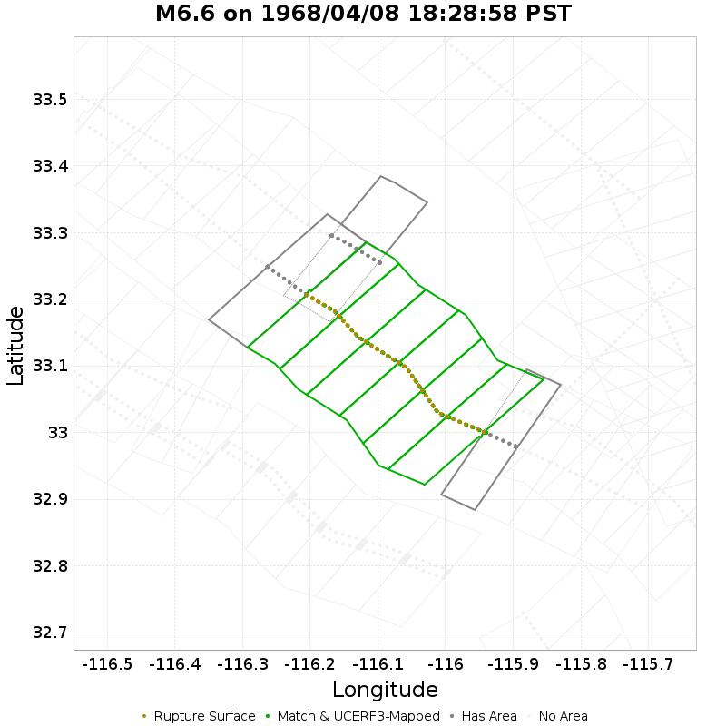

| Section Index | Section Name | Match? | Section Area | Rup Area in Raw Poly | Rup Area in No-Overlap Poly | Area Fraction | Sect Distance To Rup | UCERF3 Rupture Section? |
|-----|-----|-----|-----|-----|-----|-----|-----|-----|
| 2159 | San Jacinto (Borrego), Subsection 0 | **YES** | 70.39 [km^2] | 70.39 [km^2] | 70.39 [km^2] | 1 | mean=0.32 [0 0.52] [km] | **YES** |
| 2160 | San Jacinto (Borrego), Subsection 1 | **YES** | 63.83 [km^2] | 58.51 [km^2] | 58.51 [km^2] | 0.92 | mean=0.31 [0 0.51] [km] | **YES** |
| 2161 | San Jacinto (Borrego), Subsection 2 | **YES** | 52.36 [km^2] | 53.32 [km^2] | 53.32 [km^2] | 1.02 | mean=0.3 [0 0.48] [km] | **YES** |
| 2162 | San Jacinto (Borrego), Subsection 3 | **YES** | 37.93 [km^2] | 39.13 [km^2] | 39.13 [km^2] | 1.03 | mean=0.24 [0 0.46] [km] | **YES** |
| 2163 | San Jacinto (Borrego), Subsection 4 | **YES** | 34.57 [km^2] | 34.85 [km^2] | 34.85 [km^2] | 1.01 | mean=0.26 [0 0.47] [km] | **YES** |
| 2164 | San Jacinto (Borrego), Subsection 5 | **YES** | 37.4 [km^2] | 40.28 [km^2] | 40.28 [km^2] | 1.08 | mean=0.28 [0 0.54] [km] | **YES** |
| 2170 | San Jacinto (Clark) rev, Subsection 5 | *NO* | 118.01 [km^2] | 64.52 [km^2] | 0 [km^2] | 0 | mean=10.33 [10.19 11.04] [km] | *NO* |
| 2176 | San Jacinto (Coyote Creek), Subsection 5 | *NO* | 110.26 [km^2] | 5.87 [km^2] | 0 [km^2] | 0 | mean=3.75 [0.15 7.53] [km] | *NO* |
| 2192 | San Jacinto (Superstition Mtn), Subsection 0 | *NO* | 55.43 [km^2] | 3.12 [km^2] | 0 [km^2] | 0 | mean=3.18 [0.24 6.86] [km] | *NO* |

## M6.6 on 1971/02/09 06:00:41 PST
*[(top)](#table-of-contents)*

| Section Index | Section Name | Match? | Section Area | Rup Area in Raw Poly | Rup Area in No-Overlap Poly | Area Fraction | Sect Distance To Rup | UCERF3 Rupture Section? |
|-----|-----|-----|-----|-----|-----|-----|-----|-----|
| 1299 | Mission Hills 2011, Subsection 0 | *NO* | 104.36 [km^2] | 64.14 [km^2] | 0 [km^2] | 0 | mean=3.17 [1.05 5.34] [km] | *NO* |
| 1300 | Mission Hills 2011, Subsection 1 | *NO* | 104.36 [km^2] | 8.75 [km^2] | 0 [km^2] | 0 | mean=4.13 [1.07 7.19] [km] | *NO* |
| 1412 | Northridge, Subsection 3 | *NO* | 98.43 [km^2] | 21.75 [km^2] | 0 [km^2] | 0 | mean=9.89 [2.15 17.57] [km] | *NO* |
| 1413 | Northridge, Subsection 4 | *NO* | 98.43 [km^2] | 25.12 [km^2] | 0 [km^2] | 0 | mean=11.28 [3.52 19.52] [km] | *NO* |
| 1414 | Northridge Hills, Subsection 0 | *NO* | 324.75 [km^2] | 147.56 [km^2] | 11.66 [km^2] | 0.04 | mean=2.67 [0.18 8.27] [km] | *NO* |
| 2095 | San Gabriel, Subsection 0 | *NO* | 119.96 [km^2] | 71.99 [km^2] | 1.12 [km^2] | 0.01 | mean=2.86 [0.27 6.62] [km] | *NO* |
| 2096 | San Gabriel, Subsection 1 | *NO* | 119.96 [km^2] | 102.71 [km^2] | 2.69 [km^2] | 0.02 | mean=3.06 [0.73 5.4] [km] | *NO* |
| 2097 | San Gabriel, Subsection 2 | *NO* | 119.96 [km^2] | 47.32 [km^2] | 0 [km^2] | 0 | mean=4.77 [1.56 9.47] [km] | *NO* |
| 2301 | Santa Susana East (connector), Subsection 0 | *NO* | 74.82 [km^2] | 19.96 [km^2] | 0 [km^2] | 0 | mean=7.72 [0.26 16.71] [km] | *NO* |
| 2302 | Santa Susana East (connector), Subsection 1 | *NO* | 74.82 [km^2] | 12.56 [km^2] | 0 [km^2] | 0 | mean=8.7 [0.49 18.01] [km] | *NO* |
| 2303 | Santa Susana alt 1, Subsection 0 | *NO* | 162.32 [km^2] | 1.57 [km^2] | 0 [km^2] | 0 | mean=4.18 [0.45 8.43] [km] | *NO* |
| 2374 | Sierra Madre (San Fernando), Subsection 0 | **YES** | 106.74 [km^2] | 96.2 [km^2] | 96.2 [km^2] | 0.9 | mean=0.35 [0 0.64] [km] | **YES** |
| 2375 | Sierra Madre (San Fernando), Subsection 1 | **YES** | 106.74 [km^2] | 104.95 [km^2] | 104.95 [km^2] | 0.98 | mean=0.35 [0 0.71] [km] | **YES** |
| 2376 | Sierra Madre (San Fernando), Subsection 2 | **YES** | 106.74 [km^2] | 103.61 [km^2] | 103.61 [km^2] | 0.97 | mean=0.33 [0 0.58] [km] | **YES** |
| 2527 | Verdugo, Subsection 2 | *NO* | 125.99 [km^2] | 0.67 [km^2] | 0 [km^2] | 0 | mean=8.66 [5.77 13.09] [km] | *NO* |
| 2528 | Verdugo, Subsection 3 | *NO* | 125.99 [km^2] | 39.47 [km^2] | 0 [km^2] | 0 | mean=5.54 [3.07 8.68] [km] | *NO* |

## M6.51 on 1979/10/15 16:16:53 PDT
*[(top)](#table-of-contents)*

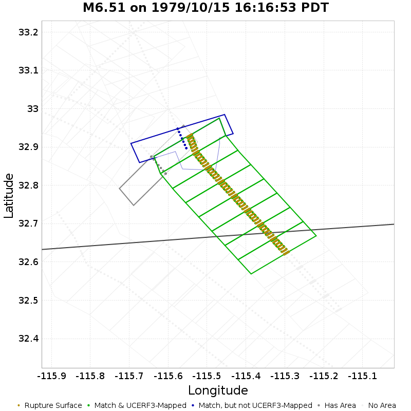

| Section Index | Section Name | Match? | Section Area | Rup Area in Raw Poly | Rup Area in No-Overlap Poly | Area Fraction | Sect Distance To Rup | UCERF3 Rupture Section? |
|-----|-----|-----|-----|-----|-----|-----|-----|-----|
| 166 | Brawley (Seismic Zone) alt 1, Subsection 9 | **YES** | 7.91 [km^2] | 113.01 [km^2] | 4.11 [km^2] | 0.52 | mean=3.19 [2.62 4.2] [km] | *NO* |
| 965 | Imperial, Subsection 4 | **YES** | 51.96 [km^2] | 47.63 [km^2] | 47.63 [km^2] | 0.92 | mean=0.22 [0 0.4] [km] | **YES** |
| 966 | Imperial, Subsection 5 | **YES** | 51.96 [km^2] | 51.96 [km^2] | 51.96 [km^2] | 1 | mean=0.22 [0 0.4] [km] | **YES** |
| 967 | Imperial, Subsection 6 | **YES** | 51.96 [km^2] | 51.96 [km^2] | 51.96 [km^2] | 1 | mean=0.22 [0 0.4] [km] | **YES** |
| 968 | Imperial, Subsection 7 | **YES** | 51.96 [km^2] | 51.96 [km^2] | 51.96 [km^2] | 1 | mean=0.22 [0 0.4] [km] | **YES** |
| 969 | Imperial, Subsection 8 | **YES** | 51.96 [km^2] | 51.96 [km^2] | 51.96 [km^2] | 1 | mean=0.22 [0 0.4] [km] | **YES** |
| 970 | Imperial, Subsection 9 | **YES** | 51.96 [km^2] | 51.96 [km^2] | 51.96 [km^2] | 1 | mean=0.22 [0 0.4] [km] | **YES** |
| 971 | Imperial, Subsection 10 | **YES** | 51.96 [km^2] | 51.96 [km^2] | 51.96 [km^2] | 1 | mean=0.22 [0 0.4] [km] | **YES** |
| 972 | Imperial, Subsection 11 | **YES** | 51.96 [km^2] | 52.18 [km^2] | 52.18 [km^2] | 1 | mean=0.22 [0 0.4] [km] | **YES** |
| 2445 | Superstition Hills, Subsection 5 | *NO* | 76.04 [km^2] | 30.53 [km^2] | 0 [km^2] | 0 | mean=9.84 [8.73 11.4] [km] | *NO* |

## M6.2 on 1980/05/25 09:33:44 PDT
*[(top)](#table-of-contents)*

| Section Index | Section Name | Match? | Section Area | Rup Area in Raw Poly | Rup Area in No-Overlap Poly | Area Fraction | Sect Distance To Rup | UCERF3 Rupture Section? |
|-----|-----|-----|-----|-----|-----|-----|-----|-----|
| 795 | Hartley Springs 2011 CFM, Subsection 0 | *NO* | 122.81 [km^2] | 28.56 [km^2] | 0 [km^2] | 0 | mean=6.51 [4.77 9.85] [km] | *NO* |
| 796 | Hartley Springs 2011 CFM, Subsection 1 | *NO* | 122.81 [km^2] | 8.06 [km^2] | 3.46 [km^2] | 0.03 | mean=5.54 [4.38 8.82] [km] | *NO* |
| 866 | Hilton Creek 2011 CFM, Subsection 1 | **YES** | 132.68 [km^2] | 123.01 [km^2] | 123.01 [km^2] | 0.93 | mean=0.35 [0 0.6] [km] | **YES** |
| 867 | Hilton Creek 2011 CFM, Subsection 2 | **YES** | 132.68 [km^2] | 129 [km^2] | 129 [km^2] | 0.97 | mean=0.35 [0 0.6] [km] | **YES** |
| 868 | Hilton Creek 2011 CFM, Subsection 3 | **YES** | 132.68 [km^2] | 129 [km^2] | 129 [km^2] | 0.97 | mean=0.35 [0 0.6] [km] | **YES** |

## M6 on 1980/05/25 09:49:27 PDT
*[(top)](#table-of-contents)*

| Section Index | Section Name | Match? | Section Area | Rup Area in Raw Poly | Rup Area in No-Overlap Poly | Area Fraction | Sect Distance To Rup | UCERF3 Rupture Section? |
|-----|-----|-----|-----|-----|-----|-----|-----|-----|
| 867 | Hilton Creek 2011 CFM, Subsection 2 | *NO* | 132.68 [km^2] | 32.68 [km^2] | 32.68 [km^2] | 0.25 | mean=9.65 [6.92 14.26] [km] | *NO* |

## M6.33 on 1980/06/08 20:28:19 PDT
*[(top)](#table-of-contents)*

| Section Index | Section Name | Match? | Section Area | Rup Area in Raw Poly | Rup Area in No-Overlap Poly | Area Fraction | Sect Distance To Rup | UCERF3 Rupture Section? |
|-----|-----|-----|-----|-----|-----|-----|-----|-----|
| 294 | Cerro Prieto, Subsection 7 | *NO* | 95.71 [km^2] | 45.01 [km^2] | 45.01 [km^2] | 0.47 | mean=3.74 [3.26 5.41] [km] | *NO* |
| 295 | Cerro Prieto, Subsection 8 | **YES** | 95.71 [km^2] | 70.01 [km^2] | 70.01 [km^2] | 0.73 | mean=4.35 [3.68 5.79] [km] | *NO* |
| 296 | Cerro Prieto, Subsection 9 | *NO* | 95.71 [km^2] | 70.01 [km^2] | 20 [km^2] | 0.21 | mean=5.43 [4.78 6.71] [km] | *NO* |
| 297 | Cerro Prieto, Subsection 10 | **YES** | 95.71 [km^2] | 70.01 [km^2] | 50.01 [km^2] | 0.52 | mean=6.47 [5.87 7.57] [km] | *NO* |
| 298 | Cerro Prieto, Subsection 11 | *NO* | 95.71 [km^2] | 45.01 [km^2] | 45.01 [km^2] | 0.47 | mean=7.3 [6.83 8.39] [km] | *NO* |
| 1042 | Laguna Salada, Subsection 0 | **YES** | 44.13 [km^2] | 70.01 [km^2] | 70.01 [km^2] | 1.59 | mean=4.79 [3.47 6.13] [km] | *NO* |
| 1043 | Laguna Salada, Subsection 1 | *NO* | 44.13 [km^2] | 60.01 [km^2] | 0 [km^2] | 0 | mean=7.28 [6 8.48] [km] | *NO* |
| 1044 | Laguna Salada, Subsection 2 | *NO* | 44.13 [km^2] | 70.01 [km^2] | 0 [km^2] | 0 | mean=9.47 [8.37 10.54] [km] | *NO* |
| 1045 | Laguna Salada, Subsection 3 | *NO* | 44.13 [km^2] | 5 [km^2] | 0 [km^2] | 0 | mean=11.77 [10.42 13.65] [km] | *NO* |

## M7.3 on 1980/11/08 02:27:33 PST
*[(top)](#table-of-contents)*

## M5.9 on 1981/04/26 05:09:28 PDT
*[(top)](#table-of-contents)*

| Section Index | Section Name | Match? | Section Area | Rup Area in Raw Poly | Rup Area in No-Overlap Poly | Area Fraction | Sect Distance To Rup | UCERF3 Rupture Section? |
|-----|-----|-----|-----|-----|-----|-----|-----|-----|
| 163 | Brawley (Seismic Zone) alt 1, Subsection 6 | **YES** | 7.91 [km^2] | 71.02 [km^2] | 71.02 [km^2] | 8.98 | mean=4.39 [2.89 6.48] [km] | *NO* |
| 506 | Elmore Ranch, Subsection 1 | *NO* | 49.62 [km^2] | 7.1 [km^2] | 0 [km^2] | 0 | mean=11.52 [10.47 12.7] [km] | *NO* |
| 507 | Elmore Ranch, Subsection 2 | *NO* | 49.62 [km^2] | 39.06 [km^2] | 0 [km^2] | 0 | mean=9.82 [9.36 10.75] [km] | *NO* |

## M6.3 on 1983/05/02 16:42:38 PDT
*[(top)](#table-of-contents)*

| Section Index | Section Name | Match? | Section Area | Rup Area in Raw Poly | Rup Area in No-Overlap Poly | Area Fraction | Sect Distance To Rup | UCERF3 Rupture Section? |
|-----|-----|-----|-----|-----|-----|-----|-----|-----|
| 769 | Great Valley 12, Subsection 3 | *NO* | 39.45 [km^2] | 2.54 [km^2] | 2.08 [km^2] | 0.05 | mean=3.19 [2.09 5.51] [km] | *NO* |
| 770 | Great Valley 13 (Coalinga), Subsection 0 | **YES** | 223.29 [km^2] | 222.83 [km^2] | 222.83 [km^2] | 1 | mean=0.39 [0 0.67] [km] | **YES** |
| 771 | Great Valley 13 (Coalinga), Subsection 1 | **YES** | 223.29 [km^2] | 223.29 [km^2] | 223.29 [km^2] | 1 | mean=0.39 [0 0.66] [km] | **YES** |
| 772 | Great Valley 13 (Coalinga), Subsection 2 | **YES** | 223.29 [km^2] | 213.14 [km^2] | 213.14 [km^2] | 0.95 | mean=0.39 [0 0.66] [km] | **YES** |
| 773 | Great Valley 14 (Kettleman Hills), Subsection 0 | *NO* | 415.33 [km^2] | 0.46 [km^2] | 0 [km^2] | 0 | mean=11.22 [1.38 24.01] [km] | *NO* |

## M6.15 on 1984/04/24 13:15:18 PST
*[(top)](#table-of-contents)*

| Section Index | Section Name | Match? | Section Area | Rup Area in Raw Poly | Rup Area in No-Overlap Poly | Area Fraction | Sect Distance To Rup | UCERF3 Rupture Section? |
|-----|-----|-----|-----|-----|-----|-----|-----|-----|
| 193 | Calaveras (Central) 2011 CFM, Subsection 2 | **YES** | 32.81 [km^2] | 30.07 [km^2] | 30.07 [km^2] | 0.92 | mean=0.36 [0 0.56] [km] | **YES** |
| 194 | Calaveras (Central) 2011 CFM, Subsection 3 | **YES** | 38.32 [km^2] | 37.86 [km^2] | 37.86 [km^2] | 0.99 | mean=0.36 [0 0.58] [km] | **YES** |
| 195 | Calaveras (Central) 2011 CFM, Subsection 4 | **YES** | 38.32 [km^2] | 38.32 [km^2] | 38.32 [km^2] | 1 | mean=0.37 [0 0.58] [km] | **YES** |
| 196 | Calaveras (Central) 2011 CFM, Subsection 5 | **YES** | 38.45 [km^2] | 38.44 [km^2] | 38.44 [km^2] | 1 | mean=0.37 [0 0.57] [km] | **YES** |
| 197 | Calaveras (Central) 2011 CFM, Subsection 6 | *NO* | 50.1 [km^2] | 3.2 [km^2] | 3.2 [km^2] | 0.06 | mean=2.68 [0.01 5.53] [km] | *NO* |
| 836 | Hayward (So) extension 2011 CFM, Subsection 0 | *NO* | 13.58 [km^2] | 19.17 [km^2] | 0 [km^2] | 0 | mean=1.53 [0.44 2.68] [km] | *NO* |
| 837 | Hayward (So) extension 2011 CFM, Subsection 1 | *NO* | 13.58 [km^2] | 4.01 [km^2] | 0 [km^2] | 0 | mean=1.81 [0.35 4.07] [km] | *NO* |
| 2381 | Silver Creek 2011 CFM, Subsection 0 | *NO* | 55.55 [km^2] | 38.32 [km^2] | 0 [km^2] | 0 | mean=2.92 [1.8 5.05] [km] | *NO* |
| 2382 | Silver Creek 2011 CFM, Subsection 1 | *NO* | 55.55 [km^2] | 40.75 [km^2] | 0 [km^2] | 0 | mean=4.25 [3.3 5.93] [km] | *NO* |
| 2383 | Silver Creek 2011 CFM, Subsection 2 | *NO* | 55.55 [km^2] | 11.42 [km^2] | 0 [km^2] | 0 | mean=5.65 [4.39 7.81] [km] | *NO* |

## M6.6 on 1984/09/09 20:14:28 PDT
*[(top)](#table-of-contents)*

## M6.08 on 1985/08/04 05:01:55 PDT
*[(top)](#table-of-contents)*

| Section Index | Section Name | Match? | Section Area | Rup Area in Raw Poly | Rup Area in No-Overlap Poly | Area Fraction | Sect Distance To Rup | UCERF3 Rupture Section? |
|-----|-----|-----|-----|-----|-----|-----|-----|-----|
| 772 | Great Valley 13 (Coalinga), Subsection 2 | *NO* | 223.29 [km^2] | 3.47 [km^2] | 3.47 [km^2] | 0.02 | mean=10.76 [0.45 21.68] [km] | *NO* |
| 773 | Great Valley 14 (Kettleman Hills), Subsection 0 | *NO* | 415.33 [km^2] | 22.78 [km^2] | 22.78 [km^2] | 0.05 | mean=17.23 [0.23 35.69] [km] | *NO* |
| 774 | Great Valley 14 (Kettleman Hills), Subsection 1 | *NO* | 415.33 [km^2] | 14.86 [km^2] | 14.86 [km^2] | 0.04 | mean=14.9 [0.34 32.11] [km] | *NO* |

## M6.02 on 1986/07/08 02:20:44 PDT
*[(top)](#table-of-contents)*

| Section Index | Section Name | Match? | Section Area | Rup Area in Raw Poly | Rup Area in No-Overlap Poly | Area Fraction | Sect Distance To Rup | UCERF3 Rupture Section? |
|-----|-----|-----|-----|-----|-----|-----|-----|-----|
| 1295 | Mission Creek, Subsection 0 | *NO* | 137.91 [km^2] | 56.69 [km^2] | 0 [km^2] | 0 | mean=6.55 [4.73 8.86] [km] | *NO* |
| 1296 | Mission Creek, Subsection 1 | *NO* | 137.91 [km^2] | 45.91 [km^2] | 0 [km^2] | 0 | mean=6.78 [5.09 9.46] [km] | *NO* |
| 1568 | Pinto Mtn, Subsection 0 | *NO* | 105.57 [km^2] | 85.04 [km^2] | 0 [km^2] | 0 | mean=6.07 [0.81 12.16] [km] | *NO* |
| 1569 | Pinto Mtn, Subsection 1 | *NO* | 105.57 [km^2] | 57.2 [km^2] | 0 [km^2] | 0 | mean=8.74 [5.04 13.99] [km] | *NO* |
| 1570 | Pinto Mtn, Subsection 2 | *NO* | 105.57 [km^2] | 14.8 [km^2] | 0 [km^2] | 0 | mean=11.99 [7.63 17.52] [km] | *NO* |
| 1858 | San Andreas (North Branch Mill Creek), Subsection 6 | *NO* | 132.56 [km^2] | 85.54 [km^2] | 40.39 [km^2] | 0.3 | mean=3.46 [0.49 6.55] [km] | *NO* |
| 1859 | San Andreas (North Branch Mill Creek), Subsection 7 | *NO* | 134.83 [km^2] | 106.36 [km^2] | 44.65 [km^2] | 0.33 | mean=3.44 [0.23 7.49] [km] | *NO* |
| 1860 | San Andreas (North Branch Mill Creek), Subsection 8 | *NO* | 140.85 [km^2] | 41.14 [km^2] | 13.8 [km^2] | 0.1 | mean=4.79 [0.27 11.5] [km] | *NO* |
| 1961 | San Andreas (San Gorgonio Pass-Garnet HIll), Subsection 4 | *NO* | 94.91 [km^2] | 33.87 [km^2] | 33.87 [km^2] | 0.36 | mean=1.82 [0.4 4.25] [km] | *NO* |
| 1962 | San Andreas (San Gorgonio Pass-Garnet HIll), Subsection 5 | **YES** | 94.91 [km^2] | 57.7 [km^2] | 57.7 [km^2] | 0.61 | mean=1.23 [0.3 3.17] [km] | *NO* |
| 1963 | San Andreas (San Gorgonio Pass-Garnet HIll), Subsection 6 | **YES** | 94.91 [km^2] | 53.18 [km^2] | 53.18 [km^2] | 0.56 | mean=1.15 [0.07 3.35] [km] | *NO* |
| 1964 | San Andreas (San Gorgonio Pass-Garnet HIll), Subsection 7 | *NO* | 94.91 [km^2] | 17.31 [km^2] | 17.31 [km^2] | 0.18 | mean=2.94 [0.4 5.81] [km] | *NO* |

## M6.22 on 1986/07/21 07:42:26 PDT
*[(top)](#table-of-contents)*

| Section Index | Section Name | Match? | Section Area | Rup Area in Raw Poly | Rup Area in No-Overlap Poly | Area Fraction | Sect Distance To Rup | UCERF3 Rupture Section? |
|-----|-----|-----|-----|-----|-----|-----|-----|-----|
| 2557 | White Mountains, Subsection 7 | *NO* | 71.97 [km^2] | 5.14 [km^2] | 5.14 [km^2] | 0.07 | mean=3.17 [0.15 6.16] [km] | *NO* |
| 2558 | White Mountains, Subsection 8 | **YES** | 71.97 [km^2] | 71.97 [km^2] | 71.97 [km^2] | 1 | mean=0.29 [0 0.5] [km] | **YES** |
| 2559 | White Mountains, Subsection 9 | **YES** | 71.97 [km^2] | 66.83 [km^2] | 66.83 [km^2] | 0.93 | mean=0.29 [0 0.5] [km] | **YES** |

## M5.98 on 1987/07/31 16:56:57 PDT
*[(top)](#table-of-contents)*

| Section Index | Section Name | Match? | Section Area | Rup Area in Raw Poly | Rup Area in No-Overlap Poly | Area Fraction | Sect Distance To Rup | UCERF3 Rupture Section? |
|-----|-----|-----|-----|-----|-----|-----|-----|-----|
| 1249 | Mendocino, Subsection 2 | **YES** | 44.57 [km^2] | 24.15 [km^2] | 24.15 [km^2] | 0.54 | mean=14.34 [9.99 18.79] [km] | *NO* |
| 1250 | Mendocino, Subsection 3 | *NO* | 44.57 [km^2] | 3.02 [km^2] | 3.02 [km^2] | 0.07 | mean=13.38 [9.64 17.38] [km] | *NO* |

## M5.89 on 1987/10/01 07:42:20 PDT
*[(top)](#table-of-contents)*

| Section Index | Section Name | Match? | Section Area | Rup Area in Raw Poly | Rup Area in No-Overlap Poly | Area Fraction | Sect Distance To Rup | UCERF3 Rupture Section? |
|-----|-----|-----|-----|-----|-----|-----|-----|-----|
| 540 | Elysian Park (Lower CFM), Subsection 3 | *NO* | 66.96 [km^2] | 8.83 [km^2] | 8.83 [km^2] | 0.13 | mean=4.46 [0.41 10.52] [km] | *NO* |
| 541 | Elysian Park (Lower CFM), Subsection 4 | *NO* | 66.96 [km^2] | 12.51 [km^2] | 12.51 [km^2] | 0.19 | mean=3.95 [0.78 8.94] [km] | *NO* |
| 544 | Elysian Park (Upper), Subsection 0 | *NO* | 94.79 [km^2] | 13.99 [km^2] | 0 [km^2] | 0 | mean=7.83 [5.77 11.02] [km] | *NO* |
| 1636 | Puente Hills, Subsection 2 | *NO* | 150.54 [km^2] | 39.99 [km^2] | 28.71 [km^2] | 0.19 | mean=6.82 [3.52 13.52] [km] | *NO* |
| 1637 | Puente Hills, Subsection 3 | *NO* | 150.54 [km^2] | 18.16 [km^2] | 8.1 [km^2] | 0.05 | mean=7.21 [3.91 12.7] [km] | *NO* |
| 1644 | Raymond, Subsection 0 | *NO* | 107.25 [km^2] | 8.59 [km^2] | 1.47 [km^2] | 0.01 | mean=12.98 [8.13 18.4] [km] | *NO* |
| 1645 | Raymond, Subsection 1 | *NO* | 107.25 [km^2] | 39.99 [km^2] | 0 [km^2] | 0 | mean=10.45 [5.47 16.33] [km] | *NO* |
| 1646 | Raymond, Subsection 2 | *NO* | 107.25 [km^2] | 1.23 [km^2] | 0 [km^2] | 0 | mean=11.38 [5.75 16.9] [km] | *NO* |

## M6.04 on 1987/11/23 17:54:14 PST
*[(top)](#table-of-contents)*

| Section Index | Section Name | Match? | Section Area | Rup Area in Raw Poly | Rup Area in No-Overlap Poly | Area Fraction | Sect Distance To Rup | UCERF3 Rupture Section? |
|-----|-----|-----|-----|-----|-----|-----|-----|-----|
| 160 | Brawley (Seismic Zone) alt 1, Subsection 3 | *NO* | 7.91 [km^2] | 25.05 [km^2] | 0 [km^2] | 0 | mean=4.36 [2.11 6.72] [km] | *NO* |
| 161 | Brawley (Seismic Zone) alt 1, Subsection 4 | *NO* | 7.91 [km^2] | 120.23 [km^2] | 0 [km^2] | 0 | mean=3.35 [1.88 5.27] [km] | *NO* |
| 162 | Brawley (Seismic Zone) alt 1, Subsection 5 | *NO* | 7.91 [km^2] | 30.06 [km^2] | 0 [km^2] | 0 | mean=7.43 [4.79 10.04] [km] | *NO* |
| 505 | Elmore Ranch, Subsection 0 | **YES** | 49.62 [km^2] | 35.07 [km^2] | 35.07 [km^2] | 0.71 | mean=0.92 [0.76 1.73] [km] | *NO* |
| 506 | Elmore Ranch, Subsection 1 | **YES** | 49.62 [km^2] | 50.1 [km^2] | 50.1 [km^2] | 1.01 | mean=0.82 [0.74 1.38] [km] | *NO* |
| 507 | Elmore Ranch, Subsection 2 | **YES** | 49.62 [km^2] | 50.1 [km^2] | 50.1 [km^2] | 1.01 | mean=0.84 [0.77 1.39] [km] | *NO* |
| 508 | Elmore Ranch, Subsection 3 | **YES** | 49.62 [km^2] | 50.1 [km^2] | 50.1 [km^2] | 1.01 | mean=0.85 [0.77 1.4] [km] | *NO* |
| 509 | Elmore Ranch, Subsection 4 | *NO* | 49.62 [km^2] | 15.03 [km^2] | 15.03 [km^2] | 0.3 | mean=1.57 [0.68 3.53] [km] | *NO* |
| 2440 | Superstition Hills, Subsection 0 | *NO* | 76.04 [km^2] | 35.07 [km^2] | 0 [km^2] | 0 | mean=9.21 [8.05 11.11] [km] | *NO* |

## M6.5 on 1987/11/24 05:15:56 PST
*[(top)](#table-of-contents)*

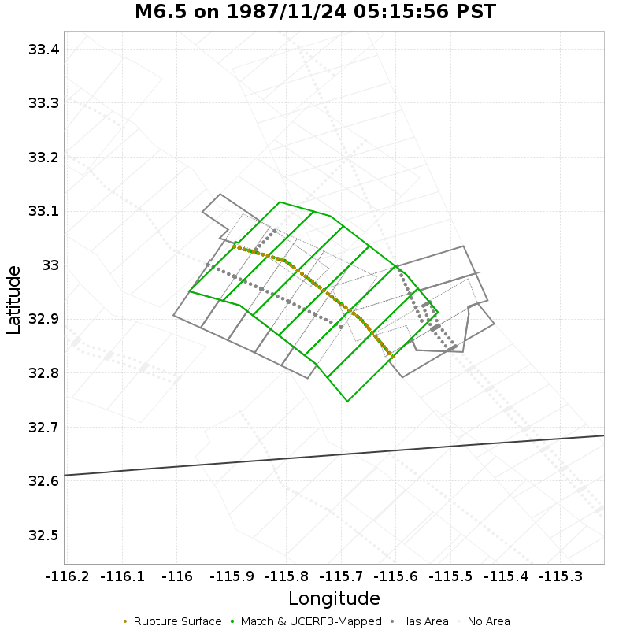

| Section Index | Section Name | Match? | Section Area | Rup Area in Raw Poly | Rup Area in No-Overlap Poly | Area Fraction | Sect Distance To Rup | UCERF3 Rupture Section? |
|-----|-----|-----|-----|-----|-----|-----|-----|-----|
| 165 | Brawley (Seismic Zone) alt 1, Subsection 8 | *NO* | 7.91 [km^2] | 29.31 [km^2] | 0 [km^2] | 0 | mean=10.92 [9.82 12.2] [km] | *NO* |
| 166 | Brawley (Seismic Zone) alt 1, Subsection 9 | *NO* | 7.91 [km^2] | 65.26 [km^2] | 0 [km^2] | 0 | mean=9.06 [8.31 9.82] [km] | *NO* |
| 510 | Elmore Ranch, Subsection 5 | *NO* | 49.62 [km^2] | 100.2 [km^2] | 0 [km^2] | 0 | mean=2.97 [0.66 5.29] [km] | *NO* |
| 971 | Imperial, Subsection 10 | *NO* | 51.96 [km^2] | 5.43 [km^2] | 0 [km^2] | 0 | mean=9.72 [8.73 10.96] [km] | *NO* |
| 972 | Imperial, Subsection 11 | *NO* | 51.96 [km^2] | 43.45 [km^2] | 0 [km^2] | 0 | mean=10.21 [8.75 11.66] [km] | *NO* |
| 2192 | San Jacinto (Superstition Mtn), Subsection 0 | *NO* | 55.43 [km^2] | 38.02 [km^2] | 0 [km^2] | 0 | mean=5.63 [5.41 5.85] [km] | *NO* |
| 2193 | San Jacinto (Superstition Mtn), Subsection 1 | *NO* | 55.43 [km^2] | 69.52 [km^2] | 0 [km^2] | 0 | mean=6.34 [5.9 6.78] [km] | *NO* |
| 2194 | San Jacinto (Superstition Mtn), Subsection 2 | *NO* | 57.29 [km^2] | 49.15 [km^2] | 0 [km^2] | 0 | mean=6.38 [5.79 6.87] [km] | *NO* |
| 2195 | San Jacinto (Superstition Mtn), Subsection 3 | *NO* | 63.26 [km^2] | 42.36 [km^2] | 0 [km^2] | 0 | mean=5.4 [4.66 6.85] [km] | *NO* |
| 2196 | San Jacinto (Superstition Mtn), Subsection 4 | *NO* | 63.26 [km^2] | 43.43 [km^2] | 0 [km^2] | 0 | mean=4.16 [3.53 6.05] [km] | *NO* |
| 2440 | Superstition Hills, Subsection 0 | **YES** | 76.04 [km^2] | 70.6 [km^2] | 70.6 [km^2] | 0.93 | mean=0.3 [0 0.58] [km] | **YES** |
| 2441 | Superstition Hills, Subsection 1 | **YES** | 63 [km^2] | 63.93 [km^2] | 63.93 [km^2] | 1.01 | mean=0.34 [0 0.62] [km] | **YES** |
| 2442 | Superstition Hills, Subsection 2 | **YES** | 49.42 [km^2] | 53.92 [km^2] | 53.92 [km^2] | 1.09 | mean=0.34 [0 0.61] [km] | **YES** |
| 2443 | Superstition Hills, Subsection 3 | **YES** | 49.42 [km^2] | 45.89 [km^2] | 45.89 [km^2] | 0.93 | mean=0.33 [0 0.61] [km] | **YES** |
| 2444 | Superstition Hills, Subsection 4 | **YES** | 64.44 [km^2] | 63.36 [km^2] | 63.36 [km^2] | 0.98 | mean=0.27 [0 0.52] [km] | **YES** |
| 2445 | Superstition Hills, Subsection 5 | **YES** | 76.04 [km^2] | 80.64 [km^2] | 80.64 [km^2] | 1.06 | mean=0.31 [0 0.58] [km] | **YES** |

## M6.89 on 1989/10/17 17:04:15 PDT
*[(top)](#table-of-contents)*

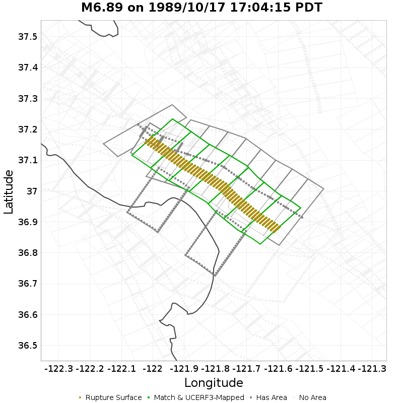

| Section Index | Section Name | Match? | Section Area | Rup Area in Raw Poly | Rup Area in No-Overlap Poly | Area Fraction | Sect Distance To Rup | UCERF3 Rupture Section? |
|-----|-----|-----|-----|-----|-----|-----|-----|-----|
| 178 | Butano 2011 CFM, Subsection 0 | *NO* | 66.39 [km^2] | 91.94 [km^2] | 0 [km^2] | 0 | mean=2.5 [0.29 5.97] [km] | *NO* |
| 179 | Butano 2011 CFM, Subsection 1 | *NO* | 66.39 [km^2] | 50.71 [km^2] | 4.74 [km^2] | 0.07 | mean=2.33 [0.27 5.28] [km] | *NO* |
| 1928 | San Andreas (Peninsula) 2011 CFM, Subsection 0 | *NO* | 80.99 [km^2] | 0.24 [km^2] | 0 [km^2] | 0 | mean=3.59 [0 6.78] [km] | *NO* |
| 1965 | San Andreas (Santa Cruz Mts) 2011 CFM, Subsection 0 | **YES** | 106.15 [km^2] | 108.52 [km^2] | 108.05 [km^2] | 1.02 | mean=0.27 [0 0.46] [km] | **YES** |
| 1966 | San Andreas (Santa Cruz Mts) 2011 CFM, Subsection 1 | **YES** | 106.15 [km^2] | 106.63 [km^2] | 106.15 [km^2] | 1 | mean=0.27 [0 0.46] [km] | **YES** |
| 1967 | San Andreas (Santa Cruz Mts) 2011 CFM, Subsection 2 | **YES** | 106.15 [km^2] | 106.63 [km^2] | 106.15 [km^2] | 1 | mean=0.27 [0 0.46] [km] | **YES** |
| 1968 | San Andreas (Santa Cruz Mts) 2011 CFM, Subsection 3 | **YES** | 106.15 [km^2] | 106.78 [km^2] | 106.54 [km^2] | 1 | mean=0.27 [0 0.46] [km] | **YES** |
| 1969 | San Andreas (Santa Cruz Mts) 2011 CFM, Subsection 4 | **YES** | 104.94 [km^2] | 105.27 [km^2] | 105.27 [km^2] | 1 | mean=0.24 [0 0.45] [km] | **YES** |
| 1970 | San Andreas (Santa Cruz Mts) 2011 CFM, Subsection 5 | **YES** | 102.97 [km^2] | 102.44 [km^2] | 102.44 [km^2] | 0.99 | mean=0.09 [0 0.18] [km] | **YES** |
| 1971 | San Andreas (Santa Cruz Mts) 2011 CFM, Subsection 6 | **YES** | 95.5 [km^2] | 88.68 [km^2] | 88.68 [km^2] | 0.93 | mean=0.13 [0 0.26] [km] | **YES** |
| 2345 | Sargent 2011 CFM, Subsection 0 | *NO* | 64.88 [km^2] | 86.72 [km^2] | 0 [km^2] | 0 | mean=2.18 [0.39 4.22] [km] | *NO* |
| 2346 | Sargent 2011 CFM, Subsection 1 | *NO* | 61.16 [km^2] | 82.46 [km^2] | 0 [km^2] | 0 | mean=3.98 [2.17 5.64] [km] | *NO* |
| 2347 | Sargent 2011 CFM, Subsection 2 | *NO* | 53.2 [km^2] | 88.62 [km^2] | 0 [km^2] | 0 | mean=5.16 [3.79 6.46] [km] | *NO* |
| 2348 | Sargent 2011 CFM, Subsection 3 | *NO* | 27.32 [km^2] | 90.73 [km^2] | 0 [km^2] | 0 | mean=5.89 [5.27 6.59] [km] | *NO* |
| 2349 | Sargent 2011 CFM, Subsection 4 | *NO* | 26.91 [km^2] | 89.81 [km^2] | 0 [km^2] | 0 | mean=6.32 [5.37 7.25] [km] | *NO* |
| 2350 | Sargent 2011 CFM, Subsection 5 | *NO* | 6.83 [km^2] | 85.81 [km^2] | 0 [km^2] | 0 | mean=7.59 [6.91 8.26] [km] | *NO* |
| 2351 | Sargent 2011 CFM, Subsection 6 | *NO* | 6.83 [km^2] | 75.58 [km^2] | 0 [km^2] | 0 | mean=8.15 [8 8.32] [km] | *NO* |
| 2352 | Sargent 2011 CFM, Subsection 7 | *NO* | 6.83 [km^2] | 29.72 [km^2] | 0 [km^2] | 0 | mean=8.34 [8 8.9] [km] | *NO* |
| 2601 | Zayante-Vergeles 2011 CFM, Subsection 3 | *NO* | 240.26 [km^2] | 13.74 [km^2] | 0 [km^2] | 0 | mean=14.58 [6.59 22.92] [km] | *NO* |
| 2603 | Zayante-Vergeles 2011 CFM, Subsection 5 | *NO* | 240.26 [km^2] | 0.47 [km^2] | 0 [km^2] | 0 | mean=14.94 [7.05 22.95] [km] | *NO* |

## M6.12 on 1991/08/17 12:29:40 PDT
*[(top)](#table-of-contents)*

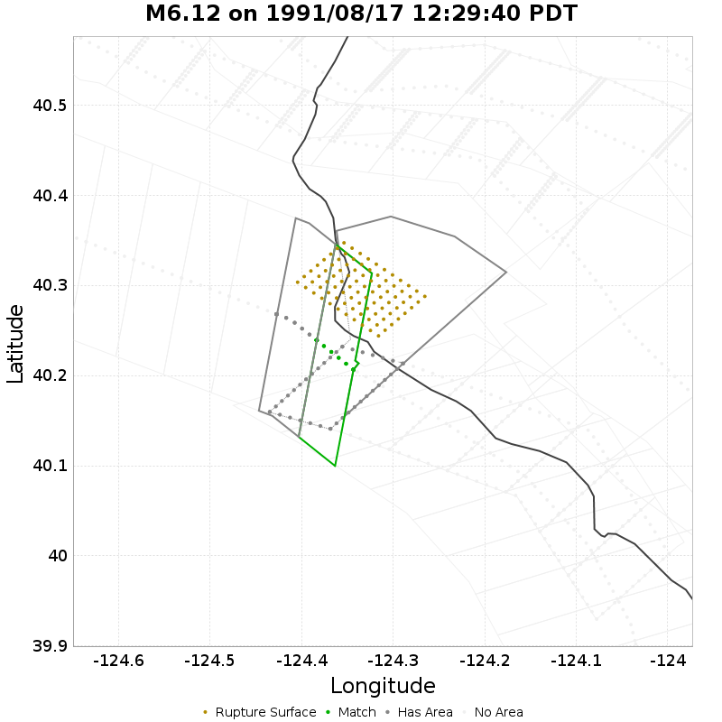

| Section Index | Section Name | Match? | Section Area | Rup Area in Raw Poly | Rup Area in No-Overlap Poly | Area Fraction | Sect Distance To Rup | UCERF3 Rupture Section? |
|-----|-----|-----|-----|-----|-----|-----|-----|-----|
| 1026 | King Range 2011 CFM, Subsection 0 | *NO* | 72.56 [km^2] | 48.13 [km^2] | 32.83 [km^2] | 0.45 | mean=8.89 [6.39 13.72] [km] | *NO* |
| 1247 | Mendocino, Subsection 0 | **YES** | 44.57 [km^2] | 27.15 [km^2] | 27.15 [km^2] | 0.61 | mean=5.35 [4.21 7.39] [km] | *NO* |
| 1248 | Mendocino, Subsection 1 | *NO* | 44.57 [km^2] | 9.13 [km^2] | 9.13 [km^2] | 0.2 | mean=5.05 [3.94 7.07] [km] | *NO* |

## M6.15 on 1992/04/22 21:50:23 PDT
*[(top)](#table-of-contents)*

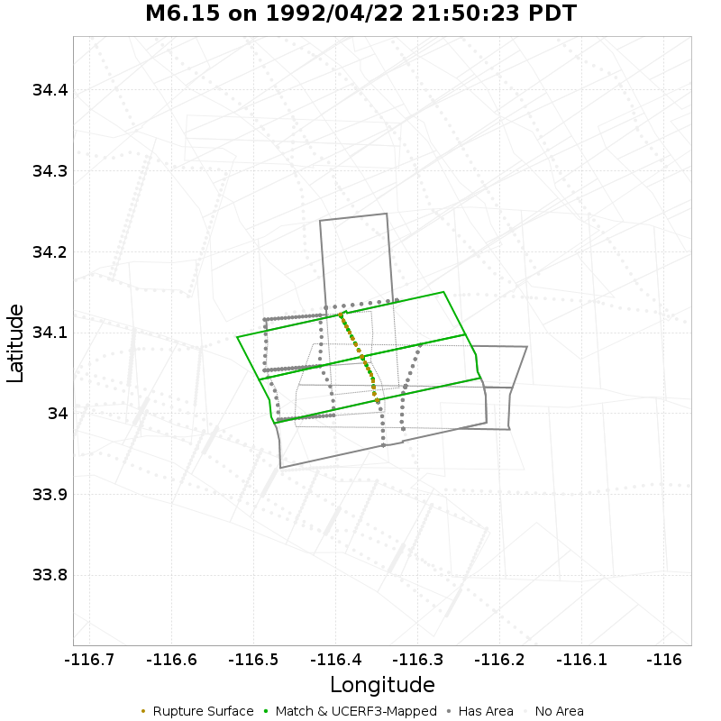

| Section Index | Section Name | Match? | Section Area | Rup Area in Raw Poly | Rup Area in No-Overlap Poly | Area Fraction | Sect Distance To Rup | UCERF3 Rupture Section? |
|-----|-----|-----|-----|-----|-----|-----|-----|-----|
| 175 | Burnt Mtn, Subsection 0 | *NO* | 109.49 [km^2] | 103.08 [km^2] | 0 [km^2] | 0 | mean=6.47 [2.28 10.89] [km] | *NO* |
| 176 | Burnt Mtn, Subsection 1 | *NO* | 109.49 [km^2] | 66.7 [km^2] | 0 [km^2] | 0 | mean=7.94 [4.72 11.43] [km] | *NO* |
| 558 | Eureka Peak, Subsection 0 | *NO* | 84.89 [km^2] | 6.06 [km^2] | 6.06 [km^2] | 0.07 | mean=3.29 [0.29 6.26] [km] | *NO* |
| 559 | Eureka Peak, Subsection 1 | **YES** | 84.89 [km^2] | 84.89 [km^2] | 84.89 [km^2] | 1 | mean=0.38 [0 0.64] [km] | **YES** |
| 560 | Eureka Peak, Subsection 2 | **YES** | 84.89 [km^2] | 78.82 [km^2] | 78.82 [km^2] | 0.93 | mean=0.38 [0 0.64] [km] | **YES** |
| 996 | Joshua Tree (Seismicity), Subsection 0 | *NO* | 69.7 [km^2] | 84.89 [km^2] | 0 [km^2] | 0 | mean=4.94 [3.55 6.64] [km] | *NO* |
| 997 | Joshua Tree (Seismicity), Subsection 1 | *NO* | 69.7 [km^2] | 30.32 [km^2] | 0 [km^2] | 0 | mean=3.57 [2.87 4.93] [km] | *NO* |
| 1572 | Pinto Mtn, Subsection 4 | *NO* | 105.57 [km^2] | 151.58 [km^2] | 0 [km^2] | 0 | mean=3.31 [1.22 6.63] [km] | *NO* |

## M7.15 on 1992/04/25 11:06:05 PDT
*[(top)](#table-of-contents)*

| Section Index | Section Name | Match? | Section Area | Rup Area in Raw Poly | Rup Area in No-Overlap Poly | Area Fraction | Sect Distance To Rup | UCERF3 Rupture Section? |
|-----|-----|-----|-----|-----|-----|-----|-----|-----|
| 79 | Bear River fault zone, Subsection 0 | *NO* | 55.85 [km^2] | 25.28 [km^2] | 19.21 [km^2] | 0.34 | mean=6.77 [2.75 10.74] [km] | *NO* |
| 80 | Bear River fault zone, Subsection 1 | **YES** | 55.85 [km^2] | 36.65 [km^2] | 36.65 [km^2] | 0.66 | mean=6.16 [2.33 10.18] [km] | *NO* |
| 81 | Bear River fault zone, Subsection 2 | *NO* | 55.85 [km^2] | 12.64 [km^2] | 12.64 [km^2] | 0.23 | mean=6.47 [3.34 9.61] [km] | *NO* |
| 82 | Bear River fault zone, Subsection 3 | *NO* | 55.85 [km^2] | 1.52 [km^2] | 1.52 [km^2] | 0.03 | mean=6.87 [5.63 8.88] [km] | *NO* |
| 590 | Garberville - Briceland 2011 CFM, Subsection 4 | *NO* | 179.01 [km^2] | 69.01 [km^2] | 66.99 [km^2] | 0.37 | mean=6.67 [0.37 13.59] [km] | *NO* |
| 1026 | King Range 2011 CFM, Subsection 0 | **YES** | 72.56 [km^2] | 176.45 [km^2] | 155.72 [km^2] | 2.15 | mean=6.12 [3.61 9.52] [km] | *NO* |
| 1027 | King Range 2011 CFM, Subsection 1 | *NO* | 72.56 [km^2] | 36.91 [km^2] | 8.59 [km^2] | 0.12 | mean=9.21 [6.69 12.95] [km] | *NO* |
| 1247 | Mendocino, Subsection 0 | **YES** | 44.57 [km^2] | 45.5 [km^2] | 45.5 [km^2] | 1.02 | mean=2.93 [0.41 6.13] [km] | *NO* |
| 1248 | Mendocino, Subsection 1 | **YES** | 44.57 [km^2] | 62.44 [km^2] | 62.44 [km^2] | 1.4 | mean=2.49 [0.35 4.86] [km] | *NO* |
| 1249 | Mendocino, Subsection 2 | **YES** | 44.57 [km^2] | 30.33 [km^2] | 30.33 [km^2] | 0.68 | mean=3.47 [0.34 6.2] [km] | *NO* |
| 1766 | Russ 2011 CFM, Subsection 3 | *NO* | 180.18 [km^2] | 2.28 [km^2] | 0 [km^2] | 0 | mean=11.74 [8.43 17.21] [km] | *NO* |
| 1767 | Russ 2011 CFM, Subsection 4 | *NO* | 180.18 [km^2] | 0.51 [km^2] | 0 [km^2] | 0 | mean=10.81 [8.27 15.53] [km] | *NO* |

## M6.45 on 1992/04/26 00:41:40 PDT
*[(top)](#table-of-contents)*

| Section Index | Section Name | Match? | Section Area | Rup Area in Raw Poly | Rup Area in No-Overlap Poly | Area Fraction | Sect Distance To Rup | UCERF3 Rupture Section? |
|-----|-----|-----|-----|-----|-----|-----|-----|-----|
| 1249 | Mendocino, Subsection 2 | *NO* | 44.57 [km^2] | 1.75 [km^2] | 1.75 [km^2] | 0.04 | mean=15.66 [11.61 19.91] [km] | *NO* |
| 1250 | Mendocino, Subsection 3 | **YES** | 44.57 [km^2] | 30.72 [km^2] | 30.72 [km^2] | 0.69 | mean=14.83 [11.35 18.62] [km] | *NO* |
| 1251 | Mendocino, Subsection 4 | **YES** | 44.57 [km^2] | 30.47 [km^2] | 30.47 [km^2] | 0.68 | mean=15.03 [11.51 18.79] [km] | *NO* |
| 1252 | Mendocino, Subsection 5 | *NO* | 44.57 [km^2] | 8.99 [km^2] | 8.99 [km^2] | 0.2 | mean=15.34 [11.89 19.05] [km] | *NO* |

## M6.6 on 1992/04/26 04:18:25 PDT
*[(top)](#table-of-contents)*

| Section Index | Section Name | Match? | Section Area | Rup Area in Raw Poly | Rup Area in No-Overlap Poly | Area Fraction | Sect Distance To Rup | UCERF3 Rupture Section? |
|-----|-----|-----|-----|-----|-----|-----|-----|-----|
| 1249 | Mendocino, Subsection 2 | *NO* | 44.57 [km^2] | 2.5 [km^2] | 2.5 [km^2] | 0.06 | mean=13.28 [8.51 18.03] [km] | *NO* |
| 1250 | Mendocino, Subsection 3 | **YES** | 44.57 [km^2] | 25.02 [km^2] | 25.02 [km^2] | 0.56 | mean=12.82 [8.46 17.24] [km] | *NO* |
| 1251 | Mendocino, Subsection 4 | **YES** | 44.57 [km^2] | 22.52 [km^2] | 22.52 [km^2] | 0.51 | mean=13.25 [8.89 17.62] [km] | *NO* |

## M7.28 on 1992/06/28 04:57:34 PDT
*[(top)](#table-of-contents)*

| Section Index | Section Name | Match? | Section Area | Rup Area in Raw Poly | Rup Area in No-Overlap Poly | Area Fraction | Sect Distance To Rup | UCERF3 Rupture Section? |
|-----|-----|-----|-----|-----|-----|-----|-----|-----|
| 230 | Calico-Hidalgo, Subsection 7 | *NO* | 82.14 [km^2] | 60.47 [km^2] | 0 [km^2] | 0 | mean=10.69 [9.8 12.12] [km] | *NO* |
| 231 | Calico-Hidalgo, Subsection 8 | *NO* | 82.14 [km^2] | 90.3 [km^2] | 0 [km^2] | 0 | mean=9.89 [9.72 10.16] [km] | *NO* |
| 232 | Calico-Hidalgo, Subsection 9 | *NO* | 82.14 [km^2] | 71.56 [km^2] | 0 [km^2] | 0 | mean=10.91 [10.09 11.67] [km] | *NO* |
| 233 | Calico-Hidalgo, Subsection 10 | *NO* | 82.14 [km^2] | 6.4 [km^2] | 0 [km^2] | 0 | mean=12.11 [11.64 12.88] [km] | *NO* |
| 241 | Camp Rock 2011, Subsection 0 | *NO* | 102.44 [km^2] | 101.81 [km^2] | 0 [km^2] | 0 | mean=1.14 [0.46 1.94] [km] | *NO* |
| 242 | Camp Rock 2011, Subsection 1 | **YES** | 102.44 [km^2] | 156.11 [km^2] | 57.18 [km^2] | 0.56 | mean=0.34 [0 0.62] [km] | **YES** |
| 243 | Camp Rock 2011, Subsection 2 | **YES** | 102.44 [km^2] | 96.04 [km^2] | 96.04 [km^2] | 0.94 | mean=0.34 [0 0.62] [km] | **YES** |
| 551 | Emerson-Copper Mtn 2011, Subsection 4 | *NO* | 83.48 [km^2] | 132.11 [km^2] | 0 [km^2] | 0 | mean=8.7 [8.04 9.54] [km] | *NO* |
| 552 | Emerson-Copper Mtn 2011, Subsection 5 | *NO* | 83.48 [km^2] | 168.34 [km^2] | 0 [km^2] | 0 | mean=7.02 [5.67 8.14] [km] | *NO* |
| 553 | Emerson-Copper Mtn 2011, Subsection 6 | **YES** | 83.48 [km^2] | 95.39 [km^2] | 95.39 [km^2] | 1.14 | mean=4.18 [2.69 5.88] [km] | *NO* |
| 554 | Emerson-Copper Mtn 2011, Subsection 7 | *NO* | 83.48 [km^2] | 101.36 [km^2] | 0 [km^2] | 0 | mean=1.7 [0.37 2.82] [km] | *NO* |
| 555 | Emerson-Copper Mtn 2011, Subsection 8 | **YES** | 83.48 [km^2] | 90.3 [km^2] | 90.3 [km^2] | 1.08 | mean=0.29 [0 0.52] [km] | **YES** |
| 556 | Emerson-Copper Mtn 2011, Subsection 9 | **YES** | 83.48 [km^2] | 83.48 [km^2] | 83.48 [km^2] | 1 | mean=0.29 [0 0.52] [km] | **YES** |
| 557 | Emerson-Copper Mtn 2011, Subsection 10 | **YES** | 83.48 [km^2] | 129.18 [km^2] | 129.18 [km^2] | 1.55 | mean=0.29 [0 0.52] [km] | **YES** |
| 875 | Homestead Valley 2011, Subsection 0 | *NO* | 109.02 [km^2] | 33.22 [km^2] | 0 [km^2] | 0 | mean=9.04 [8.15 9.94] [km] | *NO* |
| 876 | Homestead Valley 2011, Subsection 1 | *NO* | 109.02 [km^2] | 119.57 [km^2] | 0 [km^2] | 0 | mean=6.15 [4.19 8.41] [km] | *NO* |
| 877 | Homestead Valley 2011, Subsection 2 | *NO* | 109.02 [km^2] | 139.55 [km^2] | 0 [km^2] | 0 | mean=2.81 [0.38 4.37] [km] | *NO* |
| 878 | Homestead Valley 2011, Subsection 3 | **YES** | 109.02 [km^2] | 227 [km^2] | 73.43 [km^2] | 0.67 | mean=0.36 [0 0.6] [km] | **YES** |
| 879 | Homestead Valley 2011, Subsection 4 | **YES** | 109.02 [km^2] | 109.02 [km^2] | 109.02 [km^2] | 1 | mean=0.36 [0 0.6] [km] | **YES** |
| 880 | Homestead Valley 2011, Subsection 5 | **YES** | 109.02 [km^2] | 101.36 [km^2] | 101.36 [km^2] | 0.93 | mean=0.35 [0 0.57] [km] | **YES** |
| 989 | Johnson Valley (No) 2011 rev, Subsection 0 | **YES** | 106.29 [km^2] | 112.93 [km^2] | 112.93 [km^2] | 1.06 | mean=0.39 [0 0.63] [km] | **YES** |
| 990 | Johnson Valley (No) 2011 rev, Subsection 1 | **YES** | 106.29 [km^2] | 106.29 [km^2] | 106.29 [km^2] | 1 | mean=0.39 [0 0.63] [km] | **YES** |
| 991 | Johnson Valley (No) 2011 rev, Subsection 2 | *NO* | 106.29 [km^2] | 245.61 [km^2] | 45.49 [km^2] | 0.43 | mean=0.39 [0 0.63] [km] | **YES** |
| 992 | Johnson Valley (No) 2011 rev, Subsection 3 | **YES** | 106.29 [km^2] | 109.02 [km^2] | 109.02 [km^2] | 1.03 | mean=3.32 [0 5.82] [km] | *NO* |
| 993 | Johnson Valley (No) 2011 rev, Subsection 4 | *NO* | 106.29 [km^2] | 95.39 [km^2] | 0 [km^2] | 0 | mean=7.25 [5.95 8.29] [km] | *NO* |
| 994 | Johnson Valley (No) 2011 rev, Subsection 5 | *NO* | 106.29 [km^2] | 114.99 [km^2] | 0 [km^2] | 0 | mean=9.62 [8.37 10.99] [km] | *NO* |
| 995 | Johnson Valley (No) 2011 rev, Subsection 6 | *NO* | 106.29 [km^2] | 95.41 [km^2] | 0 [km^2] | 0 | mean=9.59 [8.09 10.97] [km] | *NO* |
| 1024 | Kickapoo, Subsection 0 | **YES** | 42.32 [km^2] | 96.99 [km^2] | 96.99 [km^2] | 2.29 | mean=0.29 [0 0.53] [km] | **YES** |
| 1025 | Kickapoo, Subsection 1 | **YES** | 42.32 [km^2] | 116.42 [km^2] | 116.42 [km^2] | 2.75 | mean=0.29 [0 0.53] [km] | **YES** |
| 1076 | Lenwood-Lockhart-Old Woman Springs, Subsection 5 | *NO* | 75.02 [km^2] | 51.22 [km^2] | 0 [km^2] | 0 | mean=11.79 [11.09 12.38] [km] | *NO* |
| 1077 | Lenwood-Lockhart-Old Woman Springs, Subsection 6 | *NO* | 75.02 [km^2] | 6.4 [km^2] | 0 [km^2] | 0 | mean=10.88 [10.69 11.2] [km] | *NO* |
| 1571 | Pinto Mtn, Subsection 3 | *NO* | 105.57 [km^2] | 112.93 [km^2] | 0 [km^2] | 0 | mean=5.99 [4.26 9.04] [km] | *NO* |

## M6.49 on 1992/06/28 08:05:30 PDT
*[(top)](#table-of-contents)*

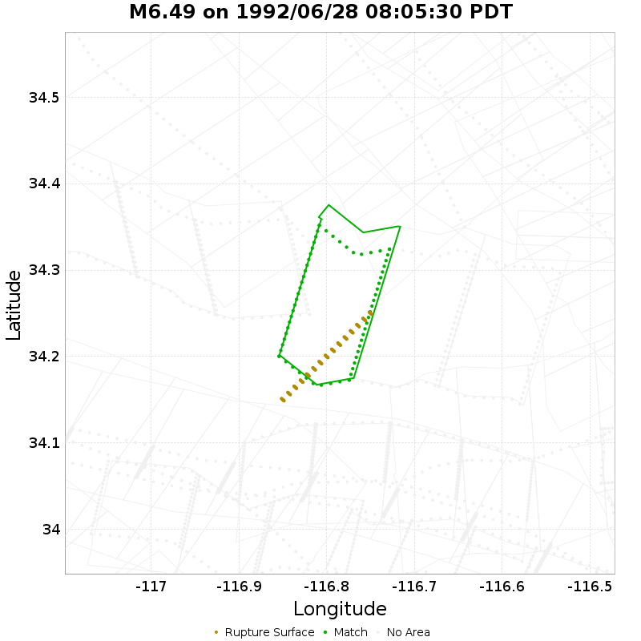

| Section Index | Section Name | Match? | Section Area | Rup Area in Raw Poly | Rup Area in No-Overlap Poly | Area Fraction | Sect Distance To Rup | UCERF3 Rupture Section? |
|-----|-----|-----|-----|-----|-----|-----|-----|-----|
| 1395 | North Frontal  (East), Subsection 0 | **YES** | 214.85 [km^2] | 132.31 [km^2] | 132.31 [km^2] | 0.62 | mean=4.84 [0.31 12.36] [km] | *NO* |

## M6.11 on 1993/05/17 16:20:50 PDT
*[(top)](#table-of-contents)*

## M6.65 on 1994/01/17 04:30:55 PST
*[(top)](#table-of-contents)*

| Section Index | Section Name | Match? | Section Area | Rup Area in Raw Poly | Rup Area in No-Overlap Poly | Area Fraction | Sect Distance To Rup | UCERF3 Rupture Section? |
|-----|-----|-----|-----|-----|-----|-----|-----|-----|
| 345 | Compton, Subsection 4 | *NO* | 354.88 [km^2] | 0.47 [km^2] | 0 [km^2] | 0 | mean=17.33 [0.94 33.41] [km] | *NO* |
| 462 | Del Valle, Subsection 0 | *NO* | 81.12 [km^2] | 2.58 [km^2] | 0 [km^2] | 0 | mean=4.16 [0.24 7.66] [km] | *NO* |
| 463 | Del Valle, Subsection 1 | *NO* | 81.12 [km^2] | 26.25 [km^2] | 0 [km^2] | 0 | mean=3.56 [0.47 7.06] [km] | *NO* |
| 872 | Holser alt 1, Subsection 0 | *NO* | 152 [km^2] | 35.39 [km^2] | 4.92 [km^2] | 0.03 | mean=3.13 [0.28 7.9] [km] | *NO* |
| 873 | Holser alt 1, Subsection 1 | *NO* | 152 [km^2] | 53.43 [km^2] | 0 [km^2] | 0 | mean=3.64 [0.56 8.21] [km] | *NO* |
| 874 | Holser alt 1, Subsection 2 | *NO* | 152 [km^2] | 37.97 [km^2] | 0 [km^2] | 0 | mean=4.44 [1.19 9.19] [km] | *NO* |
| 1299 | Mission Hills 2011, Subsection 0 | *NO* | 104.36 [km^2] | 52.5 [km^2] | 0 [km^2] | 0 | mean=4.27 [0.44 8.46] [km] | *NO* |
| 1300 | Mission Hills 2011, Subsection 1 | *NO* | 104.36 [km^2] | 66.09 [km^2] | 0 [km^2] | 0 | mean=4.33 [0.14 9.53] [km] | *NO* |
| 1409 | Northridge, Subsection 0 | **YES** | 98.43 [km^2] | 98.43 [km^2] | 98.43 [km^2] | 1 | mean=0.22 [0 0.38] [km] | **YES** |
| 1410 | Northridge, Subsection 1 | **YES** | 98.43 [km^2] | 96.55 [km^2] | 96.55 [km^2] | 0.98 | mean=0.24 [0 0.45] [km] | **YES** |
| 1411 | Northridge, Subsection 2 | **YES** | 98.43 [km^2] | 97.96 [km^2] | 97.96 [km^2] | 1 | mean=0.22 [0 0.39] [km] | **YES** |
| 1412 | Northridge, Subsection 3 | **YES** | 98.43 [km^2] | 98.43 [km^2] | 98.43 [km^2] | 1 | mean=0.22 [0 0.4] [km] | **YES** |
| 1413 | Northridge, Subsection 4 | **YES** | 98.43 [km^2] | 91.16 [km^2] | 91.16 [km^2] | 0.93 | mean=0.23 [0 0.43] [km] | **YES** |
| 1414 | Northridge Hills, Subsection 0 | *NO* | 324.75 [km^2] | 162.64 [km^2] | 0 [km^2] | 0 | mean=7.66 [2.02 16.68] [km] | *NO* |
| 1415 | Northridge Hills, Subsection 1 | *NO* | 324.75 [km^2] | 160.77 [km^2] | 0 [km^2] | 0 | mean=7.51 [1.39 16.64] [km] | *NO* |
| 1420 | Oak Ridge (Onshore), Subsection 4 | *NO* | 181.95 [km^2] | 26.72 [km^2] | 0.94 [km^2] | 0.01 | mean=3.97 [0.4 11.4] [km] | *NO* |
| 2301 | Santa Susana East (connector), Subsection 0 | *NO* | 74.82 [km^2] | 54.84 [km^2] | 0 [km^2] | 0 | mean=3.34 [0.17 7.05] [km] | *NO* |
| 2302 | Santa Susana East (connector), Subsection 1 | *NO* | 74.82 [km^2] | 59.06 [km^2] | 0 [km^2] | 0 | mean=3.36 [0.33 7.01] [km] | *NO* |
| 2303 | Santa Susana alt 1, Subsection 0 | *NO* | 162.32 [km^2] | 47.81 [km^2] | 0 [km^2] | 0 | mean=5.61 [1.32 13.21] [km] | *NO* |
| 2304 | Santa Susana alt 1, Subsection 1 | *NO* | 162.32 [km^2] | 76.87 [km^2] | 0 [km^2] | 0 | mean=4.77 [0.18 10.42] [km] | *NO* |
| 2305 | Santa Susana alt 1, Subsection 2 | *NO* | 162.32 [km^2] | 57.42 [km^2] | 0 [km^2] | 0 | mean=5.09 [0.43 10.45] [km] | *NO* |
| 2375 | Sierra Madre (San Fernando), Subsection 1 | *NO* | 106.74 [km^2] | 13.83 [km^2] | 0 [km^2] | 0 | mean=7.03 [4.26 12.58] [km] | *NO* |
| 2376 | Sierra Madre (San Fernando), Subsection 2 | *NO* | 106.74 [km^2] | 33.75 [km^2] | 0 [km^2] | 0 | mean=6.15 [2.35 12.35] [km] | *NO* |
| 2390 | Simi-Santa Rosa, Subsection 0 | *NO* | 64.56 [km^2] | 35.62 [km^2] | 0.47 [km^2] | 0.01 | mean=6.24 [0.39 12.87] [km] | *NO* |
| 2391 | Simi-Santa Rosa, Subsection 1 | *NO* | 64.56 [km^2] | 0.7 [km^2] | 0.7 [km^2] | 0.01 | mean=8.86 [2.47 14.97] [km] | *NO* |
| 2528 | Verdugo, Subsection 3 | *NO* | 125.99 [km^2] | 11.48 [km^2] | 0 [km^2] | 0 | mean=5.8 [0.41 11.03] [km] | *NO* |

## M7.12 on 1999/10/16 02:46:44 PDT
*[(top)](#table-of-contents)*

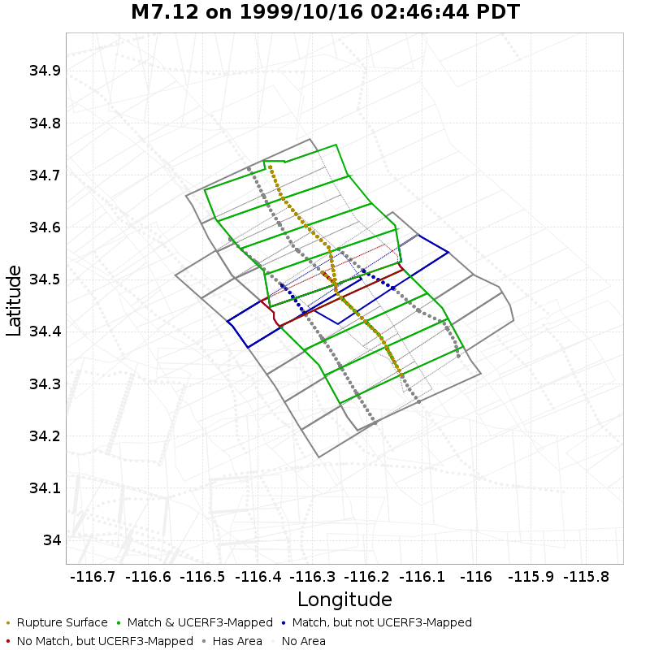

| Section Index | Section Name | Match? | Section Area | Rup Area in Raw Poly | Rup Area in No-Overlap Poly | Area Fraction | Sect Distance To Rup | UCERF3 Rupture Section? |
|-----|-----|-----|-----|-----|-----|-----|-----|-----|
| 170 | Bullion Mountains, Subsection 1 | *NO* | 74.02 [km^2] | 38.2 [km^2] | 0 [km^2] | 0 | mean=10.83 [10.38 11.03] [km] | *NO* |
| 171 | Bullion Mountains, Subsection 2 | *NO* | 74.02 [km^2] | 65.49 [km^2] | 0 [km^2] | 0 | mean=9.83 [8.44 10.94] [km] | *NO* |
| 172 | Bullion Mountains, Subsection 3 | *NO* | 74.02 [km^2] | 76.41 [km^2] | 0 [km^2] | 0 | mean=8.25 [8.09 8.41] [km] | *NO* |
| 173 | Bullion Mountains, Subsection 4 | *NO* | 74.02 [km^2] | 76.41 [km^2] | 0 [km^2] | 0 | mean=6.83 [5.06 8.03] [km] | *NO* |
| 174 | Bullion Mountains, Subsection 5 | *NO* | 74.02 [km^2] | 134.21 [km^2] | 0 [km^2] | 0 | mean=3.22 [1.55 4.91] [km] | *NO* |
| 224 | Calico-Hidalgo, Subsection 1 | *NO* | 82.14 [km^2] | 16.37 [km^2] | 0 [km^2] | 0 | mean=9.52 [8.49 11.23] [km] | *NO* |
| 225 | Calico-Hidalgo, Subsection 2 | *NO* | 82.14 [km^2] | 76.41 [km^2] | 0 [km^2] | 0 | mean=8.59 [8.49 8.79] [km] | *NO* |
| 226 | Calico-Hidalgo, Subsection 3 | *NO* | 82.14 [km^2] | 76.41 [km^2] | 0 [km^2] | 0 | mean=8.42 [7.89 8.84] [km] | *NO* |
| 227 | Calico-Hidalgo, Subsection 4 | *NO* | 82.14 [km^2] | 76.41 [km^2] | 0 [km^2] | 0 | mean=7.41 [6.89 8.07] [km] | *NO* |
| 228 | Calico-Hidalgo, Subsection 5 | *NO* | 82.14 [km^2] | 132.04 [km^2] | 0 [km^2] | 0 | mean=7.04 [6.89 7.4] [km] | *NO* |
| 229 | Calico-Hidalgo, Subsection 6 | *NO* | 82.14 [km^2] | 91.64 [km^2] | 0 [km^2] | 0 | mean=8.99 [7.16 11.36] [km] | *NO* |
| 230 | Calico-Hidalgo, Subsection 7 | *NO* | 82.14 [km^2] | 78.55 [km^2] | 0 [km^2] | 0 | mean=11.64 [10.96 12.18] [km] | *NO* |
| 843 | Hector Mine, Subsection 0 | **YES** | 91.64 [km^2] | 91.64 [km^2] | 91.64 [km^2] | 1 | mean=0.25 [0 0.45] [km] | **YES** |
| 844 | Hector Mine, Subsection 1 | **YES** | 91.64 [km^2] | 85.09 [km^2] | 85.09 [km^2] | 0.93 | mean=0.25 [0 0.45] [km] | **YES** |
| 845 | Hector Mine, Subsection 2 | **YES** | 91.64 [km^2] | 91.64 [km^2] | 91.64 [km^2] | 1 | mean=0.25 [0 0.45] [km] | **YES** |
| 846 | Hector Mine, Subsection 3 | **YES** | 91.64 [km^2] | 136.39 [km^2] | 136.39 [km^2] | 1.49 | mean=0.25 [0 0.45] [km] | **YES** |
| 1582 | Pisgah-Bullion Mtn-Mesquite Lk, Subsection 3 | *NO* | 76.41 [km^2] | 5.46 [km^2] | 5.46 [km^2] | 0.07 | mean=3.48 [0.48 6.47] [km] | *NO* |
| 1583 | Pisgah-Bullion Mtn-Mesquite Lk, Subsection 4 | **YES** | 76.41 [km^2] | 76.41 [km^2] | 76.41 [km^2] | 1 | mean=0.27 [0 0.49] [km] | **YES** |
| 1584 | Pisgah-Bullion Mtn-Mesquite Lk, Subsection 5 | **YES** | 76.41 [km^2] | 76.41 [km^2] | 76.41 [km^2] | 1 | mean=0.27 [0 0.49] [km] | **YES** |
| 1585 | Pisgah-Bullion Mtn-Mesquite Lk, Subsection 6 | **YES** | 76.41 [km^2] | 76.41 [km^2] | 76.41 [km^2] | 1 | mean=0.27 [0 0.49] [km] | **YES** |
| 1586 | Pisgah-Bullion Mtn-Mesquite Lk, Subsection 7 | *NO* | 76.41 [km^2] | 116.77 [km^2] | 32.75 [km^2] | 0.43 | mean=0.26 [0 0.49] [km] | **YES** |
| 1587 | Pisgah-Bullion Mtn-Mesquite Lk, Subsection 8 | *NO* | 76.41 [km^2] | 91.64 [km^2] | 0 [km^2] | 0 | mean=2.7 [0 4.43] [km] | *NO* |
| 1588 | Pisgah-Bullion Mtn-Mesquite Lk, Subsection 9 | *NO* | 76.41 [km^2] | 78.55 [km^2] | 0 [km^2] | 0 | mean=3.97 [3.53 4.43] [km] | *NO* |
| 1589 | Pisgah-Bullion Mtn-Mesquite Lk, Subsection 10 | *NO* | 76.41 [km^2] | 91.64 [km^2] | 0 [km^2] | 0 | mean=3.1 [2.8 3.48] [km] | *NO* |
| 1590 | Pisgah-Bullion Mtn-Mesquite Lk, Subsection 11 | *NO* | 76.41 [km^2] | 58.91 [km^2] | 0 [km^2] | 0 | mean=3.14 [2.85 3.6] [km] | *NO* |

## M5.86 on 2000/03/16 07:19:56 PST
*[(top)](#table-of-contents)*

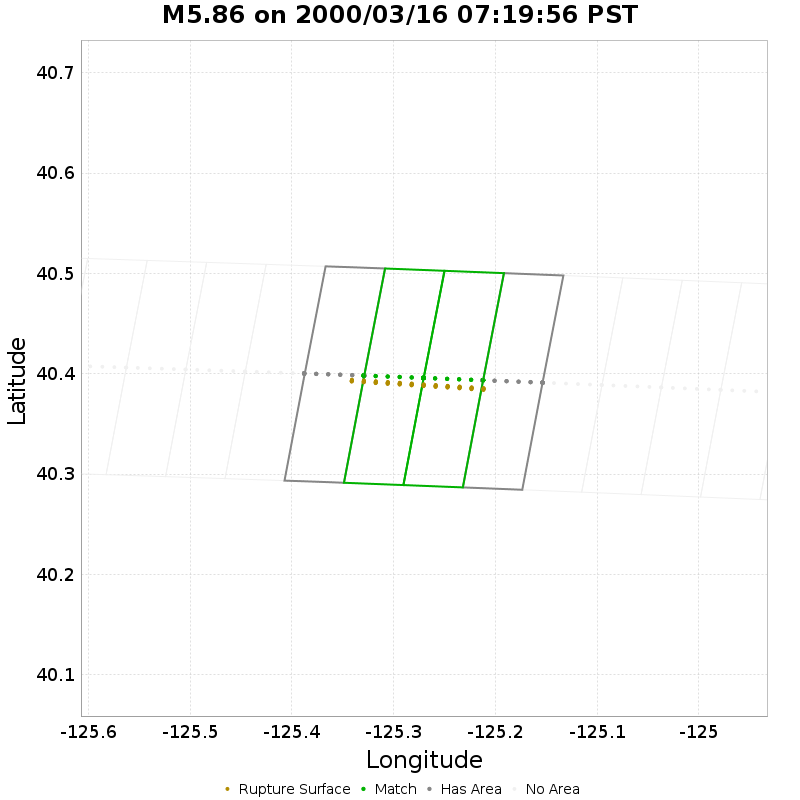

| Section Index | Section Name | Match? | Section Area | Rup Area in Raw Poly | Rup Area in No-Overlap Poly | Area Fraction | Sect Distance To Rup | UCERF3 Rupture Section? |
|-----|-----|-----|-----|-----|-----|-----|-----|-----|
| 1262 | Mendocino, Subsection 15 | *NO* | 44.57 [km^2] | 3.02 [km^2] | 3.02 [km^2] | 0.07 | mean=2.95 [0.91 5.71] [km] | *NO* |
| 1263 | Mendocino, Subsection 16 | **YES** | 44.57 [km^2] | 30.2 [km^2] | 30.2 [km^2] | 0.68 | mean=1.27 [0.75 2.97] [km] | *NO* |
| 1264 | Mendocino, Subsection 17 | **YES** | 44.57 [km^2] | 30.2 [km^2] | 30.2 [km^2] | 0.68 | mean=1.13 [0.59 2.91] [km] | *NO* |
| 1265 | Mendocino, Subsection 18 | *NO* | 44.57 [km^2] | 3.02 [km^2] | 3.02 [km^2] | 0.07 | mean=2.22 [0.56 4.91] [km] | *NO* |

## M6.55 on 2003/12/22 11:15:56 PST
*[(top)](#table-of-contents)*

| Section Index | Section Name | Match? | Section Area | Rup Area in Raw Poly | Rup Area in No-Overlap Poly | Area Fraction | Sect Distance To Rup | UCERF3 Rupture Section? |
|-----|-----|-----|-----|-----|-----|-----|-----|-----|
| 910 | Hosgri, Subsection 14 | *NO* | 68.23 [km^2] | 2.64 [km^2] | 0 [km^2] | 0 | mean=9.34 [6.16 12.88] [km] | *NO* |
| 911 | Hosgri, Subsection 15 | *NO* | 68.23 [km^2] | 24.52 [km^2] | 0.19 [km^2] | 0 | mean=6.75 [4.73 9.65] [km] | *NO* |
| 1442 | Oceanic - West Huasna, Subsection 21 | **YES** | 30.18 [km^2] | 25.65 [km^2] | 25.65 [km^2] | 0.85 | mean=0.33 [0 0.59] [km] | **YES** |
| 1443 | Oceanic - West Huasna, Subsection 22 | **YES** | 30.18 [km^2] | 28.67 [km^2] | 28.67 [km^2] | 0.95 | mean=0.33 [0 0.59] [km] | **YES** |
| 1444 | Oceanic - West Huasna, Subsection 23 | **YES** | 30.18 [km^2] | 28.29 [km^2] | 28.29 [km^2] | 0.94 | mean=0.32 [0 0.54] [km] | **YES** |
| 1445 | Oceanic - West Huasna, Subsection 24 | **YES** | 30.18 [km^2] | 28.29 [km^2] | 28.29 [km^2] | 0.94 | mean=0.32 [0 0.56] [km] | **YES** |
| 1446 | Oceanic - West Huasna, Subsection 25 | **YES** | 30.18 [km^2] | 28.29 [km^2] | 28.29 [km^2] | 0.94 | mean=0.33 [0 0.58] [km] | **YES** |
| 1447 | Oceanic - West Huasna, Subsection 26 | **YES** | 30.18 [km^2] | 28.29 [km^2] | 28.29 [km^2] | 0.94 | mean=0.33 [0 0.56] [km] | **YES** |
| 1448 | Oceanic - West Huasna, Subsection 27 | **YES** | 30.18 [km^2] | 28.29 [km^2] | 28.29 [km^2] | 0.94 | mean=0.33 [0 0.56] [km] | **YES** |
| 1449 | Oceanic - West Huasna, Subsection 28 | *NO* | 30.18 [km^2] | 2.83 [km^2] | 2.83 [km^2] | 0.09 | mean=2.03 [0 4] [km] | *NO* |

## M5.97 on 2004/09/28 10:15:24 PDT
*[(top)](#table-of-contents)*

| Section Index | Section Name | Match? | Section Area | Rup Area in Raw Poly | Rup Area in No-Overlap Poly | Area Fraction | Sect Distance To Rup | UCERF3 Rupture Section? |
|-----|-----|-----|-----|-----|-----|-----|-----|-----|
| 1797 | San Andreas (Cholame) rev, Subsection 10 | *NO* | 66.2 [km^2] | 2.32 [km^2] | 0 [km^2] | 0 | mean=3.45 [0.31 7.4] [km] | *NO* |
| 1920 | San Andreas (Parkfield), Subsection 0 | **YES** | 23.24 [km^2] | 25.3 [km^2] | 25.3 [km^2] | 1.09 | mean=0.33 [0 0.53] [km] | **YES** |
| 1921 | San Andreas (Parkfield), Subsection 1 | **YES** | 20.59 [km^2] | 20.32 [km^2] | 20.32 [km^2] | 0.99 | mean=0.36 [0 0.65] [km] | **YES** |
| 1922 | San Andreas (Parkfield), Subsection 2 | **YES** | 17.93 [km^2] | 17.66 [km^2] | 17.66 [km^2] | 0.99 | mean=0.23 [0 0.45] [km] | **YES** |
| 1923 | San Andreas (Parkfield), Subsection 3 | **YES** | 15.27 [km^2] | 15.01 [km^2] | 15.01 [km^2] | 0.98 | mean=0.34 [0 0.57] [km] | **YES** |
| 1924 | San Andreas (Parkfield), Subsection 4 | **YES** | 12.62 [km^2] | 10.09 [km^2] | 10.09 [km^2] | 0.8 | mean=0.27 [0 0.5] [km] | **YES** |
| 1925 | San Andreas (Parkfield), Subsection 5 | **YES** | 9.96 [km^2] | 10.96 [km^2] | 10.96 [km^2] | 1.1 | mean=0.3 [0 0.52] [km] | **YES** |
| 1926 | San Andreas (Parkfield), Subsection 6 | **YES** | 7.3 [km^2] | 8.03 [km^2] | 8.03 [km^2] | 1.1 | mean=0.33 [0 0.6] [km] | **YES** |
| 1927 | San Andreas (Parkfield), Subsection 7 | **YES** | 4.65 [km^2] | 4.18 [km^2] | 4.18 [km^2] | 0.9 | mean=0.22 [0 0.44] [km] | **YES** |
| 2203 | San Juan, Subsection 0 | *NO* | 73.9 [km^2] | 31.21 [km^2] | 0 [km^2] | 0 | mean=3.17 [2.07 4.98] [km] | *NO* |
| 2204 | San Juan, Subsection 1 | *NO* | 73.9 [km^2] | 2.32 [km^2] | 0 [km^2] | 0 | mean=4.79 [3.3 7.34] [km] | *NO* |

## M6.51 on 2010/01/09 16:27:39 PST
*[(top)](#table-of-contents)*

| Section Index | Section Name | Match? | Section Area | Rup Area in Raw Poly | Rup Area in No-Overlap Poly | Area Fraction | Sect Distance To Rup | UCERF3 Rupture Section? |
|-----|-----|-----|-----|-----|-----|-----|-----|-----|
| 2480 | Table Bluff, Subsection 3 | *NO* | 134.79 [km^2] | 52.93 [km^2] | 52.93 [km^2] | 0.39 | mean=16.74 [12.14 20.33] [km] | *NO* |
| 2481 | Table Bluff, Subsection 4 | *NO* | 134.79 [km^2] | 22.69 [km^2] | 22.69 [km^2] | 0.17 | mean=16.66 [12.3 19.16] [km] | *NO* |

## M7.19 on 2010/04/04 15:40:41 PDT
*[(top)](#table-of-contents)*

| Section Index | Section Name | Match? | Section Area | Rup Area in Raw Poly | Rup Area in No-Overlap Poly | Area Fraction | Sect Distance To Rup | UCERF3 Rupture Section? |
|-----|-----|-----|-----|-----|-----|-----|-----|-----|
| 287 | Cerro Prieto, Subsection 0 | *NO* | 95.71 [km^2] | 54.06 [km^2] | 0 [km^2] | 0 | mean=10.33 [8.8 12.64] [km] | *NO* |
| 288 | Cerro Prieto, Subsection 1 | *NO* | 95.71 [km^2] | 53.15 [km^2] | 0 [km^2] | 0 | mean=10.97 [9.91 12.64] [km] | *NO* |
| 289 | Cerro Prieto, Subsection 2 | *NO* | 95.71 [km^2] | 57.73 [km^2] | 0 [km^2] | 0 | mean=10.87 [9.81 12.55] [km] | *NO* |
| 290 | Cerro Prieto, Subsection 3 | *NO* | 95.71 [km^2] | 57.73 [km^2] | 0 [km^2] | 0 | mean=10.77 [9.71 12.45] [km] | *NO* |
| 291 | Cerro Prieto, Subsection 4 | *NO* | 95.71 [km^2] | 62.31 [km^2] | 0 [km^2] | 0 | mean=10.66 [9.58 12.35] [km] | *NO* |
| 292 | Cerro Prieto, Subsection 5 | *NO* | 95.71 [km^2] | 53.15 [km^2] | 0 [km^2] | 0 | mean=10.44 [8.96 12.36] [km] | *NO* |
| 293 | Cerro Prieto, Subsection 6 | *NO* | 95.71 [km^2] | 61.39 [km^2] | 0 [km^2] | 0 | mean=7.43 [4.3 10.54] [km] | *NO* |
| 294 | Cerro Prieto, Subsection 7 | *NO* | 95.71 [km^2] | 58.65 [km^2] | 0 [km^2] | 0 | mean=6.3 [3.9 10.4] [km] | *NO* |
| 295 | Cerro Prieto, Subsection 8 | *NO* | 95.71 [km^2] | 7.33 [km^2] | 0 [km^2] | 0 | mean=10 [6.45 14.07] [km] | *NO* |
| 1042 | Laguna Salada, Subsection 0 | **YES** | 44.13 [km^2] | 92.55 [km^2] | 92.55 [km^2] | 2.1 | mean=7.54 [4.85 10.7] [km] | *NO* |
| 1043 | Laguna Salada, Subsection 1 | **YES** | 44.13 [km^2] | 153.94 [km^2] | 153.94 [km^2] | 3.49 | mean=3.48 [0.44 6.95] [km] | *NO* |
| 1044 | Laguna Salada, Subsection 2 | **YES** | 44.13 [km^2] | 191.51 [km^2] | 191.51 [km^2] | 4.34 | mean=3.3 [0.3 6.54] [km] | *NO* |
| 1045 | Laguna Salada, Subsection 3 | **YES** | 44.13 [km^2] | 178.69 [km^2] | 178.69 [km^2] | 4.05 | mean=3.99 [2.53 6] [km] | *NO* |
| 1046 | Laguna Salada, Subsection 4 | **YES** | 44.13 [km^2] | 79.72 [km^2] | 79.72 [km^2] | 1.81 | mean=5.03 [2.76 6.77] [km] | *NO* |
| 1047 | Laguna Salada, Subsection 5 | **YES** | 44.13 [km^2] | 79.72 [km^2] | 79.72 [km^2] | 1.81 | mean=5.74 [4.73 6.75] [km] | *NO* |
| 1048 | Laguna Salada, Subsection 6 | **YES** | 44.13 [km^2] | 83.39 [km^2] | 83.39 [km^2] | 1.89 | mean=5.57 [4.56 6.57] [km] | *NO* |
| 1049 | Laguna Salada, Subsection 7 | **YES** | 44.13 [km^2] | 71.47 [km^2] | 71.47 [km^2] | 1.62 | mean=5.36 [4.36 6.37] [km] | *NO* |
| 1050 | Laguna Salada, Subsection 8 | **YES** | 44.13 [km^2] | 83.39 [km^2] | 83.39 [km^2] | 1.89 | mean=5.17 [4.17 6.18] [km] | *NO* |
| 1051 | Laguna Salada, Subsection 9 | **YES** | 44.13 [km^2] | 83.39 [km^2] | 83.39 [km^2] | 1.89 | mean=5 [4 6.01] [km] | *NO* |
| 1052 | Laguna Salada, Subsection 10 | **YES** | 44.13 [km^2] | 71.47 [km^2] | 71.47 [km^2] | 1.62 | mean=4.79 [3.8 5.8] [km] | *NO* |
| 1053 | Laguna Salada, Subsection 11 | **YES** | 44.13 [km^2] | 83.39 [km^2] | 83.39 [km^2] | 1.89 | mean=5.48 [3.82 7.61] [km] | *NO* |
| 1054 | Laguna Salada, Subsection 12 | **YES** | 44.13 [km^2] | 28.41 [km^2] | 28.41 [km^2] | 0.64 | mean=8.77 [5.82 11.24] [km] | *NO* |

