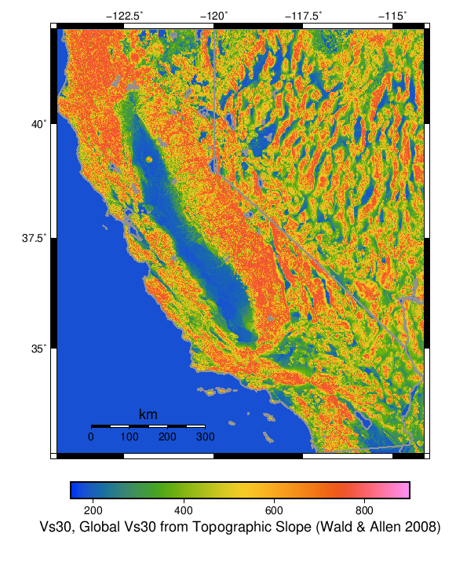
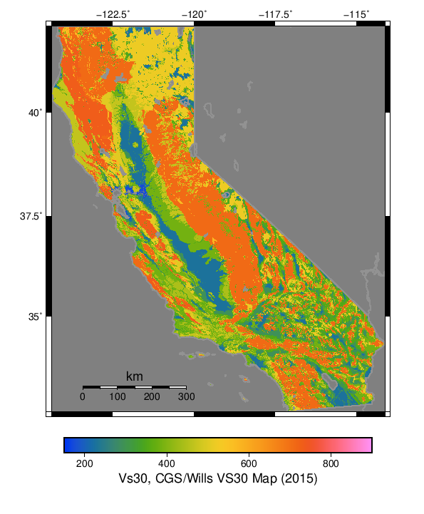
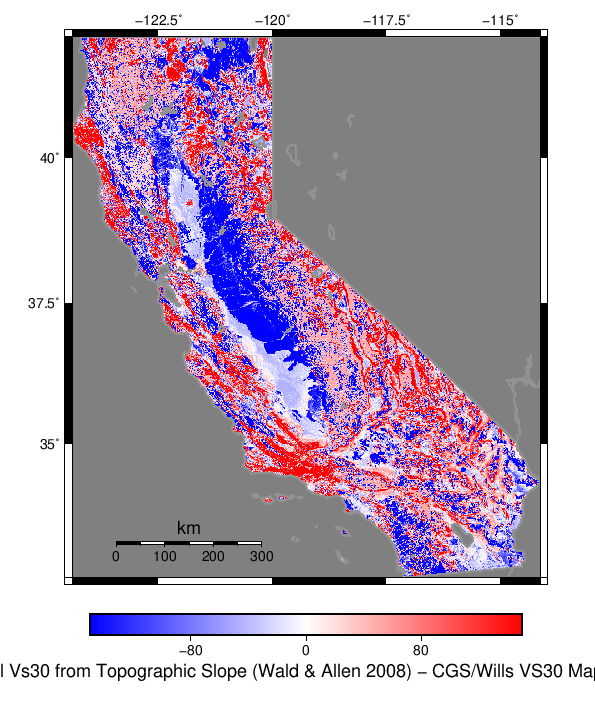
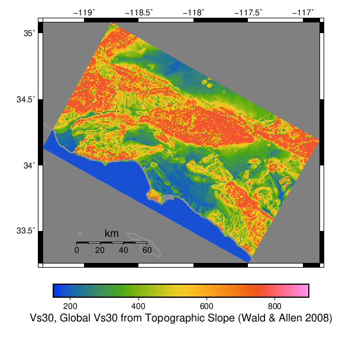
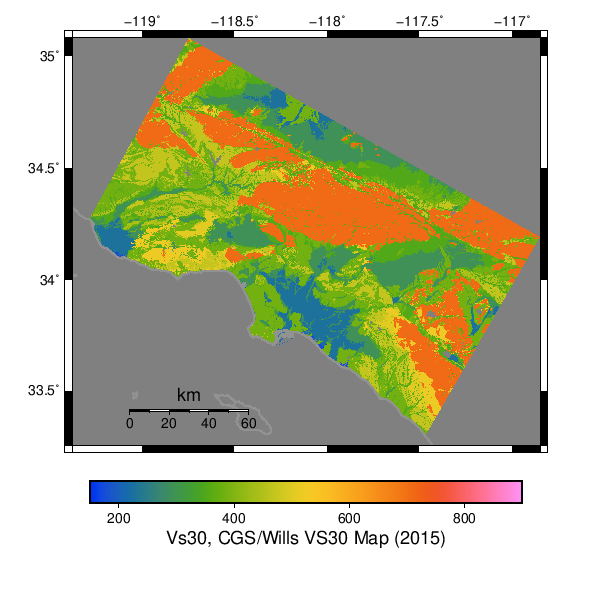
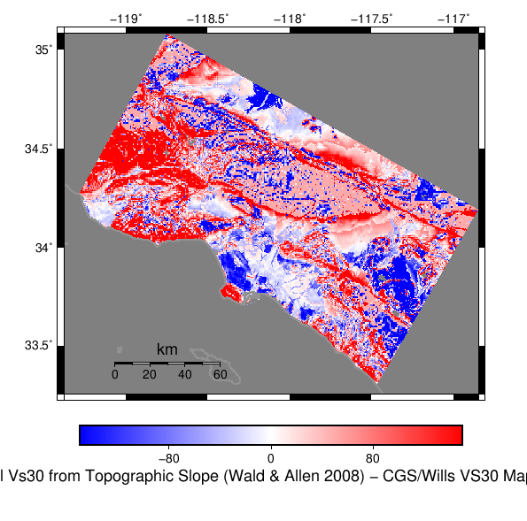
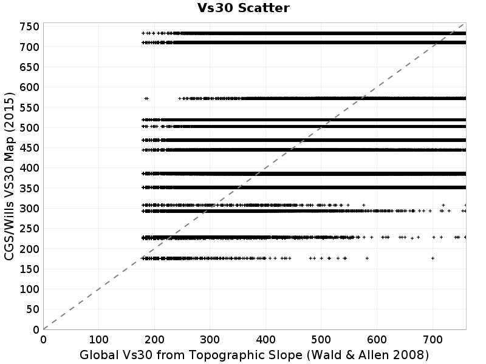

# Vs30

## Table Of Contents
* [Maps](#maps)
* [Scatter Comparison](#scatter-comparison)
## Maps
*[(top)](#table-of-contents)*

| Global Vs30 from Topographic Slope (Wald & Allen 2008) | CGS/Wills VS30 Map (2015) | Difference |
|-----|-----|-----|
|  |  |  |
|  |  |  |
## Scatter Comparison
*[(top)](#table-of-contents)*

